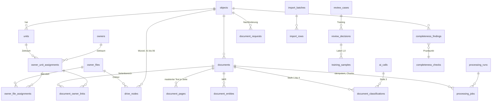

# Architekturdokument Objektübernahme (CR-05)

Stand: 10.09.2026. Status: Entwurf zur Freigabe durch die Geschäftsführung. Faktenbasis sind der Change Request CR-05 (docs/anforderungen/CR-05_Eigentuemerakte_Sonstiges.md) und die Befundakte vom 10.09.2026. Dieses Dokument konsolidiert die drei Stack-Vorschläge, die drei Gutachten, die fünf Fachentwürfe (Datenmodell, Pipeline, Drive, Betrieb und Sicherheit, Review Center) und die vier Prüfberichte zu einer verbindlichen Referenz. Wo ein Fachentwurf vom anderen abwich, steht hier die Entscheidung; wo nur der Auftraggeber entscheiden kann, steht ein Verweis auf die gebündelte Fragenliste im Umsetzungsplan (docs/umsetzungsplan.md).

Regeln dieses Dokuments: Planungsgrößen, die nicht aus CR oder Befund stammen, tragen das Präfix ANNAHME und nennen die Verifikation (gesammelt in Abschnitt 13). Bibliotheken und Werkzeuge werden ohne Versionsnummer genannt; es gilt durchgängig: aktuelle LTS bzw. stabile Version zum Umsetzungszeitpunkt prüfen und im Lockfile festschreiben. Beispiele sind synthetisch (Objekt 623, WE03_Mustermann). Tabellen-, Feld- und Schlüsselnamen folgen dem Bezeichnerregister in Abschnitt 5.7; die Fachentwürfe werden darauf angepasst.

## 1. Zusammenfassung und Empfehlung

Empfohlen wird ein einsprachiger Python-Monolith: Django in der LTS-Linie mit serverseitig gerenderten Templates und HTMX für die Oberfläche, Celery mit Redis als Auftragstransport, MariaDB als einzige Wahrheit für Fachdaten, Job-Status und Konfiguration, Tesseract mit Sprachpaket deu und ocrmypdf im Worker, ein TF-IDF-Klassifikator mit scikit-learn als lokale Stufe 2, die offiziellen SDKs von OpenAI und Anthropic hinter einer eigenen Provider-Schnittstelle als Stufe 3, ReportLab und openpyxl für Listen und Nachforderung, der offizielle Google-Drive-Client für die Ablage. Das Gremium aus drei unabhängigen Gutachtern hat diesen Stack einstimmig vor der Variante Python-API plus Single-Page-Anwendung und vor der polyglotten Variante Laravel plus Python-Worker gereiht, weil er die kleinste Betriebsfläche, den geringsten sicherheitsrelevanten Eigenbau, die niedrigste Aufwandsschätzung und den größten Personalmarkt für einen einzelnen Entwickler bietet. Aus den unterlegenen Vorschlägen werden 22 Einzelmaßnahmen übernommen, darunter vorgerenderte Seitenbilder für die Vorschau, Chunking großer Dokumente als Konstruktionsentscheidung, ein OCR-Probelauf auf dem Server vor dem Bau der Pipeline, Netztrennung in ein internes Netz ohne Internetzugang und ein Egress-Netz, zwei Datenbankkonten mit Mindestrechten für den Worker, ein Datenbank-Trigger gegen Änderungen am Audit-Protokoll und zwei Build-Ziele aus einem Dockerfile, damit der von außen erreichbare Web-Container keine OCR-Binärdateien trägt. Die Anwendung läuft als neun Compose-Dienste (web, worker, worker-nlp, worker-io, beat, redis, db, backup, optional classifier) hinter dem vorhandenen Traefik; alle serverabhängigen Werte (Kerne, Arbeitsspeicher, Traefik-Netz, Cert-Resolver, Entrypoints) sind Variablen, die vor dem ersten Deployment auf dem Server ausgelesen werden, weil der VPS aus der Entwicklungsumgebung nicht erreichbar war. Das Datenmodell aus Fachentwurf D ist die verbindliche Bezeichnerquelle für alle Bausteine; die Pipeline wird auf diese Namen umgestellt und D erhält eine dokumentierte Ergänzungsmigration (Abschnitt 5.6). Eigentum und Miete werden ausschließlich über zeitlich gültige Zuordnungen abgebildet, Dokumente werden über SHA-256 je Objekt eindeutig geführt, eingebettete Einzeldokumente werden über Seitenbereiche relational zugeordnet, und Drive-Ordner sind eine Ansicht auf das Datenmodell, nie dessen Quelle. Die Klassifikation läuft in drei Stufen mit einem Konfidenzmodell aus einem einzigen Schlüsselsatz in app_settings; Bestandsdateien in Drive werden unterhalb der Ablageschwelle nie verschoben, sondern als Vorschlag ins Review Center gestellt, und IBAN, Kontonummern und Ausweisnummern werden vor jeder Persistierung und vor jedem externen KI-Aufruf maskiert. Die 3-Stunden-Vorgabe für 10.000 Seiten hängt nach allen drei Rechenwegen an der gemessenen Kernzahl des Servers: mit drei OCR-Prozessen hält sie nur im Basisfall ohne Reserve, ab fünf Prozessen mit Reserve, weshalb der 100-Seiten-Probelauf in Meilenstein M0 und eine Tarifentscheidung vor M1 die wichtigste Risikominderung des Projekts sind. Die Reihenfolge der Umsetzung wird gegenüber dem Stack-Vorschlag an drei Stellen geändert: Massenbearbeitung mit Vorschau gehört in den Review-Center-Meilenstein, der Import der Eigentümerlisten beginnt direkt nach dem Datenmodell, und nach der OCR-Pipeline steht ein verbindlicher Performance-Prüfpunkt, bevor die fachlichen Bausteine gebaut werden. Alle Entscheidungen, die nur der Auftraggeber treffen kann (Objektnummernformat, Präfix der Eigentümerakten, Umlaut-Schreibweise, Speicherung der vollständigen IBAN, Kostenlimit der externen KI, Physik der Ablage bei offenen Fällen, Zwei-Faktor bei Google-Anmeldung, Sicherung außer Haus), sind im Umsetzungsplan gebündelt und mit je einem Vorschlagswert versehen; bis zur Antwort gelten die dort genannten Standardwerte.

## 2. Ausgangslage und Befund

### 2.1 Was vorliegt und was fehlt

| Bereich | Befund | Folge für die Architektur |
|---|---|---|
| Repository | Vollständig leer, kein Commit lokal oder auf dem Remote. Der CR liegt unter docs/anforderungen. | Kein Bestandscode, keine Vorarbeiten. Die vom CR verlangte Liste der Stellen mit Fünf-Ordner-Struktur ist leer. Alles wird neu gebaut. |
| Zielserver | IONOS VPS, Ubuntu 24.04 LTS, Docker, Traefik vorhanden. Aus der Entwicklungsumgebung nicht erreichbar, kein SSH-Zugang. | Kerne, Arbeitsspeicher, Platte, Name des Traefik-Netzes, Cert-Resolver und Entrypoints sind unbekannt. Compose-Datei mit Variablen, Ausleseanleitung in docs/betrieb.md, Messung in Meilenstein M0. Keine Annahmen über den Tarif. |
| Stammdaten | Immoware24-Export der Hausverwaltung Müller GmbH, Datenstand 01.07.2026, als CSV: 67 aktive Objekte, 869 aktive Verwaltungseinheiten, 1.737 Einheiten insgesamt, drei Verwaltungsarten (WEG-Verwaltung, Mietverwaltung, WEG mit SE-Verwaltung). Enthält personenbezogene Daten. | Strukturmerkmale fließen in Datenmodell und Import-Parser ein (Präfix-Mapping der Einheitentypen, Namens-Splitter, variable Objektnummernlänge). Keine Daten aus dem Export in Dokumenten oder Tests. Ob der Export als erster Import dient, entscheidet der Auftraggeber. |
| Corporate Identity | Skill hvm-ci mit ReportLab-Bausteinen (Kennlinie, Logo, Fußzeile mit Pflichtangaben, Anschriftfeld, Folgeseite), Farben und Schrift Helvetica/Arial 10 bis 11 pt. | PDF-Listen und Nachforderungsschreiben entstehen mit ReportLab aus portierten Bausteinen; keine erfundenen Kontaktdaten. |
| Google Drive | Wurzelpfad in Meine Ablage des technischen Kontos, kein Shared Drive. Objektordner existieren bereits, teilweise mit Unterordnern. | Adapter für beide Ablagearten (supportsAllDrives), Ordnerabgleich als erste fachliche Funktion. |

### 2.2 Widersprüche im CR und ihre Behandlung

| Nr. | Widerspruch (Befund Abschnitt 6) | Behandlung in dieser Architektur |
|---|---|---|
| 1 | CR nennt dreistellige Objektnummern; der Bestand enthält zwei- bis sechsstellige Nummern, darunter aktive Objekte mit zwei und fünf Stellen. | Erkennung über die führende Ziffernfolge mit konfigurierbarer Längenspanne (Standard 2 bis 6), Eindeutigkeit über den Zahlenwert. Nullauffüllung bei Neuanlage ist eine Frage an den Auftraggeber. |
| 2 | CR verlangt, Nachforderungsgenerator und Requirement Engine zu erweitern; es gibt keinen Bestandscode. | Beides wird als Neubau mit dem Mindestumfang aus CR 12 gebaut (deklarativer Prüfkatalog, Briefentwurf im HVM-CI). Existenz externer Vorlagen ist eine Frage an den Auftraggeber. |
| 3 | CR setzt eine Basis für die Hauptordner 01 bis 04 voraus (Unterstrukturen, Dokumenttypen, Grundfunktionen), die nirgends spezifiziert ist. | Unterstrukturen 01 bis 04 bleiben im Seed leer, Prüfpunkte dafür sind als ANNAHME geführt. Frage nach CR-01 bis CR-04 oder einem Lastenheft an den Auftraggeber. |
| 4 | Definition of Done verlangt, dass die Alt-Bezeichnung des Auffangordners im Code nicht vorkommt; Abschnitt 9.3 verlangt, den Altordner in Drive zu erkennen und umzubenennen. | Die Alt-Bezeichnung steht ausschließlich als Konfigurationswert drive.legacy_folder_aliases in der Seed-Datei unter db/seeds/. Der Anwendungscode liest den Wert aus der Konfiguration. Das Prüfskript greppt src/, tests/ und docs/ mit dokumentierten Ausnahmen db/seeds/ und docs/anforderungen/ (Abschnitt 7.4). |
| 5 | Hauptordner 05_Eigentümerakte mit Umlaut, Unterordner in ASCII (06_Wirtschaftsplaene, 07_Beschluesse). | Wortgetreue Übernahme in den Seed. Regeln, Klassifikator und KI-Schema arbeiten mit Codes (05, 05/06), Ordnernamen werden erst bei der Ablage aus dem Katalog aufgelöst. Bestätigung der Schreibweise durch den Auftraggeber. |
| 6 | Wurzelpfad liegt in einem persönlichen Drive, nicht in einer geteilten Ablage. | Adapter mit supportsAllDrives und konfigurierbarer Drive-ID, Umzug später ohne Codeänderung. Frage nach dem Zeitpunkt an den Auftraggeber. |
| 7 | Standard WE01_Nachname; Präfix für Stellplatz, Garage, Gewerbe nicht geregelt. | Benennungsfunktion mit konfigurierbarem Modus (always_we nach CR-Wortlaut als Seed, by_type als empfohlene Option). Entscheidung beim Auftraggeber. |
| 8 | Traefik-Werte, Serverressourcen, DNS, OAuth-App, Auftragsverarbeitungsverträge sind Voraussetzungen des Auftraggebers. | Vorleistungsliste im Umsetzungsplan; Compose-Variablen und Checkliste in docs/betrieb.md. |

## 3. Technologie-Stack mit Begründung

### 3.1 Entscheidung je Baustein

| Baustein | Entscheidung | Geprüfte Alternativen | Grund |
|---|---|---|---|
| Sprache | Python durchgängig (Web, Worker, Skripte) | Node.js oder Java als Einzelstack; PHP für die Web-Schicht (Vorschlag C); TypeScript für ein getrenntes Frontend (Vorschlag B) | ocrmypdf, spaCy, scikit-learn, rapidfuzz, ReportLab, openpyxl, beide KI-SDKs und der Drive-Client liegen in einem Ökosystem; die vorhandenen HVM-CI-Bausteine sind ReportLab. Eine Sprache bedeutet einen Wartungskalender und einen Personalmarkt. |
| Web-Framework | Django in der LTS-Linie, ausgeliefert über gunicorn, statische Dateien über WhiteNoise | FastAPI mit Jinja2 oder mit Vue-SPA; Laravel mit Livewire | Django liefert ORM, reversible Migrationen, Formulare mit CSRF-Schutz, Sitzungen, Gruppen und Berechtigungen ohne Eigenbau. Bei FastAPI wäre die gesamte Authentifizierung Eigenbau (größtes Sicherheitsrisiko laut allen drei Gutachten). |
| Oberfläche | Serverseitige Templates plus HTMX als statische Datei, kein Build-Schritt; vorgerenderte Seitenbilder für die Dokumentvorschau | Vollseiten-Reload; React oder Vue als SPA; Livewire | Teilaktualisierungen für Suche, Pflichtfelder, Vorschau der Massenbearbeitung und Fortschritt per Polling reichen für 2 bis 5 Anwender. Eine SPA kostet laut Vorschlag B 30 bis 40 PT Mehraufwand und eine zweite Werkzeugkette. Architektur so anlegen, dass eine JavaScript-Insel nur für das Review-Raster nachgerüstet werden kann (Risiko, Abschnitt 8.1). |
| Datenbank | MariaDB, InnoDB, utf8mb4, persistentes Volume | MySQL | Freie Lizenzlage, mariadb-dump und Healthcheck-Skript im offiziellen Image, gleichwertige Django-Unterstützung. MySQL bleibt ohne Schemaumbau möglich. Volltextparameter: Stoppwortliste deaktivieren, Mindesttokenlänge 2. |
| ORM und Migrationen | Django ORM und Django Migrations, Rückwärtsfähigkeit in der CI geprüft | SQLAlchemy plus Alembic; Eloquent plus SQLAlchemy-Reflektion | Schemamigrationen erzeugen die Rückwärtsoperation automatisch; erfüllt CR 0 Nr. 5. Tests laufen gegen MariaDB, nicht SQLite. |
| Task-Queue | Celery mit Redis als Broker, kein Ergebnis-Backend, Tasks tragen nur IDs | RQ, Huey, Dramatiq, Django-Q2; Redis Streams mit Eigenbau-Consumer | Prozesspool mit Speicher-Recycling, Zeitlimits, Routing in getrennte Queues, Beat. Pipeline als Zustandsautomat in der Datenbank, nicht als Celery-Chain. Konfigurationsfalle visibility_timeout wird durch Chunking und Integrationstest mit hartem Abbruch abgesichert. |
| Broker-Image | Redis oder protokollkompatibler Fork (Valkey), Wahl zum Umsetzungszeitpunkt | keine | Lizenzlage von Redis hat sich geändert; für internen Betrieb unkritisch, Wechsel ändert nur den Image-Tag. |
| OCR | Tesseract mit deu und ocrmypdf (CR-Vorgabe), skip-text, jobs 1, OMP_THREAD_LIMIT=1, Textebenen-Vorprüfung mit pypdfium2 oder PyMuPDF, Chunking mit pikepdf | keine Alternative zur Vorgabe; tessdata_fast als Stellhebel | Digitalseiten laufen ohne Tesseract, große Dokumente in Seitenblöcken parallel; ein Prozess belegt genau einen Kern. |
| NER | Deterministische Muster (Einheitenlabels, IBAN mit Prüfziffer, Beträge, Zeiträume), Gazetteer aus den Stammdaten mit rapidfuzz, spaCy nur für unbekannte Personen und Firmen als Kandidat | nur spaCy; Transformer-Modelle | Muster und Gazetteer sind auf OCR-Text präziser und schneller als ein allgemeines Modell; Transformer kosten Torch, Speicher und Latenz. |
| Lokaler Klassifikator | TF-IDF (Wort- und Zeichen-n-Gramme) plus lineares Modell mit Kalibrierung, zwei Modelle (Hauptkategorie, Unterordner plus Unterart) | Satz-Embeddings plus kNN im optionalen Container classifier | Millisekunden je Dokument, kein Torch im Image, erklärbar, Nachtraining in Sekunden. Embedding-Variante hinter derselben Schnittstelle als Ausbaupfad, wenn die Makro-F1 nach dem dritten Objekt unter dem Zielwert liegt. |
| KI-Provider | Eigene Schnittstelle über die offiziellen SDKs openai und anthropic, strukturierte JSON-Ausgabe, Maskierung im Interface, Circuit Breaker, Kostenprotokoll | LiteLLM, LangChain | Zwei Anbieter mit je einer Methode rechtfertigen keine Zwischenschicht; volle Kontrolle über Endpunkt, Region, Timeout, Kosten. |
| Excel | openpyxl | XlsxWriter | Eine Bibliothek für Lesen (Import) und Schreiben (Listen). |
| PDF | ReportLab mit portierten HVM-CI-Bausteinen | WeasyPrint, LibreOffice headless | CI-Bausteine liegen in ReportLab vor; keine Rendering-Engine im Image; Wasserzeichen, wiederholte Tabellenköpfe und Seitenzahlen kontrollierbar. |
| DOCX | python-docx | docxtpl | Nachforderung als bearbeitbare Word-Fassung aus einer CI-Vorlage. |
| Drive | google-api-python-client, google-auth, google-auth-oauthlib; Adapter-Protokoll mit echter Implementierung, In-Memory-Fake und Aufzeichnungsdekorator | PyDrive2 | Resumable Upload, Versionierung über files.update, Felderauswahl, Shared-Drive-Parameter direkt am offiziellen Client. |
| Authentifizierung | django-allauth (Konto, MFA mit TOTP und Wiederherstellungscodes, Google-Provider), MFA-Erzwingung per Middleware | django-two-factor-auth plus social-auth-app-django (Rückfallweg) | E-Mail-Login, TOTP und Google-Anmeldung aus einem Paket. Reifegrad des MFA-Moduls zum Umsetzungszeitpunkt prüfen; Rückfallweg dokumentiert. |
| Rollen | Django-Gruppen admin und sachbearbeiter, Berechtigungsschlüssel in roles.permissions, Prüfung in Views und Service-Schicht | django-guardian | Zwei Rollen, keine objektbezogenen Rechte; guardian bleibt Ausbaupfad. |
| Audit | Append-only-Tabelle audit_events über die Service-Schicht, Datenbank-Trigger gegen UPDATE und DELETE, Anwendungskonten ohne diese Rechte | django-auditlog, django-simple-history | Fachliche Ereignisse statt Modell-Diffs; keine IBAN, keine Volltexte im Protokoll. |
| Konfiguration | App config mit Tabelle app_settings (JSON-Wert, Typ, Kategorie, Validierung), Historie über audit_events, Admin-Formulare aus einer JSON-Schema-Katalogdatei generiert | django-constance | Listen und Mappings statt flacher Skalare; ein Register für alle Schlüssel (Abschnitt 5.5). |
| Volltext | InnoDB FULLTEXT auf document_pages.text_content (maskiert) über einen eigenen Django-Lookup, kombiniert mit relationalen Filtern | Meilisearch, OpenSearch als Container | Kein weiterer Dienst; Suche läuft primär über Metadaten. Schnittstelle SearchIndex für einen späteren Suchdienst. |
| Tests | pytest, pytest-django, factory_boy, freezegun, Hypothesis für die Benennungsfunktion, HttpMockSequence für den Drive-Client, Playwright für den 40-Dokumente-Fall, Locust oder k6 für die Mehrnutzer-Latenzsonde | unittest, Einzelsonde | Vollständige Abdeckung der CR-14-Tests einschließlich Ende-zu-Ende und Last. |
| Lint, Format, Typen | ruff, mypy für Kernmodule (Benennung, Abgrenzung, Maskierung, Konfidenzmodell) | keine | Kleine Werkzeugkette, eine Sperrdatei (uv oder pip-tools). |

### 3.2 Ergebnis des Gremiums

Drei unabhängige Gutachter haben die Vorschläge A (Python-Monolith), B (Python-API plus Vue-SPA) und C (Laravel-Web-Schicht plus Python-Worker über Redis Streams) mit demselben Kriterienkatalog (acht Kriterien, Gewichte summieren sich zu 100, Punkte 0 bis 10) bewertet.

| Gutachter | Blickwinkel | A | B | C |
|---|---|---|---|---|
| 1 | Betrieb auf einem VPS, Wartbarkeit durch einen Entwickler, Gesamtkosten über fünf Jahre | 84,0 | 64,0 | 60,0 |
| 2 | Fachliche Umsetzbarkeit (Review Center, Import, Listen, Requirement Engine), Zeit bis zum produktiven Nutzen | 79,0 | 64,5 | 63,5 |
| 3 | Risiko, Sicherheit, Datenschutz, Performance-Belastbarkeit | 84,0 | 70,0 | 67,0 |
| Summe | | 247,0 | 198,5 | 190,5 |

Die Reihenfolge A vor B vor C ist in allen drei Gutachten gleich und laut deren Empfindlichkeitsprüfungen robust gegen Umgewichtung (auch bei doppeltem Gewicht des Review Centers bleibt A vorn). Die drei Gutachten liegen als Arbeitspapiere unter docs/entwurf/ (Dateien gutachten_1.md bis gutachten_3.md).

Kernargumente je Vorschlag:

| Vorschlag | Stärken laut Gremium | Schwächen laut Gremium |
|---|---|---|
| A: Python-Monolith (Django, HTMX, Celery, Redis, MariaDB) | Eine Sprache, ein Image, eine Werkzeugkette, sieben Container; Authentifizierung, TOTP, Sitzungen, CSRF und Rollen aus Django und allauth; niedrigste Aufwandsschätzung (57 bis 87 PT); größter Personalmarkt; alle vier Fachbausteine in einer Codebasis und einer Testsuite | Optimistischster Rechenweg (3,0 s je Seite, kein Skalierungsverlust, OCR-Messung erst in M4 der eigenen Zählung), keine Thread-Begrenzung für Tesseract, Chunking nur als Stellhebel, PDF-Vorschau über synchrone gunicorn-Worker, Netz nicht als internal markiert, Audit-Trigger nur optional, Massenbearbeitung erst im vorletzten Meilenstein, Import nach dem Review Center |
| B: Python-API plus Single-Page-Anwendung (FastAPI, SQLAlchemy, Alembic, Celery, Vue) | Bestes Review Center (Raster, Vorschau-Endpunkt, Seitenbilder, Server-Sent Events), beste Netztrennung, Keyset-Paginierung, Szenariotabelle mit Fehlfällen, Domänenpaket ohne I/O | Gesamte Authentifizierung als Eigenbau (acht Endpunkte, sechs Ansichten), zweite Werkzeugkette mit Node-Build auf dem Produktionsserver, höchste Aufwandsschätzung (74 bis 113 PT), kein Chunking, Rollback-Lücke durch automatischen Migrationsdienst, kleinerer Personalmarkt |
| C: Polyglott (Laravel, Livewire, Python-Worker, Redis Streams) | Reifste Authentifizierung (Fortify, Socialite), belastbarster Rechenweg (Effizienzfaktor, Chunking als Pflicht), zwei Datenbankkonten, Audit-Trigger, Container-Härtung, Einstellungskatalog als JSON-Schema, Lizenzhinweise | Neun Container, zwei Laufzeiten, drei Verträge plus Codegenerator, Eigenbau-Queue ohne Dashboard, keine Transaktion über die Sprachgrenze, Sprachgrenze schneidet durch Requirement Engine und Nachforderung, Volltextspalte in der heißen Review-Tabelle, jährliche Laravel-Hauptversion |

### 3.3 Übernahmen aus den unterlegenen Vorschlägen

Alle Maßnahmen sind in die folgenden Abschnitte eingearbeitet; die Tabelle dient der Nachvollziehbarkeit gegenüber den Gutachten.

| Nr. | Übernahme | Quelle | Wo in diesem Dokument |
|---|---|---|---|
| Ü1 | OCR-Probelauf mit rund 100 Seiten auf dem VPS in M0, Messung von t_ocr, t_txt, m_ocr, Plattenfaktor, Skalierung bei P = 1, 2, C minus 1; Tarifentscheidung vor M1 | B, C | 12.4 |
| Ü2 | Chunking großer Dokumente in Seitenblöcke (pikepdf, Blockgröße konfigurierbar) als Konstruktionsentscheidung, je Block ein Celery-Task, Merge je Originalseite | C | 6.1 |
| Ü3 | OMP_THREAD_LIMIT=1 im Worker-Container | B, C | 4.1 |
| Ü4 | Trennung schwerer und leichter Prozesse: Queue ocr ohne Modelle im Speicher, Queue classify mit kleinem Pool für spaCy und Klassifikator | C, B | 4.1, 6.9 |
| Ü5 | Textebenen-Vorprüfung je Seite, ocrmypdf startet für rein digitale Dateien nicht | B | 6.1 |
| Ü6 | Skalierungseffizienz (ANNAHME 85 Prozent) und Ungünstig-Szenario im Rechenweg | C, B | 12.2 |
| Ü7 | Zwei Build-Ziele aus einem Dockerfile: web ohne Tesseract und Ghostscript, worker mit | B | 4.4 |
| Ü8 | Netztrennung: Netz data als internal, Netz egress nur für web, worker, worker-io, beat | B | 4.2 |
| Ü9 | Zweites Datenbankkonto app_worker mit Mindestrechten | C | 9.4 |
| Ü10 | Trigger gegen UPDATE und DELETE auf audit_events und iban_access_log als Pflicht | C, B | 9.5 |
| Ü11 | Container-Härtung: nicht privilegierter Nutzer, no-new-privileges, read-only Root-Dateisystem für web | C | 4.1 |
| Ü12 | Vorgerenderte Seitenbilder in der Pipeline, rechtegeprüfte Auslieferung, Original-PDF nur auf Wunsch | B | 8.1 |
| Ü13 | Vorschau-Endpunkt ohne Schreibwirkung für die Massenbearbeitung als HTMX-Partial | B | 8.1 |
| Ü14 | Maskierung als Teil des Provider-Interfaces, Circuit Breaker je Provider, zusätzlich Muster für Ausweisnummern | C, Gutachten 3 | 6.7, 6.8 |
| Ü15 | Datenminimierung im KI-Request: Kontextfelder ohne Personennamen und ohne Stammdatenlisten | B | 6.7 |
| Ü16 | Aufbewahrungsfristen mit Freigabefeldern, Löschkonzept umfasst transit, work, OCR-Cache, Seitenbilder und Sicherungen | C, Gutachten 3 | 9.7 |
| Ü17 | Zwei-Faktor für alle Rollen unabhängig vom Anmeldeweg (Standard; Alternative als Frage) | C | 9.2 |
| Ü18 | Aggregierte Statistiktabelle je Objekt für Fortschrittszähler | C | 5.6, 10.4 |
| Ü19 | Lizenzabschnitt (Ghostscript AGPL, Redis-Lizenzwechsel, Datenbanktreiber) | C, B | 9.9 |
| Ü20 | Mehrnutzer-Latenzsonde mit fünf gleichzeitigen Nutzern, p95 unter 2 s während des 10.000-Seiten-Laufs | C, B | 12.4 |
| Ü21 | Drive-Schreibidempotenz: Hash als appProperties, Prüfung vor Upload, drive_file_id sofort persistieren, Resumable-Session im Job | Gutachten 3 | 7.5 |
| Ü22 | Host-Härtung als Checkliste mit Abnahme in M0 oder M1, Sicherheits-Header über Traefik-Middleware | Gutachten 3 | 10.1 |

Bewusst nicht übernommen: der Einmaldienst migrate aus B (Migrationen laufen als dokumentierter Deployment-Schritt, damit ein fehlgeschlagener Schema-Schritt keine Neustartschleife erzeugt und der Rollback mit einem Befehl funktioniert), der Zwischenzustand der Massenbearbeitung nur im Browser aus B (Entwürfe werden serverseitig gespeichert), Redis Streams und der Container bridge aus C (in einem Monolithen ohne Sprachgrenze überflüssig).

## 4. Container-Aufteilung

### 4.1 Dienste

Ein Dockerfile (docker/app.Dockerfile) mit zwei Build-Zielen: Ziel web (Python, Django, Bibliotheken ohne OCR-Binärdateien) und Ziel worker (zusätzlich Tesseract mit deu, ocrmypdf, Ghostscript, qpdf, poppler-utils, img2pdf, pikepdf, pypdfium2 oder PyMuPDF, pdfplumber, spaCy mit deutschem Modell, scikit-learn, rapidfuzz). Beide Ziele teilen Codebasis und Lockfile, damit Migrationen und Fachlogik immer identisch sind. Der CR nennt web, worker, queue, db und optional classifier; die zusätzlichen Dienste worker-nlp, worker-io, beat und backup sind ein Vorschlag mit Begründung und werden dem Auftraggeber zur Bestätigung vorgelegt (Umsetzungsplan, Frage F2).

| Dienst | Aufgabe | Image-Ziel | Queues | Netze | Volumes (Schreibrecht) | Healthcheck |
|---|---|---|---|---|---|---|
| web | Django über gunicorn (gthread-Worker, ANNAHME siehe A21), Review Center, Admin, OAuth-Callback, Statusseite, rechtegeprüfte Auslieferung von Seitenbildern und Dateien | web | keine | data, egress, Traefik-Netz | transit (rw, Uploads), previews (ro), requests (ro), lists (ro), exports (ro), backup (ro, nur status.json) | HTTP GET /healthz/ |
| worker | Celery-Prozesspool für Queue ocr: discover, hash, Seitenanalyse, Chunking, OCR je Chunk, Merge, Seitenbilder; keine ML-Modelle im Speicher | worker | ocr | data, egress | transit (rw), work (rw), ocr-cache (rw), previews (rw) | Heartbeat-Datei jünger als 2 min (ANNAHME A19) |
| worker-nlp | Kleiner Pool für Queue classify: Entitätenerkennung, Gazetteer-Abgleich, lokaler Klassifikator, Entscheidungsalgorithmus, Nachtraining; lädt spaCy und Modell einmal je Prozess | worker | classify | data | ocr-cache (ro), models (rw) | Heartbeat-Datei |
| worker-io | Threads für Queues io, ai, lists: Drive-Schreibzugriffe mit Lock je Objekt, KI-Aufrufe Stufe 3, Listen, Nachforderung, Import-Parsing, Exporte | worker | io, ai, lists | data, egress | transit (rw), work (ro), ocr-cache (ro), lists (rw), requests (rw), imports (rw), exports (rw), models (ro) | Heartbeat-Datei |
| beat | Zeitplan: Sweeper jede Minute, Token-Prüfung stündlich und erzwungener Refresh täglich, Vollständigkeitsprüfung nächtlich, Nachtraining nachts, Bereinigung work und previews, Alarmierung | web | keine | data, egress | keine | Heartbeat-Datei |
| redis | Broker und Cache-Versionsschlüssel; appendonly, maxmemory-policy noeviction, Passwort | offizielles Image (Redis oder Valkey) | | data | redis-data | redis-cli ping |
| db | MariaDB, utf8mb4, InnoDB, strikter SQL-Modus, Konfigurationsfragmente | offizielles Image | | data | db-data | healthcheck.sh des Images |
| backup | Cron: täglicher Dump, Tar der Fachverzeichnisse, Aufbewahrung, optional verschlüsselte Offsite-Kopie | docker/backup.Dockerfile (mariadb-client, tar, age, rclone, cron) | | data, optional egress | backup (rw), Fachverzeichnisse (ro) | Alter von status.json |
| classifier (optional, Compose-Profil) | HTTP-Dienst für ein Embedding-Modell, nur bei unzureichender Trefferquote des linearen Modells | worker plus Zusatzabhängigkeiten | | data | models (ro) | HTTP GET /healthz |

Gemeinsame Eigenschaften aller eigenen Dienste: restart unless-stopped, fester nicht privilegierter Nutzer (ANNAHME A22: UID 10001), security_opt no-new-privileges, read-only Root-Dateisystem für web mit tmpfs für /tmp, Log-Treiber json-file mit Rotation, Geheimnisse ausschließlich als dateibasierte Docker Secrets unter /run/secrets (Variablen mit Suffix _FILE), kein Host-Port. Im worker gilt zusätzlich OMP_THREAD_LIMIT=1, OCR-Unterprozesse starten mit nice und ionice, OCR-Zwischendateien liegen auf der Platte unter work, nicht im RAM. Migrationen laufen nie beim Container-Start, sondern als Schritt in scripts/deploy.sh.

### 4.2 Netzwerke

| Netz | Typ | Teilnehmer | Zweck |
|---|---|---|---|
| data | Compose-Netz, internal: true | alle Dienste | Verkehr zu db und redis. Aus diesem Netz gibt es keinen Weg ins Internet; db, redis, worker-nlp und backup hängen nur hier. |
| egress | Compose-Netz, Bridge | web, worker, worker-io, beat; backup nur bei aktivierter Offsite-Kopie | Ausgehende Verbindungen zu Google Drive, OpenAI, Anthropic, SMTP. |
| ${TRAEFIK_NETWORK} | vorhandenes externes Netz | nur web | Eingehender Verkehr von Traefik. Name wird auf dem Server ausgelesen. |

### 4.3 Verzeichnisse und Volumes

Alle persistenten Daten liegen unter /srv/objektakte/. db und redis sind benannte Volumes, die per driver_opts auf Unterverzeichnisse gebunden sind, damit Sicherung und Plattenüberwachung einen Ort haben. Die Liste vereinigt die Verzeichnisse aller Fachentwürfe (Prüfbericht K03, K2-12, K3-05, K4-10).

| Verzeichnis | Inhalt | Schreibt | Liest | Im Backup | Löschkonzept |
|---|---|---|---|---|---|
| db/ | MariaDB-Datenverzeichnis | db | db | über Dump | Fachdaten, Fristen aus retention_policies |
| redis/ | AOF des Brokers | redis | redis | nein (nur Job-IDs, Zustand liegt in der DB) | Broker |
| transit/ | Uploads bis zur Übernahme nach Drive | web, worker-io | worker | ja | Löschung nach erfolgreicher Ablage in Drive |
| work/ | Original nach Download, Chunks, OCR-Zwischenstand je Dokument | worker | worker-io | nein (reproduzierbar aus Drive und OCR) | Sweeper löscht nach Abschluss oder nach Frist |
| ocr-cache/ | Maskierter Seitentext und OCR-Ausgabe je Dokument-Hash | worker | worker-nlp, worker-io | ja | folgt dem Dokument |
| previews/ | Seitenbilder je Dokument und Seite (JPEG) | worker | web | nein (reproduzierbar) | previews.retention_days_after_resolve (ANNAHME A18: 90 Tage), Neuerzeugung auf Anforderung |
| models/ | Klassifikator-Artefakte je Version, Metriken | worker-nlp | worker-io, classifier | ja | Versionen behalten, aktive Version in classifier_models |
| lists/ | Lokale Kopie der Listen, Rückhalt bei Drive-Fehlern | worker-io | web | ja | Aufbewahrung wie Fachdaten |
| requests/ | Nachforderungsschreiben (DOCX, PDF) je Objekt und Version | worker-io | web | ja | Fachdaten |
| imports/ | Importprotokolle je Import | worker-io | web | ja | Fachdaten |
| exports/ | Abgleichsprotokolle und sonstige Exporte | worker-io | web | ja | Fachdaten |
| backup/ | Dumps, Archive, Konfigurationskopie, status.json | backup | web (nur status.json) | ist das Backup | BACKUP_RETENTION_DAYS |
| secrets/ | Dateibasierte Docker Secrets, 0600 root | Administrator | Docker | nein, getrennt im Passwortmanager | Rotation nach Abschnitt 9.6 |
| deploy/ | current, previous, tags.log | deploy.sh | rollback.sh | ja (Konfiguration) | unbegrenzt |

Der Download von Drive-Dateien zur Verarbeitung erfolgt einheitlich nach work/<sha256>/ (Festlegung aus Prüfbericht K18, K4-10); transit ist ausschließlich für Uploads reserviert. DISK_RESERVE_GB bezieht den Vorschauspeicher ein (ANNAHME A18: rund 1,5 GB je 10.000 Seiten).

### 4.4 Ressourcenformel

Eingangsgrößen aus dem Serverbefund (Meilenstein M0): C = Kerne (nproc), M = Arbeitsspeicher in GiB (free -h), D = freie Platte in GiB (df -h für die Partition von /srv). Keine dieser Größen ist bekannt; die Formeln werden nach der Messung ausgefüllt und in .env eingetragen; die Vorlage des Ergebnisblatts liegt in docs/betrieb.md (Abschnitt 1.6), die ausgefüllte Fassung unter docs/betrieb/serverbefund.md.

| Variable | Formel | Herleitung |
|---|---|---|
| OCR_PROCESSES (P) | max(1, C minus 1) | CR 7. Nur in .env, nicht in app_settings; der Wert bestimmt die Celery-Concurrency beim Start. Bei C kleiner oder gleich 4 im Performance-Test zusätzlich P = C minus 2 vergleichen. |
| WORKER_CPUS | P | Hartes Limit, damit worker nie mehr als P Kerne belegt. |
| WORKER_MEM | P mal m_ocr plus 0,5 GiB | ANNAHME A8: m_ocr = 0,75 GiB je OCR-Prozess. |
| WORKER_MAX_MEMORY_PER_CHILD_KB | m_ocr in KB | Kindprozess wird recycelt, bevor das Container-Limit greift. |
| NLP_CONCURRENCY (L) | 1, bei C größer oder gleich 6 auch 2 | ANNAHME A9. |
| WORKER_NLP_CPUS, WORKER_NLP_MEM | L, L mal m_nlp plus 0,3 GiB | ANNAHME A9: m_nlp = 0,8 GiB je Prozess mit spaCy und Klassifikator. |
| WORKER_IO_CPUS, WORKER_IO_MEM, IO_CONCURRENCY | 0,5, 0,5 GiB, 4 Threads | ANNAHME A10. |
| WEB_CPUS, WEB_MEM, GUNICORN_WORKERS | 1,0, 1 GiB, 3 Worker mit gthread | ANNAHME A21. |
| DB_CPUS, DB_MEM, DB_INNODB_BUFFER_POOL | 1,0, max(1 GiB, 0,15 mal M), 0,5 mal DB_MEM | ANNAHME A23. |
| DB_MAX_CONNECTIONS | GUNICORN_WORKERS mal Threads plus P plus L plus IO_CONCURRENCY plus 10 | Jeder Prozess oder Thread hält höchstens eine Verbindung; Reserve für Migration, Backup, Shell. |
| REDIS_CPUS, REDIS_MEM, REDIS_MAXMEMORY | 0,5, 256 MiB, REDIS_MEM minus 56 MiB | ANNAHME A23; der Broker transportiert nur IDs. |
| BEAT_CPUS, BEAT_MEM | 0,25, 128 MiB | ANNAHME A23. |
| BACKUP_CPUS, BACKUP_MEM | 0,5, 256 MiB | ANNAHME A23. |
| CLASSIFIER_CPUS, CLASSIFIER_MEM | 1,0, 1,5 GiB | ANNAHME A23, nur bei aktiviertem Profil. |
| DISK_RESERVE_GB | max(10, 0,1 mal D) | ANNAHME A23; Ingest bricht ab, bevor die Platte voll ist. |

Randbedingung: Summe aller Speicherlimits ohne classifier kleiner oder gleich 0,85 mal M; der Rest bleibt für Host, Docker, Traefik und Seitencache. Ist die Bedingung verletzt, sinkt zuerst L auf 1, dann P schrittweise; der gewählte Wert wird mit Begründung dokumentiert. CPU-Gewichte bei Konkurrenz (ANNAHME A23, relative Gewichte ohne Messgrundlage): web 1024, db 768, worker-io 512, worker-nlp 512, worker 256, beat 256.

Rechenbeispiele mit frei gewählten Werten, ausdrücklich keine Aussage über den VPS:

| C, M | P, L | Summe der Speicherlimits | Anteil an M | Ergebnis |
|---|---|---|---|---|
| 6 Kerne, 12 GiB | 5, 1 | 4,25 plus 1,1 plus 1,0 plus 1,8 plus 0,5 plus 0,625 = 9,275 GiB | 77 Prozent | Bedingung erfüllt |
| 4 Kerne, 8 GiB | 3, 1 | 2,75 plus 1,1 plus 1,0 plus 1,2 plus 0,5 plus 0,625 = 7,175 GiB | 90 Prozent | verletzt, P sinkt auf 2 (Summe 6,425 GiB, 80 Prozent) |

Das zweite Beispiel zeigt, warum die Messung vor jeder Bauentscheidung steht: Bei knappem Arbeitsspeicher sinkt P unter C minus 1, und der Durchsatz sinkt mit (Abschnitt 12).

### 4.5 Traefik-Anbindung über Variablen

Traefik wird nicht verändert. web trägt Labels mit Platzhaltern, die aus dem Serverbefund befüllt werden: TRAEFIK_NETWORK (externes Netz), TRAEFIK_ENTRYPOINT (HTTPS-Entrypoint), TRAEFIK_ENTRYPOINT_INSECURE (HTTP-Entrypoint, nur für einen optionalen Redirect-Router, falls Traefik keinen globalen Redirect hat), TRAEFIK_REDIRECT_ROUTER (Schalter für diesen Redirect-Router), TRAEFIK_CERTRESOLVER (Let's-Encrypt-Resolver), TRUSTED_PROXY_CIDR (Subnetz des Traefik-Netzes für X-Forwarded-Header), APP_DOMAIN (uebernahme.muellerhv.de).

```yaml
services:
  web:
    labels:
      traefik.enable: "true"
      traefik.docker.network: "${TRAEFIK_NETWORK}"
      traefik.http.routers.objektakte.rule: "Host(`${APP_DOMAIN}`)"
      traefik.http.routers.objektakte.entrypoints: "${TRAEFIK_ENTRYPOINT}"
      traefik.http.routers.objektakte.tls: "true"
      traefik.http.routers.objektakte.tls.certresolver: "${TRAEFIK_CERTRESOLVER}"
      traefik.http.routers.objektakte.middlewares: "objektakte-headers"
      traefik.http.services.objektakte.loadbalancer.server.port: "8000"
      traefik.http.middlewares.objektakte-headers.headers.stsSeconds: "31536000"
      traefik.http.middlewares.objektakte-headers.headers.contentTypeNosniff: "true"
      traefik.http.middlewares.objektakte-headers.headers.customFrameOptionsValue: "SAMEORIGIN"
      traefik.http.middlewares.objektakte-headers.headers.referrerPolicy: "strict-origin-when-cross-origin"
networks:
  data: {driver: bridge, internal: true}
  egress: {driver: bridge}
  traefik: {external: true, name: "${TRAEFIK_NETWORK}"}
```

Das Label traefik.docker.network ist Pflicht, weil web in drei Netzen hängt und Traefik sonst nicht deterministisch wählt. traefik.enable=true ist bei exposedByDefault=false zwingend und sonst unschädlich. Ob providers.docker.constraints ein Zusatzlabel verlangen, zeigt der Serverbefund. Die vollständige Compose-Datei mit allen Diensten, Secrets und Healthchecks steht in docs/betrieb.md (Abschnitt 3.5) und wird in Meilenstein M1 als docker-compose.yml in das Repository übernommen; stackspezifische Kommandozeilen (gunicorn, celery, manage.py) gelten für den gewählten Stack A.

### 4.6 Konfigurationsorte

| Ort | Inhalt | Beispiele |
|---|---|---|
| Docker Secrets (Dateien unter /srv/objektakte/secrets/) | Alles Geheime | Datenbankpasswörter, Redis-Passwort, Django-Secret, IBAN_KEY, IBAN_HMAC_KEY, TOKEN_KEY, TOTP_KEY, Google-Client-Secret, API-Schlüssel OpenAI und Anthropic, SMTP-Passwort, age-Empfängerschlüssel |
| .env (nur auf dem Server, nicht im Repository) | Was vor dem Prozessstart feststehen muss | Serverwerte und Traefik-Variablen, Image-Tags, Prozesszahlen (OCR_PROCESSES, NLP_CONCURRENCY, IO_CONCURRENCY, GUNICORN_WORKERS), Ressourcenlimits, Logging, Backup-Zeitplan, Google-Client-ID und Redirect-URIs, SMTP-Host |
| app_settings (Datenbank, zur Laufzeit änderbar, protokolliert) | Alles Fachliche | Ordnerkatalog und Namensmuster, Benennungsregeln, Schwellwerte des Konfidenzmodells, KI-Provider (Modell, Endpunkt, Region, Timeout, Kostenlimit, Reihenfolge, Freigabe), Stale-Fristen je Jobtyp, Listen-Spalten, Import-Synonyme, Vollständigkeitsparameter, Aufbewahrung der Vorschaubilder |

Damit ist der Widerspruch der Fachentwürfe zur KI-Konfiguration aufgelöst (Prüfberichte K02, K2-10, K3-03, K4-05): .env enthält keine Modellnamen, Endpunkte, Timeouts oder Budgets mehr; diese Werte stehen ausschließlich in app_settings (Abschnitt 5.5).

## 5. Datenmodell

Der Fachentwurf D ist die verbindliche Quelle für Tabellen, Spalten, Statuswerte und Konfigurationsschlüssel. Die vollständige DDL (MariaDB, InnoDB, utf8mb4, rund 40 Tabellen) wird in Meilenstein M2 aus Fachentwurf D als docs/architektur/datenmodell.md in das Repository übernommen und zusammen mit den Django-Migrationen gepflegt; dieses Kapitel beschreibt Struktur, Regeln und die aus den Prüfberichten folgende Ergänzungsmigration. Konventionen: Bezeichner englisch, snake_case, Plural; Primärschlüssel BIGINT UNSIGNED; Zeitstempel DATETIME(3) in UTC; fachliche Zeiträume als DATE mit valid_from und valid_to einschließlich, valid_to NULL bedeutet aktuell; Soft-Delete mit deleted_at und generierter Spalte active_key für Eindeutigkeit aktiver Zeilen; Aufzählungen als VARCHAR mit CHECK; JSON mit CHECK JSON_VALID; Fremdschlüssel ON DELETE RESTRICT; nichts wird physisch gelöscht außer über den freigegebenen Löschlauf.

### 5.1 Bereiche und Tabellen

| Bereich | Tabellen | Zweck |
|---|---|---|
| A Stammdaten | objects, units, owners, owner_unit_assignments, owner_files, owner_file_assignments, tenants, leases, tenant_unit_assignments, tenant_files, tenant_file_assignments, field_provenance | Objekte, Einheiten, Eigentümer und Mieter mit zeitlich gültigen Zuordnungen; Akten als Fachentität; Herkunft und Status je Feld |
| B Katalog und Konfiguration | document_categories, document_subfolders, document_types, app_settings, retention_policies, classification_rules, completeness_checks, request_text_blocks | Sechs Hauptordner, Unterordner, Dokumentunterarten, Laufzeitkonfiguration, Aufbewahrungsfristen, Regeln der Stufe 1, Prüfkatalog, Textbausteine |
| C Drive-Abbild | drive_nodes, drive_sync_runs, drive_sync_actions, list_generations | Folder-IDs als Cache, Protokoll des Ordnerabgleichs, Protokoll der Listen |
| D Dokumente | documents, document_pages, document_entities, document_classifications, document_owner_links, document_tenant_links | Dateien je Objekt, maskierter Seitentext, Entitäten, Klassifikation je Stufe, relationale Zuordnung mit Seitenbereich |
| E Verarbeitung | processing_runs, processing_jobs, processing_job_events, object_progress | Läufe je Objekt mit KPIs, idempotente Jobs, Zustandsübergänge, Fortschrittszähler |
| F Review und Audit | review_cases, review_decisions, review_saved_filters, audit_events | Fälle, Entscheidungen als Trainingsdaten, gespeicherte Sichten, Revisionsprotokoll |
| G Import | import_batches, import_rows, import_column_profiles | Importe der Eigentümer- und Mieterlisten mit Vorschlägen |
| H Sicherheit | roles, users, oauth_tokens, iban_access_log | Rollen, Nutzer mit TOTP, verschlüsselte Drive-Tokens, Zugriffsprotokoll auf entschlüsselte IBAN |
| I KI und Modelle | ai_calls, classifier_models, training_samples | Protokoll externer Aufrufe, Modellversionen, Trainingsmenge mit Herkunft und Gewicht |
| J Vollständigkeit und Nachforderung | completeness_findings, document_requests | Ergebnis der Requirement Engine, Nachforderungsschreiben mit Freigabe |
| K Schema | Django-Migrationstabelle | Versionsstand des Schemas, geprüft beim Start |

### 5.2 Kernbeziehungen



### 5.3 Tragende Tabellen im Überblick

| Tabelle | Schlüsselinhalte | Regeln |
|---|---|---|
| objects | object_number (Ziffernfolge variabler Länge), generierte Spalte object_number_numeric (Eindeutigkeit aktiver Zeilen), name, street, house_number, postal_code, city, management_type (weg, rental, weg_with_se), status, takeover_from, takeover_to, fiscal_year_start_month, previous_manager_* (Name, Anschrift, Ansprechpartner, Zeichen), expected_unit_count, sepa_used, special_levies_in_period, is_test (Kennzeichen für Testobjekte des Performance-Tests), drive_root_folder_id, drive_root_folder_name | 082 und 82 sind dasselbe Objekt. Der Ist-Name des Drive-Ordners wird gespeichert, nie geändert. |
| units | object_id, unit_number, unit_type (apartment, commercial, parking, garage, underground_parking, cellar, other), unit_label frei, unit_label_normalized (Großschreibung, ohne Leerzeichen, ohne führende Nullen, abschaltbar), co_ownership_share, co_ownership_share_base, building, location, external_ref, house_fee_monthly, se_managed, data_status | Kein unit.owner_id, kein unit.tenant_id. WE 14 und WE14 sind dieselbe Einheit. |
| owners, tenants | type (natural_person, legal_entity, community; Mieter ohne community), Namen, short_name, search_name, strukturierte Korrespondenz- und Zustelladresse, email, phone, mobile, iban_last4, iban_encrypted, iban_key_version, iban_hash (HMAC), sepa_mandate_present, data_status | iban_last4 ist die einzige Klartextinformation der IBAN. iban_encrypted wird nur befüllt, wenn security.store_full_iban wahr ist (Standard falsch, Frage an den Auftraggeber). |
| owner_unit_assignments, tenant_unit_assignments | owner_id bzw. tenant_id, unit_id, lease_id (Mieter), valid_from (nullable, NULL bedeutet unbekannt), valid_to (NULL bedeutet aktuell), share, source_document_id, source_import_row_id, confidence, data_status, confirmed_by, generierte Spalte is_current, balance_at_takeover | Eigentümerwechsel ist eine neue Zeile, nie ein Update. Überlappungsprüfung anwendungsseitig in einer Transaktion plus nächtlicher Konsistenzlauf. |
| owner_files, tenant_files | object_id, unit_id (NULL bei unknown_unit und unassigned), owner_id (nullable, Pflicht bei unknown_unit), file_kind (unit_owner, unknown_unit, unassigned), folder_name aus der Benennungsfunktion, name_basis, status; Bündelung der Zuordnungen über owner_file_assignments | Eine Akte je Einheit und Eigentümergruppe; Mehrfacheigentum teilt einen Ordner. Bei Wechsel bleibt die alte Akte, eine neue entsteht. |
| leases | object_id, start_date, end_date, base_rent, utilities_prepayment, heating_prepayment, generierte Spalte total_rent, deposit_amount, deposit_type, rent_adjustment_type, persons_count | Vertragsdaten der Mieterliste, weder Person noch Einheit. |
| field_provenance | entity_type, entity_id, field_name, source_kind (document, import_row, manual, ai, system), source_document_id, source_page_from, source_page_to, source_import_row_id, confidence, status | Herkunft und Status je Stammdatenfeld; daraus Spalten Status und Quelle der Listen. |
| document_categories, document_subfolders, document_types | code 01 bis 06 mit folder_name wortgetreu aus CR 2 und scope; Unterordner mit code und folder_name (02: 01_Objektstammdaten_und_Einheiten bis 15_Übernahme_Fehlunterlagen_und_offene_Vorgänge nach der Checkliste der Geschäftsführung vom 12.09.2026; 05: 01_Stammdaten bis 11_Sonstiges, 06: 01_Unklar, 02_Manuelle_Pruefung, 03_Dubletten, 04_Nicht_objektbezogen); Dokumentunterarten mit stabilem code, name, requires_period, requires_owner, requires_tenant, keywords | Vollständiger Katalog der Unterarten aus CR 5 und 6 als Seed-Anhang (Abschnitt 5.6, Nr. 9). Regeln, Klassifikator und KI-Schema referenzieren Codes, nie Ordnernamen. |
| app_settings | key, value (JSON), value_type, category, description, validation (JSON-Schema), is_deprecated | Register in Abschnitt 5.5. Änderungen mit Vorher und Nachher in audit_events. |
| retention_policies | category_code, subfolder_id, document_type_id, retention_years (NULL bedeutet nicht festgelegt), retention_basis, trigger_event, is_approved, approved_by, approved_at | Standard leer; ohne gesetzten und freigegebenen Wert ist kein Löschlauf auslösbar. |
| drive_nodes | object_id, node_kind (data_root, object_root, main_folder, subfolder, owner_file_folder, owner_file_subfolder, tenant_file_folder, tenant_file_subfolder, list_file), Fremdschlüssel auf Kategorie, Unterordner, Akte, list_type, list_format, drive_file_id, drive_name, expected_name, created_by_app, status (active, missing, trashed), generierte position_key | Jede Zeile hängt an einer Fachentität, nie an einem Namen. Persistenter Folder-ID-Cache. |
| drive_sync_runs, drive_sync_actions | Lauf mit dry_run, file_count_before, file_count_after, id_hash_before, id_hash_after, no_changes; Aktionen mit seq_no, action_type (find_root, register_folder, create_folder, rename_folder, move_file, create_review, inventory), planned, executed, result | Protokoll und Idempotenznachweis des Ordnerabgleichs. |
| documents | object_id, sha256 (nullable bis Download), drive_md5, drive_file_id, size_bytes, mime_type, original_name, current_name, source (drive_existing, upload, import, generated, moved_in), drive_node_id, target_drive_node_id, page_count, origin_kind, ocr_cache_key, status, duplicate_of_document_id, category_code, subfolder_id, document_type_id, document_date, period_year, period_from, period_to, final_confidence, final_decided_by, classifier_version, is_master_with_segments | Unique (object_id, sha256) für gehashte Zeilen, Unique (object_id, drive_file_id) für Bestandsdateien. Statusautomat in 5.4. |
| document_pages | document_id, page_no, text_source (text_layer, ocr, mixed, empty), is_scan, text_content (maskiert), text_hash, char_count, ocr_confidence, masked_entities_count, FULLTEXT auf text_content | Text ist vor dem Speichern maskiert; der Klartext existiert nur in der Originaldatei in Drive. |
| document_entities | document_id, page_no, entity_type (person_name, company_name, unit_label, amount, date, period, iban, mandate_ref, address, object_number, id_document_number), value_text (bei iban und id_document_number nur maskiert), value_normalized, iban_last4, iban_hash, matched_owner_id, matched_unit_id, matched_tenant_id, match_confidence | CHECK verhindert eine vollständige IBAN in value_text. iban_hash wird vor dem Verwerfen des Klartexts gebildet (Abschnitt 6.8). |
| document_classifications | document_id, page_from, page_to (NULL bedeutet ganzes Dokument), stage (1 Regeln, 2 lokal, 3 externe KI, 4 Mensch), provider, model, category_code, subfolder_id, document_type_id, period_year, scope_decision, confidence, reasoning, owner_candidates, features, ai_call_id, tokens, cost_eur, is_final, decided_by | Append-only; Korrektur ist eine neue Zeile mit is_final. |
| document_owner_links, document_tenant_links | document_id, link_kind (whole_document, page_range), page_from, page_to, owner_id, unit_id, assignment_id, owner_file_id, subfolder_id, document_type_id, period_year, period_from, period_to, document_date, confidence, status (suggested, confirmed, rejected), classification_id, review_case_id, drive_copy_node_id, drive_copy_file_id | Eine Gesamtabrechnung mit zwölf Einzelabrechnungen hat zwölf Zeilen mit disjunkten Seitenbereichen; die Datei liegt einmal in 03_Buchhaltung. |
| processing_runs | object_id, run_type (full, incremental, reconcile_drive, regenerate_lists, reclassify), status, dry_run, worker_count, documents_total, documents_done, documents_failed, documents_skipped, pages_total, pages_done, documents_misc, misc_share_pct, pages_per_minute, ram_peak_mb, ai_calls_count, ai_cost_eur, ai_fallback_count, review_cases_created | KPIs je Lauf, am Ende berechnet. Höchstens ein Lauf vom Typ full oder incremental gleichzeitig im Status running (Sperre, Abschnitt 6.10). |
| processing_jobs, processing_job_events | run_id, object_id, document_id, job_type, idempotency_key (Unique), status (pending, running, done, failed, skipped), priority, attempt_count, max_attempts, locked_by, heartbeat_at, next_attempt_at, payload (Seitenbereich, chunk_no, Upload-Session-URI), result, last_error, error_class, skip_reason; Ereignisse je Übergang | Die Queue transportiert nur Job-IDs; der Zustand lebt hier. Idempotenzschlüssel je Jobtyp in 5.4. |
| object_progress | object_id, run_id, Zähler je Dokumentstatus und Jobtyp, pages_done, last_updated_at | Eine Zeile je Objekt für die Statusseite; Tasks erhöhen Zähler per UPDATE, das Polling liest eine Zeile. |
| review_cases | object_id, case_type, case_subtype, document_id, page_from, page_to, owner_link_id, import_row_id, drive_node_id, misc_subfolder_id, candidates, proposed_action, context (mit reasons), batch_key, priority, status (open, in_progress, resolved, dismissed), assigned_to, resolved_by, resolution, snoozed_until, created_by_run_id | Höchstens ein offener Fall je Dokument und Seitenbereich; weitere Gründe in context.reasons. Falltypen in 8.1. |
| review_decisions | review_case_id, document_id, Seitenbereich, decision_type (confirm, correct, reject, move, assign_owner, assign_tenant, split, merge, select_folder, revert, transfer_object), decided_by, is_bulk, bulk_key, before_state, after_state, features_snapshot, text_hashes, Label-Spalten, system_was_correct, used_for_training | Jede manuelle Entscheidung ist ein Trainingsdatum mit Gewicht 1,0. |
| training_samples | document_id, page_from, page_to, text_hash, label_category_code, label_subfolder_id, label_document_type_id, label_source (rule, synthetic, ai, review), weight, review_decision_id, created_at | Trainingsmenge des lokalen Klassifikators; Review-Labels überschreiben Regel- und KI-Labels desselben Dokuments. |
| classification_rules | rule_id, version, priority, scope (JSON), when (JSON), then (JSON), examples (JSON), is_active | Regeln der Stufe 1 aus YAML-Seed, im Admin-Bereich editierbar, versioniert. |
| classifier_models | version, algorithm, trained_at, sample_count, macro_f1, metrics (JSON), artifact_path, is_active | Aktive Version ist Konfigurationswert; Rollback ist ein Wechsel der aktiven Zeile. |
| audit_events | occurred_at, actor_type (user, system, worker), user_id, user_email (Kopie), action, entity_type, entity_id, object_id, before_state, after_state, reason, request_id, ip_address | Append-only, Trigger gegen UPDATE und DELETE. Keine IBAN, keine Tokens, keine Volltexte. |
| import_batches, import_rows, import_column_profiles | Import je Quelldatei mit source_format, parser_profile, parser_version, column_mapping, Zählern, status; Zeilen mit raw_data, parsed_fields, confidence, status (parsed, uncertain, confirmed, rejected, committed, duplicate), sub_index, matched_* und committed_*; benannte Spaltenprofile | Nichts wird verworfen; rows_total gleich Summe der Statuswerte. |
| roles, users | roles.code (admin, sachbearbeiter), permissions (JSON); users mit email, role_id, password_hash, totp_secret_encrypted, totp_recovery_hashes, google_subject, status, failed_login_count, locked_until | Selbstregistrierung aus; TOTP-Geheimnis verschlüsselt. |
| oauth_tokens | provider, account_email, scopes, storage_mode, access_token_encrypted, refresh_token_encrypted, key_version, access_expires_at, refresh_obtained_at, last_refresh_at, last_refresh_status, consecutive_failures, status (active, expired, revoked) | Grundlage für Statusanzeige und 8-Tage-Nachweis. |
| iban_access_log | accessed_at, actor_type, user_id, entity_type, entity_id, purpose (rekey, export), request_id | Nur Systemzwecke; display_full ist nicht vorgesehen (Abschnitt 9.3). |
| ai_calls | object_id, document_id, run_id, job_id, purpose, provider, model, endpoint, region, page_from, page_to, prompt_hash, prompt_chars, masked_entities_count, tokens_in, tokens_out, cost_eur, price_list_version, duration_ms, status (ok, timeout, schema_error, provider_error, rate_limited, budget_blocked, blocked_by_mask_check), http_status, fallback_used, fallback_of_call_id, response_summary | Der Prompt wird nicht gespeichert, nur sein Hash und die Anzahl maskierter Stellen. |
| completeness_checks, completeness_findings | Prüfkatalog mit check_code, scope_type, period_mode, applies_to, evaluator, severity, request_text_key; Findings mit object_id, check_code, scope_type, unit_id, assignment_id, period_year, status (missing, partial, fulfilled, not_applicable), evidence_document_id, include_in_request, manual_status, manual_reason, manual_by, manual_at | Grundlage für Blatt Offene Punkte und Nachforderung. |
| document_requests, request_text_blocks | Nachforderung je Objekt und Version mit status (draft, reviewed, approved, marked_sent, withdrawn), findings_snapshot, deadline_date, Pfade, Freigebender; Textbausteine mit Version | Die Anwendung versendet nie. |

### 5.4 Regeln für Eigentümerwechsel, Seitenbereiche, Status und Idempotenz

Eigentümerwechsel: Beim Wechsel zum 01.07.2026 erhält der Alteigentümer valid_to 30.06.2026, der Neueigentümer valid_from 01.07.2026. Die Zuordnung eines Dokuments erfolgt über den Zeitbezug des Dokuments (Abrechnungs- oder Wirtschaftsjahr vor explizitem Zeitraum vor Forderungszeitraum vor Dokumentdatum) gegen owner_unit_assignments mit der Bedingung valid_from kleiner oder gleich Zeitraumende und valid_to größer oder gleich Zeitraumbeginn oder NULL. Ein Mahnschreiben vom 15.04.2025 über Hausgeld 03/2025 für WE05 gehört damit dem Alteigentümer, auch wenn der Neueigentümer aktuell in der Datenbank steht (Pflichttest aus CR 14). Kaufvertrag und Veräußerungsanzeige werden nach den genannten Parteien zugeordnet, nicht nach Dokumentdatum, und relational beiden Akten zugeordnet. Bei fehlendem Zeitbezug und mehr als einem historischen Eigentümer entsteht ein Review-Fall owner_candidates mit allen Zuordnungen der Einheit als Kandidaten.

Seitenbereiche: Ein Gesamtdokument (Gesamtabrechnung, Gesamtwirtschaftsplan, Versammlungsprotokoll) liegt physisch einmal in seiner Zielkategorie. Eingebettete Einzelteile werden als document_owner_links mit link_kind page_range, eigener Unterart, eigenem Jahr und eigener Zuordnung geführt; document_classifications trägt je Segment eine Zeile mit page_from und page_to. Überlappende Bereiche für verschiedene Akten sind zulässig (Deckblatt). Physische Zweitablage nur bei documents.duplicate_owner_documents_in_drive wahr (Standard falsch): dann verweist drive_copy_file_id auf die Teilkopie. Dieselbe Seitenbereichslogik trägt das Chunking der OCR (Abschnitt 6.1).

Statusautomaten (verbindlich, ersetzen den Zustandsautomaten aus Fachentwurf E):

| Ebene | Werte | Übergänge |
|---|---|---|
| documents.status | registered (in Drive gesehen oder hochgeladen), hashed (SHA-256 bekannt), ocr_done, classified, filed (an Zielposition), review (wartet auf Entscheidung), duplicate, moved_out (in anderes Objekt übernommen), error | registered nach hashed nach ocr_done nach classified nach filed oder review; nach Entscheidung erneut filed; duplicate und moved_out sind Endzustände; aus error Neustart über neuen Job |
| processing_jobs.status | pending, running, done, failed, skipped | pending nach running (Reservierung mit locked_by), running nach done oder failed, failed nach pending bei wiederholbarem Fehler und attempt_count kleiner max_attempts, running nach pending durch den Sweeper bei veraltetem Heartbeat, pending nach skipped bei bereits verarbeitetem Hash oder Dry-Run |
| processing_jobs.job_type | discover, hash, analyze_pages, ocr_chunk, merge_pages, render_previews, extract_entities, classify, classify_ai, decide, file_to_drive, link_segments, generate_lists, evaluate_completeness, reconcile_drive, train_classifier, sweep | Jeder Task prüft zu Beginn den Zustand in der Datenbank, arbeitet, setzt den Folgezustand und reiht den nächsten Job ein |
| review_cases.status | open, in_progress, resolved, dismissed | Wiedereröffnung resolved nach open ist zulässig und protokolliert |

Idempotenzschlüssel je Jobtyp (Auflösung von Prüfbericht K4-03):

| job_type | idempotency_key | Bemerkung |
|---|---|---|
| discover | discover:object_id:drive_file_id:drive_md5 | Bestandsdateien vor dem Download; geänderte MD5 bei gleicher Datei erzeugt einen neuen Job |
| hash | hash:object_id:drive_file_id oder hash:object_id:upload_uuid | Download nach work/, SHA-256, Dublettenprüfung |
| ocr_chunk | ocr:object_id:sha256:chunk_no | Ein Job je Seitenblock; Unique je Dokument und Block |
| merge_pages, render_previews, extract_entities, classify, classify_ai, decide, link_segments | job_type:object_id:sha256 | Ein Job je Dokument |
| file_to_drive | file_to_drive:object_id:sha256 | Zustandsmarke target_drive_node_id; Drive-Elternordner ist die Wahrheit |
| generate_lists, evaluate_completeness, reconcile_drive | job_type:object_id:run_id | Objektbezogene Jobs |

Ein zweiter Einreicher desselben Schlüssels erzeugt keine neue Zeile (INSERT ON DUPLICATE KEY UPDATE), der bestehende Job wird zurückgegeben. Die Reservierung erfolgt über UPDATE mit Statusbedingung und Prüfung der betroffenen Zeilenzahl; SELECT FOR UPDATE SKIP LOCKED wird genutzt, wenn die eingesetzte Datenbankversion es bietet (ANNAHME A24).

### 5.5 Konfigurationsregister (app_settings)

Das Register vereinigt die Schlüssel aus den Fachentwürfen D, E, F, G und H (Prüfbericht K4-17). Es ist die einzige Quelle; die Admin-Formulare werden aus einer JSON-Schema-Katalogdatei (src/apps/config/catalog.json) generiert, die Seed-Werte liegen unter db/seeds/. Werte mit Herkunft ANNAHME sind in Abschnitt 13 nummeriert. Werte mit Herkunft Frage werden bis zur Antwort mit dem genannten Standard betrieben.

| Kategorie | Schlüssel | Seed | Herkunft |
|---|---|---|---|
| drive | root_folder_id | null, bei Einrichtung ermittelt | CR 2 |
| drive | root_drive_id | null (Meine Ablage), bei Shared Drive gesetzt | Befund 6.6 |
| drive | object_folder_name_pattern | {number} {city}, {street} {house_number} | CR 2 |
| drive | object_number_digits_min, object_number_digits_max, object_number_separators | 2, 6, Leerzeichen Unterstrich Komma Punkt Bindestrich | Befund 4 |
| drive | object_number_zero_pad_to | null (Ist-Nummer) | Frage F4 |
| drive | legacy_folder_aliases | Zuordnung Zielordner 06_Sonstiges zu seinem Altnamen, einziger Ort der Alt-Bezeichnung | CR 9.3, Befund 6.4 |
| drive | legacy_conflict_rename_pattern | leer (deaktiviert) | Vorschlag F |
| drive | max_requests_per_second, backoff (Basis, Faktor, Obergrenze, Versuche), resumable_threshold_bytes, upload_chunk_bytes | 5; 1 s, 2, 64 s, 8; 5 MiB; 8 MiB | ANNAHME A15 |
| drive | reconcile_on_open_min_interval_minutes | 15 | ANNAHME A15 |
| drive | protocol_folder_id, alert_email | null, leer | Frage F13, Frage F27 |
| owner_file | name_separator, name_max_names, name_overflow_suffix, name_unknown_unit_prefix, name_unassigned, unit_number_pad | Bindestrich, 3, ua, Unbekannte_WE, Unzugeordnet, 2 | CR 4 |
| owner_file | name_unknown_owner | Unbekannt | Vorschlag F, Frage F7 |
| owner_file | unit_prefix_mode, unit_prefix_map | always_we (CR-Wortlaut); Map WE, GE, ST, GA, TG, KE, VE für by_type | Frage F6 (Empfehlung by_type) |
| owner_file | transliterate_umlauts, name_max_length, collision_suffix_mode, legal_form_tokens, create_folders_eagerly | false, 100, year_then_counter, Liste der Rechtsformkürzel, false | Frage F5; ANNAHME A16; Vorschlag F |
| units | type_prefix_mapping | WE und WOHNUNG apartment; GE commercial; S, ST, STP, SP, STELLPLATZ parking; GA, GARAGE garage; TG underground_parking; KE, KELLER cellar; HAUS, CONTAINER, LAGERHALLE, MVW other | Befund 4, Ergänzung H |
| units | normalize_strip_leading_zeros | true | Vorschlag H |
| classification | threshold_auto_file, threshold_stage3_call, threshold_stage3_override, stage2_conflict_p, bonus_agree, malus_disagree, gap_factor, ai_sample_pct, stage2_min_samples_per_class, stage3_max_tokens | 0,90; 0,90; 0,90; 0,90; 0,05; 0,25; 0,5; 10; 15; 3.000 | ANNAHME A11 (ein Schlüsselsatz, ersetzt die drei Sätze aus D, E, F) |
| classification | fuzzy_auto, fuzzy_candidate_min | 90, 78 | ANNAHME A12 |
| classification | retrain_after_new_labels, retrain_f1_tolerance, label_weights (rule, synthetic, ai, review), embedding_switch_macro_f1 | 50, 0,01, 0,6 0,3 0,5 1,0, 0,85 | ANNAHME A13 |
| classification | mask_id_documents_block_stage3 | true (Dokumente mit erkannter Ausweiskopie nie an Stufe 3) | Frage F19 |
| ocr | chunk_pages, digital_min_chars, digital_alnum_ratio, two_phase_enabled, two_phase_head_pages, tessdata_variant, dpi_cap | 20, 50, 0,60, false, 3, standard, 300 | ANNAHME A14; two_phase Frage F18; tessdata Frage F18 |
| ai | provider_order | openai, anthropic | Frage F17 |
| ai | providers.openai und providers.anthropic mit enabled, model, endpoint, region, timeout_s, max_attempts, cost_limit_eur_per_object | enabled false bis AVV-Freigabe; model, endpoint, region null; timeout_s 30; max_attempts 2; cost_limit null | CR 0.1; ANNAHME A17 für timeout_s; Frage F17 für Limit |
| ai | monthly_budget_eur.openai, monthly_budget_eur.anthropic | null (Alarmierung, kein Sperrkriterium) | Vorschlag G, Frage F17 |
| ai | wall_budget_s, max_input_tokens, chars_per_token | 120, 3.000, 3,5 | ANNAHME A17 |
| ai | store_masked_prompts | false, in der ersten Ausbaustufe nicht vorgesehen | Frage F17 |
| documents | duplicate_owner_documents_in_drive, duplicate_name_pattern | false, {original_stem}_S{page_from}-{page_to}.pdf | CR 6 |
| documents | max_download_bytes | 500 MB | ANNAHME A14 |
| jobs | stale_minutes.ocr_chunk, stale_minutes.classify, stale_minutes.classify_ai, stale_minutes.file_to_drive, stale_minutes.default | 10, 3, 5, 5, 15 | ANNAHME A19 |
| jobs | max_attempts_default, visibility_timeout_s | 3, 3.600 | ANNAHME A19 |
| processing | max_parallel_objects | 1 | ANNAHME A20, Frage F18 |
| review | snooze_default_days, bulk_max_cases, list_page_size | 7, 500, 50 | ANNAHME A25 |
| lists | owner_columns, tenant_columns | Spaltenlisten wortgetreu aus CR 12a | CR 12a |
| lists | owner_list_name_pattern, tenant_list_name_pattern | 00_Eigentuemerliste_{number}.{ext}, 00_Mieterliste_{number}.{ext} | CR 12a |
| lists | debounce_seconds, restore_position, include_provenance_sheet, pdf_table_font_pt | 60, true, false, 8 | ANNAHME A26; Frage F21 (Schrift) |
| completeness | default_period_years, statement_expected_after, mostly_complete_pct, contact_channels_required | 3, 30.06., 90, 1 | ANNAHME A27; Frage F22 |
| previews | long_edge_px, jpeg_quality, retention_days_after_resolve | 1.200, 80, 90 | ANNAHME A18 |
| import | column_synonyms, legal_form_markers, name_split_thresholds, owner_match_weights, column_confidence_min, ocr_cell_confidence_min | Synonymwörterbuch, Markerliste, 0,90 und 0,60, Gewichtstabelle, 0,80, 70 | ANNAHME A28 |
| reports | misc_share_target_pct, review_age_warning_days | 5, 10 | CR 8; ANNAHME A25, Frage F22 |
| security | store_full_iban, iban_decrypt_roles, iban_key_version_current | false, leer, 1 | Frage F16; Standard restriktiv |
| security | log_document_views | true (Vorschlag: Ansichten und Downloads aus 05 als document.view und document.download protokollieren) | Frage F15 |
| retention | Hinweistext je Kategorie | durch Geschäftsführung und Steuerberater festzulegen | CR 15 |
| tenant_file | subfolders | leer | Befund 6.3, Frage F10 |

Nicht in app_settings, sondern in .env: OCR_PROCESSES, NLP_CONCURRENCY, IO_CONCURRENCY, GUNICORN_WORKERS, alle Ressourcenlimits, Image-Tags, Traefik-Werte, Google-Client-ID und Redirect-URIs, SMTP-Host, BACKUP_CRON, BACKUP_RETENTION_DAYS, DISK_RESERVE_GB, SESSION_IDLE_MINUTES, SESSION_ABSOLUTE_HOURS, LOGIN_MAX_ATTEMPTS, LOGIN_LOCKOUT_MINUTES. Die Statusseite zeigt OCR_PROCESSES lesend an; ein Schlüssel ocr.worker_processes in app_settings entfällt.

### 5.6 Ergänzungsmigration zu Fachentwurf D

Die folgenden Ergänzungen schließen die Lücken aus den Prüfberichten und werden als eigene Migration nach der Erstanlage geführt (Nummern verweisen auf die Findings).

| Nr. | Ergänzung | Grund |
|---|---|---|
| 1 | Tabellen classification_rules, classifier_models, training_samples (5.3) | E braucht Ablage für Regeln, Modellversionen und Trainingsmenge mit label_source und weight; H sprach von review_decisions als einziger Quelle, was die Kaltstart-Labels ausschließen würde (K01, K2-01, K3-01, K4-02, K4-14) |
| 2 | documents: sha256 nullable bis zum Download, Spalte drive_md5, Status hashed und moved_out, Spalten target_drive_node_id und classifier_version, Unique (object_id, drive_file_id) | Registrierung vor dem Download, Zustandsmarke für die Verschiebung, Übernahme in anderes Objekt (K4-03, K2-24) |
| 3 | processing_jobs.job_type um analyze_pages, ocr_chunk, merge_pages, render_previews, decide, classify_ai, evaluate_completeness, train_classifier, sweep; Chunk-Nummer im payload, Unique über idempotency_key | Chunking und vollständige Jobfolge (K2-01, K4-03) |
| 4 | Tabelle object_progress | Fortschrittszähler ohne Aggregation über processing_jobs (Ü18) |
| 5 | ai_calls.status um schema_error, provider_error, blocked_by_mask_check; Spalte fallback_of_call_id bleibt | Vereinigte Statusliste (K07, K4-06) |
| 6 | review_cases.case_type um missing_metadata, drive_structure, import_candidate (publish_failed ist Unterfall von move_proposal); Spalte snoozed_until; Tabelle review_saved_filters | Fachliche Falltypen statt Sammelbegriff, Zurückstellen, gespeicherte Sichten (K05, K11, K2-07, K4-13, K4-22) |
| 7 | review_decisions.decision_type um transfer_object | Aktion In anderes Objekt übernehmen (K2-24) |
| 8 | owner_files.owner_id (nullable, Pflicht bei unknown_unit) | Akte Unbekannte_WE_Nachname braucht einen Eigentümerbezug (K08) |
| 9 | Seed-Anhang document_types mit allen Unterarten aus CR 5 (Stammdaten, Eigentumsnachweise, SEPA, Hausgeld, Abrechnungen, Wirtschaftspläne, Beschlüsse, Korrespondenz, Mahnwesen, Vollmachten) und den Objekt- und Buchhaltungstypen aus CR 6, je mit code, Unterordner, requires_period, requires_owner, keywords; zusätzlich sonderumlage_einzel unter 04_Hausgeld als Vorschlag | Vollständiger Katalog mit stabilen Codes, auf den Regeln, Requirement Engine und Review Center verweisen (K09) |
| 10 | list_generations.trigger_kind um import_commit, masterdata_change, scheduled | Auslöser aus H (K3-10, K4-22) |
| 11 | drive_sync_actions.action_type um inventory; Spalten id_hash_before, id_hash_after | Inventur und ID-Hash-Nachweis der Umbenennung (K4-22) |
| 12 | objects: previous_manager_street, previous_manager_house_number, previous_manager_postal_code, previous_manager_city, previous_manager_contact_person, previous_manager_reference, expected_unit_count, sepa_used, special_levies_in_period, is_test | Anschriftfeld der Nachforderung, Prüfpunkte 2, 12, 13 und Kennzeichnung des Testobjekts (Umsetzungsplan M13) |
| 13 | owner_unit_assignments.balance_at_takeover; units.se_managed, units.vacancy_confirmed | Prüfpunkte 8 und 9, WEG mit SE-Verwaltung, Leerstand |
| 14 | Tabellen completeness_checks, document_requests, request_text_blocks, import_column_profiles; completeness_findings um manual_status, manual_reason, manual_by, manual_at | Requirement Engine als Katalog, Nachforderung mit Freigabe, Textbausteine, Importprofile, Negativerklärungen |
| 15 | document_entities.entity_type um id_document_number | Maskierung von Ausweisnummern (K2-02) |
| 16 | iban_access_log.purpose ohne display_full (nur rekey, export) | Klartext für keine Rolle in der Oberfläche (K06) |
| 17 | app_settings: Schlüssel owner_file.subfolders und ocr.worker_processes entfallen; Kategorienliste um reports, documents, units, leases, tenant_file, completeness, previews, review, processing, retention | Doppelte Quellen beseitigt (K15, K21, K4-17) |
| 18 | DDL-Kommentar zu document_categories.folder_name auf die CR-Schreibweise 05_Eigentümerakte; Feature-Mindestversionen der Datenbank ohne Zahlen formuliert | K22, K23 |
| 19 | Status je Datensatz (data_status) nach Vorrang unvollständig vor KI-Vorschlag vor bestätigt | K3-16 |

### 5.7 Bezeichnerregister

Verbindliche Namen für alle Bausteine; Abweichungen in den Fachentwürfen werden bei der Überarbeitung ersetzt.

| Gegenstand | Verbindlich | Ersetzt |
|---|---|---|
| Seitenbereichszuordnung | document_owner_links, document_tenant_links | document_segments (E) |
| Jobs | processing_jobs, processing_job_events, payload.chunk_no | jobs, ocr_chunks (E) |
| Klassifikationsergebnis | document_classifications | document_decisions (E) |
| Seitentext | document_pages.text_content (maskiert), ocr_confidence | text_masked, ocr_mean_confidence (E) |
| IBAN am Stammdatensatz | iban_last4, iban_encrypted, iban_hash | iban_masked (E) |
| Zugriffsprotokoll | audit_events, iban_access_log | access_log (E) |
| Zielmarke der Verschiebung | documents.target_drive_node_id | documents.target_folder_id (E) |
| Firmenkurzname | owners.short_name, tenants.short_name | company_short_name (F) |
| Rollencodes | admin, sachbearbeiter | clerk (D) |
| Verwaltungsart | weg, rental, weg_with_se | Anzeigetexte in Regeln (E) |
| Kategorie in Regeln, Modell, KI-Schema | Codes 01 bis 06, Unterordner als Code je Kategorie | Ordnernamen als Identifikator (E) |
| Queues | ocr, classify, ai, io, lists | cpu, drive-io (G, F) |
| Prozessvariablen | OCR_PROCESSES, NLP_CONCURRENCY, IO_CONCURRENCY, WORKER_MEM, WORKER_NLP_MEM, WORKER_IO_MEM | WORKER_OCR_PROCESSES, WORKER_MEM_LIMIT (E), ocr.worker_processes (D) |
| Verzeichnisse | transit, work, ocr-cache, previews, models, lists, requests, imports, exports, backup, secrets, deploy | Download nach transit (F) |
| Secrets | db_root_password, db_app_password, db_worker_password, db_migrate_password, db_backup_password, db_ro_password, redis_password, app_secret_key, iban_key, iban_hmac_key, token_key, totp_key, google_client_secret, openai_api_key, anthropic_api_key, smtp_password, readyz_token, backup_age_recipient, rclone_conf (Dateinamen wie in docs/betrieb.md, Abschnitt 3.8) | OAUTH_TOKEN_KEY (F); Kurzformen db_app_rw, django_secret_key, backup_public_key (frühere Fassung des Umsetzungsplans) |
| OAuth-Redirect-URIs | /auth/google/callback (Drive-Verbindung), /auth/google/login/callback (Mitarbeiter-Login) | /admin/google/oauth/callback (F) |
| Audit-Aktionen Drive | drive.authorize, drive.token_refresh, drive.move, drive.rename, drive.create_folder, drive.upload | oauth.authorized, oauth.refresh (F) |
| Audit-Aktionen Review | review.assign, review.confirm, review.reclassify, review.merge_duplicate, review.split, review.defer, review.dismiss, review.reopen, review.bulk_execute, review.transfer_object | |
| Audit-Aktionen sonstige | auth.login, auth.login_failed, auth.denied, auth.totp_reset, setting.update, owner.update, unit.update, assignment.create, retention.approve, deletion.propose, deletion.execute, list.generate, list.export, request.approve, request.withdraw, import.commit, import.rollback, document.view, document.download (beide nur bei security.log_document_views) | |
| Datenbankkonten | app_migrate (DDL), app_rw (DML für web und beat), app_worker (eingeschränkt), app_backup (Dump), app_ro (Reporting) | ein einziges Konto app_rw für alle Dienste (D, G) |
| Seed-Ort | db/seeds/ (Datenmigration über Management-Command seed) | db/migrations (D) |

## 6. Klassifikationspipeline

### 6.1 Ablauf je Datei

Die Pipeline verarbeitet jede Datei in kleinen, einzeln wiederaufnehmbaren Jobs. Die Datenbank ist die einzige Wahrheit über den Zustand, Redis transportiert nur Job-IDs. Jeder Job prüft zu Beginn den Zustand, arbeitet, schreibt den Folgezustand in einer Transaktion und reiht den nächsten Job ein.

| Nr. | Job (Queue) | Inhalt |
|---|---|---|
| 1 | discover (ocr) | Bestandsdatei aus dem Ordnerabgleich oder Upload registrieren: documents mit source, drive_file_id, drive_md5, original_name, status registered. Dateien über documents.max_download_bytes werden nicht geladen, sondern als Review-Fall gemeldet. |
| 2 | hash (ocr) | Download nach work/<tmp>/, SHA-256, Umbenennung nach work/<sha256>/, status hashed. Dublettenprüfung über (object_id, sha256): Treffer ergibt status duplicate, Ablage in 06_Sonstiges/03_Dubletten, Review-Fall mit Verweis auf das Original, keine OCR. Gleicher Hash in einem anderen Objekt ist ein Hinweis, keine Dublette. |
| 3 | analyze_pages (ocr) | Formatweiche (PDF; Bildformate über img2pdf; Office-Dateien ohne OCR mit Textextraktion; sonst 06_Sonstiges/02_Manuelle_Pruefung mit Review-Fall). Je Seite Textebenen-Vorprüfung mit pypdfium2 oder PyMuPDF: digital, wenn mindestens digital_min_chars Zeichen, Anteil alphanumerischer Zeichen über digital_alnum_ratio und die Seite nicht nur aus einem seitenfüllenden Bild besteht. Ergebnis: Liste digitaler und OCR-pflichtiger Seiten; rein digitale Dateien starten ocrmypdf nicht. |
| 4 | ocr_chunk (ocr) | OCR-pflichtige Seiten in Blöcke von ocr.chunk_pages Seiten (ANNAHME A14: 20) mit pikepdf aufteilen, je Block ein Job. ocrmypdf mit skip-text, jobs 1, sidecar, Sprache deu, OMP_THREAD_LIMIT=1, nice und ionice. Der Sidecar-Text je Seite wird sofort maskiert (Abschnitt 6.8) und in ocr-cache/<sha256>/pages/ abgelegt. Der letzte fertige Block setzt unter Zeilensperre auf documents den Übergang nach ocr_done. |
| 5 | merge_pages, render_previews (ocr) | Seitentexte digitaler und erkannter Seiten zu document_pages zusammenführen (Massen-Insert je Dokument), Seitenbilder als JPEG nach previews/<document_id>/<page_no>.jpg rendern. |
| 6 | extract_entities (classify) | Entitäten je Seite (6.3) in document_entities; Abgleich gegen Stammdaten des Objekts. |
| 7 | classify (classify) | Stufe 1 und Stufe 2, Konfidenzmodell (6.6). Liegt die Konfidenz unter threshold_stage3_call und ist Stufe 3 freigegeben, Job classify_ai; sonst Job decide. |
| 8 | classify_ai (ai) | Stufe 3 über die Provider-Schnittstelle (6.7), Ergebnis in ai_calls und document_classifications, danach decide. |
| 9 | decide (classify) | Entscheidungsalgorithmus (6.4), Zusatzprüfungen (6.5), Segmentierung von Gesamtdokumenten, Fallbildung (6.9), Zielposition auflösen, target_drive_node_id setzen. |
| 10 | file_to_drive (io) | Letzter Schritt, Lock drive:write:<object_id>. Bestandsdatei: Elternordner wechseln (addParents, removeParents), nur bei Konfidenz über threshold_auto_file oder nach Bestätigung. Upload: resumable Upload in den Zielordner, Session-URI im payload, danach Transitdatei löschen. Elternordner zurücklesen und mit target_drive_node_id vergleichen, dann status filed. |
| 11 | link_segments, generate_lists, evaluate_completeness (classify, lists) | Seitenbereiche schreiben, Listen und Vollständigkeit des Objekts entprellt neu erzeugen. |

Zwei-Phasen-OCR (ocr.two_phase_enabled, Standard aus) ist ein Stellhebel, kein Standard: Phase A erkennt die ersten two_phase_head_pages Seiten plus letzte Seite mit hoher Priorität, Stufe 1 und 2 laufen sofort, Phase B erkennt den Rest nachrangig; die Ablage in Drive erfolgt erst nach Phase B. Gesamtdokumente erhalten immer die vollständige OCR vor der Segmentierung. Ob dieser Hebel zulässig ist, ändert die Bedeutung von vollständig verarbeitet und ist Frage F18.

### 6.2 Stufe 1: deterministisches Regelwerk

Stufe 1 läuft immer. Eingangsgrößen: Dateiname, Drive-Elternordner (weicher Hinweis, nie harter Treffer), Objektnummer und Adresse des eigenen Objekts sowie aller anderen Objekte als Negativliste, Verwaltungsart (Codes weg, rental, weg_with_se), bekannte Eigentümer, Mieter, Einheiten, Vertragspartner je Objekt, und nach der Entitätenerkennung der Zeitbezug. Regeln liegen als YAML unter db/seeds/rules/ und werden in classification_rules geladen, versioniert und im Admin-Bereich editierbar. Jede Regel hat Priorität, Geltungsbereich, UND-verknüpfte Bedingungen (any_of für ODER, Negativbedingungen), Wirkung mit Kategoriecode, Unterordnercode, Unterartcode, Metadaten, Konfidenz und Kennzeichen hard, sowie positive und negative Testbeispiele, aus denen Unit-Tests entstehen.

```yaml
id: R-05-ABR-001
version: 1
priority: 100
scope: {management_types: [weg, weg_with_se]}
when:
  any_of:
    filename_regex: ['(?i)einzelabrechnung', '(?i)einzel.?abr']
    text_regex: ['(?i)^\s*einzelabrechnung\b', '(?i)abrechnungsergebnis.*(nachzahlung|guthaben)']
  entity_required: [unit, period_year]
  not_text_regex: ['(?i)gesamtabrechnung', '(?i)alle\s+einheiten']
then:
  category: "05"
  subfolder: "05"
  document_type: einzelabrechnung
  metadata: {period_year: '{period_year}'}
  confidence: 0.95
  hard: false
```

Regelgruppen im Startumfang: 01 (Verwaltervertrag, Verwalterbestellung, Verwaltervollmacht mit eigener Firma als Bevollmächtigte), 02 (je Unterordner 01 bis 15 eine Gruppe nach der Checkliste vom 12.09.2026, 102 Regeln von Objektstammblatt bis Übersicht offener Vorgänge; harte Treffer nur bei eindeutigen Titeln wie Baugenehmigung, Energieausweis, Schließplan, Nachtrag zur Teilungserklärung; spezifische Vertragsarten wie Hausmeister- oder Wartungsvertrag vor der Auffangregel Dienstleistervertrag; Rechnungen, Abrechnungen, Mietverträge, Kaufverträge und Grundbuchauszüge über Negativbedingungen ausgeschlossen), 03 (Gesamtjahresabrechnung, Gesamtwirtschaftsplan, Kontoauszüge, Belege), 04 (Mietvertrag, Kaution, Betriebskostenabrechnung, Mieterkorrespondenz), 05 (je Unterordner 01 bis 10 eine Gruppe nach CR 5), 06/04 (Fremdobjektmarker ohne eigenen Marker). Alle passenden Regeln werden gesammelt; der beste harte Treffer gewinnt, sonst der beste weiche. Widersprüchliche harte Treffer gelten als Konflikt mit Konfidenz 0, damit Stufe 2 und 3 entscheiden.

Verwaltungsart als Steuergröße: Bei weg sind Mieterdokumente kein Verwaltungsgegenstand; Vorschlag ist die Zuordnung zur Eigentümerakte des Sondereigentümers unter 08_Korrespondenz mit Review-Pflicht, ohne Einheit 06_Sonstiges/02_Manuelle_Pruefung (Frage F9). Bei weg_with_se gehen Mieterdokumente der verwalteten Sondereigentumseinheiten nach 04_Mieterakte. Bei rental gibt es keine Gemeinschaft; Hausgeld, Wirtschaftsplan und Beschluss haben keine Zielregel und landen als Verdacht auf Fehlablage in 06_Sonstiges/02_Manuelle_Pruefung. Nach CR 4 führt die Einheit auch bei Mietverwaltung: je Einheit eine Akte, kein Sonderfall je Eigentümer (Auflösung von Prüfbericht K4-24).

### 6.3 Stufe 2: lokale Erkennung und Klassifikation

Entitätenerkennung in dieser Reihenfolge: (1) deterministische Muster für Einheitenlabels (Variantengenerator aus units.unit_label je Objekt mit dem Präfix-Mapping aus dem Befund, Normalisierung Großschreibung, ohne Leerzeichen und Trennzeichen, ohne führende Nullen), IBAN mit MOD-97-Prüfung, BIC, BLZ, Kontonummer, Ausweisnummer mit Kontextwort, Beträge im deutschen Format, Datumsangaben und Zeiträume (Abrechnungsjahr, Wirtschaftsjahr, Zeitraum von bis, Dokumentdatum), Objektmarker; (2) Gazetteer aus owners, tenants, units und Vertragspartnern des Objekts mit rapidfuzz (token_set_ratio für Personen, partial_ratio für Firmen, Normalisierung von Umlauten, Bindestrichen und typischen OCR-Verwechslungen); (3) spaCy mit deutschem Modell nur für Personen und Firmen ohne Treffer in der Datenbank, ausschließlich als Kandidat für das Review Center. Schwellen: automatischer Treffer ab classification.fuzzy_auto, Kandidat ab fuzzy_candidate_min (ANNAHME A12). Ein Nachnamentreffer allein reicht nie für einen automatischen Treffer, weil doppelte Nachnamen im Bestand vorkommen; zusätzlich muss Vorname oder Einheit passen. Zeitbezug-Präzedenz: Abrechnungs- oder Wirtschaftsjahr vor explizitem Zeitraum vor Forderungszeitraum vor Dokumentdatum.

Lokaler Klassifikator: TF-IDF über Zeichen-n-Gramme 3 bis 5 und Wort-1-2-Gramme des maskierten Texts der ersten drei Seiten plus letzte Seite (gekürzt auf 4.000 Zeichen, ANNAHME A13) mit vorangestellten Kontexttoken (Verwaltungsart, Quellordner, Einheit erkannt, Eigentümer erkannt, IBAN erkannt, Jahr erkannt); lineares Modell mit Kalibrierung; Modell A für die Hauptkategorie (Codes 01 bis 05 plus nicht_objektbezogen), Modell B für Unterordner plus Unterart innerhalb von 05. Ausgabe sind kalibrierte Wahrscheinlichkeiten und der Abstand zur zweiten Klasse. Latenz und Speicher: ANNAHME A13 (unter 10 ms je Dokument, unter 300 MB). Modellartefakte unter models/<version>/, Metadaten in classifier_models; die aktive Version ist Konfigurationswert.

Kaltstart (bewusste Abweichung vom Wortlaut Stufe 2 immer, Prüfbericht K2-26): Modell A liefert erst dann eine Konfidenz über 0, wenn je Klasse mindestens classification.stage2_min_samples_per_class gewichtete Beispiele vorliegen (ANNAHME A13: 15). Bis dahin trägt Stufe 2 nur Entitätenerkennung und Abgleich, und Stufe 3 übernimmt häufiger, begrenzt durch das Kostenlimit je Objekt. Trainingsmenge in training_samples aus vier Quellen mit Gewichten (ANNAHME A13): harte Regeltreffer 0,6, synthetische Beispiele aus Vorlagen mit erfundenen Platzhalterwerten und OCR-Störung 0,3, KI-Ergebnisse über dem Override-Schwellwert 0,5, Review-Entscheidungen 1,0. Review-Labels überschreiben Regel- und KI-Labels desselben Dokuments; Ablagen in 06_Sonstiges ohne Bestätigung werden nie trainiert. Nachtraining nächtlich oder nach retrain_after_new_labels neuen Review-Labels, nie während ein Objekt läuft, mit 5-facher Kreuzvalidierung; automatische Aktivierung nur, wenn die Makro-F1 nicht schlechter als das aktive Modell minus retrain_f1_tolerance ist. Die Kaltstartphase ist im Statusbereich sichtbar und wird im Performance-Bericht getrennt ausgewiesen; der Zielwert unter 5 Prozent in 06_Sonstiges ist erst nach der Einlernphase realistisch.

### 6.4 Entscheidungsalgorithmus (CR 6)

Die Reihenfolge aus CR 6 (Gemeinschaft vor Buchhaltung vor Eigentümer) ist verbindlich. Die Schritte 0, 0b, A und 3 sind Ergänzungen für Fälle, die der CR für 01, 04 und 06 impliziert, aber nicht ausformuliert; sie sind als Vorschlag im Umsetzungsplan zu bestätigen. Jeder Schritt wird nur betreten, wenn die kombinierte Konfidenz für diese Kategorie den Schwellwert erreicht.

```text
ENTSCHEIDE(dokument):
  0   Dublette (Hash bekannt im Objekt)                                 -> 06/03_Dubletten, Review
  0b  Kein Objektbezug (Fremdobjektmarker ohne eigenen Marker oder
      alle Stufen melden nicht objektbezogen)                            -> 06/04_Nicht_objektbezogen, Review,
                                                                            Vorschlag "In Objekt NNN uebernehmen" falls erkannt
  A   Verwaltungslegitimation (Verwaltervertrag, Bestellung,
      Verwaltervollmacht mit eigener Firma als Bevollmaechtigte)         -> 01
  1   Gesamtes Objekt oder gesamte Gemeinschaft (CR 6 Nr. 1)             -> 02, Segmente mit Einheitenbezug relational zu 05
  2   Gesamtdokument der Buchhaltung (CR 6 Nr. 2)                        -> 03, eingebettete Einzelteile relational zu 05
  3   Mieterbezug                                                        -> 04 bei rental und weg_with_se; bei weg Review
  4   Bestimmter Eigentuemer, einzelne Einheit, konkretes Konto (CR 6 Nr. 3) -> 05, danach ZUSATZPRUEFUNGEN
  5   sonst                                                              -> 06/01_Unklar, Review
```

Konfliktregel: Erkennt Schritt 1 oder 2 ein Gesamtdokument und gleichzeitig Stufe 2 einen Einheiten- oder Eigentümerbezug, gewinnt das Gesamtdokument für die physische Ablage; der Einzelbezug wird als Segment ergänzt. Ein Protokoll mit einem Beschluss zu WE03 liegt physisch in 02_Stammakte und erscheint über die Relation in der Akte WE03_Mustermann unter 07_Beschluesse.

### 6.5 Zusatzprüfungen für Eigentümerdokumente (CR 7)

| Prüfung | Quelle | Ergebnis |
|---|---|---|
| P1 Eigentümername erkennbar | Gazetteer-Treffer oder Namenskandidat ohne Datenbanktreffer | owner_id mit Score oder Kandidat |
| P2 Wohneinheit erkennbar | Einheitenmuster | unit_id |
| P3 Verbindung bekannt | owner_unit_assignments zu (owner_id, unit_id) | Zuordnungen |
| P4 Zeitbezug | Präzedenz aus 6.3 | period_from, period_to, period_year oder leer |
| P5 Wer war im Zeitraum Eigentümer | Zuordnungen der Einheit, die den Zeitraum überlappen; ohne Zeitraum alle Zuordnungen der Historie | Kandidatenliste |
| P6 Eigentümerbezogen oder objektbezogen | durch die Reihenfolge in 6.4 entschieden | |

Fallunterscheidung und physische Ablage (Entscheidungstabelle, ersetzt die abweichenden Varianten aus E, F und H; Standardpfad bis zur Antwort auf Frage F8):

| Fall | case_type | Physische Ablage | KPI 06 |
|---|---|---|---|
| Eigentümer und Einheit erkannt, genau eine Zuordnung deckt den Zeitraum | kein Fall | Akte dieser Zuordnung, automatisch | nein |
| Eigentümer und Einheit erkannt, keine Zuordnung, Unterart aus 02_Eigentumsnachweise | owner_candidates mit Vorschlag neue Zuordnung | Upload: 06/02_Manuelle_Pruefung; Bestandsdatei: bleibt am Fundort | ja, bereinigt nein |
| Nur Einheit erkannt, genau ein Eigentümer im Zeitraum | kein Fall | Akte, automatisch | nein |
| Nur Einheit erkannt, mehrere Eigentümer oder kein Zeitbezug | owner_candidates (Kandidatenliste, nicht raten, CR 7) | Upload: 06/02_Manuelle_Pruefung; Bestandsdatei: bleibt am Fundort | ja, bereinigt nein |
| Nur Eigentümer erkannt, genau eine Zuordnung im Zeitraum | kein Fall | Akte, automatisch | nein |
| Nur Eigentümer erkannt, mehrere Einheiten | owner_candidates mit Kandidaten Einheiten des Eigentümers; Bearbeiter kann Unbekannte_WE_Nachname wählen | Upload: 06/02_Manuelle_Pruefung; Bestandsdatei: bleibt am Fundort | ja, bereinigt nein |
| Nur Eigentümer erkannt, keine Zuordnung im Objekt | owner_candidates | Akte Unbekannte_WE_Nachname (CR 4) mit Review-Fall | nein |
| Weder Eigentümer noch Einheit, Kategorie 05 sicher | unclear mit Unterfall no_owner_no_unit | Akte Unzugeordnet (CR 4) mit Review-Fall | nein |
| Kategorie sicher, Pflichtmetadatum (Jahr) fehlt | missing_metadata | Upload: 06/02_Manuelle_Pruefung; Bestandsdatei: bleibt am Fundort; nach Eintrag Ablage abgeschlossen | ja, bereinigt nein |
| Dokument nennt Alt- und Neueigentümer (Kaufvertrag, Veräußerungsanzeige) | kein Fall, sofern beide bekannt | Relational zu beiden Akten, physisch beim zuerst genannten, kein Duplikat | nein |
| Zeitraum überspannt einen Wechsel | Dokument benennt genau einen Kandidaten: dieser; beide: Fall zuvor; sonst owner_candidates | wie oben | |

Der fachliche Falltyp führt; die Ablage in 06_Sonstiges ist ein Attribut (misc_subfolder_id), unclear gilt nur ohne fachlichen Grund. Der KPI Anteil 06_Sonstiges wird immer nach CR-Definition brutto ausgewiesen (Anteil Dokumente mit finaler Kategorie 06) und zusätzlich bereinigt ohne 03_Dubletten, 04_Nicht_objektbezogen und ohne Fälle mit fachlichem Grund in 02_Manuelle_Pruefung.

### 6.6 Konfidenzmodell

Signale: Stufe 1 liefert Kategorie, Unterordner, Unterart, Konfidenz und Kennzeichen hard; Stufe 2 liefert kalibrierte Wahrscheinlichkeit der Top-Klasse, Abstand zur zweiten Klasse und Stützsignale (Eigentümer, Einheit, Zeitbezug gefunden); Stufe 3 liefert Konfidenz und Übereinstimmung mit Stufe 1 oder 2. Schlüssel ausschließlich aus app_settings, Kategorie classification (Abschnitt 5.5).

```text
KOMBINIERE(s1, s2):
  s1.hard und s2.top gleich s1.kategorie:                    c = 1,0
  s1.hard und s2.top ungleich und s2.p groesser stage2_conflict_p:  c = threshold_stage3_call minus 0,01 (Stufe 3 erzwingen)
  s1.hard sonst:                                             c = s1.confidence
  s1.kategorie gleich s2.top:                                c = min(1, max(s1.confidence, s2.p) plus bonus_agree)
  s1.kategorie ungleich s2.top:                              c = max(s1.confidence, s2.p) minus malus_disagree, Kategorie des Groesseren
  Stufe 1 ohne Treffer:                                      c = s2.p mal (1 minus gap_factor mal (1 minus s2.abstand))
  c kleiner threshold_stage3_call:                           Stufe 3 aufrufen, sofern freigegeben, Kostenlimit offen, kein Maskierungsblock

NACH STUFE 3(c, kategorie_lokal, s3):
  s3.kategorie gleich kategorie_lokal:                       c = min(1, max(c, s3.confidence) plus bonus_agree)
  s3.kategorie ungleich und s3.confidence groesser gleich threshold_stage3_override:
                                                             Kategorie = s3.kategorie, c = s3.confidence, decided_by = stage3, Stichprobenflag (ai_sample_pct)
  sonst:                                                     c bleibt unter threshold_auto_file -> 06/01_Unklar mit Review

ABLAGE:
  c groesser gleich threshold_auto_file:                     automatisch (Upload: Ablage; Bestandsdatei: Verschiebung)
  sonst:                                                     Upload: 06/01_Unklar mit Review; Bestandsdatei: bleibt am Fundort, Review-Fall move_proposal
```

Startwerte (ANNAHME A11): threshold_auto_file 0,90, threshold_stage3_call 0,90 (kann zur Kostenersparnis abgesenkt werden), threshold_stage3_override 0,90, stage2_conflict_p 0,90, bonus_agree 0,05, malus_disagree 0,25, gap_factor 0,5, ai_sample_pct 10. Ablageschwelle und Verschiebeschwelle sind identisch (ein Schlüssel). Kalibrierung: je Schwellwertstufe wird der Anteil später korrigierter Entscheidungen aus review_decisions.system_was_correct gemessen; Zielwert für den Korrekturanteil automatischer Ablagen ist Frage F17 (Vorschlag 2 Prozent).

### 6.7 KI-Provider-Abstraktion (Stufe 3)

Stufe 3 erhält nie Originaldateien, nie Bank- oder Ausweisdaten und keine Stammdatenlisten, sondern nur den maskierten, gekürzten Textauszug, den maskierten Dateinamen, die Verwaltungsart als Code, die Taxonomie mit Codes und Definitionen aus CR 5 und 6, Präfixmuster der Einheiten (keine konkreten Einheiten oder Namen) und Hinweise ohne Personenbezug. Der Abgleich der zurückgemeldeten Namen und Einheiten gegen owners, tenants und units erfolgt ausschließlich lokal.

```python
class ClassificationProvider(Protocol):
    name: str                                    # openai | anthropic
    def classify(self, req: ClassificationRequest, cfg: ProviderConfig) -> ClassificationResult: ...
    def estimate_cost_eur(self, tokens_in: int, tokens_out: int, price_list: PriceList) -> Decimal: ...

@dataclass(frozen=True)
class ClassificationRequest:
    excerpt_masked: str        # maskiert, auf ai.max_input_tokens gekuerzt, Kuerzungsstelle markiert
    filename_masked: str
    management_type: str       # weg | rental | weg_with_se
    taxonomy: Taxonomy         # Codes 01 bis 06, Unterordner- und Unterartcodes mit Definitionen
    unit_label_patterns: list[str]
    hints: dict                # z. B. {"rule_candidates": ["03"], "has_period_year": true}
```

Antwortschema (strikt, additionalProperties false, beim Anbieter über dessen Mechanismus für strukturierte Ausgaben erzwungen und lokal validiert): object_related (bool), category (Code 01 bis 06), subfolder (Code oder null), document_type (Code oder null), period (year, from, to, document_date), mentioned_units, mentioned_parties, confidence (0 bis 1), reasoning (höchstens 400 Zeichen). Das Ergebnisformat ist für beide Anbieter identisch.

Router: Primäranbieter nach ai.provider_order mit bis zu max_attempts Versuchen (zweiter Versuch nur bei Timeout, 5xx oder Schemaverletzung mit Reparaturhinweis), danach Fallback mit identischem Request; Gesamtbudget ai.wall_budget_s je Dokument; Circuit Breaker je Provider öffnet nach mehreren Fehlern in Folge und leitet direkt an den Fallback, halboffen nach einer Wartezeit. Maskierung ist Teil der Basisklasse: unmittelbar vor dem Senden läuft die zweite Prüfung mit allen Mustern aus 6.8; ein Treffer bricht den Aufruf mit Status blocked_by_mask_check ab. Kostenlimit je Provider und Objekt (ai.providers.<p>.cost_limit_eur_per_object) wird vor jedem Aufruf gegen die Summe in ai_calls geprüft; bei Erreichen Status budget_blocked, Stufe 3 für das Objekt deaktiviert, Dokumente unter dem Schwellwert gehen nach 06/01_Unklar mit Grund Kostenlimit, der Admin kann das Limit erhöhen und den Nachklassifikationslauf starten. Ein Monatsbudget je Provider ist nur Alarmschwelle, kein Sperrkriterium (Frage F17). Bei Ausfall beider Anbieter: Status provider_error, Ablage 06/01_Unklar mit Grund KI nicht verfügbar, Review-Fall, Hinweis im Statusbereich; ein Nachklassifikationslauf (manuell oder zeitgesteuert, Frage F17) darf diese Dokumente erneut durch Stufe 3 schicken, solange kein Mensch sie bearbeitet hat. Protokoll je Aufruf in ai_calls ohne Prompttext: prompt_hash, prompt_chars, masked_entities_count, tokens_in, tokens_out, cost_eur nach hinterlegter, vom Auftraggeber freigegebener Preisliste mit Versionskennung, duration_ms, status, fallback_used, fallback_of_call_id, response_summary (Kategorie, Unterart, Konfidenz, gekürzte Begründung). Provider werden erst nach Freigabe der Auftragsverarbeitungsverträge, der EU-Region und des Trainings-Opt-outs aktiviert (ai.providers.<p>.enabled, protokolliert).

Integrationstest Provider-Wechsel (CR 14, Prüfbericht K3-04): FakeClassificationProvider mit konfigurierbarem Fehlverhalten; Szenarien Timeout, 5xx, Schemaverletzung mit Reparaturversuch, Ausfall beider Anbieter, Kostenlimit erreicht, Maskierungsblock; Prüfaussagen: ai_calls.fallback_used gleich 1 und fallback_of_call_id gesetzt, document_classifications.provider gleich Fallback, Antwort validiert gegen dasselbe Schema, bei Ausfall beider Anbieter Ablage 06/01_Unklar mit Review-Fall und Status provider_error.

### 6.8 Maskierung von Bank- und Ausweisdaten

Grundsatz: IBAN, Kontonummern, BLZ, BIC und Ausweisnummern erscheinen nirgends im Klartext: nicht in document_pages, nicht im Volltextindex, nicht im OCR-Cache, nicht in Seitenbildern des Textauszugs, nicht in Logs, nicht in Prompts, nicht in Listen, nicht in Importprotokollen. Die Maskierung ist der erste Schritt nach der Texterkennung und läuft vor jeder Persistierung. Der Klartext existiert nur in der Originaldatei in Drive und in den Seitenbildern (Zugriff nur rechtegeprüft, Abschnitt 8.1).

Muster in dieser Reihenfolge: DE-IBAN (OCR-tolerant für O statt 0), generische IBAN (zwei Buchstaben, zwei Prüfziffern, 11 bis 30 alphanumerische Zeichen in Vierergruppen), BIC, BLZ mit Kontextwort, Kontonummer mit Kontextwort, Ausweisnummer mit Kontextwort (Ausweis, Personalausweis, Reisepass, Pass-Nr., Ausweisnummer, Ausweis-Nr., Ausweis-ID) und Ersetzung [AUSWEISNR]. Die Muster sind bewusst weit gefasst; ein falsch positiver Treffer kostet ein maskiertes Zahlwort, ein falsch negativer wäre ein Datenschutzverstoß. Für den Volltext gilt die Ersetzung [IBAN_****1234] mit den letzten vier Stellen, für Prompts [IBAN] ohne Reststellen.

Die Funktion mask() liefert nicht nur Text und Trefferzahl, sondern je Treffer eine strukturierte Entität (Seite, Position, Typ, letzte vier Stellen, HMAC-SHA256 der normalisierten IBAN mit IBAN_HMAC_KEY, MOD-97-Ergebnis) und schreibt sie in derselben Transaktion in document_entities, bevor der Klartext verworfen wird (Auflösung von Prüfbericht K2-09). Damit ist der Abgleich einer im Dokument erkannten IBAN gegen owners.iban_hash ohne Klartext möglich und bleibt ein belastbares Zuordnungssignal. Eine erkannte Ausweiskopie (Kontextwörter des Dokumentkopfs eines Ausweises) blockiert Stufe 3 für dieses Dokument (classification.mask_id_documents_block_stage3); ob Dokumente der Kategorie 01_Legitimationsunterlagen grundsätzlich ohne Stufe 3 bleiben, ist Frage F19.

Unit-Tests (CR 14): DE-IBAN mit und ohne Leerzeichen, IBAN mit OCR-Fehler, österreichische und niederländische IBAN, BLZ mit und ohne Gruppierung, Kontonummer mit Kto.-Nr., Ausweisnummer mit jedem Kontextwort, Negativfälle (Datum, Betrag, Telefonnummer, Rechnungsnummer ohne Kontextwort bleiben unmaskiert), Wiederholungsprüfung nach der Maskierung ohne Treffer, gleicher Hash für Dokument-IBAN und Stammdaten-IBAN ohne Klartext in document_pages oder document_entities. Derselbe Mustersatz liegt als Log-Filter in allen Diensten und als Prüfung über Listen, Exporte, Importprotokolle und Nachforderungsschreiben vor der Veröffentlichung.

### 6.9 Fallbildung und Ablage in 06_Sonstiges

| Unterordner | Regel | Review-Eintrag |
|---|---|---|
| 01_Unklar | Objektbezug vorhanden oder unbekannt, keine Kategorie erreicht threshold_auto_file nach allen verfügbaren Stufen; oder Stufe 3 nicht verfügbar bzw. Kostenlimit erreicht bei lokaler Konfidenz unter der Schwelle | unclear mit Top-3-Kandidaten aller Stufen |
| 02_Manuelle_Pruefung | Kategorie sicher, Zuordnung nicht (owner_candidates), Pflichtmetadatum fehlt (missing_metadata), Widerspruch zwischen harter Regel und Klassifikator ohne Auflösung durch Stufe 3, Mieterdokument bei reiner WEG-Verwaltung, nicht unterstütztes Format, Datei über Größenlimit | fachlicher Falltyp mit misc_subfolder_id |
| 03_Dubletten | identischer SHA-256 im selben Objekt | unclear mit Unterfall duplicate und Verweis auf das Original; Löschung nur durch Admin nach Löschkonzept, nie automatisch |
| 04_Nicht_objektbezogen | Fremdobjektmarker ohne eigenen Marker über der Schwelle oder alle Stufen melden nicht objektbezogen | unclear mit Unterfall foreign_object und Vorschlag In Objekt NNN übernehmen |

Jede Ablage in 06_Sonstiges erzeugt den Review-Eintrag in derselben Transaktion wie den Dokumentzustand (CR 8). Für Bestandsdateien gilt CR 9.4: unterhalb der Schwelle keine Verschiebung, sondern Review-Fall move_proposal mit Zielvorschlag (auch wenn das Ziel 06 wäre); Bestandsdateien, die bereits in 06_Sonstiges liegen und dort bleiben, erhalten trotzdem den Review-Fall, damit der KPI vollständig ist. Ausnahmen mit sicherer 06-Entscheidung (Dublette, Fremdobjekt) werden auch für Bestandsdateien verschoben.

### 6.10 Idempotenz, Wiederaufnahme, Serialität

Celery-Einstellungen: acks_late, reject_on_worker_lost, prefetch_multiplier 1, visibility_timeout jobs.visibility_timeout_s (ANNAHME A19: 3.600 s, deutlich über der längsten Blockdauer), weiche und harte Zeitlimits je Jobtyp, Speicher-Recycling der Kindprozesse. Die Reservierung eines Jobs erfolgt über UPDATE mit Statusbedingung; eine doppelt zugestellte Nachricht findet den Job in running oder done und endet ohne Wirkung. Laufende Jobs schreiben alle 30 s einen Heartbeat (ANNAHME A19).

Sweeper (beat jede Minute und beim Start jedes Worker-Containers): Jobs in running mit Heartbeat älter als jobs.stale_minutes.<job_type> zurücksetzen und erneut einreihen; nach max_attempts Status failed mit Review-Fall; Dokumente mit gesetzter target_drive_node_id ohne filed prüfen den Elternordner in Drive (liegt die Datei bereits im Ziel, direkt filed, sonst Verschiebung wiederholen); verwaiste work-Verzeichnisse nach Frist löschen. Nach docker compose up oder Serverneustart läuft der Sweeper sofort; unterbrochene Jobs werden ohne manuelle Aktion fortgesetzt, Doppelverarbeitung ist über (object_id, sha256) und die Idempotenzschlüssel ausgeschlossen. Re-Klassifikation (neues Modell, neue Regeln) liest den OCR-Cache ohne erneute OCR und verändert die Ablage nur, wenn kein Mensch entschieden hat.

Serialität der Objekte (Prüfbericht K2-25): Höchstens processing.max_parallel_objects Läufe vom Typ full oder incremental gleichzeitig im Status running (ANNAHME A20: 1), durchgesetzt über Redis-Lock und Datenbankprüfung; weitere Objekte stehen in pending mit sichtbarer Warteposition. Ohne diese Sperre wäre die 3-Stunden-Messung nicht reproduzierbar.

Pipeline-Dry-Run (Prüfbericht K2-05): Ein Lauf mit processing_runs.dry_run führt die vollständige Klassifikation der Bestandsdateien aus und liefert einen Verschiebungsplan (Quelle, Ziel, Konfidenz, Review-Bedarf) ohne Drive-Schreibzugriff; die spätere Ausführung übernimmt die Entscheidungen aus dem OCR-Cache ohne erneute OCR. Der Ordnerabgleich-Dry-Run (Abschnitt 7.3) zeigt Anlagen, Umbenennungen und Registrierungen und verweist auf den Pipeline-Dry-Run für Verschiebungen.

## 7. Google-Drive-Anbindung und Ordnerabgleich

### 7.1 Authentifizierung und Token

OAuth 2.0 mit Refresh-Token des technischen Kontos ablage@muellerhv.de über eine interne Workspace-App (Nutzertyp Intern, damit der Refresh-Token nicht im Testmodus nach sieben Tagen verfällt), Scope https://www.googleapis.com/auth/drive. Begründung laut CR 0.1: drive.file erlaubt nur den Zugriff auf selbst erzeugte Dateien; die Anwendung muss bestehende Objektordner lesen, umbenennen und Dateien darin verschieben. Die Begrenzung erfolgt auf Kontoebene: das technische Konto erhält nur Zugriff auf den Wurzelpfad. Die Schritt-für-Schritt-Anleitung für die Google Cloud Console (Projekt, Drive API, Zustimmungsbildschirm intern, OAuth-Client Webanwendung, Redirect-URIs, Prüfung in der Admin-Console, Zwei-Faktor für das technische Konto) steht in docs/betrieb.md; Fachentwurf G ist deren Eigentümer, Fachentwurf F übernimmt die dort festgelegten Werte.

Verbindliche OAuth-Parameter (Auflösung der Prüfberichte K12, K2-11, K3-08, K4-08):

| Parameter | Wert |
|---|---|
| Redirect-URI Drive-Verbindung | https://uebernahme.muellerhv.de/auth/google/callback |
| Redirect-URI Mitarbeiter-Login (optional) | https://uebernahme.muellerhv.de/auth/google/login/callback |
| Autorisierung | access_type offline, prompt consent, include_granted_scopes false, state an die Admin-Sitzung gebunden, PKCE |
| Kontoprüfung | E-Mail des autorisierenden Kontos muss DRIVE_ACCOUNT_EMAIL entsprechen, sonst Ablehnung mit Audit-Eintrag |
| Speicherung | oauth_tokens, Access- und Refresh-Token mit TOKEN_KEY (AES-256-GCM) verschlüsselt, key_version, storage_mode db |
| Refresh | automatisch durch google-auth vor Ablauf, Callback persistiert den neuen Access-Token; Redis-Lock drive:token:refresh serialisiert mehrere Prozesse |
| Überwachung | stündlicher Lesezugriff auf den Wurzelordner (Beat) und täglicher erzwungener Refresh (Beat); Ergebnis in oauth_tokens und audit_events |
| Audit-Aktionen | drive.authorize, drive.token_refresh |
| 8-Tage-Nachweis (CR 14) | Export der oauth_tokens-Metadaten (ohne Chiffrate) und der Ereignisse drive.token_refresh über mindestens acht aufeinanderfolgende Tage ohne Ereignis drive.authorize nach Tag 0; Statusseite zeigt Tage seit Autorisierung |
| Widerruf | invalid_grant setzt status revoked, Statusseite rot, alle Drive-Schreibjobs pausieren (paused_auth), OCR und Klassifikation laufen weiter, Neuautorisierung nur durch Admin, danach automatische Fortsetzung ohne Doppelwirkung |

Regeln zur Gültigkeit von Refresh-Tokens (Anzahl je Konto und Client, Verfall bei Nichtnutzung) sind der Anbieterdokumentation zum Umsetzungszeitpunkt zu entnehmen; wiederholte Erstautorisierungen sind zu vermeiden.

### 7.2 Adapter

Alle Aufrufe mit supportsAllDrives und includeItemsFromAllDrives; Suchraum drive.root_drive_id (null bedeutet Meine Ablage); Wurzel immer die konfigurierte Folder-ID, nie das Alias root. Felderauswahl auf id, name, mimeType, parents, trashed, size, md5Checksum, sha256Checksum (falls von der API geliefert, zum Umsetzungszeitpunkt prüfen), modifiedTime, createdTime, shortcutDetails. Namen in Abfragen werden escaped; die Objektordner-Erkennung listet alle Ordner der Wurzel und filtert lokal. Paginierung bis nextPageToken leer, Verarbeitung erst nach vollständiger Listung.

```python
class DriveAdapter(Protocol):
    def get(self, file_id: str) -> DriveNode | None: ...
    def list_children(self, parent_id: str, folders_only: bool = False) -> list[DriveNode]: ...
    def list_children_including_trashed(self, parent_id: str) -> list[DriveNode]: ...
    def create_folder(self, parent_id: str, name: str) -> DriveNode: ...
    def rename(self, file_id: str, new_name: str) -> DriveNode: ...
    def move(self, file_id: str, from_parent_id: str, to_parent_id: str) -> DriveNode: ...
    def copy(self, file_id: str, to_parent_id: str, new_name: str) -> DriveNode: ...
    def upload(self, parent_id: str, local_path: Path, name: str, mime_type: str, app_properties: dict) -> DriveNode: ...
    def update_content(self, file_id: str, local_path: Path, mime_type: str) -> DriveNode: ...
    def download(self, file_id: str, target_path: Path) -> None: ...
    def walk(self, folder_id: str) -> Iterator[tuple[DriveNode, list[str]]]: ...
```

Implementierungen: GoogleDriveAdapter (echter Client mit Backoff, Ratenbegrenzung, Metriken), InMemoryDriveAdapter (Fake für Tests mit Papierkorb, Revisionen, Verknüpfungen, Fehlerinjektion, Operationsprotokoll, deterministischen IDs, Szenario-Lader), RecordingDriveAdapter (Dekorator für den Idempotenznachweis). Der Dry-Run ist kein eigener Adapter, sondern die Planungsphase ohne Ausführung (ein Codepfad).

Fehlerbehandlung: 403 rateLimitExceeded, 429 und 5xx mit exponentiellem Backoff und Zufallsanteil (Retry-After beachtet); 401 einmal Refresh erzwingen; 403 insufficientFilePermissions oder storageQuotaExceeded nicht wiederholen, Job failed, Statusseite rot; 404 auf gecachte ID setzt drive_nodes.status missing und löst Neuauflösung über den Abgleich aus. Clientseitige Ratenbegrenzung über drive.max_requests_per_second. Startwerte ANNAHME A15. Jeder Aufruf wird mit Dauer, Statuscode, Versuch und Operation strukturiert protokolliert, ohne Inhalte und Token.

### 7.3 Objektordner-Erkennung und Ordnerabgleich (CR 9)

Erkennung: Regulärer Ausdruck aus der Konfiguration (führende Ziffernfolge mit drive.object_number_digits_min bis digits_max Stellen, gefolgt von einem Trennzeichen aus drive.object_number_separators oder dem Namensende), Vergleich über den Zahlenwert. Objektordner werden nie umbenannt. Fallunterscheidung: genau ein aktiver Treffer registrieren; kein Treffer und kein Papierkorb-Treffer anlegen nach drive.object_folder_name_pattern (fehlen Ort, Straße oder Hausnummer, keine Anlage und kein Platzhalter); Treffer nur im Papierkorb Review-Fall drive_structure mit Unterfall candidate_in_trash statt Anlage (Vorschlag, Frage F24); mehrere aktive Treffer Review-Fall duplicate_object_number mit Kandidatenliste (CR 9.1); Verknüpfung auf Ordner wird aufgelöst. Ordner in der Wurzel ohne Treffer werden im Protokoll als ignoriert geführt.

Abgleich in zwei Phasen, plan (nur Lesen) und execute (Schreiben in seq_no-Reihenfolge); dry_run beendet nach plan. Jeder Lauf ist eine Zeile drive_sync_runs, jede Aktion eine Zeile drive_sync_actions. Auslöser: Anlage eines Objekts, Öffnen eines Objekts (gedrosselt über drive.reconcile_on_open_min_interval_minutes), manuell mit Dry-Run-Schalter, Sammellauf über alle Objekte für die Definition of Done.

| Schritt | Inhalt |
|---|---|
| 0 | Wurzel per files.get prüfen (existiert, nicht im Papierkorb, Ordnertyp); sonst Lauf failed, nichts anlegen |
| 1 | Objektordner auflösen (siehe oben); gespeicherte drive_root_folder_id wird per files.get bestätigt, bei 404 oder Papierkorb Review-Fall drive_structure, Unterfall drive_folder_missing, keine Neuanlage |
| 2 | Ordner erster Ebene listen, deterministisch sortieren, Dateizählung rekursiv und Hash der sortierten Datei-IDs als Vorher-Wert |
| 3 | Legacy-Umbenennung: Ordner, deren Name normalisiert einem Alias aus drive.legacy_folder_aliases entspricht, werden per files.update auf den Zielnamen aus document_categories umbenannt (Umbenennen, nicht kopieren; ID und Kinder bleiben). Vorher und nachher Dateizählung und ID-Hash; Gleichheit ist die Erfolgsbedingung, Ungleichheit ergibt failed, Review-Fall drive_structure mit Unterfall rename_count_mismatch und Abbruch weiterer Schreibaktionen dieses Laufs. Die Kategorie, deren Code der Altordner trug, wird erst nach der Umbenennung angelegt (CR 9.3: erst umbenennen, dann 05_Eigentümerakte anlegen). Umkehrbar über einen Admin-Befehl mit name_before aus dem Protokoll. |
| 4 | Hauptordner 01 bis 06 prüfen mit dreistufigem Namensvergleich: exakt (NFC) und normalisiert (casefold, Leerraum, Unterstrich, Umlaut-Transliteration) gelten als vorhanden und werden registriert, nicht umbenannt (CR 2); lose Ähnlichkeit oder Mehrdeutigkeit ergibt Review-Fall drive_structure (Unterfälle similar_folder_name, multiple_folders_same_name, legacy_and_target_both_exist, multiple_legacy_folders); fehlende Ordner werden angelegt |
| 5 | Unterordner aller Kategorien mit Katalogeinträgen (06: 01_Unklar, 02_Manuelle_Pruefung, 03_Dubletten, 04_Nicht_objektbezogen) nach derselben Logik |
| 6 | Inventur aller Dateien rekursiv (walk): eigene Listen-Dateien überspringen, Verknüpfungen auflösen, Google-Dokumente registrieren, bekannte drive_file_id mit unverändertem MD5 und modifiedTime kein neuer Job, veränderte Datei neuer Job, neue Datei documents mit source drive_existing und Job discover |
| 7 | Ausführung mit Vorprüfung je Aktion (Ordner mit exaktem Namen schon vorhanden, Umbenennung schon erfolgt, Datei schon im Ziel), Ergebnisse ok, skipped, failed |
| 8 | Nachzählung, no_changes für den Idempotenznachweis, Prüfung je Kategorie genau ein aktiver drive_node |

Blockaden sind lokal: Ein Review-Fall zu einer Kategorie blockiert nur Anlage und Registrierung dieser Kategorie. Gleichzeitiges Vorkommen von Alt- und Zielordner (Fall legacy_and_target_both_exist) wird nicht automatisch aufgelöst; der Zielordner wird registriert, die Anlage von 05_Eigentümerakte zurückgestellt, die Optionen (Dateien des Altordners als Bestandsdateien in die Pipeline; Altordner in einen Archivnamen umbenennen, wenn drive.legacy_conflict_rename_pattern gesetzt ist) stehen im Review-Fall (Frage F24). Zusätzliche, nicht katalogisierte Ordner bleiben unverändert und werden inventarisiert.

Dry-Run: Die Objektansicht zeigt die Planliste (Nr., Aktion, Ordner vorher und nachher, Dateianzahl, Hinweis). Der Dry-Run schreibt in Drive nichts und in die Datenbank nur drive_sync_runs mit dry_run und drive_sync_actions mit planned; Review-Fälle werden nur als geplante Aktion gezeigt; die Inventur registriert keine documents. Verschiebungen entstehen erst nach der Klassifikation und werden im Pipeline-Dry-Run gezeigt (Abschnitt 6.10); die Planliste enthält diesen Hinweis. Nachweis im Test: der RecordingDriveAdapter enthält nach einem Dry-Run ausschließlich Lesemethoden.

Idempotenz: Ein zweiter Lauf findet alle Ordner exakt vor, plant nur Registrierungen, actions_executed gleich 0 Schreibaktionen, no_changes gleich 1, Aufrufprotokoll nur get, list_children, walk, Dateizählung und ID-Hash gleich. Der Integrationstest aus CR 14 prüft alle drei Ebenen für die drei Testobjekte (ohne Unterordner; mit Altordner und Dateien; vollständige Struktur), jeweils Dry-Run, Ausführung, zweiter Lauf.

### 7.4 Alt-Bezeichnung und Definition of Done

Die Alt-Bezeichnung des Auffangordners steht ausschließlich als Wert von drive.legacy_folder_aliases in der Seed-Datei db/seeds/app_settings.json. Kein Anwendungscode, kein Test und keine verbindliche Dokumentation enthält sie als Literal; Ausnahmen sind der CR selbst (docs/anforderungen/) und die historischen Arbeitspapiere der Entwurfsphase (docs/entwurf/), die vor dieser Festlegung entstanden sind. Die Betriebsdokumentation spricht von der Altbezeichnung laut Konfiguration. Das Prüfskript scripts/check_no_legacy_names.sh greppt src/, tests/ und docs/ und nimmt db/seeds/, docs/anforderungen/ und docs/entwurf/ mit dokumentierter Begründung aus; es läuft in der CI und wird dem Abgleichsprotokoll der Definition of Done beigefügt. Die Auslegung der Grep-Prüfung ist Frage F20.

### 7.5 Bestandsdateien, Verschiebung und Schreibidempotenz

Bestandsdateien werden nach der Inventur der Pipeline übergeben (CR 9.4). Nach der Klassifikation: Zielordner über drive_nodes auflösen (fehlende Akten oder Unterordner mit denselben Vorprüfungen wie im Abgleich anlegen); Ist-Elternordner aus files.get, nicht aus dem Cache; gleich bedeutet keine Aktion und status filed; Konfidenz größer oder gleich threshold_auto_file bedeutet Verschiebung per addParents und removeParents ohne Download, Upload oder Umbenennung der Datei; darunter keine Verschiebung, Review-Fall move_proposal, Datei bleibt liegen. Nichts wird gelöscht, auch keine leeren Ordner. Dateien in der Unterstruktur einer Eigentümerakte, die historisch einem anderen Eigentümer gehören, werden nie automatisch verschoben, sondern mit Kandidatenliste vorgelegt.

Alle Drive-Schreibzugriffe eines Objekts laufen seriell unter dem Lock drive:write:<object_id> in der Queue io; Objekte selbst laufen seriell (Abschnitt 6.10). Sortierschlüssel der Ablage: Objektnummer, Zielpfad, casefold(Dateiname), sha256; Listen in fester Reihenfolge owner_list xlsx, owner_list pdf, tenant_list xlsx, tenant_list pdf.

Schreibidempotenz (Übernahme Ü21): Jede hochgeladene Datei trägt den SHA-256 als appProperties; vor jedem Upload wird der Zielordner nach Name und Hash durchsucht (Datei ohne Datenbankzeile wird übernommen, nicht neu angelegt; Namensgleichheit mit abweichendem Hash ergibt Review-Fall); drive_file_id wird unmittelbar nach Abschluss persistiert; die URI der Resumable-Session liegt im payload des Jobs und wird nach Neustart fortgesetzt statt neu begonnen (Gültigkeit laut Anbieterdokumentation zum Umsetzungszeitpunkt prüfen); nach jedem Upload wird die Prüfsumme der Antwort mit der lokalen verglichen. Integrationstest: Abbruch zwischen Upload und Persistierung ergibt nach Wiederaufnahme genau eine Datei. Die Umbenennung eines Aktenordners in Drive durch einen Nutzer wird beim nächsten Zugriff erkannt, drive_name aktualisiert, expected_name bleibt, nicht zurückbenannt (Ordner sind Ansicht, IDs führen).

### 7.6 Benennung der Eigentümerakten (CR 4)

Eine einzige, nebenwirkungsfreie Funktion build_owner_folder_name erzeugt jeden Aktennamen aus der Konfiguration owner_file.* und wird von der Aktenanlage, der Vorschau der Massenbearbeitung und den Unit-Tests aufgerufen. Regeln: NFC-Normalisierung, verbotene Zeichen entfernen, Leerraum bereinigen; Einheitentoken nach owner_file.unit_prefix_mode (always_we: immer WE plus Nummer; by_type: Präfix aus unit_prefix_map), Nummer aus der Ziffernfolge des Labels auf unit_number_pad Stellen aufgefüllt, längere Nummern ungekürzt, Buchstabenzusatz kleingeschrieben; Anzeigename je Eigentümer: natürliche Person last_name, juristische Person short_name, sonst company_name ohne Rechtsformtoken; Doppelnamen behalten den Bindestrich; alphabetische Sortierung über einen Sortierschlüssel mit Transliteration und casefold, Ausgabe in Originalschreibweise; gleiche Namen einmal; höchstens name_max_names Namen, danach Nachname1 plus Trenner plus ua; Umlaute bleiben erhalten (transliterate_umlauts false); Längenbegrenzung name_max_length durch Reduktion der Namen, dann Kappung, Einheitentoken nie gekappt; Kollision im Objekt ergibt Suffix Jahr des Eigentumsbeginns, ohne Datum laufende Nummer; bei Eigentümerwechsel bleibt die Akte des Alteigentümers, die neue erhält einen neuen Ordner. Drive-Ordner einer Akte werden erst bei der ersten Ablage oder auf Anforderung angelegt (owner_file.create_folders_eagerly false, Vorschlag, Frage F24), dann mit allen elf Unterordnern aus document_subfolders.

Testtabelle (Auszug der 32 Fälle plus Eigenschaftstest; Konfiguration wie Seed, Präfixmodus je Zeile genannt; alle Namen synthetisch):

| Nr. | Eingabe | Modus | Erwartung |
|---|---|---|---|
| 1 | unit_owner, WE 1, apartment, [Mustermann] | always_we | WE01_Mustermann |
| 2 | unit_owner, WE 103, apartment, [Mustermann] | always_we | WE103_Mustermann |
| 3 | unit_owner, WE 14a, apartment, [Mustermann] | always_we | WE14a_Mustermann |
| 4 | unit_owner, WE03, apartment, [Zeta, Alpha] | always_we | WE03_Alpha-Zeta |
| 5 | unit_owner, WE03, apartment, [Gamma, Alpha, Beta] | always_we | WE03_Alpha-Beta-Gamma |
| 6 | unit_owner, WE03, apartment, [Delta, Gamma, Alpha, Beta] | always_we | WE03_Alpha-ua |
| 7 | unit_owner, WE05, apartment, [Mustermann, Mustermann] | always_we | WE05_Mustermann |
| 8 | unit_owner, WE06, apartment, [Öztürk, Alphamuster, Zimmer] | always_we | WE06_Alphamuster-Öztürk-Zimmer |
| 9 | unit_owner, WE02, apartment, [Muster-Beispiel] | always_we | WE02_Muster-Beispiel |
| 10 | wie 9 mit transliterate_umlauts true, [Müller-Lüdenscheidt] | always_we | WE02_Mueller-Luedenscheidt |
| 11 | unit_owner, WE07, apartment, [legal_entity Muster Immobilien GmbH und Co. KG] | always_we | WE07_Muster Immobilien |
| 12 | unit_owner, WE07, apartment, [legal_entity short_name MusterImmo] | always_we | WE07_MusterImmo |
| 13 | unit_owner, WE08, apartment, [community Erbengemeinschaft Mustermann] | always_we | WE08_Erbengemeinschaft Mustermann |
| 14 | unit_owner, Garage 3, garage, [Mustermann] | always_we | WE03_Mustermann (Kollision mit Wohnung 3 wird über Suffix und Hinweis gelöst) |
| 15 | unit_owner, Garage 3, garage, [Mustermann] | by_type | GA03_Mustermann |
| 16 | unit_owner, Stellplatz Nr. 12, parking, [Mustermann] | by_type | ST12_Mustermann |
| 17 | unit_owner, TG 7, underground_parking, [Mustermann] | by_type | TG07_Mustermann |
| 18 | unit_owner, WE03, apartment, [] | always_we | WE03_Unbekannt (Vorschlag, Frage F7) |
| 19 | unknown_unit, kein Label, [Mustermann] | beide | Unbekannte_WE_Mustermann |
| 20 | unknown_unit, kein Label, [Zeta, Alpha] | beide | Unbekannte_WE_Alpha-Zeta |
| 21 | unassigned | beide | Unzugeordnet |
| 22 | unit_owner, WE03, apartment, [Mustermann], WE03_Mustermann existiert, valid_from 01.07.2026 | always_we | WE03_Mustermann_2026 |
| 23 | wie 22 ohne valid_from, WE03_Mustermann und WE03_Mustermann_2 existieren | always_we | WE03_Mustermann_3 |
| 24 | unit_owner, WE09, apartment, drei Namen mit je 40 Zeichen | always_we | WE09_Name1-ua (Längenregel) |
| 25 | unit_owner, WE01, apartment, [Name in NFD-Kodierung] | always_we | NFC-normalisiert |
| 26 | wiederholter Aufruf für dieselbe Akte | beide | identisches Ergebnis, kein Suffix |

Eigenschaftstest mit Hypothesis: Ergebnis nie leer, keine verbotenen Zeichen, höchstens name_max_length Zeichen, beginnt bei unit_owner mit dem Einheitentoken, deterministisch.

### 7.7 Listen-Versionierung in Drive (CR 12a)

Ablage: 00_Eigentuemerliste_NNN.xlsx und .pdf im Hauptordner 05_Eigentümerakte, 00_Mieterliste_NNN.xlsx und .pdf im Hauptordner 04_Mieterakte; NNN in der Schreibweise des Objektordners (Frage F4). Kein Datum im Dateinamen; Stand und Erzeugungszeitpunkt stehen im Dokumentkopf. Veröffentlichung über publish_list: drive_nodes vom Typ list_file suchen; files.get bestätigen; bei 404 oder Papierkorb neue Datei anlegen, alte Zeile mit Status missing oder trashed behalten, Protokoll; bei manuell verschobener oder umbenannter Datei Rückführung in Zielordner und Sollname mit Protokoll (lists.restore_position, Alternative Review-Fall, Frage F24); bei unverändertem content_hash keine neue Version (skipped_unchanged); sonst files.update mit Medieninhalt als neue Revision derselben ID, Prüfsummenvergleich. Erstanlage prüft den Zielordner nach dem Sollnamen (Wiederaufnahme ohne Datenbankzeile); mehrere Treffer ergeben einen Review-Fall. Lock je Objekt, Entprellung lists.debounce_seconds nach Review-Bestätigungen (ANNAHME A26). Integrationstest: nach zwei Läufen genau eine Datei je Format und Liste im Zielordner, zwei Revisionen oder skipped_unchanged, Historie-Blatt mit Alteigentümer, keine vollständige IBAN.

### 7.8 Duplikatoption

documents.duplicate_owner_documents_in_drive (Seed false). Bei false liegt jedes Gesamtdokument einmal in seiner Kategorie, Eigentümerakten zeigen die Zuordnung mit Seitenbereich. Bei true wird zusätzlich eine physische Zweitablage erzeugt: ganze Dateien per files.copy serverseitig, Seitenbereiche als extrahierte Teil-PDF (qpdf oder pikepdf) mit Namensmuster documents.duplicate_name_pattern; drive_copy_file_id verbindet Kopie und Zuordnung, damit die Wiederaufnahme keine zweite Kopie erzeugt. Kopien werden nie automatisch aktualisiert oder gelöscht; eine geänderte Zuordnung erzeugt einen Review-Fall (Unterfall stale_copy). Umschalten wirkt nur vorwärts; ein Admin-Befehl mit Dry-Run plant rückwirkende Kopien. Der Integrationstest Gesamtabrechnung mit zwölf Einzelabrechnungen läuft mit false (null Kopien) und mit true (zwölf Teilkopien, Master unverändert).

## 8. Review Center, Vollständigkeitsprüfung, Nachforderung, Listen, Import

### 8.1 Review Center (CR 11)

Das Review Center ist eine Arbeitsliste über review_cases mit filterbarer Listenansicht, dreiteiliger Detailansicht (Fall, Dokumentvorschau, Entscheidung) und Serienmodus mit Tastaturbedienung. Alle Lesezugriffe gehen gegen Datenbank und vorgerenderte Seitenbilder, nie synchron gegen Drive, OCR oder KI; alles, was länger dauert als eine Datenbankabfrage, ist ein Job mit Statusanzeige. Umsetzung mit Django-Templates und HTMX-Partials (Suche mit Vorschlägen, Nachladen der Pflichtfelder, Vorschau der Massenbearbeitung, Fortschritt per Polling). Halbfertige Massenbearbeitungen werden serverseitig als Entwurf gespeichert. Massenbearbeitung mit Vorschau gehört in den Review-Center-Meilenstein, nicht ans Ende (Änderung am Plan aus Gutachten 2).

Fallarten:

| Nr. | Fallart | case_type und Unterfälle | Auslöser | Entscheidung | Ergebnis |
|---|---|---|---|---|---|
| FA1 | Unklare Klassifikation | unclear (low_confidence, stage_conflict, no_owner_no_unit, duplicate, foreign_object) | Konfidenz unter Schwelle, Widerspruch der Stufen, Ablage in 06 ohne fachlichen Grund | Zielbereich 01 bis 06, bei 05 Pflichtfelder, bei 04 analog Mieter | document_classifications Stufe 4, Verschiebungsjob, Trainingsdatum |
| FA2 | Kandidatenliste historische Eigentümer | owner_candidates (no_time_reference, multiple_in_period, no_assignment_in_period, multiple_units) | CR 7 Zusatzprüfung 5 | Auswahl eines Kandidaten oder Anlage einer neuen Zuordnung mit Zeitraum | document_owner_links confirmed |
| FA3 | Doppelte Objektnummer | duplicate_object_number | Ordnerabgleich (CR 9.1) | Auswahl des führenden Ordners | objects.drive_root_folder_id, Abgleich läuft weiter |
| FA4 | Drive-Struktur | drive_structure (candidate_in_trash, legacy_and_target_both_exist, multiple_legacy_folders, multiple_folders_same_name, similar_folder_name, drive_folder_missing, rename_count_mismatch, stale_copy) | Ordnerabgleich, Duplikatoption | Auswahl oder Neuanlage | Registrierung, Fortsetzung des Abgleichs |
| FA5 | Verschiebungsvorschlag | move_proposal (existing_file_reclassified, legacy_folder, publish_failed) | Bestandsdatei unter der Schwelle (CR 9.4), endgültig gescheiterter Drive-Job | Annehmen, anderes Ziel, belassen | Verschiebungsjob oder Vermerk |
| FA6 | Import-Zeile unsicher | import_row_uncertain (name_split_ambiguous, unit_label_unknown, owner_match_ambiguous, date_unparseable, owner_conflict, unit_label_unparsed) | Parser (8.5) | Felder korrigieren, bestehenden Eigentümer wählen, Zeile ablehnen | import_rows confirmed, Übernahme |
| FA7 | Fehlende Pflichtmetadaten | missing_metadata (period_year, document_type, unit, owner) | Kategorie sicher, Pflichtfeld der Unterart fehlt | Eintrag des Werts | Ablage abgeschlossen |
| FA8 | Importkandidat | import_candidate | Pipeline erkennt eine Eigentümer- oder Mieterliste (8.5), kein automatischer Import | Import mit vorbelegtem Profil starten oder ablehnen | import_batches, Importkette wie beim manuellen Upload |

Regeln: höchstens ein offener Fall je Dokument und Seitenbereich, weitere Gründe in context.reasons; Priorität FA3 und FA4 vor FA2 und FA7 vor FA1 und FA5 vor FA6, innerhalb nach Alter; der Fall speichert den Systemvorschlag vollständig in proposed_action und candidates, damit Bestätigen ohne Rückfrage an Pipeline oder KI läuft.

Detailansicht: linke Spalte Fall (Fallart, Grund, Objekt, Dateiname und Drive-Pfad, Klassifikationsverlauf je Stufe, erkannte Entitäten mit maskierter IBAN, Kandidatenliste mit Zeiträumen, Fallprotokoll); mittlere Spalte Vorschau (Seitenbilder als Streifen und Hauptansicht, Umschalter auf den maskierten Textauszug, Modus Aufteilen mit Trennern zwischen Seiten); rechte Spalte Entscheidung mit Zielbereich 01 bis 06 (Tasten 1 bis 6) und je Zielbereich passenden Feldern. Bei 05_Eigentümerakte: Eigentümer (Suche mit Vorschlägen aus owners.search_name, objektbezogen zuerst), Einheit (aktive Einheiten des Objekts), Zuordnung (vorbelegt), Unterordner 01 bis 11, Unterart, Jahr bzw. Zeitraum; zusätzlich die expliziten Auswahlen Einheit unbekannt (Akte Unbekannte_WE_Nachname), Eigentümer unbekannt (WE03_Unbekannt nach Frage F7) und beides unbekannt (Unzugeordnet) mit Pflichtbegründung (Prüfbericht K3-07). Wählt der Bearbeiter einen Eigentümer, der im Zeitraum laut owner_unit_assignments nicht Eigentümer war, erscheint eine Warnung mit dem laut Datenbank zutreffenden Eigentümer; sie blockiert nicht und wird protokolliert. Jahr bzw. Zeitraum ist Pflicht bei requires_period; ob es nach CR 11 für jedes 05-Dokument Pflicht sein soll, ist Frage F9.

Vorschaubilder werden im Worker erzeugt (previews.long_edge_px, JPEG) und von web über eine rechtegeprüfte View ausgeliefert (Prüfung owner_files.read bzw. tenant_files.read, Cache-Control private und no-store, kein erratbarer Pfad, FileResponse aus dem gemounteten Verzeichnis); das Original-PDF wird nur auf ausdrücklichen Wunsch gestreamt. Der Zugriff auf Vorschauen der Kategorie 05 gilt als Aktenzugriff und wird bei security.log_document_views als document.view protokolliert, ein Download als document.download (Frage F15).

Aktionen (jede in einer Transaktion mit review_decisions, review_cases und audit_events; Drive-Schreibvorgänge nie in der Anfrage): Bestätigen (confirm), Umklassifizieren (correct, move, assign_owner, assign_tenant), Zusammenführen als Dublette (merge, Verschiebung nach 06/03_Dubletten, nichts löschen), Aufteilen nach Seitenbereichen (split, je Segment eine Zeile document_owner_links), In anderes Objekt übernehmen (transfer_object: neue documents-Zeile im Zielobjekt, alte Zeile moved_out mit Verweis, Drive-Move über Objektgrenzen, Neuklassifikation aus dem OCR-Cache, Audit beidseitig), Zurückstellen (snoozed_until, ANNAHME A25: 7 Tage), Verwerfen (reject mit Pflichtgrund; für FA3 nur Admin über review.dismiss_object_case), Zuweisen, Wiedereröffnen (revert). Nach jeder bestätigenden Entscheidung werden Listen und Vollständigkeit des Objekts entprellt neu erzeugt.

Massenbearbeitung: Der Worker vergibt beim Anlegen eines Falls einen batch_key aus Objekt, Herkunft (Masterdokument oder Lauf), Kategorie, Unterordner, Unterart und Jahr; zusätzlich freie Mehrfachauswahl gleichartiger Fälle. Der Vorschau-Endpunkt (HTMX-Partial ohne Schreibwirkung) ruft für jede Zeile die Benennungsfunktion und den Folder-ID-Cache auf und zeigt Seitenbereich, Eigentümer, Einheit, Zielakte, Unterordner, Unterart, Jahr, Konfidenz und Hinweis; Zeilen mit Konflikt sind markiert und von der Sammelaktion ausgenommen, bis sie korrigiert oder ausgeschlossen sind; Sammelfelder setzen einen Wert für alle Zeilen. Ausführung als Job mit Fortschritt (review.bulk_max_cases, ANNAHME A25: 500), je Zeile eigene review_decisions-Zeile mit is_bulk und gemeinsamem bulk_key, eigener Audit-Eintrag, eigener Verschiebungsjob; genau eine Listenerzeugung je Gruppe. Beispiel: Objekt 623, Gesamtabrechnung 2025 mit 40 Segmenten, 37 eindeutig, 2 mit Eigentümerwechsel und Kandidaten, 1 mit unbekannter Einheit; der Bearbeiter setzt zwei Kandidaten, schließt eine Zeile aus und bestätigt 39 Segmente in einer Aktion. Ende-zu-Ende-Test dieses Falls mit Playwright ist Abnahmekriterium des Review-Center-Meilensteins.

Bedienung: Serienmodus öffnet nach jeder Entscheidung den nächsten Fall im Filter; Tastenbelegung für Navigation, Zielbereich, Fokus der Pflichtfelder, alle Aktionen, Markierung, Rücknahme der letzten eigenen Entscheidung, globale Suche; alle Aktionen zusätzlich als Schaltfläche; Fehlermeldungen am Feld. Gespeicherte Sichten je Nutzer in review_saved_filters. Risiko: HTMX trägt Auswahl, Vorschau und Suche, aber kein grafisches Ziehen von Seitenbereichen und kein Server-Push; wird das Review Center zum ganztägigen Hauptarbeitsplatz, wird nach den ersten drei realen Objekten über eine JavaScript-Insel (Alpine.js oder ein einzelnes Modul) nur für das Review-Raster entschieden; die Architektur (Vorschau-Endpunkt, JSON-fähige Views) lässt das ohne Stackwechsel zu (Frage F3).

### 8.2 Vollständigkeitsprüfung WEG-Übernahme (CR 12)

Neubau als deklarativer Regelkatalog (Befund 6.2): Tabelle completeness_checks mit check_code, name, category, scope_type (object, unit, assignment), period_mode (none, per_year, at_takeover), applies_to (Verwaltungsarten), evaluator, evidence_document_type_codes, severity (blocking, standard, info), request_text_key, sort_order, is_active; Seed mit den 15 Prüfpunkten aus CR 12. Bewerter sind reine Funktionen evaluate(object, check, context) mit Ergebnis missing, partial, fulfilled, not_applicable plus Nachweis; der Lauf schreibt per Upsert auf completeness_findings (Unique position_key), setzt entfallene Positionen auf not_applicable und protokolliert Statuswechsel. Manuelle Übersteuerung (manual_status, manual_reason, manual_by, manual_at) für Negativerklärungen der Vorverwaltung; der Bewerter überschreibt sie nicht.

| Nr. | Prüfpunkt (CR 12) | check_code | Geltung | Datenquelle |
|---|---|---|---|---|
| 1 | vollständige Eigentümerliste | owner_list_complete | Objekt | bestätigtes Dokument der Unterart eigentuemerliste in 02_Stammakte oder import_batches owner_list committed |
| 2 | alle Einheiten erfasst | all_units_known | Objekt | Anzahl aktiver units gegen objects.expected_unit_count; Summe co_ownership_share gegen Nenner, falls bekannt |
| 3 | Eigentümer je Einheit bekannt | owner_per_unit | Einheit, Stichtag | aktuelle Zuordnung mit data_status |
| 4 | Eigentümerwechsel erfasst | owner_changes | Einheit, Zeitraum | Zuordnungen mit valid_from im Zeitraum und Nachweis aus 02_Eigentumsnachweise |
| 5 | Anschriften | addresses | Zuordnung | Korrespondenzadresse mit field_provenance.status |
| 6 | Kommunikationsdaten | contact_data | Zuordnung | email, phone, mobile; erfüllt ab completeness.contact_channels_required Kanälen (ANNAHME A27, Frage F22) |
| 7 | Eigentümerkonten | owner_accounts | Zuordnung, Stichtag | Unterart eigentuemerkonto (04_Hausgeld) |
| 8 | offene Hausgelder | open_house_fees | Objekt und Zuordnung, Stichtag | Unterart rueckstands_guthabenaufstellung; optional balance_at_takeover |
| 9 | Guthaben | credits | wie 8 | dieselbe Aufstellung |
| 10 | Einzelabrechnungen je Jahr im Übernahmezeitraum | annual_statement_year | Zuordnung je Jahr | document_owner_links mit einzelabrechnung oder korrekturabrechnung und period_year; not_applicable vor Fälligkeit |
| 11 | Wirtschaftspläne | business_plan_year | Zuordnung je Jahr einschließlich laufendes Jahr | einzelwirtschaftsplan oder hausgeldvorschuss |
| 12 | SEPA-Mandate soweit verwendet | sepa_mandate | Zuordnung | objects.sepa_used, owners.sepa_mandate_present, Unterart lastschriftmandat |
| 13 | Sonderumlagen je Eigentümer | special_levy | Objekt und Zuordnung | objects.special_levies_in_period, Unterart sonderumlage_einzel (Vorschlag, Frage F22) |
| 14 | laufende Zahlungsvereinbarungen | payment_agreement | Objekt und Zuordnung, Stichtag | Unterart zahlungsvereinbarung; Objektfinding Aufstellung oder Negativerklärung |
| 15 | laufende Mahnverfahren | dunning_procedure | Objekt und Zuordnung, Stichtag | Unterarten aus 09_Mahnwesen; Objektfinding Aufstellung oder Negativerklärung |

Muster Negativnachweis (Nr. 12 bis 15): Das Fehlen eines Dokuments kann bedeuten, dass es den Sachverhalt nicht gibt oder dass er nicht geliefert wurde; deshalb ein Objektfinding, das eine Aufstellung oder Negativerklärung verlangt und in die Nachforderung fließt, bis es manuell geschlossen wird. Zeitraumlogik: Übernahmezeitraum aus takeover_from bis takeover_to, ohne takeover_from completeness.default_period_years abgeschlossene Wirtschaftsjahre plus laufendes Jahr (ANNAHME A27: 3); Wirtschaftsjahr aus fiscal_year_start_month; Einzelabrechnung für Jahr Y gilt ab completeness.statement_expected_after des Folgejahres als erwartbar (ANNAHME A27: 30.06., Frage F22); bei Eigentümerwechsel im Jahr sind beide Zuordnungen anwendbar. Bewertung je Einheit (complete, partial, incomplete, not_evaluable mit Folgefehlern) und je Objekt (completeness_ratio; complete, mostly_complete ab completeness.mostly_complete_pct, incomplete). Ausgabe Offene Punkte: eine Zeile je Finding mit Status missing oder partial (Einheit, Eigentümer, Prüfpunkt, Jahr, Status, Hinweis, Nachweis, in Nachforderung, Übersteuerung). Auslöser: nach jedem Lauf, nach jeder bestätigenden Review-Entscheidung (entprellt), nach Import-Übernahme, nach Stammdatenänderung, manuell, nächtlich für Objekte im Status takeover; idempotent, ANNAHME A27 unter 5 Sekunden je Objekt mit 100 Einheiten und vier Jahren. Ein Minimalkatalog für Mietverwaltung (stammdatenbasiert) und Kandidaten-Prüfpunkte für 01 bis 04 sind als ANNAHME geführt, bis Frage F10 beantwortet ist.

### 8.3 Nachforderungsgenerator

Neubau (Befund 6.2). Aus Findings mit include_in_request und Status missing oder partial entsteht ein Schreiben an die Vorverwaltung als Entwurf; die Anwendung versendet nie und kennt keinen Versandkanal. Datenhaltung in document_requests je Objekt und Version mit findings_snapshot, deadline_date, Freigabefeldern und Pfaden unter requests/<object_id>/<version>/. Aufbau nach DIN 5008 mit den portierten HVM-Bausteinen: Briefkopf mit Kennlinie und Logo, Anschriftfeld der Vorverwaltung (aus objects.previous_manager_*; unvollständige Anschrift verhindert die Freigabe), Infoblock (Ihr Zeichen, Unser Zeichen aus Objektnummer und Sachbearbeiterkürzel, Ansprechpartner, Datum), Betreff Übernahme der Verwaltung NNN Ort, Straße Hausnummer zum TT.MM.JJJJ, Nachforderung fehlender Unterlagen, Einleitung, Liste der fehlenden Unterlagen gruppiert nach Kategorie (je Zeile Einheit, Eigentümer als Nachname bzw. Firma, Jahr, Hinweis; keine Kontakt- oder Bankdaten; ab ANNAHME A29 25 Positionen als Anlage), Fristsatz mit Platzhalter, Schlusssatz, Unterschriftsblock Hausverwaltung Müller GmbH, Timo Müller, Geschäftsführer, Fußzeile mit den Pflichtangaben aus dem Befund (Rheinpromenade 13, 40789 Monheim am Rhein, Amtsgericht Düsseldorf HRB 104762, www.muellerhv.de), keine erfundenen Telefon-, E-Mail- oder Bankangaben. Textbausteine in request_text_blocks mit Platzhaltern und Versionen; ein Schreiben speichert die verwendeten Versionen. Erzeugung als PDF (ReportLab, Wasserzeichen ENTWURF bis zur Freigabe) und DOCX (python-docx aus einer CI-Vorlage) aus denselben Daten ohne Konvertierung. Freigabe: draft nach reviewed (Frist gesetzt, Anschrift vollständig) nach approved (Rolle mit Freigaberecht, ANNAHME A29: Admin; Dateien ohne Wasserzeichen, mit Unterschriftsbild, Datum gleich Freigabedatum, content_hash eingefroren) nach marked_sent (Vermerk Datum und Kanal); withdrawn durch Admin. Ablage der freigegebenen Fassung in Drive erst nach Festlegung der Unterstruktur von 02_Stammakte (Frage F23). Freigabe durch die Geschäftsführung ist nach den Organisationsvorgaben Pflicht, weil es sich um eine Erklärung gegenüber Dritten mit Fristsetzung handelt.

### 8.4 Listen (CR 12a)

Datenquelle ausschließlich Stammdatentabellen (owners, units, owner_unit_assignments, owner_files, field_provenance, completeness_findings; für Mieter tenants, leases, tenant_unit_assignments). Eine Zeile je Zuordnung; Blatt Aktuell (is_current, Einheit aktiv, Einheiten ohne Zuordnung mit leeren Spalten und Status unvollständig), Blatt Historie (valid_to gesetzt), Blatt Offene Punkte (identisch mit der Vollständigkeitsprüfung); Sortierung nach Einheitennummer, dann Label, dann Nachname. Spalten wortgetreu nach CR 12a in CR-Reihenfolge, administrativ erweiterbar über lists.owner_columns und lists.tenant_columns (Mindestumfang nicht entfernbar). IBAN nur als Anzeigeform aus iban_last4, nie aus iban_encrypted. Status je Datensatz nach Vorrang unvollständig (Pflichtfeld leer) vor KI-Vorschlag (ein Feld ai_suggested) vor bestätigt. Quelle: Dateiname des Quelldokuments der Zuordnung, sonst Import-Dateiname, sonst manuell; optional ein ausgeblendetes Blatt Herkunft je Feld (lists.include_provenance_sheet, Frage F21).

Excel (openpyxl): Dokumentkopf in den Zeilen 1 bis 3 (Objektnummer und Bezeichnung, Verwaltungsart, Stand TT.MM.JJJJ HH:MM und Zahl der Datensätze), Tabellenobjekt mit Autofilter ab Zeile 5, Kopfzeile Orange #E6A83C mit Schrift #1A1A1A, Schrift Arial 10, freeze_panes A6, Beträge als Zahl mit zwei Nachkommastellen, Datumszellen als Datum, PLZ als Text, leere Zellen ohne Platzhalter. PDF (ReportLab): A4 quer, Kennlinie mit den vier Segmenten aus dem Befund, Logo rechts oben, Kopf je Seite mit Objektnummer, Objektbezeichnung, Verwaltungsart, Stand mit Uhrzeit, Seite X von Y, Tabelle mit wiederholter Kopfzeile (Orange), alternierenden Zeilen (Weiß, Hellgrau #D7D8DA), Linien #ECECEC, Fußzeile mit Pflichtangaben. Vorschlag zur Abweichung von der CI-Schriftgröße: Tabellenschrift lists.pdf_table_font_pt (8 pt statt 10 bis 11 pt), damit die 23 Spalten auf eine Seitenbreite passen; Alternative zwei Teiltabellen mit Schlüsselspalten (Frage F21). Kaution als zwei Spalten Betrag und Anlageform ist ebenfalls Frage F21. Vor jeder Veröffentlichung läuft die Maskierungsprüfung über alle Zellwerte und den PDF-Text; ein Treffer bricht die Erzeugung mit Review-Fall ab. Auslöser: Ende eines Verarbeitungslaufs, bestätigende Review-Entscheidung (entprellt), Import-Übernahme, Stammdatenänderung, manuelle Auslösung; Job in Queue lists mit Lock je Objekt, content_hash gegen unveränderte Basis, Veröffentlichung nach Abschnitt 7.7, lokale Kopie unter lists/ als Rückhalt bei Drive-Fehlern mit Statusanzeige Listen veraltet seit.

### 8.5 Import-Parser für Eigentümer- und Mieterlisten (CR 15)

Kette aus austauschbaren Schritten, jeder mit gespeichertem Zwischenergebnis: Annahme (SHA-256, import_batches, Quelldatei als documents-Zeile), Formaterkennung, Formatprofil (Score je Profil, manuell änderbar), Tabellenextraktion, Kopfzeilenerkennung und Spaltenzuordnung mit Vorschlag (Synonymwörterbuch import.column_synonyms plus Inhaltsmuster, Markierung unter import.column_confidence_min), Normalisierung je Feld (Einheit, Namens-Splitter, Adresse, Telefon, E-Mail, Datum, Betrag, IBAN sofort maskiert mit Hash), Abgleich gegen units (exakt normalisiert) und owners bzw. tenants (unscharf mit gewichteten Signalen aus import.owner_match_weights: Name, gleiche Einheit, Anschrift, E-Mail, iban_hash, Vorname), Zeilenkonfidenz mit Unsicherheitsgründen in import_rows (parsed oder uncertain, Review-Fälle FA6), Bestätigung im Review Center (sichere Zeilen gesammelt über batch_key, unsichere einzeln), Übernahme je Zeile in einer Transaktion (owners anlegen oder nur leere Felder ergänzen, units über unit_label_normalized oder external_ref wiederverwenden, Zuordnungen mit valid_from aus der Liste sonst NULL, field_provenance, import_rows committed), Protokoll als Excel unter imports/<batch_id>/. Schritte bis zur Konfidenz laufen als Job in Queue io, die Übernahme als kurze Transaktionen. Nichts wird verworfen: rows_total gleich Summe der Statuswerte.

Formatprofile: csv_generic (Trennzeichen und Zeichensatz aus Inhaltsprobe), xlsx_generic (openpyxl, Blattwahl, verbundene Zellen), pdf_digital_table (pdfplumber, PyMuPDF), pdf_scan_ocr (Tesseract-Wortkoordinaten aus der Pipeline, Zellkonfidenz; externe KI zur Strukturierung nur nach Freigabe, Frage F19), immoware24_export (Spaltenstruktur aus dem Befund: Objekt-Nr als Filter über den Zahlenwert, Status steuert die Übernahme, VE-Nr nach external_ref, VE-Beschreibung nach unit_label mit Ableitung von unit_number und unit_type, Eigentümer und Mieter durch den Namens-Splitter, Hausgeld_EUR_mtl nach house_fee_monthly, Miete_EUR_mtl bis zur Klärung in leases.notes; kontakte.csv über unscharfen Namensabgleich mit Kandidatenlisten bei doppelten Namen), domus_export (Profil wird angelegt, sobald eine Beispieldatei vorliegt), generic_table (Rückfall mit manueller Zuordnung). Fragen zum Immoware24-Profil (Bedeutung der Mietspalte, Umgang mit inaktiven Status, präfixlose Einheitennummern, Beispieldatei Domus) sind Frage F11; ob der Export als erster Import dient, Frage F11.

Namens-Splitter für die Freitextmuster aus dem Befund (Nachname, Vorname und Vorname; Vorname und Vorname Nachname; GbR; c/o; Schrägstrich): Vorverarbeitung, Rechtsformerkennung aus import.legal_form_markers (Firmen und Gemeinschaften ohne Split), Personentrennung an Schrägstrich oder Semikolon, Kommaform mit gemeinsamem Nachnamen (Konfidenz hoch), Leerzeichenform mit letztem Token als Nachname (mittel), Titel und Anreden abgetrennt; Ausgabe je Person mit split_pattern und Konfidenz; Schwellen import.name_split_thresholds (ANNAHME A28: 0,90 übernehmen, 0,60 bis 0,89 markiert, darunter FA6 mit Alternative Gemeinschaft). Auslösemodell (Prüfbericht K3-20): Erkennt die Pipeline eine Eigentümer- oder Mieterliste, erzeugt sie einen Review-Fall Als Liste importieren mit vorbelegtem Profil; der Import läuft nach Bestätigung über dieselbe Kette wie ein manueller Upload. Konflikt mit bestehender Zuordnung: nichts überschreiben (CR 3), FA6 mit den Optionen Eigentümerwechsel, Mehrfacheigentum, Dublette. Import-Übernahme löst Listen und Vollständigkeit neu aus. Der Import wird im Plan direkt nach dem Datenmodell begonnen (XLSX und CSV), damit das Review Center von Anfang an auf befüllten Stammtabellen steht; PDF-Scan-Import folgt nach der OCR-Pipeline.

### 8.6 Suche und Reporting (CR 13)

Globale Suche mit strukturierten Filtern (Eigentümer, Mieter, Einheit mit Normalisierung WE 14 gleich WE14, Objekt, Zeitraum, Dokumentunterart, Hauptordner, Status, Verwaltungsart) und Volltext auf document_pages.text_content (maskiert, boolescher Modus, Umlautvarianten ODER-verknüpft, Mindesttokenlänge im Admin-Bereich angezeigt); Ergebnisse als Dokumente mit Seitenbereich, Akte, Drive-Pfad und offenem Fall, Eigentümer mit Zuordnungen, Einheiten, Mieter; serverseitige Filterung nach Rolle; Suchanfragen mit Personenbezug werden nicht protokolliert (nur Trefferzahl und Dauer). Schnittstelle SearchIndex.query(filters, text) für einen späteren Suchdienst; Auslösekriterien: p95 über 2 Sekunden im Test oder Betrieb, Bedarf an Tippfehlertoleranz oder Facetten.

KPI je Objekt (Referenzdefinition ist Abschnitt 12.4 des Fachentwurfs D, H liefert Prüfabfragen): Anteil 06_Sonstiges brutto nach CR (Dokumente mit finaler Kategorie 06 geteilt durch klassifizierte Dokumente, Zielwert unter 5 Prozent, Momentaufnahme in processing_runs.misc_share_pct), aktuell nach Review-Entscheidungen, bereinigt ohne 03_Dubletten, 04_Nicht_objektbezogen und ohne Fälle mit fachlichem Grund in 02_Manuelle_Pruefung (Vorschlag, Frage F22); Vollständigkeitsstatus (completeness_ratio, missing je Kategorie); offene Review-Fälle je Fallart mit Median und Maximum des Alters (Warnung ab reports.review_age_warning_days, ANNAHME A25: 10 Arbeitstage, Frage F22); Trefferquote System (system_was_correct je Stufe, Eingang in die Kalibrierung); Eigentümerakten je Objekt (Akten, Dokumente je Akte, Akten Unbekannte_WE und Unzugeordnet); KI-Kosten je Objekt und Monat je Provider; Importstand. Darstellung als Tabellen mit CSV-Export, keine Diagramme in der ersten Ausbaustufe.

## 9. Sicherheit und Datenschutz

### 9.1 Rollen und Rechte (CR 10, 15)

Zwei Rollen mit den Codes admin und sachbearbeiter; Rechte als Berechtigungsschlüssel in roles.permissions, geprüft in Views und Service-Schicht, nie nur in der Oberfläche. Eine dritte, rein lesende Rolle ist ohne Schemaänderung möglich, aber nicht Teil dieses Umfangs. Ob Sachbearbeiter alle Objekte und alle Eigentümerakten sehen (ANNAHME A30, Standard ja, weil alle Sachbearbeiter alle Objekte bearbeiten) oder eine Zuweisung je Objekt nötig ist, ist Frage F15; django-guardian ist der Ausbaupfad.

| Recht | Schlüssel | admin | sachbearbeiter |
|---|---|---|---|
| Konfiguration ändern (Namensmuster, Unterstrukturen, Schwellwerte, Provider, Duplikat-Option) | settings.write | ja | nein, lesend |
| Aufbewahrungsfristen setzen und freigeben | retention.approve | ja | nein |
| Nutzer anlegen, sperren, Rolle ändern, TOTP zurücksetzen | users.manage | ja | nein |
| Löschläufe (nur mit freigegebener Frist; Vier-Augen-Prinzip oder Wartefrist, Frage F28) | deletion.approve | ja | nein |
| Objekte anlegen, bearbeiten, Ordnerabgleich (Dry-Run und Ausführung) | objects.write | ja | ja |
| Dokumente hochladen, Verarbeitung starten | documents.ingest | ja | ja |
| Review Center bearbeiten, Massenbearbeitung | review.decide | ja | ja |
| FA3-Fälle verwerfen | review.dismiss_object_case | ja | nein |
| Nachforderung erzeugen (Entwurf) | demands.write | ja | ja |
| Nachforderung freigeben | demands.approve | ja | nein (ANNAHME A29, Frage F23) |
| Eigentümerakten und Mieterakten sehen | owner_files.read, tenant_files.read | ja | ja (Frage F15) |
| Stammdaten ändern (über Review-Bestätigung oder Formular mit Quelle) | masterdata.write | ja | ja |
| IBAN im Klartext anzeigen | keiner | nein | nein |
| Listen erzeugen und herunterladen | lists.generate | ja | ja |
| Statusseite lesen; Aktionen (Sweeper, Google-Verbindung, Backup auslösen) | status.read; status.operate | ja; ja | ja; nein |
| Audit einsehen (alle; eigene) | audit.read_all; audit.read_own | ja; ja | nein; ja |
| KI-Aufrufe und Kosten einsehen | ai.read | ja | ja (nur Zähler) |
| Import hochladen und bestätigen | imports.write | ja | ja |
| Google-Drive-Verbindung herstellen, trennen | drive.connect | ja | nein |

### 9.2 Anmeldung und zweiter Faktor

E-Mail und Passwort (Argon2id oder bcrypt, Bibliothek zum Umsetzungszeitpunkt prüfen; Mindestlänge und Historie ANNAHME A31, Frage F28), TOTP verpflichtend für die Rollen aus `security.mfa_required_roles` (Entscheidung 12.09.2026: nur `admin`; ursprünglich Ü17 für jede Rolle), Nutzer einer Pflichtrolle ohne aktiven zweiten Faktor werden auf die Einrichtungsseite geleitet und können nichts anderes aufrufen, andere Rollen richten ihn freiwillig ein und werden dann ebenfalls abgefragt; vertrauenswürdiges Gerät nach erfolgreichem TOTP für `MFA_TRUST_DAYS` Tage (Vorgabe 90, signiertes Cookie mit Fingerabdruck aus Nutzer, Passwort-Hash und Authenticatoren, erlischt daher bei Passwortwechsel und TOTP-Zurücksetzung); zehn Wiederherstellungscodes als Hash (ANNAHME A31); Zurücksetzen nur durch einen Admin nach Identitätsprüfung außerhalb des Systems, protokolliert; Ratenbegrenzung je Konto und IP; Selbstregistrierung aus. Optionaler Google-Workspace-Login nur für vom Admin angelegte Nutzer, Abgleich über verifizierte E-Mail und sub-Anspruch, Parameter hd und serverseitige Prüfung der Domain muellerhv.de, Scopes nur openid email profile, kein Drive-Zugriff über Mitarbeiterkonten. TOTP bleibt auch nach Google-Anmeldung für die Rollen aus `security.mfa_required_roles` Pflicht (seit 12.09.2026 nur `admin`); die Alternative, den Google-Login als zweiten Faktor zu werten, wenn die Workspace-Richtlinie Zwei-Faktor erzwingt, ist Frage F14 und betrifft nur noch diese Rollen. Sitzungen: Cookies Secure, HttpOnly, SameSite Lax; Erneuerung der Sitzungs-ID bei Login und TOTP-Erfolg; Leerlaufzeit und Höchstdauer aus .env (ANNAHME A31); Step-up-TOTP vor Nutzerverwaltung, Konfigurationsänderung, Löschlauf, Google-Verbindung und Excel-Export der Eigentümerliste; CSRF-Schutz auch für HTMX-Teilanfragen; Vertrauen in X-Forwarded-Header nur von TRUSTED_PROXY_CIDR; absolute URLs nur aus APP_BASE_URL; Admin kann alle Sitzungen eines Nutzers beenden.

### 9.3 IBAN-Regeln (CR 3, 10)

Verbindliche Regeln, die die abweichenden Standards der Fachentwürfe ersetzen (Prüfberichte K06, K2-20, K4-15):

| Regel | Festlegung |
|---|---|
| Speicherung am Stammdatensatz | iban_last4 im Klartext (einzige Klartextinformation), iban_hash als HMAC-SHA256 mit IBAN_HMAC_KEY für den Abgleich, iban_encrypted mit IBAN_KEY nur wenn security.store_full_iban wahr (Standard falsch) |
| Vollständige IBAN speichern | Frage F16: Ohne einen Prozess, der die vollständige IBAN braucht (SEPA-Einzug aus der Anwendung), Empfehlung nein; dann entfallen Rotation von IBAN_KEY und Zugriffsprotokoll auf Klartext, iban_hash bleibt möglich, solange die IBAN beim Erfassen einmal vorliegt |
| Anzeige | Klartext für keine Rolle in keiner Oberfläche; Anzeigeform aus iban_last4 (DE** **** **** **** **12 34); security.iban_decrypt_roles leer |
| Systemzugriffe | Entschlüsselung nur für rekey und künftig export; jeder Vorgang in iban_access_log; purpose display_full ist nicht vorgesehen |
| Volltext, OCR-Cache, Seitentext | nur maskiert (Abschnitt 6.8) |
| Logs | zentraler Filter mit denselben Mustern in allen Diensten; kein Dokumenttext im Log |
| KI-Prompts | maskiert ohne Reststellen, zweite Prüfung vor dem Senden |
| Listen, Exporte, Nachforderung, Importprotokoll | Musterprüfung vor Veröffentlichung, Abbruch bei Treffer |
| Audit | before_state und after_state ohne IBAN, Tokens, Geheimnisse und Volltexte |
| Import | IBAN aus der Quelle wird beim Parsen maskiert und als iban_last4, iban_hash (und bei Freigabe iban_encrypted) am Zielobjekt abgelegt; raw_data enthält keine vollständige IBAN |

### 9.4 Datenbankkonten

| Konto | Rechte | Nutzer |
|---|---|---|
| app_migrate | DDL und DML | Migrationsschritt in deploy.sh |
| app_rw | DML auf allen Tabellen; auf audit_events und iban_access_log nur INSERT und SELECT | web, beat |
| app_worker | SELECT auf Stammdaten und Katalog; INSERT und UPDATE auf documents, document_pages, document_entities, document_classifications, document_owner_links, document_tenant_links, processing_runs, processing_jobs, processing_job_events, object_progress, review_cases, ai_calls, drive_nodes, drive_sync_runs, drive_sync_actions, list_generations, completeness_findings, import_batches, import_rows, training_samples, classifier_models; DELETE auf document_pages, document_entities, document_owner_links, document_tenant_links, completeness_findings, drive_sync_actions, import_rows (ein Job ersetzt deren Inhalt vollständig); INSERT auf audit_events; kein Schreibrecht auf owners, units, owner_unit_assignments, tenants, leases, tenant_unit_assignments, users, roles, app_settings, retention_policies | worker, worker-nlp, worker-io |
| app_backup | SELECT, SHOW VIEW, TRIGGER, LOCK TABLES, EVENT (gegen die Dokumentation des Dump-Werkzeugs prüfen) | backup |
| app_ro | SELECT | Reporting, Prüfabfragen |

Damit ist technisch durchgesetzt, dass Eigentümer, Einheiten und Zuordnungen nur über die Bestätigung im Review Center (web) entstehen (CR 15). In Django über eine zweite Datenbankverbindung in den Worker-Containern. Vorbehalt: Die Rechteliste des Worker-Kontos wird im Umsetzungsplan gegen die tatsächlichen Schreibzugriffe der Listen- und Import-Tasks geprüft (ANNAHME A32).

### 9.5 Audit

Jede Aktion im Review Center, jede Stammdaten-, Konfigurations- und Nutzerverwaltungsaktion, jeder Drive-Schreibzugriff, jeder Login und Fehlversuch, jede Token-Erneuerung, jeder Löschlauf, jede Listenerzeugung und jeder Export schreibt eine Zeile in audit_events mit Nutzer, Zeitstempel, Aktion, Entität, Objektbezug, Vorher und Nachher, request_id und IP (CR 15). Append-only: Datenbank-Trigger gegen UPDATE und DELETE auf audit_events und iban_access_log als Pflicht in M1, Anwendungskonten ohne diese Rechte, Test der erwartet fehlschlägt. Ob Lesezugriffe auf Eigentümerakten (Dokumentansicht, Download) protokolliert werden, ist Frage F15 (Vorschlag ein, Schlüssel security.log_document_views, Aktionen document.view und document.download); der CR fordert Protokollierung nur für Bankdatenzugriffe und Review-Aktionen. Auswertung im Admin-Bereich mit Filtern und CSV-Export; Sachbearbeiter sehen eigene Aktionen. Aufbewahrungsdauer des Audits (Mitarbeiterdaten) ist Frage F15.

### 9.6 Verschlüsselung und Schlüsselverwaltung

AES-256-GCM über die Bibliothek cryptography, je Zweck ein eigener Schlüssel (IBAN_KEY, IBAN_HMAC_KEY, TOKEN_KEY, TOTP_KEY) als Docker Secret, Schlüsselversion je Datensatz, Tabellen- und Spaltenname als zusätzliche authentifizierte Daten, zufällige Nonce. Rotation als dokumentierter Rekey-Job (neuen Schlüssel als Version n plus 1 bereitstellen, aktive Version in app_settings setzen, zeilenweise umschlüsseln, alten Schlüssel erst nach einem Sicherungszyklus mit ausschließlich neuen Chiffraten entfernen); Anlass planmäßig (ANNAHME A31: jährlich, Frage F28), bei Verdacht oder Ausscheiden einer Person mit Serverzugang. Verlust eines Schlüssels: IBAN-Chiffrate unlesbar bei IBAN_KEY (iban_last4 bleibt), Neuautorisierung bei TOKEN_KEY, Neueinrichtung aller TOTP bei TOTP_KEY. Alle Schlüssel und das Root-Passwort werden zusätzlich im Passwortmanager der Geschäftsführung hinterlegt (mindestens zwei Personen, Frage F26); Sicherungen enthalten nur Chiffrate, ohne getrennt verwahrten Schlüssel sind sie nicht wiederherstellbar. Volume-Verschlüsselung ist nicht vorgesehen (bei einem VPS begrenzter Nutzen, widerspricht dem automatischen Hochfahren); Offsite-Sicherungen werden vor dem Transport mit age verschlüsselt.

### 9.7 Löschkonzept und Aufbewahrung

Aufbewahrungsfristen je Kategorie, Unterordner oder Unterart in retention_policies mit leeren Standardwerten und dem Hinweis durch Geschäftsführung und Steuerberater festzulegen; ohne gesetzten und mit Nutzer und Zeitpunkt freigegebenen Wert ist kein Löschlauf technisch auslösbar (CR 15). Der Löschlauf erzeugt zunächst nur eine Vorschlagsliste (Review-Fall), soft-löscht nach Freigabe und entfernt erst in einem zweiten freizugebenden Schritt physisch; jeder Schritt schreibt audit_events; Drive-Dateien werden vom System nie endgültig gelöscht; einzige Ausnahme vom Grundsatz „nur verschieben“ ist das Aufräumen nach der Aufarbeitung eines Altbestand-Ordners (Entscheidung 12.09.2026): Dubletten, Temporär- und Systemdateien und danach leere Ordner der alten Struktur gehen nach Vorschau und Bestätigung durch einen Admin in den Papierkorb von Drive (30 Tage wiederherstellbar, Protokoll drive.trash); Ordner der neuen Struktur und Dateien in Prüfung sind tabu. Das Löschkonzept umfasst alle Dateisystemartefakte (transit, work, ocr-cache, previews, lists, requests, imports, exports) und die Sicherungen (BACKUP_RETENTION_DAYS). Keine Rechtsberatung durch die Anwendung; die Fristen sind fachliche Vorgaben.

### 9.8 Externe KI und Compliance-Voraussetzungen

Technische Maßnahmen: nur maskierte Textauszüge, keine Originaldateien, keine Bank- oder Ausweisdaten, keine Stammdatenlisten, Kontextfelder ohne Personennamen; Endpunkt und Region je Provider konfigurierbar; Provider erst nach Freigabe aktivierbar; Kosten je Objekt protokolliert und begrenzt. Organisatorische Voraussetzungen des Auftraggebers vor dem ersten externen Aufruf mit Produktivdaten (Einschätzung aus technischer Sicht, keine Rechtsberatung; Prüfung durch Datenschutzberater empfohlen): Auftragsverarbeitungsverträge mit OpenAI und Anthropic in der API-Variante, verbindliche EU-Endpunkte und Regionen, schriftliche Bestätigung des Trainings-Opt-outs und der Aufbewahrung von API-Eingaben, Prüfung des Workspace-Vertrags für Drive, Ergänzung des Verzeichnisses der Verarbeitungstätigkeiten, AVV mit dem Hosting-Anbieter, Aufbewahrungsfristen, Dokumentation der technischen und organisatorischen Maßnahmen, Prüfung der Notwendigkeit einer Datenschutz-Folgenabschätzung, Informationspflichten gegenüber Eigentümern und Mietern, Information der Mitarbeiter über das Audit-Protokoll, Freigabe des Berechtigungskonzepts, Verfahren für Auskunfts- und Löschersuchen. Diese Liste steht als Checkliste mit Status im Umsetzungsplan.

### 9.9 Lizenzen

Alle Komponenten sind quelloffen, Lizenzkosten fallen nicht an. Für den internen Betrieb ohne Weitergabe unkritisch, bei einer späteren Weitergabe an Dritte vorab durch einen Rechtsanwalt zu prüfen: Ghostscript (AGPL, Abhängigkeit von ocrmypdf), der Datenbanktreiber (mysqlclient nach Kenntnisstand GPL, zu verifizieren; PyMySQL oder MariaDB Connector als freizügige Alternative ohne Änderung der Fachlogik), Redis (Lizenzwechsel; Valkey als protokollkompatible Option). Ob eine Nutzung außerhalb der Hausverwaltung Müller GmbH denkbar ist, ist Frage F29.

## 10. Betrieb (Kurzform)

Das Betriebshandbuch docs/betrieb.md enthält die vollständige Ausarbeitung aus Fachentwurf G: Ausleseanleitung für den Serverbefund mit Ergebnisblatt, Host-Härtung als Checkliste, vollständige Compose-Datei, .env.example, Secrets-Anlage, Backup- und Wiederherstellungsskripte, Deployment und Rollback, Google-OAuth-Anleitung, Runbook für Störungen, Deployment-Testplan. Hier die tragenden Festlegungen.

### 10.1 Reihenfolge und Host-Härtung

Serverbefund (nproc, free -h, df -h, Docker- und Compose-Version, Cgroup-Version, Traefik-Container, Netze, Kommandozeile, Konfigurationsdateien, Entrypoints, Cert-Resolver, exposedByDefault, Constraints, belegte Ports, SSH- und UFW-Zustand) vor jeder Änderung, Ergebnis im Ergebnisblatt docs/betrieb/serverbefund.md ohne Geheimnisse (Vorlage in docs/betrieb.md, Abschnitt 1.6). Danach Host-Härtung mit Abnahme in M0 oder M1: eigener Deploy-Nutzer, SSH nur mit Schlüssel und ohne Root-Login (Schlüssel vor dem Abschalten des Passwort-Logins testen), UFW nur 22, 80, 443, kein Dienst des Projekts veröffentlicht Host-Ports, unattended-upgrades ohne automatischen Neustart, geplantes Docker-Engine-Update monatlich, Zeitzone Europe/Berlin mit Zeitsynchronisation, Journal begrenzt, Swap falls keiner vorhanden (ANNAHME A33), fail2ban optional, Dateirechte für .env, secrets und backup. Sicherheits-Header (HSTS ohne Subdomains, nosniff, SAMEORIGIN, Referrer-Policy) über eine Traefik-Middleware am Router von web, ohne Eingriff in die Traefik-Konfiguration. Die Änderung der Docker-daemon.json für die Logrotation fremder Container ist Frage F27.

### 10.2 Deployment und Rollback

scripts/deploy.sh: git pull, Image-Tag gleich Git-SHA, docker compose build für beide Ziele, docker compose config, Dump vor der Migration (Pflicht), Migration mit dem neuen Image bei laufenden alten Containern (nur rückwärtskompatible Migrationen nach dem Muster Erweitern und Zusammenziehen), docker compose up -d, Warten auf Healthchecks, Smoke-Test über Traefik (healthz, readyz mit Token), Tags fortschreiben (current, previous, tags.log), alte Images aufräumen. Erstinstallationspfad (Prüfbericht K4-20): db, redis und backup zuerst starten, auf healthy warten, Dump nur wenn die Migrationstabelle existiert, dann Migration und up -d; Schalter --first-run. scripts/rollback.sh: vorheriges Image-Tag setzen, docker compose up -d --no-build, ein Befehl (CR 0.1); das Schema bleibt rückwärtskompatibel, ein Schema-Rollback ist die Ausnahme (Anwendung anhalten, Dump, genau eine Migration zurück, Image zurück, starten) und nur bei fehlerhafter Migration nötig. Jede Migration wird in der CI vorwärts und rückwärts ausgeführt; nicht rückrollbare Migrationen werden vorab benannt. Der Deployment-Test T1 (docker compose up -d auf frischem Checkout) wird über deploy.sh erfüllt, weil Migrationen nicht beim Container-Start laufen; die Akzeptanzformulierung ist Frage F20. Ob Images auf dem VPS gebaut oder in GitHub Actions gebaut und über eine Registry bezogen werden, ist Frage F27 (Standard: Build auf dem VPS außerhalb laufender Objektverarbeitung).

### 10.3 Backup und Wiederherstellung

Container backup mit Cron (BACKUP_CRON, ANNAHME A34: 02:30 Serverzeit): mariadb-dump mit single-transaction, routines, triggers, events, hex-blob als app_backup, gzip, Integritätsprüfung; Tar der Verzeichnisse transit, ocr-cache, models, lists, requests, imports, exports; Kopie von .env und Compose-Datei; status.json mit Zeitpunkt, Dauer, Größen, Prüfsummen; Schreiben in .part-Dateien mit atomarem Umbenennen; Löschung alter Sicherungen erst nach Erfolg (BACKUP_RETENTION_DAYS, ANNAHME A34: 30, Frage F26); work, previews und redis werden nicht gesichert (reproduzierbar bzw. nur Job-IDs). Wiederherstellung auf leerer Instanz Schritt für Schritt (Checkout der passenden Version, db und redis starten, Dump einspielen, Verzeichnisse zurückspielen, Schema prüfen, alle Dienste starten, Smoke-Test), Nacharbeiten (Token-Status, Sweeper reiht offene Jobs neu ein, Ordnerabgleich prüft Folder-IDs), einmal vor Produktivstart und danach quartalsweise geprobt mit Protokoll. Offsite-Kopie als Empfehlung: verschlüsselt mit age (privater Schlüssel nur beim Auftraggeber), Ziel nicht das Drive-Konto der Nutzdaten, Übertragung mit rclone bei OFFSITE_ENABLED; Zielort, Aufbewahrung und Schlüsselverwahrung sind Frage F26.

### 10.4 Monitoring, Statusseite, Alarmierung

Strukturierte JSON-Logs je Dienst mit Pflichtfeldern (Zeit, Level, Dienst, request_id bzw. task_id und job_id, object_id, document_id, user_id ohne E-Mail, Dauer), zentraler Maskierungsfilter, Docker-Rotation. Healthcheck-Endpunkte: /healthz/ (öffentlich, nur ok) und /readyz/ (mit Token oder als Admin: Datenbank, Redis, freier Platz, Token-Status, Schema-Version). Statusseite unter /status/ (Polling ANNAHME A35: alle 10 s, Sachbearbeiter lesend, Admin mit Aktionen): Fortschritt je Objekt aus object_progress (Dokumente je Status, Seiten fertig, Seiten pro Minute gleitend, geschätzte Restzeit, Warteposition), offene Review-Fälle mit Alter, Anteil 06_Sonstiges und Anteil Stufe 3, KI-Kosten je Objekt und Monat, aktiver Provider, Token-Status mit Tagen seit Autorisierung, Backup-Status aus status.json, Queue-Längen ocr, classify, ai, io, lists und Jobs mit veraltetem Heartbeat, Heartbeat-Alter der Dienste, freier Platz und Belegung der Verzeichnisse, aktive Konfiguration mit Hinweis auf fehlende Aufbewahrungsfristen, Kaltstartstatus des Klassifikators. Alarmierung per E-Mail ist optional (Frage F27): Backup älter als BACKUP_MAX_AGE_HOURS oder fehlgeschlagen, Token zweimal fehlgeschlagen oder widerrufen, Heartbeat eines Workers älter als 10 min bei nicht leerer Queue, freier Platz unter DISK_RESERVE_GB, Fallback-Provider länger als 1 h aktiv, Monatsbudget zu 80 Prozent, TLS-Zertifikat läuft in weniger als 14 Tagen ab, Dateianzahl beim Ordnerabgleich vorher ungleich nachher (Schwellen ANNAHME A35). Runbook für Störungen: Token ungültig, Drive-Quota, Platte voll, Worker ohne Fortschritt, Fallback aktiv, Backup fehlgeschlagen, Zertifikat nicht erneuert, doppelte Objektnummer, Listen veraltet.

### 10.5 Deployment-Testplan (CR 14)

T1 frischer Checkout mit deploy.sh, alle Dienste healthy, TLS gültig, HTTP leitet auf HTTPS; T2 kein Host-Port außer Traefik; T3 Isolation des Netzes data; T4 Serverneustart während eines Laufs, Fortsetzung ohne doppelt verarbeitete Dokumente; T5 hartes Beenden des Worker-Containers während der OCR; T6 Backup und Wiederherstellung auf leerer Instanz mit Zeilenvergleich; T7 Rollback mit einem Befehl; T8 Migration vorwärts und rückwärts; T9 OAuth über acht Tage; T10 Ressourcenlimits ohne OOM-Kill während des 10.000-Seiten-Laufs, p95 unter 2 s; T11 Logging als JSON ohne IBAN-Treffer; T12 Host-Härtung; T13 Login und Rollen (TOTP-Erzwingung, verweigerter Zugriff mit auth.denied); T14 Healthcheck-Endpunkte. Ergebnisse in docs/betrieb/deployment-test.md mit Datum, Durchführendem und Nachweisen (Testplan in docs/betrieb.md, Abschnitt 9).

## 11. Repository-Ordnerstruktur

```text
<repo-wurzel>/
├── docker-compose.yml            Produktion; alle Serverwerte als Variablen aus .env
├── docker-compose.dev.yml        Override für lokale Entwicklung (Ports, Debug, Test-Mailausgabe)
├── docker-compose.test.yml       Testprofil mit MariaDB, Redis, Worker, Test-Runner, Playwright
├── .env.example                  Alle Variablen mit Kommentar, ohne Werte, inklusive Traefik-Platzhalter
├── pyproject.toml                Abhängigkeiten, Lockfile-Quelle (uv oder pip-tools), ruff, pytest, mypy
├── manage.py                     Django-Einstieg
├── Makefile                      Kurzbefehle: up, migrate, seed, test, perf, backup-test, rollback, check-legacy
├── docker/
│   ├── app.Dockerfile            Mehrstufig, Ziele web (ohne OCR-Binärdateien) und worker (Tesseract deu, ocrmypdf, Ghostscript, qpdf, poppler-utils, img2pdf, pikepdf, pypdfium2 oder PyMuPDF, spaCy-Modell); tessdata-Variante als Build-Argument
│   ├── backup.Dockerfile         mariadb-client, tar, gzip, age, rclone, cron
│   ├── backup/                   crontab, backup.sh, restore.sh
│   ├── db/init/                  Anlage der Konten app_rw, app_worker, app_backup, app_ro; Trigger auf audit_events und iban_access_log
│   └── db/conf.d/                utf8mb4, Buffer-Pool aus Variable, Volltextparameter (Stoppwörter aus, Mindesttokenlänge 2)
├── db/
│   └── seeds/                    Idempotente Seed-Dateien: Kategorien, Unterordner, Dokumentunterarten, Prüfkatalog, Textbausteine, Rollen, app_settings (einziger Ort der Alt-Bezeichnung des Auffangordners), Regeln (rules/*.yaml)
├── docs/
│   ├── anforderungen/            CR-05 unverändert, spätere CRs
│   ├── architektur.md            Dieses Dokument
│   ├── architektur/              datenmodell.md (DDL mit Ergänzungsmigration), bezeichnerregister.md, image.md (Paketliste der Images), lizenzen.md, Entscheidungsprotokolle (ADR)
│   ├── umsetzungsplan.md         Meilensteine, Risiken, gebündelte offene Fragen, Vorleistungen
│   ├── betrieb.md                Betriebshandbuch: Ausleseanleitung, Host-Härtung, Compose, Secrets, Backup, Deployment, OAuth-Anleitung, Runbook, Testplan
│   ├── betrieb/                  Ausgefüllte Ergebnisblätter, Protokolle und Nachweise: serverbefund.md, performance-entscheidung.md, performance-bericht.md, deployment-test.md, restore-protokoll.md, oauth-nachweis.md, abgleich-protokoll.md, wartung.md; ausführliche Fassungen deployment.md, runbook.md, google-oauth.md
│   ├── plan/                     status.md, entscheidungen.md, berichte/ (Meilenstein- und Prüfpunktberichte)
│   └── anleitungen/              bedienung-review-center.md, bedienung-objektanlage.md, admin-konfiguration.md (Kurzanleitungen Review Center, Objektanlage, Import, Listen, Nachforderung, Admin-Konfiguration)
├── src/
│   ├── objektakte/               Django-Projekt: settings (base, production, development, test), urls, wsgi, celery (Queues ocr, classify, ai, io, lists), Datenbankrouting web und worker
│   ├── hvm_ci/                   Portierte CI-Bausteine (ReportLab), Assets (Logo), Farb- und Schriftkonstanten, DOCX-Vorlage
│   └── apps/
│       ├── accounts/             Nutzer, Rollen, allauth-Anpassungen, MFA-Erzwingung, Step-up, Domain-Prüfung Google
│       ├── audit/                audit_events, iban_access_log, Schreibfunktion, Ansicht, Export
│       ├── config/               app_settings, catalog.json (JSON-Schema), Cache, Admin-Formulare, Management-Command seed
│       ├── objects/              Objekte, Verwaltungsart, Objektnummer-Erkennung, object_progress, Objektansicht
│       ├── parties/              owners, tenants, units, Zuordnungen, leases, Akten, field_provenance, Namens-Splitter, Einheitennormalisierung
│       ├── documents/            documents, document_pages, document_entities, Zuordnungen, Volltext-Lookup, Aufbewahrung, Löschlauf
│       ├── pipeline/             Celery-Tasks je Jobtyp, processing_runs, processing_jobs, Sweeper, Serialitätssperre, Pipeline-Dry-Run
│       ├── ocr/                  Seitenanalyse, Chunking, ocrmypdf-Aufruf, Merge, Seitenbilder, Maskierung mit strukturierten Treffern
│       ├── classification/       Regeln der Stufe 1, Gazetteer, spaCy-Anbindung, TF-IDF-Modell, Training, Konfidenzmodell, Entscheidungsalgorithmus, Zusatzprüfungen, Segmentierung
│       ├── ai/                   Provider-Protokoll, OpenAI, Anthropic, Router mit Circuit Breaker, Kostenprotokoll, FakeClassificationProvider
│       ├── drive/                Adapter-Protokoll, Google-Client, In-Memory-Fake, Aufzeichnungsdekorator, OAuth, drive_nodes, Ordnerabgleich, Benennungsfunktion, publish_list
│       ├── review/               Fälle, Entscheidungen, Massenbearbeitung mit Vorschau-Endpunkt, Serienmodus, gespeicherte Sichten, Entwurfsspeicher
│       ├── requirements/         completeness_checks, Bewerter, Findings, Nachforderungsgenerator (PDF, DOCX), Textbausteine, Freigabe
│       ├── lists/                Eigentümer- und Mieterlisten (openpyxl, ReportLab A4 quer), Entprellung, Maskierungsprüfung
│       ├── imports/              Formatprofile, Spaltenzuordnung, Feldnormalisierung, Abgleich, Übernahme, Protokoll
│       ├── search/               SearchIndex-Schnittstelle, Volltext-Implementierung, Suchansicht
│       ├── reporting/            KPI-Abfragen, Objektübersicht, CSV-Export
│       ├── status/               Statusseite, healthz, readyz, Alarmierung
│       └── ui/                   Basis-Templates, HTMX-Partials, gemeinsame Tabellenkomponente, statische Dateien
├── tests/
│   ├── unit/                     Benennung (32 Fälle plus Eigenschaftstest), Abgrenzung (T01 bis T34), historische Zuordnung, Maskierung inklusive Ausweisnummern, Objektnummer, Namens-Splitter, Einheitennormalisierung, Konfidenzmodell, Alt-Literal-Prüfung
│   ├── integration/              Ordnerabgleich (drei Testobjekte), Pipeline-Abbruch und Wiederaufnahme, Gesamtabrechnung mit zwölf Einzelabrechnungen, Provider-Wechsel, Listen, Import, Drive-Schreibidempotenz, Audit-Trigger, Datenbankrechte
│   ├── e2e/                      Playwright: Login mit TOTP, Massenbearbeitung von 40 Dokumenten
│   ├── performance/              Korpusgenerator (Scan-Anteil konfigurierbar), perf_probe, perf_run, Latenzsonde (Locust oder k6), Auswertung
│   └── fixtures/                 Synthetische Testdokumente und Formatbeispiele, keine realen Daten
├── scripts/
│   ├── measure_server.sh         Serverbefund, schreibt das Ergebnisblatt
│   ├── deploy.sh                 Deployment mit Erstinstallationspfad
│   ├── rollback.sh               Rollback mit einem Befehl
│   ├── check_no_legacy_names.sh  Grep-Prüfung der Definition of Done mit dokumentierten Ausnahmen
│   └── check_no_pii.sh           Trefferzähler der Dokumentation gegen die Stammdaten-CSVs (nur Zahlen, keine Ausgabe von Namen)
└── .github/workflows/            CI: ruff, mypy, Unit- und Integrationstests gegen MariaDB, Migrationen vorwärts und rückwärts, Image-Build beider Ziele, Grep-Prüfung, PII-Prüfung
```

## 12. Performance-Modell und Messplan

### 12.1 Vorgabe und Planungsgrößen

Vorgabe (CR 7 und 14): Ein Objekt mit 10.000 Seiten, gemischt Scan und Digital-PDF, vollständig verarbeitet (OCR, Klassifikation, Ablage) in unter 3 Stunden (10.800 s); das Review Center antwortet währenddessen unter 2 Sekunden. Erforderlicher Durchsatz rund 56 Seiten je Minute. Interne Planungsvorgabe: OCR-Anteil unter 2 Stunden, damit Nachlauf und Reserve Platz haben. Der Server ist nicht vermessen (Befund 2); alle Größen sind Annahmen und werden im Probelauf ersetzt. Die drei Stack-Vorschläge rechneten mit 3,0 bis 4,0 s je Scanseite und teils ohne Skalierungsverlust; dieses Modell übernimmt den konservativsten Rechenweg.

| Größe | Wert | Verifikation |
|---|---|---|
| S Seiten je Objekt | 10.000 | CR |
| ANNAHME A1: t_ocr Sekunden je Scanseite je Prozess (300 dpi, deu Standard, ohne deskew und clean, ein Thread) | 3,5 (Spanne 2 bis 5) | M0-Probelauf mit 100 Scanseiten, ein Prozess |
| ANNAHME A2: d Anteil Seiten mit Textebene | 0,40 (Spanne 0,30 bis 0,70) | Seitenanalyse der ersten zwei realen Objekte; Korpuszusammensetzung im Test |
| ANNAHME A3: t_txt Sekunden je Digitalseite (Textextraktion plus Seitenbild) | 0,1 | M0-Probelauf mit 100 Digitalseiten |
| ANNAHME A4: e Skalierungseffizienz bei P parallelen OCR-Prozessen | 0,85 | M0 mit P = 1, 2, C minus 1 |
| ANNAHME A5: Seiten je Dokument im Mittel | 8 (1.250 Dokumente) | Zählung im ersten realen Objekt |
| ANNAHME A6: Anteil Dokumente mit Stufe 3 in der Kaltstartphase; Dauer je Aufruf | 0,20; 6 s | ai_calls je Objekt |
| ANNAHME A7: Dauer je Drive-Operation; Nachlauf nach der letzten OCR-Seite | 1 s bei serieller Ablage je Objekt; 10 bis 15 min | Adapter-Metrik; Performance-Test |
| ANNAHME A36: Kosten der Seitenbilder (Zeit und Bytes je Seite) gegenüber der OCR nachrangig; OCR-Ausgabe 1,5 bis 2 mal so groß wie das Original; rund 3 KB maskierter Text je Seite | | M0 und Performance-Test (Zeit je Seite, df -h, Tabellengröße) |
| ANNAHME A39: tessdata_fast etwa Faktor 2 schneller bei geringerer Genauigkeit | | M0 mit Zeichenfehlerrate gegen bekannten Quelltext |

### 12.2 Rechenweg

```text
CPU-Sekunden OCR   = S mal (1 minus d) mal t_ocr plus S mal d mal t_txt
Wandzeit OCR       = CPU-Sekunden / (P mal e)
Gesamtdauer        = Wandzeit OCR plus Nachlauf (10 bis 15 min), Klassifikation, KI und Ablage laufen ueberlappend
Benoetigte Prozesse fuer ein OCR-Budget B:   P groesser gleich CPU-Sekunden / (e mal B)
```

Basisfall: 6.000 mal 3,5 plus 4.000 mal 0,1 gleich 21.400 CPU-Sekunden. Für ein OCR-Budget von 7.200 s folgt P größer gleich 21.400 / (0,85 mal 7.200) gleich 3,5, also mindestens 4 OCR-Prozesse und 5 Kerne; im ungünstigen Fall (40.200 CPU-Sekunden) P größer gleich 6,6, also 7 Prozesse und 8 Kerne.

| Szenario | CPU-Sekunden | P = 3 | P = 5 | P = 7 |
|---|---|---|---|---|
| Günstig: t_ocr 2 s, 40 Prozent Scan | 8.600 | 56 min | 34 min | 24 min |
| Basis: t_ocr 3,5 s, 60 Prozent Scan | 21.400 | 140 min | 84 min | 60 min |
| Ungünstig: t_ocr 5 s, 80 Prozent Scan | 40.200 | 263 min, verfehlt | 158 min | 113 min |
| Ungünstigster Fall: t_ocr 5 s, 100 Prozent Scan | 50.000 | 327 min, verfehlt | 196 min, verfehlt | 140 min |

Zu jeder Zelle kommen 10 bis 15 Minuten Nachlauf. Lesart: Mit drei OCR-Prozessen hält die Vorgabe nur im günstigen und im Basisfall und dort ohne Reserve; ab fünf Prozessen hält sie im Basis- und im ungünstigen Fall; der ungünstigste Fall verlangt sieben Prozesse oder den Hebel tessdata_fast. Welche Spalte gilt, entscheidet nproc auf dem VPS. Nebenläufige Anteile bei 1.250 Dokumenten: Klassifikation 1.250 mal 0,3 s (ANNAHME A41) gleich rund 6 min auf einem Prozess; Stufe 3 250 Aufrufe mal 6 s bei Nebenläufigkeit 3 gleich rund 8 min; Drive-Ablage 1.250 mal 1 s seriell je Objekt gleich rund 21 min (überlappt mit der OCR, bestimmt bei kurzer OCR den Nachlauf); Listen unter einer Minute (ANNAHME A41). Ein einzelnes Dokument mit 2.000 Scanseiten liefe ohne Chunking 2.000 mal 3,5 s gleich 117 min seriell auf einem Prozess und würde die Vorgabe unabhängig von P verfehlen; deshalb ist Chunking Konstruktionsentscheidung.

### 12.3 Speicher, Antwortzeit, Stellhebel

Speicher nach Abschnitt 4.4: WORKER_MEM gleich P mal m_ocr plus 0,5 GiB, WORKER_NLP_MEM gleich L mal m_nlp plus 0,3 GiB; die Modelle liegen nur im Klassifikationspool, nicht in den P OCR-Prozessen (Auflösung der Lücke aus Gutachten 2). Bei knappem Arbeitsspeicher sinkt P, was den Durchsatz weiter senkt (Rechenbeispiel in 4.4).

Antwortzeit des Review Centers unter Last: harte CPU-Obergrenze und niedriges Gewicht für worker, rechnerisch ein freier Kern für web, db und redis, OMP_THREAD_LIMIT=1, nice und ionice für OCR-Prozesse; auf Anwendungsebene keine synchronen Aufrufe an Drive, OCR, Klassifikator oder KI in Anfragen, Seitenbilder statt PDF-Streams, gthread-Worker für Dateiauslieferung, Keyset-Paginierung und benannte Indizes auf documents(object_id, status), review_cases(status, priority, created_at), owner_unit_assignments(unit_id, valid_from, valid_to), Fortschritt aus object_progress statt Aggregation, getrennte Verbindungspools für web und Worker, Massen-Insert der Seitentexte je Dokument, Volltextbefüllung in einem nachrangigen Schritt. Restrisiko I/O-Konkurrenz auf einer gemeinsamen Platte zwischen OCR-Zwischendateien und Datenbank; iostat läuft im Performance-Test mit. Die Wirkung von ionice hängt vom I/O-Scheduler des Hosts ab (ANNAHME A37).

Stellhebel bei Verfehlung in Reihenfolge des Aufwands: (1) Vorverarbeitung aus, Auflösung auf 300 dpi begrenzen, optimize 0; (2) tessdata_fast (Frage F18); (3) Digitalseiten konsequent an ocrmypdf vorbei (Standard); (4) Chunkgröße und P nachjustieren, P gleich C für Nachtläufe ohne Anwender; (5) Zwei-Phasen-OCR (Frage F18); (6) Drive-Parallelität anheben, bis Quota-Fehler auftreten; (7) größerer VPS-Tarif nach der Formel für P (Frage F18); (8) zweiter Worker-Host über denselben Broker als Entscheidung des Auftraggebers außerhalb der Ein-Server-Vorgabe.

### 12.4 Messplan

| Zeitpunkt | Messung | Ergebnis |
|---|---|---|
| M0 (vor jedem Bau der Pipeline) | scripts/measure_server.sh: nproc, free -h, df -h, Docker- und Compose-Version, Cgroup-Version, Traefik-Werte, I/O-Scheduler. perf_probe: 100 synthetische Scanseiten (300 dpi, Text mit Tabellen aus dem Testkatalog gerastert) mit deu Standard und tessdata_fast, ein Prozess, dann P = 2 und C minus 1; 100 Digitalseiten; Zeichenfehlerrate; docker stats und cgroup memory.peak je Prozess; Zeit und Bytes je Seitenbild; Plattenfaktor der OCR-Ausgabe | t_ocr, t_txt, e, m_ocr, Seitenbildkosten ersetzen A1, A3, A4, A8, A36, A39; .env wird befüllt; Entscheidung über P, tessdata_fast und gegebenenfalls Tarif (Frage F18) dokumentiert, bevor M1 beginnt |
| M4 | Drive-Live-Test gegen ein Test-Wurzelverzeichnis (Frage F13): Dauer je Operation, Ratenlimit-Antworten | A7, A15 ersetzt oder bestätigt |
| P1 (nach M5 Pipeline OCR und Extraktion, verbindlicher Prüfpunkt) | Gemischter Lauf mit 1.000 Seiten Ende zu Ende inklusive Klassifikation und Drive-Ablage in ein Testobjekt; m_nlp per docker stats; Neuberechnung der Formel mit Messwerten | Freigabe für M6 bis M12 oder Entscheidung über Stellhebel bzw. Tarif (Frage F18) |
| M13 Performance-Test (Abnahme nach CR 14) | Korpus mit 10.000 Seiten aus dem Generator (Zusammensetzung als Testparameter: 60 Prozent Scan und 40 Prozent Digital, zusätzlich ein Lauf mit 100 Prozent Scan als ungünstigster Fall; ob anonymisierte Realdokumente bereitstehen, ist Frage F18) auf dem VPS mit Drive-Fake oder Test-Wurzelverzeichnis; parallel Latenzsonde mit fünf simulierten Nutzern (Locust oder k6) gegen Objektansicht, Review-Liste, Detail, Vorschaubild, Eigentümersuche, Entscheidung und Suche, Kriterium p95 unter 2 s, p99 unter 4 s als Warnschwelle; docker stats alle 60 s, iostat; Kaltstartphase getrennt ausgewiesen | Bericht mit Seiten je Minute je Schritt, RAM-Spitze je Container, Plattenverbrauch work, ocr-cache, previews, Anteil Stufe 3, Kosten, Antwortzeiten; Konfiguration (P, L, Modell, Chunkgröße) wird aus den Messwerten abgeleitet |

## 13. Annahmen und offene Fragen

### 13.1 Annahmen (konsolidiert)

Alle Planungsgrößen dieses Dokuments, die nicht aus CR oder Befund stammen. Die Nummern werden im Text referenziert; Messwerte ersetzen die Annahmen im jeweils genannten Meilenstein. Der Umsetzungsplan führt einen eigenen Nummernkreis A-01 ff. mit Bindestrich (Anhang A), das Betriebshandbuch AB1 ff. (Anhang A); Werte, die in mehreren Dokumenten vorkommen, sind gleich gesetzt.

| Nr. | ANNAHME | Verifikation |
|---|---|---|
| A1 | t_ocr 3,5 s je Scanseite je Prozess (Spanne 2 bis 5 s) | M0-Probelauf |
| A2 | Anteil Seiten mit Textebene 40 Prozent (Spanne 30 bis 70) | Seitenanalyse der ersten zwei realen Objekte |
| A3 | t_txt 0,1 s je Digitalseite inklusive Seitenbild | M0-Probelauf |
| A4 | Skalierungseffizienz 85 Prozent bei P parallelen OCR-Prozessen | M0 mit P = 1, 2, C minus 1 |
| A5 | 8 Seiten je Dokument im Mittel | erstes reales Objekt |
| A6 | 20 Prozent der Dokumente in Stufe 3 während der Kaltstartphase, 6 s je Aufruf | ai_calls je Objekt |
| A7 | 1 s je Drive-Operation bei serieller Ablage je Objekt; Nachlauf 10 bis 15 min | Adapter-Metrik, Performance-Test |
| A8 | m_ocr 0,75 GiB Spitze je OCR-Prozess | docker stats und memory.peak in M0 |
| A9 | L gleich 1 (2 ab C größer gleich 6), m_nlp 0,8 GiB je Prozess mit spaCy und Klassifikator | docker stats in M6 |
| A10 | worker-io 0,5 CPU, 0,5 GiB, 4 Threads | docker stats bei Drive-Uploads und KI-Aufrufen |
| A11 | Konfidenzmodell: threshold_auto_file 0,90, threshold_stage3_call 0,90, threshold_stage3_override 0,90, stage2_conflict_p 0,90, bonus_agree 0,05, malus_disagree 0,25, gap_factor 0,5, ai_sample_pct 10 | Kalibrierung am Korrekturanteil nach zwei Objekten (Zielwert Frage F17) |
| A12 | Fuzzy-Schwellen 90 automatisch, 78 bis 89 Kandidat | Review-Entscheidungen der ersten zwei Objekte |
| A13 | TF-IDF-Klassifikator unter 10 ms und unter 300 MB je Prozess; Eingabe 4.000 Zeichen; Scharfschaltung ab 15 gewichteten Beispielen je Klasse; Label-Gewichte 0,6, 0,3, 0,5, 1,0; Nachtraining nach 50 Labels mit Toleranz 0,01; Umstieg auf Embeddings unter Makro-F1 0,85 | Benchmark im Worker-Image, Lernkurve, Metriken je Trainingslauf |
| A14 | Chunkgröße 20 Seiten; Digitalkriterium 50 Zeichen und 60 Prozent alphanumerisch; Downloadlimit 500 MB; Rasterung höchstens 300 dpi | Skalierungsbenchmark, Stichprobe Deckblätter und Alt-OCR-Seiten, df -h |
| A15 | Drive: 5 Anfragen je Sekunde, Backoff Basis 1 s, Faktor 2, Obergrenze 64 s, 8 Versuche, resumable ab 5 MiB mit 8 MiB Blöcken (Blockgröße laut Anbieterdokumentation prüfen), Abgleichsdrosselung 15 min, Folder-ID-Prozesscache 10 min | Quota-Seite, Zähler der Ratenlimit-Antworten (Ziel null), Live-Test |
| A16 | Aktenname höchstens 100 Zeichen | Pfadlängen der eingesetzten Drive-Desktop-Clients im Testlauf |
| A17 | KI-Timeout 30 s, 2 Versuche je Provider, Gesamtbudget 120 s je Dokument, Nebenläufigkeit 3, 3.000 Eingabetoken bei 3,5 Zeichen je Token | ai_calls.duration_ms der ersten 200 Aufrufe, zurückgemeldete Tokenzahlen |
| A18 | Seitenbilder 1.200 Pixel lange Kante, JPEG Qualität 80, rund 150 KB je Seite, rund 1,5 GB je 10.000 Seiten, Aufbewahrung 90 Tage nach Erledigung | Dateigrößen und df -h im Performance-Test |
| A19 | Stale-Fristen 10 min ocr_chunk, 3 min classify, 5 min classify_ai und file_to_drive, 15 min sonst; visibility_timeout 3.600 s; Heartbeat 30 s, Healthcheck-Schwelle 2 min; max_attempts 3 | Laufzeitverteilung in processing_jobs, längste Blockdauer im Performance-Test |
| A20 | Höchstens ein Objekt gleichzeitig in Verarbeitung | Performance-Test; Frage F18 |
| A21 | web mit 3 gunicorn-Workern (gthread) braucht rund 1 GiB und 1 CPU | docker stats im Betrieb, Latenzsonde mit zwei parallelen Vorschauen |
| A22 | Anwendungscontainer laufen mit UID 10001 | Dockerfile, docker compose exec web id |
| A23 | Feste Startlimits: db 1 CPU und max(1 GiB, 0,15 mal M), redis 0,5 CPU und 256 MiB, beat 0,25 CPU und 128 MiB, backup 0,5 CPU und 256 MiB, classifier 1 CPU und 1,5 GiB, DISK_RESERVE_GB max(10, 0,1 mal D), Summe der Limits höchstens 0,85 mal M; cpu_shares web 1024, db 768, worker-io 512, worker-nlp 512, worker 256, beat 256 | docker stats nach dem Performance-Test |
| A24 | CHECK-Constraints, generierte Spalten, JSON_VALID, REGEXP in CHECK und SELECT FOR UPDATE SKIP LOCKED sind in der eingesetzten Datenbankversion verfügbar; deploy.resources.limits und cpu_shares werden von der installierten Compose-Version ausgewertet; das MariaDB-Image liest _FILE-Variablen und liefert healthcheck.sh; Traefik läuft in einer Version mit Router- und Middleware-Labels ohne Swarm | Prüfung beim Aufsetzen, Fallback-Varianten im Anhang DDL; docker compose config und docker inspect; Serverbefund |
| A25 | Review: Zurückstellen 7 Tage, höchstens 500 Fälle je Sammelaktion unter 60 s, 50 Zeilen je Seite, Warnung ab 10 Arbeitstagen Alter, batch_key-Gruppierung trifft die Arbeitsweise (über 80 Prozent der Gruppen ohne Einzelkorrektur), Detailansicht in höchstens vier Abfragen | Rückmeldung der Sachbearbeiter, Test mit 500 Fällen, Performance-Test |
| A26 | Listen-Entprellung 60 s | Anzahl list_generations je Objekt und Tag im ersten Betriebsmonat |
| A27 | Vollständigkeit: Übernahmezeitraum 3 abgeschlossene Wirtschaftsjahre plus laufendes Jahr, Einzelabrechnung ab 30.06. des Folgejahres erwartbar, Wirtschaftsplan des Folgejahres bei Stichtag im letzten Quartal, mostly_complete ab 90 Prozent, Kommunikationsdaten erfüllt ab einem Kanal, Bewertungslauf unter 5 s je Objekt mit 100 Einheiten und vier Jahren; Prüfpunkte für 01 bis 04 und Mietkatalog aus CR 5 und 6 abgeleitet | Vorgabe der Geschäftsführung (Frage F22, F10), Integrationstest |
| A28 | Import: Spaltenzuordnung ohne Markierung ab 0,80, Namens-Splitter 0,90 und 0,60, OCR-Zellen unter Wortkonfidenz 70 unsicher, präfixlose Nummern in WEG-Objekten als Wohnung mit mittlerer Konfidenz, Übernahme unter 100 ms je Zeile | Korrekturanteil der ersten zehn Importe, Integrationstest mit 1.000 Zeilen |
| A29 | Nachforderung: Einzelaufstellung ab 25 Positionen als Anlage, Freigaberolle Admin | Lesbarkeit der ersten Schreiben, Frage F23 |
| A30 | Sachbearbeiter sehen alle Objekte und Akten, keine objektbezogenen Rechte | Frage F15 |
| A31 | Passwortmindestlänge 12 Zeichen, keine Wiederverwendung der letzten fünf, zehn Wiederherstellungscodes, Sitzung 8 h Leerlauf und 12 h absolut, 5 Fehlversuche und 15 min Sperre, Step-up 15 min, Schlüsselrotation jährlich | Frage F28 |
| A32 | Die Rechteliste des Kontos app_worker deckt alle Schreibzugriffe der Worker-Tasks ab | widerlegt am 11.09.2026: pipeline.merge_pages brach mit Fehler 1142 ab, weil DELETE auf document_pages fehlte. Seitdem prüft tests/unit/test_worker_delete_rechte.py jede Löschstelle außerhalb der Web-Ansichten gegen die Rechteliste; tests/integration/test_grants_sql.py prüft die erzeugte SQL |
| A33 | Swap von 2 GiB als Puffer sinnvoll, falls der Server keinen hat | free -h im Serverbefund |
| A34 | Backup um 02:30 Serverzeit außerhalb der Objektverarbeitung, Aufbewahrung 30 Tage, Healthcheck rot ab 26 h | Auslastungsmuster, Plattenverbrauch nach dem ersten Objekt, Frage F26 |
| A35 | Statusseite alle 10 s per Polling ohne spürbare Last; Alarmschwellen 5 min Prüfintervall, 6 h Wiederholung, 10 min Heartbeat, 1 h Fallback, 80 Prozent Budget, 14 Tage Zertifikat | Antwortzeit im Performance-Test, Frage F27 |
| A36 | Seitenbildkosten nachrangig; OCR-Ausgabe 1,5 bis 2 mal Original; 3 KB Text je Seite | M0, Performance-Test |
| A37 | Wirkung von nice und ionice im Container hängt vom I/O-Scheduler des Hosts ab | Scheduler unter /sys/block, iostat |
| A38 | Aufwand: Erstellung 71 bis 105 PT nach Umsetzungsplan Abschnitt 2.0 (Stack-Vorschlag A 57 bis 87 PT plus 4 bis 7 PT für die Übernahmen plus 6 bis 10 PT Konsolidierung); Betrieb 2 bis 4 h je Woche, monatlich 2 bis 4 h Updates, quartalsweise 1 PT, jährlich 2 bis 3 PT; Einweisung 2 h je Anwender; die Untergrenze ist optimistisch, weil die Basis 01 bis 04 nicht spezifiziert ist | Ist-Aufwände an den Prüfpunkten P1 und P2 und nach drei Betriebsmonaten |
| A39 | tessdata_fast etwa Faktor 2 schneller | M0 mit Zeichenfehlerrate |
| A40 | Der umsetzende Entwickler beherrscht Python und Django sicher; ein Entwickler ohne feste Vertretung; keine Weitergabe der Software an Dritte | Frage F1, F29 |
| A41 | Nebenläufige Anteile im Rechenweg: 0,3 s je Dokument für Entitätenerkennung und lokalen Klassifikator zusammen; Listenerzeugung unter einer Minute je Objekt | Messlauf M5 und Performance-Test M13 (Dauer je Job aus processing_job_events) |

### 13.2 Offene Fragen an den Auftraggeber

Die vollständige Fragenliste mit Begründung, Vorschlagswert und Auswirkung steht im Umsetzungsplan (docs/umsetzungsplan.md, Abschnitt Offene Fragen). Hier die Nummern, auf die dieses Dokument verweist, mit dem Standard, der bis zur Antwort gilt. Die Nummern sind die des Umsetzungsplans (F1 bis F31, Abschnitt 4); mehrere Zeilen mit derselben Nummer sind Teilfragen derselben gebündelten Frage. Voraussetzungen des Auftraggebers (V-01 bis V-28) und Freigabegegenstände (FG-1 bis FG-5) stehen ebenfalls im Umsetzungsplan (Abschnitte 5 und 1.3).

| Nr. | Thema | Standard bis zur Antwort |
|---|---|---|
| F1 | Kenntnisprofil und Vertretung des umsetzenden Entwicklers (Python, TypeScript, PHP); bei starkem TypeScript-Schwerpunkt und Review Center als Hauptarbeitsplatz wäre Vorschlag B neu zu bewerten | Stack A |
| F2 | Erweiterung des Container-Katalogs um worker-nlp, worker-io, beat, backup akzeptiert | ja |
| F3 | Review Center als ganztägiges Hauptwerkzeug: Entscheidung über eine JavaScript-Insel nach den ersten drei Objekten | HTMX ohne Insel |
| F4 | Objektnummer bei Neuanlage: Nullauffüllung oder Ist-Nummer; Stellenzahl 2 bis 6 | Ist-Nummer, 2 bis 6 Stellen |
| F5 | Umlaut-Politik: 05_Eigentümerakte mit Umlaut, Unterordner ASCII, Personennamen mit Umlaut | wortgetreu, Namen mit Umlaut |
| F6 | Präfix der Eigentümerakten bei Nichtwohnungen: immer WE oder nach Typ (Empfehlung by_type, Kürzel WE, GE, ST, GA, TG, KE, VE) | always_we (CR-Wortlaut), Tests für beide Modi |
| F7 | Einheit bekannt, Eigentümer unbekannt: WE03_Unbekannt oder keine Akte | WE03_Unbekannt |
| F8 | Physik der Ablage bei Kandidatenliste oder fehlendem Pflichtmetadatum: 06/02_Manuelle_Pruefung (Uploads) und Fundort (Bestandsdateien) oder Verbleib bis zur Entscheidung; Wirkung auf den KPI | Entscheidungstabelle in 6.5 |
| F9 | Mieterdokumente bei reiner WEG-Verwaltung: Akte des Sondereigentümers unter 08_Korrespondenz mit Review oder 06/02_Manuelle_Pruefung | 06/02 mit Review |
| F9 | Jahr bzw. Zeitraum Pflicht für jedes 05-Dokument (CR 11) oder nur bei Abrechnungen und Wirtschaftsplänen (CR 5) | nur bei requires_period |
| F10 | Existenz von CR-01 bis CR-04, Lastenheft oder Vorlagen für 01 bis 04, Requirement Engine, Nachforderung; Freigabe für minimalen Neubau; Mietkatalog | Neubau minimal, Prüfpunkte 01 bis 04 als ANNAHME |
| F11 | Immoware24-Profil: Bedeutung der Mietspalte, Umgang mit inaktiven Status, präfixlose Einheitennummern, Beispieldatei Domus | siehe A28, Mietspalte in Notizen |
| F11 | Immoware24-Export als erster Import über das Review Center trotz keine Bestandsdaten im CR | Profil wird gebaut, Import nur nach Freigabe |
| F12 | Umzug des Wurzelpfads in eine geteilte Ablage geplant (Zeitpunkt des vollständigen Abgleichs danach) | nicht geplant |
| F13 | Test-Wurzelverzeichnis und Protokollordner in Drive außerhalb von 01_Daten | keines |
| F13 | Ein OAuth-Client für Drive-Verbindung und Mitarbeiter-Login oder zwei getrennte Clients | einer |
| F14 | TOTP zusätzlich zur Google-Anmeldung Pflicht oder Google-Login als zweiter Faktor | TOTP Pflicht |
| F15 | Dokumentansichten der Eigentümerakte protokollieren | ein (document.view und document.download, Schlüssel security.log_document_views) |
| F15 | Sehen Sachbearbeiter alle Objekte und Eigentümerakten oder Zuweisung je Sachbearbeiter | alle |
| F16 | Vollständige IBAN verschlüsselt speichern oder nur letzte vier Stellen und Hash | nicht speichern |
| F17 | Stufe 3: Primäranbieter, Kostenlimit je Objekt und Provider in EUR, Verhalten bei Erreichen, optionaler Monatsdeckel, Startwerte für Modell und Region | openai vor anthropic, Provider bis AVV-Freigabe deaktiviert |
| F17 | Maskierte Prompts zur Fehlersuche speichern (mit Aufbewahrungsfrist) | nein |
| F17 | Zielwert für den Anteil später korrigierter automatischer Ablagen (Vorschlag 2 Prozent) | 2 Prozent |
| F17 | Nachklassifikationslauf nach KI-Ausfall automatisch oder manuell; Stichprobenprüfung von KI-Entscheidungen (10 Prozent) durch wen | manuell; Stichprobe an Sachbearbeiter |
| F18 | Zwei-Phasen-OCR als Stellhebel zulässig (ändert die Bedeutung von vollständig verarbeitet) | aus |
| F18 | tessdata_fast als Standard bei akzeptabler Fehlerrate | Standardmodell |
| F18 | Serielle Verarbeitung technisch erzwingen oder mehrere Objekte parallel mit längerer Laufzeit | seriell |
| F18 | Vorab-Entscheidung, falls M0 weniger als fünf nutzbare OCR-Prozesse oder t_ocr über 5 s ergibt: Tarifwechsel vor M1, Zwei-Phasen-OCR oder längere Laufzeit je Objekt (Nachtlauf) | Stellhebel zuerst, dann Tarif |
| F18 | Performance-Testkorpus: anonymisierte Realdokumente oder synthetischer Korpus als Nachweis | synthetisch |
| F19 | Dokumente mit Ausweiskopie oder Kategorie 01 grundsätzlich ohne Stufe 3 | erkannte Ausweiskopie blockiert Stufe 3 |
| F19 | Externe KI zur Strukturierung gescannter Eigentümerlisten (Namen und Anschriften) zulässig | nein |
| F20 | Auslegung der Grep-Prüfung: src, tests, docs ohne db/seeds und docs/anforderungen | so umgesetzt |
| F20 | Akzeptanz des Deployment-Tests T1 mit vorgelagertem Migrationsschritt statt Migration beim Container-Start | deploy.sh |
| F21 | Listen: Tabellenschrift 8 pt statt CI-Vorgabe oder zwei Teiltabellen; Kaution als zwei Spalten; Blatt Herkunft | 8 pt, zwei Spalten, kein Blatt Herkunft |
| F22 | Vollständigkeit: Übernahmezeitraum, Fälligkeitsdatum der Einzelabrechnung, Wirtschaftsplan des Folgejahres, Anzahl Kommunikationskanäle, Objektfindings in die Nachforderung, wer Negativerklärungen schließt | Werte aus A27 |
| F22 | Reporting: Zielwert für das Alter offener Fälle; bereinigter Anteil 06_Sonstiges zusätzlich ausweisen | 10 Arbeitstage, ja |
| F22 | Erkennung von Sonderumlagen (manuelles Kennzeichen am Objekt) und neue Unterart Sonderumlage unter 04_Hausgeld | Kennzeichen, Unterart als Vorschlag |
| F23 | Nachforderung: Word-Vorlage vorhanden oder neu, Freigaberolle, Unterschriftsbild nur in der Freigabe, Ablage in Drive, Prüfung der Seed-Textbausteine | neu, Admin, ja, nur lokal, ja |
| F24 | Objektordner nur im Papierkorb: Review-Fall oder Neuanlage | Review-Fall |
| F24 | Alt- und Zielordner des Auffangbereichs gleichzeitig vorhanden: Review-Fall mit Optionen oder feste Regel | Review-Fall |
| F24 | Aktenordner in Drive erst bei erster Ablage oder sofort für alle Einheiten | erst bei Ablage |
| F24 | Manuell verschobene oder umbenannte Listen: automatische Rückführung oder Review-Fall | Rückführung mit Protokoll |
| F25 | OCR-Ergebnis mit Textebene als neue Dateiversion in Drive zurückschreiben oder Original unverändert lassen | Original unverändert |
| F26, F15 | Aufbewahrung der Sicherungen in Tagen; Aufbewahrung des Audit-Protokolls | 30 Tage; unbegrenzt |
| F26 | Wer erhält SSH-Zugang; wer verwahrt die Schlüsselkopien im Passwortmanager (mindestens zwei Personen) | Entwickler; Geschäftsführung plus eine Person |
| F26 | Offsite-Kopie der Sicherungen: gewünscht, Zielort mit AVV in der EU, Verwahrer des privaten Schlüssels | vorgesehen, deaktiviert |
| F27 | Benachrichtigung bei Störungen: gewünscht, Kanal (Workspace-SMTP), Empfänger | aus |
| F27 | Änderung der Docker-daemon.json für die Logrotation fremder Container mit kurzem Traefik-Neustart | nein, nur eigene Dienste |
| F27 | Image-Build auf dem VPS oder in GitHub Actions mit Registry | auf dem VPS außerhalb laufender Verarbeitung |
| F27 | Zeitfenster für Deployments und den Neustart-Test des Servers | außerhalb der Arbeitszeit |
| F28 | Löschläufe: Vier-Augen-Prinzip oder Wartefrist 24 h; Anzahl Admin-Konten (Empfehlung zwei) | Wartefrist, zwei Admins |
| F28 | Passwortmindestlänge, Sitzungsdauer, Rotationsintervall der Schlüssel | Werte aus A31 |
| F29 | Spätere Nutzung außerhalb der Hausverwaltung Müller GmbH (Lizenzprüfung AGPL und GPL) | nein |
| F30 | Definition des ersten produktiven Einsatzes: mit oder ohne Stufe 3 und Listen | Pipeline, Review Center, Import |
| V-01 bis V-28 | Vorleistungen und Zeitpunkte: SSH-Zugang, DNS-Eintrag, Konto ablage@muellerhv.de, interne OAuth-App, Auftragsverarbeitungsverträge mit EU-Region und Trainings-Opt-out, HVM-CI-Assets, Support-Kontakt für den Zustimmungsbildschirm | Zeitpunkte je Position in Umsetzungsplan Abschnitt 5 |
| FG-3 | Freigabe der Planänderungen: Massenbearbeitung im Review-Center-Meilenstein, Import vor dem Review Center, Performance-Prüfpunkt P1 nach M5 | wie vorgeschlagen |

Alle übrigen Widersprüche aus den Prüfberichten sind in diesem Dokument entschieden und brauchen keine Vorgabe des Auftraggebers.
