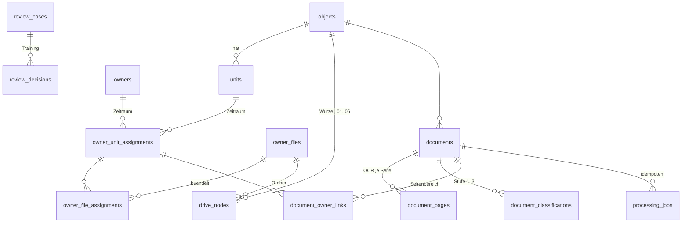

# Fachentwurf D: Datenmodell für CR-05 (Eigentümerakte, 06_Sonstiges)

> Arbeitspapier der Entwurfsphase vom 10.09.2026, nicht verbindlich. Bei Abweichungen gelten docs/architektur.md, docs/betrieb.md und docs/umsetzungsplan.md (Lesehinweise in docs/entwurf/README.md).

Stand: 10.09.2026. Faktenbasis: CR-05 (docs/anforderungen/CR-05_Eigentuemerakte_Sonstiges.md) und Befundakte (docs/entwurf/befundakte.md). Technologieneutraler Entwurf als SQL-DDL für MariaDB oder MySQL (InnoDB, utf8mb4). Versionsstände der Datenbank sind zum Umsetzungszeitpunkt zu prüfen (aktuelle LTS bzw. stabile Version).

## 0. Ergebnis und Empfehlung

Empfohlen wird ein relationales Schema mit rund 40 Tabellen in zehn Bereichen. Die tragenden Entscheidungen:

| Nr. | Entscheidung | Begründung (kurz) |
|---|---|---|
| 1 | Eigentum und Miete werden ausschließlich über zeitlich gültige Zuordnungszeilen (`owner_unit_assignments`, `tenant_unit_assignments`) abgebildet. Kein `unit.owner_id`, kein `unit.tenant_id`. | CR Abschnitt 3 und 12a. Historisch korrekte Zuordnung von Dokumenten ist nur so möglich. |
| 2 | Die Eigentümerakte wird als eigene Entität `owner_files` geführt, die eine oder mehrere Zuordnungen bündelt. Der Drive-Ordner hängt an dieser Entität, nicht am Namen. | CR Abschnitt 4: Ordner sind eine Ansicht auf das Datenmodell. Mehrere Eigentümer einer Einheit teilen einen Ordner (`WE03_Nachname1-Nachname2`). |
| 3 | Alle Drive-Objekte (Objektwurzel, Hauptordner 01 bis 06, Unterordner, Aktenordner, Listen-Dateien) liegen in einer Tabelle `drive_nodes` mit Fremdschlüsseln auf die Fachentitäten. | Ordnernamen sind austauschbar, IDs sind stabil. Cache der Folder-IDs laut CR Abschnitt 4 und 13. |
| 4 | Dokumente werden über SHA-256 je Objekt eindeutig geführt. Eingebettete Einzeldokumente (Einzelabrechnungen in einer Gesamtabrechnung) werden über Seitenbereiche in `document_owner_links` relational zugeordnet, ohne Drive-Duplikate. | CR Abschnitt 6 und 14 (Integrationstest 12 Einzelabrechnungen). |
| 5 | Verarbeitung ist idempotent über einen eindeutigen `idempotency_key` (Jobtyp, Objekt, Datei-Hash) in `processing_jobs`. Die Datenbank ist Quelle der Wahrheit, die Queue transportiert nur Job-IDs. | CR Abschnitt 7: Wiederaufnahme ohne Doppelverarbeitung. |
| 6 | Nichts wird physisch gelöscht. Fachtabellen tragen `deleted_at` (Soft-Delete), Protokolltabellen sind append-only, Fremdschlüssel stehen auf `ON DELETE RESTRICT`. Physische Löschung nur über einen Admin-Löschlauf mit freigegebener Aufbewahrungsfrist. | CR Abschnitt 0 (kein Datenverlust), 9 und 15 (Löschkonzept). |
| 7 | Sensible Werte (IBAN, OAuth-Tokens, TOTP-Geheimnis) werden anwendungsseitig verschlüsselt gespeichert, der Schlüssel liegt außerhalb der Datenbank (Docker Secret oder `.env`). Im Klartext steht nur `iban_last4`. Für den Abgleich dient ein schlüsselbasierter Hash (`iban_hash`). | CR Abschnitt 3 und 10. |
| 8 | Aufzählungswerte werden als `VARCHAR` mit `CHECK`-Constraint modelliert, nicht als `ENUM`. | Erweiterung ohne Tabellenumbau, portabel zwischen MariaDB und MySQL. |
| 9 | Jede Schemaänderung ist eine versionierte Migration mit dokumentiertem Rollback. Seeds (Kategorien, Unterordner, Einstellungen) sind idempotent. | CR Abschnitt 0 Punkt 5. |
| 10 | Die Alt-Bezeichnung `05_Sonstiges` steht ausschließlich als Konfigurationswert (`drive.legacy_folder_aliases`) in der Seed-Migration, nicht im Anwendungscode. | Befund Punkt 6.4: Definition of Done (Grep leer) und CR Abschnitt 9.3 (Altordner erkennen) lassen sich nur so vereinbaren. |

Abweichungen vom CR-Wortlaut sind in diesem Dokument als Vorschlag gekennzeichnet und in Abschnitt 14 gesammelt. Entscheidungen des Auftraggebers stehen in Abschnitt 15.

## 1. Konventionen

| Thema | Festlegung |
|---|---|
| Engine, Zeichensatz | `ENGINE=InnoDB`, `CHARSET utf8mb4`, `COLLATE utf8mb4_unicode_ci` (in beiden Systemen vorhanden). |
| Bezeichner | Tabellen Plural, snake_case, Englisch. Kommentare Deutsch über `COMMENT`. |
| Primärschlüssel | `BIGINT UNSIGNED AUTO_INCREMENT`. Keine fachlichen Primärschlüssel. |
| Zeitstempel | `created_at`, `updated_at` als `DATETIME(3)` in UTC, gesetzt durch die Anwendung. Fachliche Zeiträume (Eigentum, Miete) als `DATE`. |
| Gültigkeitszeitraum | `valid_from` einschließlich, `valid_to` einschließlich (letzter Tag). `valid_to IS NULL` bedeutet aktuell. Bei Eigentümerwechsel zum 01.07.2026 erhält der Alteigentümer `valid_to = 30.06.2026`, der Neueigentümer `valid_from = 01.07.2026`. |
| Soft-Delete | `deleted_at DATETIME(3) NULL`, `deleted_by BIGINT UNSIGNED NULL`, `delete_reason VARCHAR(255) NULL`. Eindeutigkeit über eine generierte Hilfsspalte `active_key`, die bei gelöschten Zeilen `NULL` ist (NULL kollidiert im Unique-Index nicht). |
| Aufzählungen | `VARCHAR` plus `CHECK (col IN (...))`. `CHECK` wird ab MariaDB 10.2 und MySQL 8.0.16 erzwungen (Version zum Umsetzungszeitpunkt prüfen). |
| JSON | Spaltentyp `JSON`. In MariaDB ist `JSON` ein Alias auf `LONGTEXT`, daher wird `CHECK (JSON_VALID(col))` ausdrücklich ergänzt. |
| Geldbeträge | `DECIMAL(12,2)` in EUR. KI-Kosten `DECIMAL(12,6)`. Anteile `DECIMAL(9,6)`. |
| Fremdschlüssel | Immer `ON DELETE RESTRICT ON UPDATE RESTRICT`. Kein `CASCADE`. |
| Datenbanknutzer | `app_migrate` (DDL), `app_rw` (DML ohne `DELETE` auf Protokolltabellen), `app_ro` (Reporting, Backupprüfung). |
| Personenbezug in Beispielen | Alle Beispiele synthetisch (`WE03_Mustermann`, Objekt `623`). Keine Werte aus den Stammdaten-CSVs. |

Volltext: OCR-Text wird je Seite gespeichert, jedoch erst nach Maskierung von IBAN und Kontonummern (CR Abschnitt 10: IBAN nicht im Klartext im Volltextindex). Der Originaltext ist im PDF in Drive enthalten und wird nicht separat unmaskiert persistiert. Erkannte IBAN werden getrennt als `iban_last4` plus `iban_hash` in `document_entities` abgelegt, damit der Abgleich zu Eigentümern ohne Klartext möglich ist.

## 2. Übersicht der Tabellen

| Bereich | Tabellen |
|---|---|
| A Stammdaten | objects, units, owners, owner_unit_assignments, owner_files, owner_file_assignments, tenants, leases, tenant_unit_assignments, tenant_files, tenant_file_assignments, field_provenance |
| B Katalog und Konfiguration | document_categories, document_subfolders, document_types, app_settings, retention_policies |
| C Drive-Abbild | drive_nodes, drive_sync_runs, drive_sync_actions, list_generations |
| D Dokumente | documents, document_pages, document_entities, document_classifications, document_owner_links, document_tenant_links |
| E Verarbeitung | processing_runs, processing_jobs, processing_job_events |
| F Review und Audit | review_cases, review_decisions, audit_events |
| G Import | import_batches, import_rows |
| H Sicherheit | roles, users, oauth_tokens, iban_access_log |
| I KI | ai_calls |
| J Vollständigkeit | completeness_findings |
| K Schema | schema_migrations |

Kernbeziehungen (vereinfacht):



## 3. Bereich A: Stammdaten

### 3.1 objects

Zweck: Verwaltungsobjekt (Liegenschaft). Objektnummer als Zeichenkette variabler Länge, weil der Bestand laut Befund 2- bis 6-stellige Nummern enthält. Eindeutigkeit über den Zahlenwert (`082` und `82` sind dasselbe Objekt).

Schlüssel und Indizes: PK `id`; Unique `object_number_numeric` (aktive Zeilen); Index `status`, `drive_root_folder_id`.

Constraints: `object_number` nur Ziffern (Länge über `app_settings` konfigurierbar, geprüft in der Anwendung, da die Länge nicht als statischer `CHECK` fixiert werden soll). `management_type` und `status` als `CHECK`.

Löschverhalten: Soft-Delete. Objekt mit Dokumenten oder Einheiten ist nicht physisch löschbar (RESTRICT).

```sql
CREATE TABLE objects (
  id                      BIGINT UNSIGNED NOT NULL AUTO_INCREMENT,
  object_number           VARCHAR(8)  NOT NULL COMMENT 'Ziffernfolge wie erfasst, z. B. 623 oder 82',
  object_number_numeric   INT UNSIGNED GENERATED ALWAYS AS (CAST(object_number AS UNSIGNED)) STORED,
  name                    VARCHAR(160) NULL COMMENT 'Objektbezeichnung, z. B. Ort, Strasse Hausnummer',
  street                  VARCHAR(120) NULL,
  house_number            VARCHAR(20)  NULL,
  postal_code             VARCHAR(10)  NULL,
  city                    VARCHAR(80)  NULL,
  management_type         VARCHAR(16)  NOT NULL COMMENT 'weg | rental | weg_with_se',
  status                  VARCHAR(16)  NOT NULL DEFAULT 'new' COMMENT 'new | takeover | active | archived',
  takeover_from           DATE NULL COMMENT 'Beginn Uebernahmezeitraum',
  takeover_to             DATE NULL COMMENT 'Ende Uebernahmezeitraum (Stichtag Verwaltungsuebergang)',
  fiscal_year_start_month TINYINT UNSIGNED NULL COMMENT 'Wirtschaftsjahr, 1 = Kalenderjahr',
  previous_manager_name   VARCHAR(160) NULL COMMENT 'Vorverwaltung fuer Nachforderungen',
  drive_root_folder_id    VARCHAR(128) NULL COMMENT 'Folder-ID des Objektordners in Drive',
  drive_root_folder_name  VARCHAR(255) NULL COMMENT 'Ist-Name in Drive, wird nicht umbenannt',
  drive_root_verified_at  DATETIME(3) NULL,
  notes                   TEXT NULL,
  created_by              BIGINT UNSIGNED NULL,
  created_at              DATETIME(3) NOT NULL,
  updated_at              DATETIME(3) NOT NULL,
  deleted_at              DATETIME(3) NULL,
  deleted_by              BIGINT UNSIGNED NULL,
  delete_reason           VARCHAR(255) NULL,
  active_key              INT UNSIGNED GENERATED ALWAYS AS
                            (CASE WHEN deleted_at IS NULL THEN object_number_numeric ELSE NULL END) STORED,
  PRIMARY KEY (id),
  UNIQUE KEY uq_objects_number_active (active_key),
  KEY ix_objects_status (status),
  KEY ix_objects_drive_root (drive_root_folder_id),
  CONSTRAINT ck_objects_number_digits CHECK (object_number REGEXP '^[0-9]+$'),
  CONSTRAINT ck_objects_mgmt CHECK (management_type IN ('weg','rental','weg_with_se')),
  CONSTRAINT ck_objects_status CHECK (status IN ('new','takeover','active','archived')),
  CONSTRAINT ck_objects_takeover CHECK (takeover_to IS NULL OR takeover_from IS NULL OR takeover_from <= takeover_to)
) ENGINE=InnoDB DEFAULT CHARSET=utf8mb4 COLLATE=utf8mb4_unicode_ci
  COMMENT='Verwaltungsobjekte (Liegenschaften)';
```

Hinweis: `REGEXP` in `CHECK` ist in MariaDB und MySQL 8 zulässig; falls die gewählte Version dies nicht erlaubt, entfällt der Constraint und die Prüfung erfolgt anwendungsseitig (Migration dokumentiert die Variante).

### 3.2 units

Zweck: Verwaltungseinheit. `unit_label` frei (Befund: Muster WE03, WE 3, GE 1, Garage 4, TG7 usw.), `unit_number` als Ziffernanteil, `unit_type` über konfigurierbares Präfix-Mapping. `unit_label_normalized` (Großschreibung, ohne Leerzeichen) verhindert Doppelanlage von `WE 14` und `WE14`.

Schlüssel und Indizes: PK `id`; Unique `(object_id, unit_label_normalized)` für aktive Zeilen; Index `(object_id, unit_number)`, `external_ref`.

Constraints: `unit_type` als `CHECK` mit den CR-Werten. `co_ownership_share` nullable.

Vorschlag (Abweichung): zusätzlich `co_ownership_share_base` (Nenner, z. B. 1.000 oder 10.000), da Miteigentumsanteile als Bruch angegeben werden und der Nenner je Teilungserklärung variiert. Ohne Nenner ist der Anteil nicht vergleichbar. `house_fee_monthly` wird als aktueller Wert je Einheit geführt (Quelle im Immoware-Export ist je Einheit), Änderungshistorie über `audit_events` und `field_provenance`.

Löschverhalten: Soft-Delete. Einheit mit Zuordnungen nicht physisch löschbar.

```sql
CREATE TABLE units (
  id                       BIGINT UNSIGNED NOT NULL AUTO_INCREMENT,
  object_id                BIGINT UNSIGNED NOT NULL,
  unit_number              VARCHAR(16)  NULL COMMENT 'WE-Nummer, Ziffernanteil des Labels, z. B. 3',
  unit_type                VARCHAR(24)  NOT NULL DEFAULT 'other'
                             COMMENT 'apartment | commercial | parking | garage | underground_parking | cellar | other',
  unit_label               VARCHAR(80)  NOT NULL COMMENT 'z. B. WE03',
  unit_label_normalized    VARCHAR(80)  NOT NULL COMMENT 'Grossschreibung, ohne Leerzeichen, fuer Dublettenschutz',
  co_ownership_share       DECIMAL(14,4) NULL COMMENT 'Miteigentumsanteil, Zaehler',
  co_ownership_share_base  INT UNSIGNED  NULL COMMENT 'Vorschlag: Nenner der MEA, z. B. 10000',
  building                 VARCHAR(80)  NULL COMMENT 'Gebaeude laut Quelle',
  location                 VARCHAR(120) NULL COMMENT 'Lage, z. B. 2. OG links',
  external_ref             VARCHAR(32)  NULL COMMENT 'Fremdkennung, z. B. VE-Nr aus Immoware24',
  house_fee_monthly        DECIMAL(12,2) NULL COMMENT 'Hausgeld monatlich, aktueller Wert soweit erkannt',
  status                   VARCHAR(16)  NOT NULL DEFAULT 'active' COMMENT 'active | inactive',
  data_status              VARCHAR(16)  NOT NULL DEFAULT 'incomplete' COMMENT 'confirmed | ai_suggested | incomplete',
  notes                    VARCHAR(500) NULL,
  created_at               DATETIME(3) NOT NULL,
  updated_at               DATETIME(3) NOT NULL,
  deleted_at               DATETIME(3) NULL,
  deleted_by               BIGINT UNSIGNED NULL,
  delete_reason            VARCHAR(255) NULL,
  active_key               VARCHAR(80) GENERATED ALWAYS AS
                             (CASE WHEN deleted_at IS NULL THEN unit_label_normalized ELSE NULL END) STORED,
  PRIMARY KEY (id),
  UNIQUE KEY uq_units_object_label_active (object_id, active_key),
  KEY ix_units_object_number (object_id, unit_number),
  KEY ix_units_external_ref (external_ref),
  CONSTRAINT fk_units_object FOREIGN KEY (object_id) REFERENCES objects (id)
    ON DELETE RESTRICT ON UPDATE RESTRICT,
  CONSTRAINT ck_units_type CHECK (unit_type IN
    ('apartment','commercial','parking','garage','underground_parking','cellar','other')),
  CONSTRAINT ck_units_status CHECK (status IN ('active','inactive')),
  CONSTRAINT ck_units_data_status CHECK (data_status IN ('confirmed','ai_suggested','incomplete'))
) ENGINE=InnoDB DEFAULT CHARSET=utf8mb4 COLLATE=utf8mb4_unicode_ci
  COMMENT='Verwaltungseinheiten je Objekt';
```

### 3.3 owners

Zweck: Eigentümer als natürliche Person, juristische Person oder Gemeinschaft (Ehegemeinschaft, Erbengemeinschaft, GbR). Adressen strukturiert, weil die Eigentümerliste (CR 12a) Straße, PLZ und Ort als getrennte Spalten verlangt. Bankverbindung nur als `iban_last4` (Klartext), `iban_encrypted` (anwendungsseitig verschlüsselt) und `iban_hash` (schlüsselbasierter HMAC für Abgleich). Das CR-Feld `iban_masked` wird bei Ausgabe aus `iban_last4` gebildet (Anzeigeform `DE** **** **** **** **12 34`).

Schlüssel und Indizes: PK `id`; Index `search_name`, `last_name`, `company_name`, `iban_hash`, `email`.

Constraints: `type` als `CHECK`; bei `natural_person` ist `last_name` Pflicht, bei `legal_entity` und `community` `company_name` (Prüfung anwendungsseitig, weil `CHECK` mit bedingter Pflicht in beiden Systemen zwar möglich, aber bei Teildaten aus Imports zu restriktiv wäre; Datensätze dürfen unvollständig sein und tragen dann `data_status = incomplete`).

Löschverhalten: Soft-Delete. Physische Löschung nur über Admin-Löschlauf nach Freigabe, Voraussetzung: keine aktive Zuordnung und keine Dokumentverknüpfung.

```sql
CREATE TABLE owners (
  id                          BIGINT UNSIGNED NOT NULL AUTO_INCREMENT,
  type                        VARCHAR(16)  NOT NULL COMMENT 'natural_person | legal_entity | community',
  salutation                  VARCHAR(40)  NULL,
  first_name                  VARCHAR(120) NULL,
  last_name                   VARCHAR(120) NULL,
  company_name                VARCHAR(200) NULL COMMENT 'Firma oder Bezeichnung der Gemeinschaft',
  short_name                  VARCHAR(60)  NULL COMMENT 'Firmenkurzname fuer Ordnerbenennung',
  search_name                 VARCHAR(240) NOT NULL COMMENT 'normalisiert fuer Suche und Dublettenpruefung',
  correspondence_street       VARCHAR(120) NULL,
  correspondence_house_number VARCHAR(20)  NULL,
  correspondence_postal_code  VARCHAR(10)  NULL,
  correspondence_city         VARCHAR(80)  NULL,
  correspondence_country      CHAR(2)      NULL COMMENT 'ISO 3166-1 alpha-2',
  correspondence_addition     VARCHAR(120) NULL COMMENT 'c/o, Zusatz',
  delivery_street             VARCHAR(120) NULL COMMENT 'abweichende Zustelladresse',
  delivery_house_number       VARCHAR(20)  NULL,
  delivery_postal_code        VARCHAR(10)  NULL,
  delivery_city               VARCHAR(80)  NULL,
  delivery_country            CHAR(2)      NULL,
  delivery_addition           VARCHAR(120) NULL,
  email                       VARCHAR(254) NULL,
  phone                       VARCHAR(40)  NULL,
  mobile                      VARCHAR(40)  NULL,
  iban_last4                  CHAR(4)      NULL COMMENT 'einzige Klartextinformation der IBAN',
  iban_encrypted              VARBINARY(160) NULL COMMENT 'AES-GCM, Nonce||Ciphertext||Tag, Schluessel ausserhalb DB',
  iban_key_version            SMALLINT UNSIGNED NULL COMMENT 'Version des Verschluesselungsschluessels',
  iban_hash                   BINARY(32)   NULL COMMENT 'HMAC-SHA256 der normalisierten IBAN fuer Abgleich',
  sepa_mandate_present        TINYINT(1)   NULL COMMENT 'NULL = unbekannt, 0 = nein, 1 = ja',
  sepa_mandate_reference      VARCHAR(35)  NULL,
  notes                       VARCHAR(500) NULL COMMENT 'Bemerkung fuer Listen',
  data_status                 VARCHAR(16)  NOT NULL DEFAULT 'incomplete' COMMENT 'confirmed | ai_suggested | incomplete',
  created_at                  DATETIME(3) NOT NULL,
  updated_at                  DATETIME(3) NOT NULL,
  deleted_at                  DATETIME(3) NULL,
  deleted_by                  BIGINT UNSIGNED NULL,
  delete_reason               VARCHAR(255) NULL,
  PRIMARY KEY (id),
  KEY ix_owners_search_name (search_name),
  KEY ix_owners_last_name (last_name),
  KEY ix_owners_company (company_name),
  KEY ix_owners_iban_hash (iban_hash),
  KEY ix_owners_email (email),
  CONSTRAINT ck_owners_type CHECK (type IN ('natural_person','legal_entity','community')),
  CONSTRAINT ck_owners_data_status CHECK (data_status IN ('confirmed','ai_suggested','incomplete')),
  CONSTRAINT ck_owners_iban_pair CHECK ((iban_encrypted IS NULL) = (iban_key_version IS NULL))
) ENGINE=InnoDB DEFAULT CHARSET=utf8mb4 COLLATE=utf8mb4_unicode_ci
  COMMENT='Eigentuemer (Personen, Firmen, Gemeinschaften)';
```

Mitglieder einer Gemeinschaft (Erbengemeinschaft mit drei Personen) werden nicht als eigene Tabelle geführt. Entweder erhält die Gemeinschaft eine Zeile vom Typ `community`, oder jede Person erhält eine eigene Zeile und eine eigene Zuordnung mit `share`. Die Ordnerbenennung `WE03_Nachname1-Nachname2` (CR Abschnitt 4) setzt die zweite Variante voraus, daher ist sie Standard; Variante 1 bleibt für Fälle, in denen nur die Bezeichnung der Gemeinschaft bekannt ist.

### 3.4 owner_unit_assignments

Zweck: Zeitlich gültige Verbindung Eigentümer zu Einheit. Eigentümerwechsel ist eine neue Zeile, nie ein Update von `owner_id`.

Schlüssel und Indizes: PK `id`; Index `(unit_id, valid_from, valid_to)`, `(owner_id, valid_from)`, `source_document_id`. Generierte Spalte `is_current` für schnelle Filterung.

Constraints: `valid_from <= valid_to` als `CHECK`. `share` zwischen 0 und 1.

Vorschlag (Abweichung): `valid_from` nullable, weil bei Übernahmen der Eigentumsbeginn häufig nicht in den Unterlagen steht. `NULL` bedeutet unbekannt und wird bei der Stichtagsabfrage als unbegrenzt in der Vergangenheit behandelt. Die Vollständigkeitsprüfung (CR Abschnitt 12) meldet fehlendes `valid_from` als offenen Punkt.

Keine Überlappung: Die Regel "für dasselbe Paar (owner_id, unit_id) dürfen sich Zeiträume nicht überschneiden" kann in MariaDB und MySQL nicht deklarativ ausgedrückt werden (kein Exclusion-Constraint wie in PostgreSQL). Ein Trigger wäre möglich, ist aber schwer testbar und verdeckt die Fehlermeldung. Deshalb: Prüfung in der Anwendung innerhalb einer Transaktion mit `SELECT ... FOR UPDATE` auf die Einheit, plus nächtlicher Konsistenzlauf, der Verstöße als `review_cases` meldet. Überlappungen verschiedener Eigentümer auf derselben Einheit sind zulässig (Mehrfacheigentum). Die Summe der `share`-Werte je Einheit und Stichtag über 1,0 erzeugt eine Warnung, keine Sperre (Teildaten aus Imports).

Löschverhalten: Soft-Delete. Zuordnungen mit Dokumentverknüpfung sind nicht physisch löschbar.

```sql
CREATE TABLE owner_unit_assignments (
  id                    BIGINT UNSIGNED NOT NULL AUTO_INCREMENT,
  owner_id              BIGINT UNSIGNED NOT NULL,
  unit_id               BIGINT UNSIGNED NOT NULL,
  valid_from            DATE NULL COMMENT 'Eigentumsbeginn einschliesslich, NULL = unbekannt',
  valid_to              DATE NULL COMMENT 'Eigentumsende einschliesslich, NULL = aktuell',
  share                 DECIMAL(9,6) NULL COMMENT 'Anteil bei Mehrfacheigentum, 0.5 = haelftig',
  source_document_id    BIGINT UNSIGNED NULL,
  source_import_row_id  BIGINT UNSIGNED NULL,
  confidence            DECIMAL(5,4) NULL COMMENT 'Konfidenz der Erkennung, NULL bei manueller Anlage',
  data_status           VARCHAR(16) NOT NULL DEFAULT 'incomplete' COMMENT 'confirmed | ai_suggested | incomplete',
  confirmed_by          BIGINT UNSIGNED NULL,
  confirmed_at          DATETIME(3) NULL,
  notes                 VARCHAR(500) NULL,
  is_current            TINYINT(1) GENERATED ALWAYS AS (CASE WHEN valid_to IS NULL THEN 1 ELSE 0 END) STORED,
  created_at            DATETIME(3) NOT NULL,
  updated_at            DATETIME(3) NOT NULL,
  deleted_at            DATETIME(3) NULL,
  deleted_by            BIGINT UNSIGNED NULL,
  delete_reason         VARCHAR(255) NULL,
  PRIMARY KEY (id),
  KEY ix_oua_unit_period (unit_id, valid_from, valid_to),
  KEY ix_oua_owner_period (owner_id, valid_from),
  KEY ix_oua_unit_current (unit_id, is_current),
  KEY ix_oua_source_doc (source_document_id),
  CONSTRAINT fk_oua_owner FOREIGN KEY (owner_id) REFERENCES owners (id)
    ON DELETE RESTRICT ON UPDATE RESTRICT,
  CONSTRAINT fk_oua_unit FOREIGN KEY (unit_id) REFERENCES units (id)
    ON DELETE RESTRICT ON UPDATE RESTRICT,
  CONSTRAINT ck_oua_period CHECK (valid_from IS NULL OR valid_to IS NULL OR valid_from <= valid_to),
  CONSTRAINT ck_oua_share CHECK (share IS NULL OR (share > 0 AND share <= 1)),
  CONSTRAINT ck_oua_data_status CHECK (data_status IN ('confirmed','ai_suggested','incomplete'))
) ENGINE=InnoDB DEFAULT CHARSET=utf8mb4 COLLATE=utf8mb4_unicode_ci
  COMMENT='Zeitraumbezogene Zuordnung Eigentuemer zu Einheit';
```

Die Fremdschlüssel auf `documents` und `import_rows` werden in einer späteren Migration ergänzt (zyklische Abhängigkeit, siehe Abschnitt 13).

### 3.5 owner_files und owner_file_assignments

Zweck: Die Eigentümerakte als Fachentität. Sie bündelt eine oder mehrere Zuordnungen (bei Mehrfacheigentum derselben Einheit einen gemeinsamen Ordner `WE03_Nachname1-Nachname2`). Der Drive-Ordner hängt über `drive_nodes.owner_file_id` an dieser Entität. Die Sonderfälle des CR werden über `file_kind` abgebildet: `unit_owner` (Standard), `unknown_unit` (`Unbekannte_WE_Nachname`), `unassigned` (`Unzugeordnet`, genau eine je Objekt).

Bei Eigentümerwechsel bleibt die Akte des Alteigentümers bestehen, für den Neueigentümer entsteht eine neue Akte (CR Abschnitt 4). Der aus der Benennungsfunktion erzeugte Name wird in `folder_name` gespeichert; bei Namenskollision (zwei Eigentümer namens Mustermann nacheinander auf WE03) hängt die Benennungsfunktion ein Suffix an (Vorschlag: Jahr des Eigentumsbeginns, sonst laufende Nummer). Eindeutig je Objekt.

Schlüssel und Indizes: PK `id`; Unique `(object_id, folder_name)` aktiv; Index `(unit_id)`. In `owner_file_assignments` Unique `(assignment_id)`: eine Zuordnung gehört zu genau einer Akte.

Löschverhalten: Soft-Delete, Ordner in Drive bleibt bestehen (nichts wird gelöscht).

```sql
CREATE TABLE owner_files (
  id              BIGINT UNSIGNED NOT NULL AUTO_INCREMENT,
  object_id       BIGINT UNSIGNED NOT NULL,
  unit_id         BIGINT UNSIGNED NULL COMMENT 'NULL bei unknown_unit und unassigned',
  file_kind       VARCHAR(16) NOT NULL DEFAULT 'unit_owner' COMMENT 'unit_owner | unknown_unit | unassigned',
  folder_name     VARCHAR(255) NOT NULL COMMENT 'Ergebnis der Benennungsfunktion, z. B. WE03_Mustermann',
  name_basis      JSON NULL COMMENT 'Eingaben der Benennungsfunktion (Label, Namen, Suffix) fuer Nachvollziehbarkeit',
  status          VARCHAR(16) NOT NULL DEFAULT 'active' COMMENT 'active | closed',
  created_at      DATETIME(3) NOT NULL,
  updated_at      DATETIME(3) NOT NULL,
  deleted_at      DATETIME(3) NULL,
  deleted_by      BIGINT UNSIGNED NULL,
  delete_reason   VARCHAR(255) NULL,
  active_key      VARCHAR(255) GENERATED ALWAYS AS
                    (CASE WHEN deleted_at IS NULL THEN folder_name ELSE NULL END) STORED,
  PRIMARY KEY (id),
  UNIQUE KEY uq_owner_files_name_active (object_id, active_key),
  KEY ix_owner_files_unit (unit_id),
  CONSTRAINT fk_owner_files_object FOREIGN KEY (object_id) REFERENCES objects (id)
    ON DELETE RESTRICT ON UPDATE RESTRICT,
  CONSTRAINT fk_owner_files_unit FOREIGN KEY (unit_id) REFERENCES units (id)
    ON DELETE RESTRICT ON UPDATE RESTRICT,
  CONSTRAINT ck_owner_files_kind CHECK (file_kind IN ('unit_owner','unknown_unit','unassigned')),
  CONSTRAINT ck_owner_files_status CHECK (status IN ('active','closed')),
  CONSTRAINT ck_owner_files_json CHECK (name_basis IS NULL OR JSON_VALID(name_basis))
) ENGINE=InnoDB DEFAULT CHARSET=utf8mb4 COLLATE=utf8mb4_unicode_ci
  COMMENT='Eigentuemerakte als Fachentitaet, Drive-Ordner ist Ansicht darauf';

CREATE TABLE owner_file_assignments (
  id               BIGINT UNSIGNED NOT NULL AUTO_INCREMENT,
  owner_file_id    BIGINT UNSIGNED NOT NULL,
  assignment_id    BIGINT UNSIGNED NOT NULL,
  created_at       DATETIME(3) NOT NULL,
  PRIMARY KEY (id),
  UNIQUE KEY uq_ofa_assignment (assignment_id),
  KEY ix_ofa_file (owner_file_id),
  CONSTRAINT fk_ofa_file FOREIGN KEY (owner_file_id) REFERENCES owner_files (id)
    ON DELETE RESTRICT ON UPDATE RESTRICT,
  CONSTRAINT fk_ofa_assignment FOREIGN KEY (assignment_id) REFERENCES owner_unit_assignments (id)
    ON DELETE RESTRICT ON UPDATE RESTRICT
) ENGINE=InnoDB DEFAULT CHARSET=utf8mb4 COLLATE=utf8mb4_unicode_ci
  COMMENT='Zuordnungen, die eine Eigentuemerakte buendelt';
```

Akten vom Typ `unknown_unit` verweisen nicht auf eine Zuordnung, weil keine Einheit bekannt ist. Vorschlag: Spalte `owner_id` in `owner_files` ergänzen (nullable), die nur bei `file_kind = unknown_unit` gesetzt ist. Sie ist in der obigen DDL bewusst weggelassen, um die Regel "Verknüpfung über Zuordnung" nicht zu verwässern; die Ergänzung ist eine Migration von einer Spalte, falls der Auftraggeber den Fall `Unbekannte_WE_Nachname` in der Praxis häufig sieht.

### 3.6 tenants

Zweck: Mieter analog zu `owners` (CR 12a). Gleiche Struktur für Person, Firma, Bankdaten und Kontaktdaten. Kein Typ `community`, stattdessen mehrere Mieter je Mietverhältnis.

Löschverhalten: wie `owners`.

```sql
CREATE TABLE tenants (
  id                    BIGINT UNSIGNED NOT NULL AUTO_INCREMENT,
  type                  VARCHAR(16)  NOT NULL COMMENT 'natural_person | legal_entity',
  salutation            VARCHAR(40)  NULL,
  first_name            VARCHAR(120) NULL,
  last_name             VARCHAR(120) NULL,
  company_name          VARCHAR(200) NULL,
  short_name            VARCHAR(60)  NULL,
  search_name           VARCHAR(240) NOT NULL,
  email                 VARCHAR(254) NULL,
  phone                 VARCHAR(40)  NULL,
  mobile                VARCHAR(40)  NULL,
  iban_last4            CHAR(4)      NULL,
  iban_encrypted        VARBINARY(160) NULL,
  iban_key_version      SMALLINT UNSIGNED NULL,
  iban_hash             BINARY(32)   NULL,
  sepa_mandate_present  TINYINT(1)   NULL COMMENT 'NULL = unbekannt',
  sepa_mandate_reference VARCHAR(35) NULL,
  notes                 VARCHAR(500) NULL,
  data_status           VARCHAR(16)  NOT NULL DEFAULT 'incomplete',
  created_at            DATETIME(3) NOT NULL,
  updated_at            DATETIME(3) NOT NULL,
  deleted_at            DATETIME(3) NULL,
  deleted_by            BIGINT UNSIGNED NULL,
  delete_reason         VARCHAR(255) NULL,
  PRIMARY KEY (id),
  KEY ix_tenants_search_name (search_name),
  KEY ix_tenants_last_name (last_name),
  KEY ix_tenants_iban_hash (iban_hash),
  CONSTRAINT ck_tenants_type CHECK (type IN ('natural_person','legal_entity')),
  CONSTRAINT ck_tenants_data_status CHECK (data_status IN ('confirmed','ai_suggested','incomplete')),
  CONSTRAINT ck_tenants_iban_pair CHECK ((iban_encrypted IS NULL) = (iban_key_version IS NULL))
) ENGINE=InnoDB DEFAULT CHARSET=utf8mb4 COLLATE=utf8mb4_unicode_ci
  COMMENT='Mieter, analog zu owners';
```

### 3.7 leases

Zweck: Mietverhältnis (Vertrag) mit den Mietfeldern der Mieterliste: Kaltmiete, Nebenkostenvorauszahlung, Heizkostenvorauszahlung, Gesamtmiete (generiert), Kaution mit Anlageform, Staffel oder Index, Personenanzahl. Ein Vertrag kann mehrere Einheiten umfassen (Wohnung plus Stellplatz) und mehrere Mieter haben; beides über `tenant_unit_assignments`.

Schlüssel und Indizes: PK `id`; Index `(object_id, start_date)`, `source_document_id`.

Constraints: Beträge nicht negativ; `start_date <= end_date`; `rent_adjustment_type` und `deposit_type` als `CHECK`. `total_rent` bleibt `NULL`, solange die Kaltmiete unbekannt ist (CR 12a: leere Felder bleiben leer).

Löschverhalten: Soft-Delete.

```sql
CREATE TABLE leases (
  id                     BIGINT UNSIGNED NOT NULL AUTO_INCREMENT,
  object_id              BIGINT UNSIGNED NOT NULL,
  lease_reference        VARCHAR(60) NULL COMMENT 'Vertragsnummer der Vorverwaltung, soweit vorhanden',
  start_date             DATE NULL COMMENT 'Mietbeginn, NULL = unbekannt',
  end_date               DATE NULL COMMENT 'Mietende, NULL = laufend',
  base_rent              DECIMAL(12,2) NULL COMMENT 'Kaltmiete monatlich',
  utilities_prepayment   DECIMAL(12,2) NULL COMMENT 'Nebenkostenvorauszahlung monatlich',
  heating_prepayment     DECIMAL(12,2) NULL COMMENT 'Heizkostenvorauszahlung monatlich',
  total_rent             DECIMAL(12,2) GENERATED ALWAYS AS
                           (CASE WHEN base_rent IS NULL THEN NULL
                                 ELSE base_rent + COALESCE(utilities_prepayment,0) + COALESCE(heating_prepayment,0) END) STORED
                           COMMENT 'Gesamtmiete',
  deposit_amount         DECIMAL(12,2) NULL COMMENT 'Kaution',
  deposit_type           VARCHAR(24) NULL COMMENT 'cash_account | savings_book | bank_guarantee | pledge | insurance | other | unknown',
  deposit_notes          VARCHAR(255) NULL,
  rent_adjustment_type   VARCHAR(16) NOT NULL DEFAULT 'unknown' COMMENT 'none | graduated | indexed | unknown',
  persons_count          SMALLINT UNSIGNED NULL COMMENT 'Anzahl Personen im Haushalt',
  source_document_id     BIGINT UNSIGNED NULL,
  source_import_row_id   BIGINT UNSIGNED NULL,
  confidence             DECIMAL(5,4) NULL,
  data_status            VARCHAR(16) NOT NULL DEFAULT 'incomplete',
  notes                  VARCHAR(500) NULL,
  created_at             DATETIME(3) NOT NULL,
  updated_at             DATETIME(3) NOT NULL,
  deleted_at             DATETIME(3) NULL,
  deleted_by             BIGINT UNSIGNED NULL,
  delete_reason          VARCHAR(255) NULL,
  PRIMARY KEY (id),
  KEY ix_leases_object_start (object_id, start_date),
  KEY ix_leases_source_doc (source_document_id),
  CONSTRAINT fk_leases_object FOREIGN KEY (object_id) REFERENCES objects (id)
    ON DELETE RESTRICT ON UPDATE RESTRICT,
  CONSTRAINT ck_leases_period CHECK (start_date IS NULL OR end_date IS NULL OR start_date <= end_date),
  CONSTRAINT ck_leases_amounts CHECK (
    (base_rent IS NULL OR base_rent >= 0) AND
    (utilities_prepayment IS NULL OR utilities_prepayment >= 0) AND
    (heating_prepayment IS NULL OR heating_prepayment >= 0) AND
    (deposit_amount IS NULL OR deposit_amount >= 0)),
  CONSTRAINT ck_leases_deposit_type CHECK (deposit_type IS NULL OR deposit_type IN
    ('cash_account','savings_book','bank_guarantee','pledge','insurance','other','unknown')),
  CONSTRAINT ck_leases_adjustment CHECK (rent_adjustment_type IN ('none','graduated','indexed','unknown')),
  CONSTRAINT ck_leases_data_status CHECK (data_status IN ('confirmed','ai_suggested','incomplete'))
) ENGINE=InnoDB DEFAULT CHARSET=utf8mb4 COLLATE=utf8mb4_unicode_ci
  COMMENT='Mietverhaeltnisse mit Mietfeldern der Mieterliste';
```

Die Werteliste für `deposit_type` ist ein Vorschlag; sie wird in `app_settings` (`leases.deposit_types`) gespiegelt, damit das Review Center dieselbe Auswahl anbietet. Erweiterung erfordert eine Migration des `CHECK`.

### 3.8 tenant_unit_assignments

Zweck: Zeitraumbezogene Zuordnung Mieter zu Einheit, optional mit Bezug auf das Mietverhältnis. Mieterwechsel als neue Zeile. Regeln zur Überlappung wie bei Eigentümern (anwendungsseitig).

```sql
CREATE TABLE tenant_unit_assignments (
  id                    BIGINT UNSIGNED NOT NULL AUTO_INCREMENT,
  tenant_id             BIGINT UNSIGNED NOT NULL,
  unit_id               BIGINT UNSIGNED NOT NULL,
  lease_id              BIGINT UNSIGNED NULL,
  role                  VARCHAR(16) NOT NULL DEFAULT 'tenant' COMMENT 'tenant | co_tenant | guarantor',
  valid_from            DATE NULL COMMENT 'Mietbeginn einschliesslich, NULL = unbekannt',
  valid_to              DATE NULL COMMENT 'Mietende einschliesslich, NULL = laufend',
  source_document_id    BIGINT UNSIGNED NULL,
  source_import_row_id  BIGINT UNSIGNED NULL,
  confidence            DECIMAL(5,4) NULL,
  data_status           VARCHAR(16) NOT NULL DEFAULT 'incomplete',
  confirmed_by          BIGINT UNSIGNED NULL,
  confirmed_at          DATETIME(3) NULL,
  notes                 VARCHAR(500) NULL,
  is_current            TINYINT(1) GENERATED ALWAYS AS (CASE WHEN valid_to IS NULL THEN 1 ELSE 0 END) STORED,
  created_at            DATETIME(3) NOT NULL,
  updated_at            DATETIME(3) NOT NULL,
  deleted_at            DATETIME(3) NULL,
  deleted_by            BIGINT UNSIGNED NULL,
  delete_reason         VARCHAR(255) NULL,
  PRIMARY KEY (id),
  KEY ix_tua_unit_period (unit_id, valid_from, valid_to),
  KEY ix_tua_tenant_period (tenant_id, valid_from),
  KEY ix_tua_lease (lease_id),
  CONSTRAINT fk_tua_tenant FOREIGN KEY (tenant_id) REFERENCES tenants (id)
    ON DELETE RESTRICT ON UPDATE RESTRICT,
  CONSTRAINT fk_tua_unit FOREIGN KEY (unit_id) REFERENCES units (id)
    ON DELETE RESTRICT ON UPDATE RESTRICT,
  CONSTRAINT fk_tua_lease FOREIGN KEY (lease_id) REFERENCES leases (id)
    ON DELETE RESTRICT ON UPDATE RESTRICT,
  CONSTRAINT ck_tua_role CHECK (role IN ('tenant','co_tenant','guarantor')),
  CONSTRAINT ck_tua_period CHECK (valid_from IS NULL OR valid_to IS NULL OR valid_from <= valid_to),
  CONSTRAINT ck_tua_data_status CHECK (data_status IN ('confirmed','ai_suggested','incomplete'))
) ENGINE=InnoDB DEFAULT CHARSET=utf8mb4 COLLATE=utf8mb4_unicode_ci
  COMMENT='Zeitraumbezogene Zuordnung Mieter zu Einheit';
```

### 3.9 tenant_files und tenant_file_assignments

Zweck: Mieterakte analog zu `owner_files` für die Ablage in `04_Mieterakte`. Struktur identisch (`object_id`, `unit_id`, `file_kind`, `folder_name`, `name_basis`, `status`, Soft-Delete, `active_key`), Verknüpfungstabelle `tenant_file_assignments (tenant_file_id, assignment_id UNIQUE)` mit Fremdschlüssel auf `tenant_unit_assignments`. Die Unterstruktur der Mieterakte ist im CR nicht spezifiziert (Befund Punkt 6.3) und wird als leere Konfiguration `tenant_file.subfolders` angelegt.

```sql
CREATE TABLE tenant_files (
  id              BIGINT UNSIGNED NOT NULL AUTO_INCREMENT,
  object_id       BIGINT UNSIGNED NOT NULL,
  unit_id         BIGINT UNSIGNED NULL,
  file_kind       VARCHAR(16) NOT NULL DEFAULT 'unit_tenant' COMMENT 'unit_tenant | unknown_unit | unassigned',
  folder_name     VARCHAR(255) NOT NULL,
  name_basis      JSON NULL,
  status          VARCHAR(16) NOT NULL DEFAULT 'active',
  created_at      DATETIME(3) NOT NULL,
  updated_at      DATETIME(3) NOT NULL,
  deleted_at      DATETIME(3) NULL,
  deleted_by      BIGINT UNSIGNED NULL,
  delete_reason   VARCHAR(255) NULL,
  active_key      VARCHAR(255) GENERATED ALWAYS AS
                    (CASE WHEN deleted_at IS NULL THEN folder_name ELSE NULL END) STORED,
  PRIMARY KEY (id),
  UNIQUE KEY uq_tenant_files_name_active (object_id, active_key),
  KEY ix_tenant_files_unit (unit_id),
  CONSTRAINT fk_tenant_files_object FOREIGN KEY (object_id) REFERENCES objects (id)
    ON DELETE RESTRICT ON UPDATE RESTRICT,
  CONSTRAINT fk_tenant_files_unit FOREIGN KEY (unit_id) REFERENCES units (id)
    ON DELETE RESTRICT ON UPDATE RESTRICT,
  CONSTRAINT ck_tenant_files_kind CHECK (file_kind IN ('unit_tenant','unknown_unit','unassigned')),
  CONSTRAINT ck_tenant_files_status CHECK (status IN ('active','closed')),
  CONSTRAINT ck_tenant_files_json CHECK (name_basis IS NULL OR JSON_VALID(name_basis))
) ENGINE=InnoDB DEFAULT CHARSET=utf8mb4 COLLATE=utf8mb4_unicode_ci
  COMMENT='Mieterakte als Fachentitaet';

CREATE TABLE tenant_file_assignments (
  id               BIGINT UNSIGNED NOT NULL AUTO_INCREMENT,
  tenant_file_id   BIGINT UNSIGNED NOT NULL,
  assignment_id    BIGINT UNSIGNED NOT NULL,
  created_at       DATETIME(3) NOT NULL,
  PRIMARY KEY (id),
  UNIQUE KEY uq_tfa_assignment (assignment_id),
  KEY ix_tfa_file (tenant_file_id),
  CONSTRAINT fk_tfa_file FOREIGN KEY (tenant_file_id) REFERENCES tenant_files (id)
    ON DELETE RESTRICT ON UPDATE RESTRICT,
  CONSTRAINT fk_tfa_assignment FOREIGN KEY (assignment_id) REFERENCES tenant_unit_assignments (id)
    ON DELETE RESTRICT ON UPDATE RESTRICT
) ENGINE=InnoDB DEFAULT CHARSET=utf8mb4 COLLATE=utf8mb4_unicode_ci;
```

### 3.10 field_provenance

Zweck: Herkunft und Status je Feld eines Stammdatensatzes. Die Listen (CR 12a) verlangen je Datensatz die Spalten Status (bestätigt, KI-Vorschlag, unvollständig) und Quelle (Dokument, aus dem der Wert stammt). Da ein Datensatz Werte aus mehreren Dokumenten enthalten kann (Adresse aus Eigentümerliste, IBAN aus SEPA-Mandat), wird die Herkunft je Feld gespeichert. Der Datensatzstatus `data_status` wird daraus abgeleitet: `confirmed`, wenn alle Pflichtfelder bestätigt sind; `ai_suggested`, wenn mindestens ein Feld unbestätigt aus Klassifikation oder Import stammt; sonst `incomplete`.

Schlüssel und Indizes: PK `id`; Unique `(entity_type, entity_id, field_name)` (aktueller Stand, Historie über `audit_events`); Index `source_document_id`.

Löschverhalten: Zeile wird beim Feldwechsel überschrieben; alter Stand landet in `audit_events`. Kein physisches Löschen.

```sql
CREATE TABLE field_provenance (
  id                    BIGINT UNSIGNED NOT NULL AUTO_INCREMENT,
  entity_type           VARCHAR(32) NOT NULL COMMENT 'owner | unit | owner_unit_assignment | tenant | lease | tenant_unit_assignment | object',
  entity_id             BIGINT UNSIGNED NOT NULL,
  field_name            VARCHAR(64) NOT NULL,
  source_kind           VARCHAR(16) NOT NULL COMMENT 'document | import_row | manual | ai | system',
  source_document_id    BIGINT UNSIGNED NULL,
  source_page_from      INT UNSIGNED NULL,
  source_page_to        INT UNSIGNED NULL,
  source_import_row_id  BIGINT UNSIGNED NULL,
  confidence            DECIMAL(5,4) NULL,
  status                VARCHAR(16) NOT NULL COMMENT 'confirmed | ai_suggested | incomplete',
  set_by                BIGINT UNSIGNED NULL COMMENT 'Nutzer bei manual oder Bestaetigung',
  set_at                DATETIME(3) NOT NULL,
  PRIMARY KEY (id),
  UNIQUE KEY uq_provenance_field (entity_type, entity_id, field_name),
  KEY ix_provenance_source_doc (source_document_id),
  KEY ix_provenance_import_row (source_import_row_id),
  CONSTRAINT ck_provenance_kind CHECK (source_kind IN ('document','import_row','manual','ai','system')),
  CONSTRAINT ck_provenance_status CHECK (status IN ('confirmed','ai_suggested','incomplete')),
  CONSTRAINT ck_provenance_pages CHECK (source_page_from IS NULL OR source_page_to IS NULL OR source_page_from <= source_page_to)
) ENGINE=InnoDB DEFAULT CHARSET=utf8mb4 COLLATE=utf8mb4_unicode_ci
  COMMENT='Herkunft und Bestaetigungsstatus je Stammdatenfeld';
```

`entity_type` plus `entity_id` ist ein polymorpher Verweis ohne Fremdschlüssel. Das ist eine bewusste Ausnahme von der FK-Regel; die referenzielle Integrität wird durch den nächtlichen Konsistenzlauf geprüft.

## 4. Bereich B: Katalog und Konfiguration

### 4.1 document_categories, document_subfolders, document_types

Zweck: Katalog der sechs Hauptordner (01 bis 06), ihrer Unterordner und der Dokumentunterarten. Der Katalog wird per Seed-Migration befüllt und ist administrativ erweiterbar (CR Abschnitt 4: Unterstruktur als Konfiguration). Die Dokumentunterart trägt `requires_period`, damit die Pflicht "Abrechnungsjahr bzw. Wirtschaftsjahr" (CR Abschnitt 5, Unterordner 05 und 06 der Eigentümerakte) datengetrieben geprüft wird.

Schlüssel: `document_categories.code` (`'01'` bis `'06'`) als fachlicher Primärschlüssel, weil er stabil und kurz ist und in vielen Tabellen als Fremdschlüssel steht. Unterordner und Unterarten mit numerischem PK und Unique auf Code je Elternelement.

Löschverhalten: `is_active = 0` statt Löschen. Physisches Löschen nur, wenn keine Referenz existiert (RESTRICT).

```sql
CREATE TABLE document_categories (
  code          CHAR(2)      NOT NULL COMMENT '01 .. 06',
  folder_name   VARCHAR(80)  NOT NULL COMMENT 'Ordnername in Drive, z. B. 05_Eigentuemerakte',
  display_name  VARCHAR(80)  NOT NULL,
  scope         VARCHAR(16)  NOT NULL COMMENT 'object | owner | tenant | misc',
  sort_order    TINYINT UNSIGNED NOT NULL,
  is_active     TINYINT(1)   NOT NULL DEFAULT 1,
  created_at    DATETIME(3)  NOT NULL,
  updated_at    DATETIME(3)  NOT NULL,
  PRIMARY KEY (code),
  UNIQUE KEY uq_categories_folder (folder_name),
  CONSTRAINT ck_categories_scope CHECK (scope IN ('object','owner','tenant','misc'))
) ENGINE=InnoDB DEFAULT CHARSET=utf8mb4 COLLATE=utf8mb4_unicode_ci
  COMMENT='Hauptordner 01 bis 06';

CREATE TABLE document_subfolders (
  id             BIGINT UNSIGNED NOT NULL AUTO_INCREMENT,
  category_code  CHAR(2)      NOT NULL,
  code           CHAR(2)      NOT NULL COMMENT 'z. B. 05 fuer 05_Abrechnungen',
  folder_name    VARCHAR(80)  NOT NULL COMMENT 'z. B. 05_Abrechnungen',
  display_name   VARCHAR(80)  NOT NULL,
  sort_order     TINYINT UNSIGNED NOT NULL,
  is_active      TINYINT(1)   NOT NULL DEFAULT 1,
  created_at     DATETIME(3)  NOT NULL,
  updated_at     DATETIME(3)  NOT NULL,
  PRIMARY KEY (id),
  UNIQUE KEY uq_subfolders_code (category_code, code),
  UNIQUE KEY uq_subfolders_name (category_code, folder_name),
  CONSTRAINT fk_subfolders_category FOREIGN KEY (category_code) REFERENCES document_categories (code)
    ON DELETE RESTRICT ON UPDATE RESTRICT
) ENGINE=InnoDB DEFAULT CHARSET=utf8mb4 COLLATE=utf8mb4_unicode_ci
  COMMENT='Unterordner je Hauptordner, z. B. Eigentuemerakte 01 bis 11, Sonstiges 01 bis 04';

CREATE TABLE document_types (
  id               BIGINT UNSIGNED NOT NULL AUTO_INCREMENT,
  category_code    CHAR(2)      NOT NULL,
  subfolder_id     BIGINT UNSIGNED NULL,
  code             VARCHAR(48)  NOT NULL COMMENT 'stabiler Schluessel, z. B. einzelabrechnung',
  name             VARCHAR(120) NOT NULL COMMENT 'Dokumentunterart, z. B. Einzelabrechnung',
  requires_period  TINYINT(1)   NOT NULL DEFAULT 0 COMMENT '1 = Abrechnungsjahr bzw. Wirtschaftsjahr Pflicht',
  requires_owner   TINYINT(1)   NOT NULL DEFAULT 0 COMMENT '1 = Eigentuemer- oder Einheitenbezug Pflicht',
  requires_tenant  TINYINT(1)   NOT NULL DEFAULT 0,
  keywords         JSON NULL COMMENT 'Stichworte fuer Stufe 1',
  is_active        TINYINT(1)   NOT NULL DEFAULT 1,
  created_at       DATETIME(3)  NOT NULL,
  updated_at       DATETIME(3)  NOT NULL,
  PRIMARY KEY (id),
  UNIQUE KEY uq_doctypes_code (code),
  KEY ix_doctypes_category (category_code, subfolder_id),
  CONSTRAINT fk_doctypes_category FOREIGN KEY (category_code) REFERENCES document_categories (code)
    ON DELETE RESTRICT ON UPDATE RESTRICT,
  CONSTRAINT fk_doctypes_subfolder FOREIGN KEY (subfolder_id) REFERENCES document_subfolders (id)
    ON DELETE RESTRICT ON UPDATE RESTRICT,
  CONSTRAINT ck_doctypes_keywords CHECK (keywords IS NULL OR JSON_VALID(keywords))
) ENGINE=InnoDB DEFAULT CHARSET=utf8mb4 COLLATE=utf8mb4_unicode_ci
  COMMENT='Dokumentunterarten als Metadatum';
```

Seed-Inhalt (Auszug, wortgetreu nach CR):

| category_code | folder_name | scope |
|---|---|---|
| 01 | 01_Legitimationsunterlagen | object |
| 02 | 02_Stammakte | object |
| 03 | 03_Buchhaltung | object |
| 04 | 04_Mieterakte | tenant |
| 05 | 05_Eigentümerakte | owner |
| 06 | 06_Sonstiges | misc |

Unterordner 05: `01_Stammdaten` bis `11_Sonstiges` gemäß CR Abschnitt 4. Unterordner 06: `01_Unklar`, `02_Manuelle_Pruefung`, `03_Dubletten`, `04_Nicht_objektbezogen` gemäß CR Abschnitt 8. Dokumentunterarten für 05 gemäß CR Abschnitt 5, wobei `einzelabrechnung`, `abrechnungsspitze`, `korrekturabrechnung`, `einzelwirtschaftsplan`, `hausgeldvorschuss` mit `requires_period = 1` angelegt werden. Unterordner der Hauptordner 01 bis 04 sind im CR nicht spezifiziert (Befund Punkt 6.3) und bleiben im Seed leer.

Die Schreibweise `05_Eigentümerakte` mit Umlaut neben ASCII-Unterordnern (`06_Wirtschaftsplaene`) wird wortgetreu übernommen; Bestätigung siehe Abschnitt 15.

### 4.2 app_settings

Zweck: Zentrale Konfiguration mit typisiertem JSON-Wert. Änderungen werden in `audit_events` mit Vorher und Nachher protokolliert.

Schlüssel: `key` als Primärschlüssel (Punktnotation nach Bereichen).

Löschverhalten: Kein Löschen; nicht mehr benötigte Schlüssel erhalten `is_deprecated = 1`.

```sql
CREATE TABLE app_settings (
  `key`          VARCHAR(128) NOT NULL,
  value          JSON NOT NULL,
  value_type     VARCHAR(16)  NOT NULL COMMENT 'string | integer | decimal | boolean | list | object',
  category       VARCHAR(32)  NOT NULL COMMENT 'drive | owner_file | classification | ai | ocr | import | lists | security | jobs',
  description    VARCHAR(500) NOT NULL,
  validation     JSON NULL COMMENT 'JSON-Schema oder Wertebereich',
  is_secret      TINYINT(1)   NOT NULL DEFAULT 0 COMMENT '1 = im UI maskiert, keine Secrets speichern, nur Verweise',
  is_deprecated  TINYINT(1)   NOT NULL DEFAULT 0,
  updated_by     BIGINT UNSIGNED NULL,
  updated_at     DATETIME(3)  NOT NULL,
  created_at     DATETIME(3)  NOT NULL,
  PRIMARY KEY (`key`),
  KEY ix_settings_category (category),
  CONSTRAINT ck_settings_type CHECK (value_type IN ('string','integer','decimal','boolean','list','object')),
  CONSTRAINT ck_settings_value CHECK (JSON_VALID(value)),
  CONSTRAINT ck_settings_validation CHECK (validation IS NULL OR JSON_VALID(validation))
) ENGINE=InnoDB DEFAULT CHARSET=utf8mb4 COLLATE=utf8mb4_unicode_ci
  COMMENT='Anwendungskonfiguration';
```

Seed-Schlüssel (Standardwerte, sofern nicht als ANNAHME oder offene Frage markiert):

| key | value (Seed) | Herkunft |
|---|---|---|
| `drive.root_folder_id` | `null` | wird bei Einrichtung ermittelt (CR Abschnitt 2) |
| `drive.object_folder_name_pattern` | `"{number} {city}, {street} {house_number}"` | CR Abschnitt 2 |
| `drive.object_number_digits_min` | `2` | Befund Punkt 4 |
| `drive.object_number_digits_max` | `6` | Befund Punkt 4 |
| `drive.object_number_zero_pad_to` | `null` | offene Frage (082 oder 82) |
| `drive.legacy_folder_aliases` | `{"06_Sonstiges": ["05_Sonstiges"]}` | CR Abschnitt 9.3, Befund Punkt 6.4 |
| `drive.supports_all_drives` | `true` | Befund Punkt 6.6 |
| `owner_file.subfolders` | Liste der 11 Unterordner | CR Abschnitt 4 (redundant zum Katalog, Katalog führt) |
| `owner_file.name_pattern_single` | `"{unit_label}_{name}"` | CR Abschnitt 4 |
| `owner_file.name_pattern_multi` | `"{unit_label}_{names}"` mit Trenner `-`, alphabetisch | CR Abschnitt 4 |
| `owner_file.name_max_names` | `3` | CR Abschnitt 4 |
| `owner_file.name_overflow_suffix` | `"ua"` | CR Abschnitt 4 |
| `owner_file.name_unknown_unit_prefix` | `"Unbekannte_WE"` | CR Abschnitt 4 |
| `owner_file.name_unassigned` | `"Unzugeordnet"` | CR Abschnitt 4 |
| `owner_file.unit_prefix_mode` | `"always_we"` | offene Frage (Befund Punkt 6.7) |
| `tenant_file.subfolders` | `[]` | nicht spezifiziert |
| `units.type_prefix_mapping` | `{"WE": "apartment", "WOHNUNG": "apartment", "GE": "commercial", "S": "parking", "ST": "parking", "STP": "parking", "SP": "parking", "STELLPLATZ": "parking", "GA": "garage", "GARAGE": "garage", "TG": "underground_parking"}` | Befund Punkt 4 |
| `classification.stage3_threshold` | `0.80` | ANNAHME, Kalibrierung mit Testset |
| `classification.auto_file_threshold` | `0.90` | ANNAHME, Kalibrierung mit Testset |
| `classification.stage3_max_tokens` | `null` | vom Auftraggeber festzulegen (CR Abschnitt 7) |
| `documents.duplicate_owner_documents_in_drive` | `false` | CR Abschnitt 6 |
| `ai.provider_order` | `["openai","anthropic"]` | offene Frage, Reihenfolge Primär und Fallback |
| `ai.providers` | `{"openai": {"model": null, "endpoint": null, "region": null, "timeout_s": null, "cost_limit_eur_per_object": null}, "anthropic": {...}}` | CR Abschnitt 0.1, Werte vor Produktivstart setzen |
| `ocr.worker_processes` | `null` | gemessene Kerne minus 1 (CR Abschnitt 7) |
| `jobs.stale_running_minutes` | `15` | ANNAHME, siehe Abschnitt 7.2 |
| `jobs.max_attempts_default` | `3` | ANNAHME |
| `reports.misc_share_target_pct` | `5` | CR Abschnitt 8 |
| `lists.owner_columns` | Spaltenliste gemäß CR 12a | CR Abschnitt 12a |
| `lists.tenant_columns` | Spaltenliste gemäß CR 12a | CR Abschnitt 12a |
| `leases.deposit_types` | Werteliste aus 3.7 | Vorschlag |
| `security.iban_key_version_current` | `1` | Schlüsselverwaltung |
| `security.iban_decrypt_roles` | `["admin"]` | offene Frage, welche Rolle Klartext sehen darf |

Regel: API-Keys und Passwörter stehen nie in `app_settings`, sondern in `.env` oder Docker Secrets. `is_secret` dient nur der Maskierung von Verweisen (z. B. Name der Secret-Datei).

### 4.3 retention_policies

Zweck: Aufbewahrungsfrist je Kategorie, optional je Unterordner oder Dokumentunterart. Standardwerte leer, Freigabeflag. Löschung ist nur dann überhaupt vorschlagbar, wenn `retention_years` gesetzt und `is_approved = 1` ist. Auch dann erzeugt das System nur einen Löschvorschlag (Review-Fall), den ein Admin freigibt. Werte legt die Geschäftsführung mit dem Steuerberater fest (CR Abschnitt 15).

Als eigene Tabelle statt in `app_settings`, weil je Zeile eine Freigabe mit Nutzer und Zeitpunkt protokolliert werden muss.

```sql
CREATE TABLE retention_policies (
  id                BIGINT UNSIGNED NOT NULL AUTO_INCREMENT,
  category_code     CHAR(2) NOT NULL,
  subfolder_id      BIGINT UNSIGNED NULL,
  document_type_id  BIGINT UNSIGNED NULL,
  retention_years   SMALLINT UNSIGNED NULL COMMENT 'NULL = nicht festgelegt, keine Loeschung',
  retention_basis   VARCHAR(500) NULL COMMENT 'Begruendung, Vorgabe von Geschaeftsfuehrung und Steuerberater',
  trigger_event     VARCHAR(24) NULL COMMENT 'document_date | period_end | assignment_end',
  is_approved       TINYINT(1) NOT NULL DEFAULT 0,
  approved_by       BIGINT UNSIGNED NULL,
  approved_at       DATETIME(3) NULL,
  updated_by        BIGINT UNSIGNED NULL,
  updated_at        DATETIME(3) NOT NULL,
  created_at        DATETIME(3) NOT NULL,
  PRIMARY KEY (id),
  UNIQUE KEY uq_retention_scope (category_code, subfolder_id, document_type_id),
  CONSTRAINT fk_retention_category FOREIGN KEY (category_code) REFERENCES document_categories (code)
    ON DELETE RESTRICT ON UPDATE RESTRICT,
  CONSTRAINT fk_retention_subfolder FOREIGN KEY (subfolder_id) REFERENCES document_subfolders (id)
    ON DELETE RESTRICT ON UPDATE RESTRICT,
  CONSTRAINT fk_retention_doctype FOREIGN KEY (document_type_id) REFERENCES document_types (id)
    ON DELETE RESTRICT ON UPDATE RESTRICT,
  CONSTRAINT ck_retention_trigger CHECK (trigger_event IS NULL OR trigger_event IN ('document_date','period_end','assignment_end')),
  CONSTRAINT ck_retention_approval CHECK (is_approved = 0 OR (approved_by IS NOT NULL AND approved_at IS NOT NULL AND retention_years IS NOT NULL))
) ENGINE=InnoDB DEFAULT CHARSET=utf8mb4 COLLATE=utf8mb4_unicode_ci
  COMMENT='Aufbewahrungsfristen, Standard leer, Freigabe erforderlich';
```

Hinweis: Der Unique-Index mit nullbaren Spalten lässt in MariaDB und MySQL mehrere Zeilen mit `NULL` zu. Die Anwendung stellt sicher, dass je Kategorie genau eine Zeile ohne Unterordner und Unterart existiert (Seed legt sechs Zeilen an, alle mit `retention_years = NULL`).

## 5. Bereich C: Drive-Abbild

### 5.1 drive_nodes

Zweck: Abbild aller relevanten Drive-Ordner und der von der Software erzeugten Dateien (Listen). Jede Zeile ist einer Fachentität zugeordnet (Objekt, Kategorie, Unterordner, Eigentümerakte, Mieterakte, Liste), niemals nur einem Namen. Der Ist-Name wird gespeichert, aber nie als Schlüssel verwendet (CR Abschnitt 2: bestehende Ordner werden nicht umbenannt).

Schlüssel und Indizes: PK `id`; Unique `drive_file_id`; Unique je fachlicher Position für aktive Zeilen (`object_id, node_kind, category_code, subfolder_id, owner_file_id, tenant_file_id, list_type, list_format`, umgesetzt über einen generierten `position_key`); Index `parent_node_id`.

Constraints: `node_kind` als `CHECK`; Konsistenz der Fremdschlüssel je `node_kind` wird anwendungsseitig geprüft (z. B. `owner_file_folder` verlangt `owner_file_id`), weil ein deklarativer `CHECK` über acht Kombinationen schwer wartbar ist.

Löschverhalten: Kein Löschen. In Drive verschwundene Ordner erhalten `status = missing` und einen Review-Fall.

```sql
CREATE TABLE drive_nodes (
  id                 BIGINT UNSIGNED NOT NULL AUTO_INCREMENT,
  object_id          BIGINT UNSIGNED NULL COMMENT 'NULL nur fuer die Wurzel 01_Daten',
  node_kind          VARCHAR(24) NOT NULL
                       COMMENT 'data_root | object_root | main_folder | subfolder | owner_file_folder | owner_file_subfolder | tenant_file_folder | tenant_file_subfolder | list_file',
  category_code      CHAR(2) NULL COMMENT 'bei main_folder und darunter',
  subfolder_id       BIGINT UNSIGNED NULL COMMENT 'bei subfolder, owner_file_subfolder, tenant_file_subfolder',
  owner_file_id      BIGINT UNSIGNED NULL,
  tenant_file_id     BIGINT UNSIGNED NULL,
  list_type          VARCHAR(16) NULL COMMENT 'owner_list | tenant_list bei list_file',
  list_format        VARCHAR(8)  NULL COMMENT 'xlsx | pdf bei list_file',
  parent_node_id     BIGINT UNSIGNED NULL,
  drive_file_id      VARCHAR(128) NOT NULL COMMENT 'Google Drive ID',
  drive_parent_id    VARCHAR(128) NULL,
  drive_name         VARCHAR(255) NOT NULL COMMENT 'Ist-Name in Drive',
  expected_name      VARCHAR(255) NULL COMMENT 'Soll-Name laut Katalog oder Benennungsfunktion',
  mime_type          VARCHAR(120) NULL,
  is_folder          TINYINT(1) NOT NULL DEFAULT 1,
  created_by_app     TINYINT(1) NOT NULL DEFAULT 0 COMMENT '1 = von der Software angelegt, 0 = vorgefunden',
  status             VARCHAR(16) NOT NULL DEFAULT 'active' COMMENT 'active | missing | trashed',
  last_verified_at   DATETIME(3) NULL,
  created_at         DATETIME(3) NOT NULL,
  updated_at         DATETIME(3) NOT NULL,
  position_key       VARCHAR(190) GENERATED ALWAYS AS (
                       CASE WHEN status = 'active' THEN CONCAT_WS('|', node_kind, IFNULL(object_id,0),
                         IFNULL(category_code,''), IFNULL(subfolder_id,0), IFNULL(owner_file_id,0),
                         IFNULL(tenant_file_id,0), IFNULL(list_type,''), IFNULL(list_format,''))
                       ELSE NULL END) STORED,
  PRIMARY KEY (id),
  UNIQUE KEY uq_drive_nodes_file_id (drive_file_id),
  UNIQUE KEY uq_drive_nodes_position (position_key),
  KEY ix_drive_nodes_parent (parent_node_id),
  KEY ix_drive_nodes_object_kind (object_id, node_kind),
  CONSTRAINT fk_drive_nodes_object FOREIGN KEY (object_id) REFERENCES objects (id)
    ON DELETE RESTRICT ON UPDATE RESTRICT,
  CONSTRAINT fk_drive_nodes_category FOREIGN KEY (category_code) REFERENCES document_categories (code)
    ON DELETE RESTRICT ON UPDATE RESTRICT,
  CONSTRAINT fk_drive_nodes_subfolder FOREIGN KEY (subfolder_id) REFERENCES document_subfolders (id)
    ON DELETE RESTRICT ON UPDATE RESTRICT,
  CONSTRAINT fk_drive_nodes_owner_file FOREIGN KEY (owner_file_id) REFERENCES owner_files (id)
    ON DELETE RESTRICT ON UPDATE RESTRICT,
  CONSTRAINT fk_drive_nodes_tenant_file FOREIGN KEY (tenant_file_id) REFERENCES tenant_files (id)
    ON DELETE RESTRICT ON UPDATE RESTRICT,
  CONSTRAINT fk_drive_nodes_parent FOREIGN KEY (parent_node_id) REFERENCES drive_nodes (id)
    ON DELETE RESTRICT ON UPDATE RESTRICT,
  CONSTRAINT ck_drive_nodes_kind CHECK (node_kind IN
    ('data_root','object_root','main_folder','subfolder','owner_file_folder','owner_file_subfolder',
     'tenant_file_folder','tenant_file_subfolder','list_file')),
  CONSTRAINT ck_drive_nodes_status CHECK (status IN ('active','missing','trashed')),
  CONSTRAINT ck_drive_nodes_list CHECK (
    (node_kind <> 'list_file' AND list_type IS NULL AND list_format IS NULL) OR
    (node_kind = 'list_file' AND list_type IN ('owner_list','tenant_list') AND list_format IN ('xlsx','pdf')))
) ENGINE=InnoDB DEFAULT CHARSET=utf8mb4 COLLATE=utf8mb4_unicode_ci
  COMMENT='Abbild der Drive-Ordner und Listen-Dateien, Zuordnung zum Datenmodell';
```

Beispiel: Objekt 623 hat eine Zeile `object_root`, sechs Zeilen `main_folder` (category_code 01 bis 06), elf Zeilen `owner_file_subfolder` je Eigentümerakte und zwei Zeilen `list_file` (`owner_list/xlsx`, `owner_list/pdf`) unter `main_folder 05`. Die Listen werden bei jedem Lauf über `drive_file_id` als neue Version aktualisiert (CR 12a), die Zeile bleibt.

### 5.2 drive_sync_runs und drive_sync_actions

Zweck: Protokoll des Ordnerabgleichs (CR Abschnitt 9) einschließlich Dry-Run, Dateizählung vor und nach Umbenennung von `05_Sonstiges` und idempotenter Wiederholung. Jede geplante oder ausgeführte Aktion ist eine Zeile.

Löschverhalten: append-only.

```sql
CREATE TABLE drive_sync_runs (
  id                  BIGINT UNSIGNED NOT NULL AUTO_INCREMENT,
  object_id           BIGINT UNSIGNED NULL COMMENT 'NULL bei Abgleich ueber alle Objekte',
  dry_run             TINYINT(1) NOT NULL DEFAULT 0,
  status              VARCHAR(16) NOT NULL DEFAULT 'running' COMMENT 'running | done | failed | aborted',
  triggered_by        BIGINT UNSIGNED NULL COMMENT 'Nutzer, NULL = System',
  root_matches        SMALLINT UNSIGNED NULL COMMENT 'Anzahl gefundener Objektordner mit dieser Nummer',
  file_count_before   INT UNSIGNED NULL COMMENT 'Dateien im Objektordner vor Aenderungen',
  file_count_after    INT UNSIGNED NULL,
  actions_planned     INT UNSIGNED NOT NULL DEFAULT 0,
  actions_executed    INT UNSIGNED NOT NULL DEFAULT 0,
  no_changes          TINYINT(1) NULL COMMENT '1 = zweiter Lauf ohne Aenderungen (Idempotenznachweis)',
  summary             JSON NULL,
  error_message       TEXT NULL,
  started_at          DATETIME(3) NOT NULL,
  finished_at         DATETIME(3) NULL,
  PRIMARY KEY (id),
  KEY ix_sync_runs_object (object_id, started_at),
  CONSTRAINT fk_sync_runs_object FOREIGN KEY (object_id) REFERENCES objects (id)
    ON DELETE RESTRICT ON UPDATE RESTRICT,
  CONSTRAINT ck_sync_runs_status CHECK (status IN ('running','done','failed','aborted')),
  CONSTRAINT ck_sync_runs_summary CHECK (summary IS NULL OR JSON_VALID(summary))
) ENGINE=InnoDB DEFAULT CHARSET=utf8mb4 COLLATE=utf8mb4_unicode_ci
  COMMENT='Laeufe des Ordnerabgleichs';

CREATE TABLE drive_sync_actions (
  id                  BIGINT UNSIGNED NOT NULL AUTO_INCREMENT,
  sync_run_id         BIGINT UNSIGNED NOT NULL,
  seq_no              INT UNSIGNED NOT NULL COMMENT 'deterministische Reihenfolge',
  action_type         VARCHAR(24) NOT NULL
                        COMMENT 'find_root | register_folder | create_folder | rename_folder | move_file | create_review',
  drive_node_id       BIGINT UNSIGNED NULL,
  target_drive_id     VARCHAR(128) NULL,
  parent_drive_id     VARCHAR(128) NULL,
  name_before         VARCHAR(255) NULL,
  name_after          VARCHAR(255) NULL,
  file_count_before   INT UNSIGNED NULL COMMENT 'bei rename_folder Pflicht',
  file_count_after    INT UNSIGNED NULL,
  planned             TINYINT(1) NOT NULL DEFAULT 1,
  executed            TINYINT(1) NOT NULL DEFAULT 0,
  executed_at         DATETIME(3) NULL,
  result              VARCHAR(16) NULL COMMENT 'ok | skipped | failed',
  error_message       TEXT NULL,
  created_at          DATETIME(3) NOT NULL,
  PRIMARY KEY (id),
  UNIQUE KEY uq_sync_actions_seq (sync_run_id, seq_no),
  KEY ix_sync_actions_node (drive_node_id),
  CONSTRAINT fk_sync_actions_run FOREIGN KEY (sync_run_id) REFERENCES drive_sync_runs (id)
    ON DELETE RESTRICT ON UPDATE RESTRICT,
  CONSTRAINT fk_sync_actions_node FOREIGN KEY (drive_node_id) REFERENCES drive_nodes (id)
    ON DELETE RESTRICT ON UPDATE RESTRICT,
  CONSTRAINT ck_sync_actions_type CHECK (action_type IN
    ('find_root','register_folder','create_folder','rename_folder','move_file','create_review')),
  CONSTRAINT ck_sync_actions_result CHECK (result IS NULL OR result IN ('ok','skipped','failed'))
) ENGINE=InnoDB DEFAULT CHARSET=utf8mb4 COLLATE=utf8mb4_unicode_ci
  COMMENT='Einzelaktionen je Abgleichslauf, Dry-Run und Ausfuehrung';
```

### 5.3 list_generations

Zweck: Protokoll der Listenerzeugung (CR 12a) je Objekt, Listentyp und Format mit Auslöser, Zeilenzahlen und Dauer. Nachweis für den Integrationstest "nach zwei Läufen genau eine Datei je Format".

```sql
CREATE TABLE list_generations (
  id             BIGINT UNSIGNED NOT NULL AUTO_INCREMENT,
  object_id      BIGINT UNSIGNED NOT NULL,
  list_type      VARCHAR(16) NOT NULL COMMENT 'owner_list | tenant_list',
  list_format    VARCHAR(8)  NOT NULL COMMENT 'xlsx | pdf',
  drive_node_id  BIGINT UNSIGNED NULL COMMENT 'aktualisierte Listen-Datei',
  trigger_kind   VARCHAR(16) NOT NULL COMMENT 'run | review_confirm | manual',
  triggered_by   BIGINT UNSIGNED NULL,
  rows_current   INT UNSIGNED NULL,
  rows_history   INT UNSIGNED NULL,
  rows_open      INT UNSIGNED NULL COMMENT 'Blatt Offene Punkte',
  content_hash   CHAR(64) NULL COMMENT 'SHA-256 der Datenbasis, unveraenderte Basis = keine neue Drive-Version',
  status         VARCHAR(16) NOT NULL COMMENT 'done | failed | skipped_unchanged',
  error_message  TEXT NULL,
  duration_ms    INT UNSIGNED NULL,
  generated_at   DATETIME(3) NOT NULL,
  PRIMARY KEY (id),
  KEY ix_list_gen_object (object_id, list_type, list_format, generated_at),
  CONSTRAINT fk_list_gen_object FOREIGN KEY (object_id) REFERENCES objects (id)
    ON DELETE RESTRICT ON UPDATE RESTRICT,
  CONSTRAINT fk_list_gen_node FOREIGN KEY (drive_node_id) REFERENCES drive_nodes (id)
    ON DELETE RESTRICT ON UPDATE RESTRICT,
  CONSTRAINT ck_list_gen_type CHECK (list_type IN ('owner_list','tenant_list')),
  CONSTRAINT ck_list_gen_format CHECK (list_format IN ('xlsx','pdf')),
  CONSTRAINT ck_list_gen_trigger CHECK (trigger_kind IN ('run','review_confirm','manual')),
  CONSTRAINT ck_list_gen_status CHECK (status IN ('done','failed','skipped_unchanged'))
) ENGINE=InnoDB DEFAULT CHARSET=utf8mb4 COLLATE=utf8mb4_unicode_ci
  COMMENT='Protokoll der Eigentuemer- und Mieterlisten';
```

## 6. Bereich D: Dokumente

### 6.1 documents

Zweck: Eine Zeile je Datei je Objekt. Identität über SHA-256 des Dateiinhalts. Dieselbe Datei in zwei Objekten ist fachlich möglich (z. B. Rahmenvertrag), daher Unique auf `(object_id, sha256)`. Innerhalb eines Objekts ist die zweite Datei mit gleichem Hash eine Dublette und verweist über `duplicate_of_document_id` auf das Original (Ablage in `06_Sonstiges/03_Dubletten`, Review-Fall). Die endgültige Ablage (Kategorie, Unterordner, Unterart, Zeitraum) steht denormalisiert am Dokument; die Herleitung steht in `document_classifications`.

Schlüssel und Indizes: PK `id`; Unique `(object_id, sha256)`; Index `drive_file_id`, `(object_id, status)`, `(category_code, subfolder_id)`, `document_type_id`, `period_year`, `duplicate_of_document_id`.

Constraints: `status`, `source`, `origin_kind` als `CHECK`. `page_count >= 1` sobald bekannt.

Status-Automat: `registered` (Hash bekannt) → `ocr_done` → `classified` → `filed` (in Drive an Zielposition) oder `review` (wartet auf Entscheidung) → nach Entscheidung erneut `filed`. `duplicate` und `error` sind Endzustände, aus `error` ist Neustart über einen neuen Job möglich.

Löschverhalten: Soft-Delete nur über Admin-Löschlauf nach freigegebener Aufbewahrungsfrist. Dateien in Drive werden vom System nie gelöscht.

```sql
CREATE TABLE documents (
  id                        BIGINT UNSIGNED NOT NULL AUTO_INCREMENT,
  object_id                 BIGINT UNSIGNED NOT NULL,
  sha256                    CHAR(64) NOT NULL COMMENT 'Hash des Dateiinhalts, hex',
  size_bytes                BIGINT UNSIGNED NOT NULL,
  mime_type                 VARCHAR(120) NOT NULL,
  original_name             VARCHAR(255) NOT NULL COMMENT 'Dateiname bei Erstsichtung',
  current_name              VARCHAR(255) NOT NULL COMMENT 'aktueller Dateiname in Drive',
  source                    VARCHAR(16) NOT NULL COMMENT 'drive_existing | upload | import | generated',
  source_path               VARCHAR(1000) NULL COMMENT 'Drive-Pfad bei Erstsichtung, informativ',
  drive_file_id             VARCHAR(128) NULL COMMENT 'Drive-ID der Datei',
  drive_node_id             BIGINT UNSIGNED NULL COMMENT 'aktueller Ablageordner',
  drive_moved_at            DATETIME(3) NULL,
  page_count                INT UNSIGNED NULL,
  origin_kind               VARCHAR(16) NULL COMMENT 'digital | scan | mixed, aus document_pages abgeleitet',
  ocr_cache_key             VARCHAR(160) NULL COMMENT 'Ablageschluessel im OCR-Cache-Volume',
  status                    VARCHAR(16) NOT NULL DEFAULT 'registered'
                              COMMENT 'registered | ocr_done | classified | filed | review | duplicate | error',
  duplicate_of_document_id  BIGINT UNSIGNED NULL,
  category_code             CHAR(2) NULL COMMENT 'finale Zielkategorie',
  subfolder_id              BIGINT UNSIGNED NULL,
  document_type_id          BIGINT UNSIGNED NULL COMMENT 'Dokumentunterart',
  document_date             DATE NULL,
  period_year               SMALLINT UNSIGNED NULL COMMENT 'Abrechnungs- oder Wirtschaftsjahr, wenn das Dokument als Ganzes eines hat',
  period_from               DATE NULL,
  period_to                 DATE NULL,
  final_confidence          DECIMAL(5,4) NULL,
  final_decided_by          VARCHAR(16) NULL COMMENT 'stage1 | stage2 | stage3 | human',
  is_master_with_segments   TINYINT(1) NOT NULL DEFAULT 0 COMMENT '1 = Gesamtdokument mit eingebetteten Einzelteilen',
  error_message             TEXT NULL,
  first_seen_at             DATETIME(3) NOT NULL,
  filed_at                  DATETIME(3) NULL,
  created_at                DATETIME(3) NOT NULL,
  updated_at                DATETIME(3) NOT NULL,
  deleted_at                DATETIME(3) NULL,
  deleted_by                BIGINT UNSIGNED NULL,
  delete_reason             VARCHAR(255) NULL,
  PRIMARY KEY (id),
  UNIQUE KEY uq_documents_object_hash (object_id, sha256),
  KEY ix_documents_drive_file (drive_file_id),
  KEY ix_documents_object_status (object_id, status),
  KEY ix_documents_category (category_code, subfolder_id),
  KEY ix_documents_type (document_type_id),
  KEY ix_documents_period (period_year),
  KEY ix_documents_duplicate (duplicate_of_document_id),
  KEY ix_documents_node (drive_node_id),
  CONSTRAINT fk_documents_object FOREIGN KEY (object_id) REFERENCES objects (id)
    ON DELETE RESTRICT ON UPDATE RESTRICT,
  CONSTRAINT fk_documents_node FOREIGN KEY (drive_node_id) REFERENCES drive_nodes (id)
    ON DELETE RESTRICT ON UPDATE RESTRICT,
  CONSTRAINT fk_documents_duplicate FOREIGN KEY (duplicate_of_document_id) REFERENCES documents (id)
    ON DELETE RESTRICT ON UPDATE RESTRICT,
  CONSTRAINT fk_documents_category FOREIGN KEY (category_code) REFERENCES document_categories (code)
    ON DELETE RESTRICT ON UPDATE RESTRICT,
  CONSTRAINT fk_documents_subfolder FOREIGN KEY (subfolder_id) REFERENCES document_subfolders (id)
    ON DELETE RESTRICT ON UPDATE RESTRICT,
  CONSTRAINT fk_documents_type FOREIGN KEY (document_type_id) REFERENCES document_types (id)
    ON DELETE RESTRICT ON UPDATE RESTRICT,
  CONSTRAINT ck_documents_source CHECK (source IN ('drive_existing','upload','import','generated')),
  CONSTRAINT ck_documents_origin CHECK (origin_kind IS NULL OR origin_kind IN ('digital','scan','mixed')),
  CONSTRAINT ck_documents_status CHECK (status IN
    ('registered','ocr_done','classified','filed','review','duplicate','error')),
  CONSTRAINT ck_documents_decider CHECK (final_decided_by IS NULL OR final_decided_by IN ('stage1','stage2','stage3','human')),
  CONSTRAINT ck_documents_period CHECK (period_from IS NULL OR period_to IS NULL OR period_from <= period_to),
  CONSTRAINT ck_documents_not_self_dup CHECK (duplicate_of_document_id IS NULL OR duplicate_of_document_id <> id)
) ENGINE=InnoDB DEFAULT CHARSET=utf8mb4 COLLATE=utf8mb4_unicode_ci
  COMMENT='Dokumente je Objekt, Identitaet ueber SHA-256';
```

### 6.2 document_pages

Zweck: Seitentext aus OCR oder Textebene je Seite, OCR-Konfidenz, Kennzeichen Digital oder Scan. Grundlage für Stufe 2 (NER, lokaler Klassifikator), für Seitenbereiche und für die Suche. Text ist bereits maskiert (IBAN, Kontonummern).

Schlüssel und Indizes: PK `id`; Unique `(document_id, page_no)`; `FULLTEXT (text_content)` für die Suche nach Eigentümer, Einheit, Zeitraum über alle Objekte (CR Abschnitt 13). InnoDB-Volltext bietet keine deutsche Stammformreduktion; die Anwendung normalisiert Suchbegriffe (Umlaute, Groß- und Kleinschreibung). Ein externer Suchindex ist nicht Teil dieses Entwurfs.

Datenvolumen: aus dem CR abgeleitet bis zu 4 Objekte mit je bis zu 10.000 Seiten pro Tag, also bis zu 40.000 Zeilen pro Tag. ANNAHME: etwa 3 KB Text je Seite als Planungsgröße für das Datenvolume; wird im Performance-Test mit dem 10.000-Seiten-Objekt gemessen und im Bericht festgehalten.

Löschverhalten: folgt dem Dokument (nur über Löschlauf). Kein eigenständiges Löschen.

```sql
CREATE TABLE document_pages (
  id                     BIGINT UNSIGNED NOT NULL AUTO_INCREMENT,
  document_id            BIGINT UNSIGNED NOT NULL,
  page_no                INT UNSIGNED NOT NULL COMMENT '1-basiert',
  text_source            VARCHAR(16) NOT NULL COMMENT 'text_layer | ocr | mixed | empty',
  is_scan                TINYINT(1) NOT NULL COMMENT '1 = Bildseite ohne verwertbare Textebene',
  text_content           MEDIUMTEXT NULL COMMENT 'maskierter Seitentext (IBAN, Kontonummern maskiert)',
  text_hash              CHAR(64) NULL COMMENT 'SHA-256 des maskierten Textes, fuer Near-Duplicates und Training',
  char_count             INT UNSIGNED NULL,
  word_count             INT UNSIGNED NULL,
  ocr_confidence         DECIMAL(5,2) NULL COMMENT 'mittlere Wortkonfidenz 0 bis 100, NULL bei Textebene',
  ocr_engine             VARCHAR(40) NULL COMMENT 'z. B. tesseract, Version im Wert',
  ocr_language           VARCHAR(8)  NULL COMMENT 'z. B. deu',
  rotation_deg           SMALLINT NULL,
  masked_entities_count  SMALLINT UNSIGNED NOT NULL DEFAULT 0 COMMENT 'Anzahl maskierter Bankdaten auf der Seite',
  created_at             DATETIME(3) NOT NULL,
  PRIMARY KEY (id),
  UNIQUE KEY uq_pages_document_page (document_id, page_no),
  KEY ix_pages_text_hash (text_hash),
  FULLTEXT KEY ft_pages_text (text_content),
  CONSTRAINT fk_pages_document FOREIGN KEY (document_id) REFERENCES documents (id)
    ON DELETE RESTRICT ON UPDATE RESTRICT,
  CONSTRAINT ck_pages_source CHECK (text_source IN ('text_layer','ocr','mixed','empty')),
  CONSTRAINT ck_pages_confidence CHECK (ocr_confidence IS NULL OR (ocr_confidence >= 0 AND ocr_confidence <= 100))
) ENGINE=InnoDB DEFAULT CHARSET=utf8mb4 COLLATE=utf8mb4_unicode_ci
  COMMENT='Seitentext je Dokumentseite, maskiert';
```

### 6.3 document_entities

Zweck: Ergebnis der Named-Entity-Erkennung aus Stufe 2 je Seite: Namen, WE-Nummern, Beträge, Zeiträume, IBAN-Muster, Mandatsreferenzen. Mit Treffer auf Stammdaten (`matched_owner_id`, `matched_unit_id`, `matched_tenant_id`). IBAN wird nur als `iban_last4` und `iban_hash` gespeichert, nie im Klartext.

Schlüssel und Indizes: PK `id`; Index `(document_id, page_no)`, `(entity_type, value_normalized)`, `iban_hash`, `matched_owner_id`, `matched_unit_id`.

Löschverhalten: folgt dem Dokument.

```sql
CREATE TABLE document_entities (
  id                 BIGINT UNSIGNED NOT NULL AUTO_INCREMENT,
  document_id        BIGINT UNSIGNED NOT NULL,
  page_no            INT UNSIGNED NOT NULL,
  entity_type        VARCHAR(24) NOT NULL
                       COMMENT 'person_name | company_name | unit_label | amount | date | period | iban | mandate_ref | address | object_number',
  value_text         VARCHAR(255) NULL COMMENT 'Fundstelle wie im Text, bei iban nur maskierte Form',
  value_normalized   VARCHAR(255) NULL COMMENT 'normalisiert, z. B. WE03, 2024, 1234.56',
  iban_last4         CHAR(4) NULL,
  iban_hash          BINARY(32) NULL,
  char_from          INT UNSIGNED NULL,
  char_to            INT UNSIGNED NULL,
  confidence         DECIMAL(5,4) NULL,
  matched_owner_id   BIGINT UNSIGNED NULL,
  matched_unit_id    BIGINT UNSIGNED NULL,
  matched_tenant_id  BIGINT UNSIGNED NULL,
  match_confidence   DECIMAL(5,4) NULL,
  created_at         DATETIME(3) NOT NULL,
  PRIMARY KEY (id),
  KEY ix_entities_doc_page (document_id, page_no),
  KEY ix_entities_type_value (entity_type, value_normalized),
  KEY ix_entities_iban_hash (iban_hash),
  KEY ix_entities_owner (matched_owner_id),
  KEY ix_entities_unit (matched_unit_id),
  KEY ix_entities_tenant (matched_tenant_id),
  CONSTRAINT fk_entities_document FOREIGN KEY (document_id) REFERENCES documents (id)
    ON DELETE RESTRICT ON UPDATE RESTRICT,
  CONSTRAINT fk_entities_owner FOREIGN KEY (matched_owner_id) REFERENCES owners (id)
    ON DELETE RESTRICT ON UPDATE RESTRICT,
  CONSTRAINT fk_entities_unit FOREIGN KEY (matched_unit_id) REFERENCES units (id)
    ON DELETE RESTRICT ON UPDATE RESTRICT,
  CONSTRAINT fk_entities_tenant FOREIGN KEY (matched_tenant_id) REFERENCES tenants (id)
    ON DELETE RESTRICT ON UPDATE RESTRICT,
  CONSTRAINT ck_entities_type CHECK (entity_type IN
    ('person_name','company_name','unit_label','amount','date','period','iban','mandate_ref','address','object_number')),
  CONSTRAINT ck_entities_iban_masked CHECK (entity_type <> 'iban' OR value_text IS NULL OR value_text NOT REGEXP '^[A-Z]{2}[0-9]{2}[A-Z0-9]{11,30}$')
) ENGINE=InnoDB DEFAULT CHARSET=utf8mb4 COLLATE=utf8mb4_unicode_ci
  COMMENT='Erkannte Entitaeten je Seite (Stufe 2)';
```

Der letzte `CHECK` verhindert, dass eine vollständige IBAN versehentlich als `value_text` gespeichert wird. Falls die gewählte Datenbankversion `REGEXP` in `CHECK` nicht erlaubt, erfolgt die Prüfung anwendungsseitig und im Unit-Test "IBAN-Maskierung" (CR Abschnitt 14).

### 6.4 document_classifications

Zweck: Jedes Klassifikationsergebnis je Stufe, optional je Seitenbereich (für Gesamtdokumente mit eingebetteten Einzelteilen). Mehrere Zeilen je Dokument: Stufe 1, Stufe 2, gegebenenfalls Stufe 3, gegebenenfalls menschliche Entscheidung. Die ausgewählte Zeile trägt `is_final = 1`. Bei Stufe 3 sind Provider, Modell, Tokens und Kosten gesetzt und es besteht ein Verweis auf `ai_calls`.

Schlüssel und Indizes: PK `id`; Index `(document_id, stage)`, `(document_id, is_final)`, `ai_call_id`.

Constraints: `stage` 1 bis 3 sowie 4 für menschliche Entscheidung (Vorschlag: 4 = `human`, damit die Reihenfolge der Stufen numerisch bleibt); `confidence` 0 bis 1; Seitenbereich gültig.

Löschverhalten: append-only. Eine Korrektur ist eine neue Zeile mit `is_final = 1`, die alte Zeile erhält `is_final = 0`.

```sql
CREATE TABLE document_classifications (
  id                  BIGINT UNSIGNED NOT NULL AUTO_INCREMENT,
  document_id         BIGINT UNSIGNED NOT NULL,
  page_from           INT UNSIGNED NULL COMMENT 'NULL = gesamtes Dokument',
  page_to             INT UNSIGNED NULL,
  stage               TINYINT UNSIGNED NOT NULL COMMENT '1 Regelwerk, 2 lokal, 3 externe KI, 4 Mensch',
  provider            VARCHAR(24) NOT NULL COMMENT 'rules | local_model | openai | anthropic | human',
  model               VARCHAR(80) NULL COMMENT 'Modellname bzw. Version des lokalen Klassifikators',
  category_code       CHAR(2) NULL,
  subfolder_id        BIGINT UNSIGNED NULL,
  document_type_id    BIGINT UNSIGNED NULL,
  period_year         SMALLINT UNSIGNED NULL,
  scope_decision      VARCHAR(16) NULL COMMENT 'object | accounting | owner | tenant | unclear (Abgrenzung CR Abschnitt 6)',
  confidence          DECIMAL(5,4) NOT NULL,
  reasoning           TEXT NULL COMMENT 'Begruendung, bei Stufe 3 aus der KI-Antwort',
  owner_candidates    JSON NULL COMMENT 'Kandidaten mit owner_id, unit_id, assignment_id, score',
  features            JSON NULL COMMENT 'genutzte Merkmale (Dateiname, Treffer, Entitaeten), fuer Training',
  ai_call_id          BIGINT UNSIGNED NULL,
  tokens_in           INT UNSIGNED NULL,
  tokens_out          INT UNSIGNED NULL,
  cost_eur            DECIMAL(12,6) NULL,
  duration_ms         INT UNSIGNED NULL,
  is_final            TINYINT(1) NOT NULL DEFAULT 0,
  decided_by          BIGINT UNSIGNED NULL COMMENT 'Nutzer bei stage 4',
  created_at          DATETIME(3) NOT NULL,
  PRIMARY KEY (id),
  KEY ix_class_document_stage (document_id, stage),
  KEY ix_class_document_final (document_id, is_final),
  KEY ix_class_ai_call (ai_call_id),
  CONSTRAINT fk_class_document FOREIGN KEY (document_id) REFERENCES documents (id)
    ON DELETE RESTRICT ON UPDATE RESTRICT,
  CONSTRAINT fk_class_category FOREIGN KEY (category_code) REFERENCES document_categories (code)
    ON DELETE RESTRICT ON UPDATE RESTRICT,
  CONSTRAINT fk_class_subfolder FOREIGN KEY (subfolder_id) REFERENCES document_subfolders (id)
    ON DELETE RESTRICT ON UPDATE RESTRICT,
  CONSTRAINT fk_class_doctype FOREIGN KEY (document_type_id) REFERENCES document_types (id)
    ON DELETE RESTRICT ON UPDATE RESTRICT,
  CONSTRAINT ck_class_stage CHECK (stage BETWEEN 1 AND 4),
  CONSTRAINT ck_class_provider CHECK (provider IN ('rules','local_model','openai','anthropic','human')),
  CONSTRAINT ck_class_scope CHECK (scope_decision IS NULL OR scope_decision IN ('object','accounting','owner','tenant','unclear')),
  CONSTRAINT ck_class_confidence CHECK (confidence >= 0 AND confidence <= 1),
  CONSTRAINT ck_class_pages CHECK ((page_from IS NULL AND page_to IS NULL) OR (page_from >= 1 AND page_to >= page_from)),
  CONSTRAINT ck_class_candidates CHECK (owner_candidates IS NULL OR JSON_VALID(owner_candidates)),
  CONSTRAINT ck_class_features CHECK (features IS NULL OR JSON_VALID(features))
) ENGINE=InnoDB DEFAULT CHARSET=utf8mb4 COLLATE=utf8mb4_unicode_ci
  COMMENT='Klassifikationsergebnisse je Stufe und Seitenbereich';
```

Der Fremdschlüssel auf `ai_calls` wird nach Anlage dieser Tabelle ergänzt (Abschnitt 13).

### 6.5 document_owner_links

Zweck: Relationale Zuordnung eines Dokuments oder eines Seitenbereichs zu einer Eigentümerakte. Verknüpfung über `unit_id`, `owner_id` bzw. `assignment_id` (CR Abschnitt 3), zusätzlich denormalisiert `owner_file_id` für schnelle Aktenabfragen. Ein Gesamtdokument mit zwölf Einzelabrechnungen hat zwölf Zeilen mit disjunkten Seitenbereichen, die Masterdatei liegt einmal in `03_Buchhaltung`. `period_year` ist Pflicht, wenn `document_types.requires_period = 1`; das wird anwendungsseitig erzwungen (tabellenübergreifender `CHECK` ist nicht möglich) und im nächtlichen Konsistenzlauf geprüft. Bei `documents.duplicate_owner_documents_in_drive = true` verweist `drive_copy_node_id` auf den Ordner der physischen Zweitablage.

Schlüssel und Indizes: PK `id`; Index `(owner_file_id, status)`, `(assignment_id)`, `(owner_id, period_year)`, `(unit_id, period_year)`, `(document_id, page_from)`; Unique `(document_id, page_from, page_to, assignment_id)` für aktive Zeilen gegen Doppelverknüpfung.

Constraints: mindestens eine der Referenzen `owner_id`, `unit_id`, `assignment_id` gesetzt; `page_from <= page_to`; `status` als `CHECK`.

Löschverhalten: Soft-Delete. Abgelehnte Vorschläge bleiben mit `status = rejected` als Trainingsdatum erhalten.

```sql
CREATE TABLE document_owner_links (
  id                  BIGINT UNSIGNED NOT NULL AUTO_INCREMENT,
  document_id         BIGINT UNSIGNED NOT NULL,
  link_kind           VARCHAR(16) NOT NULL COMMENT 'whole_document | page_range',
  page_from           INT UNSIGNED NULL COMMENT 'bei page_range Pflicht',
  page_to             INT UNSIGNED NULL,
  owner_id            BIGINT UNSIGNED NULL,
  unit_id             BIGINT UNSIGNED NULL,
  assignment_id       BIGINT UNSIGNED NULL,
  owner_file_id       BIGINT UNSIGNED NULL COMMENT 'denormalisiert aus assignment_id',
  subfolder_id        BIGINT UNSIGNED NULL COMMENT 'Unterordner der Eigentuemerakte',
  document_type_id    BIGINT UNSIGNED NULL COMMENT 'Dokumentunterart des Segments',
  period_year         SMALLINT UNSIGNED NULL COMMENT 'Abrechnungs- oder Wirtschaftsjahr, Pflicht laut Unterart',
  period_from         DATE NULL,
  period_to           DATE NULL,
  document_date       DATE NULL COMMENT 'Datum des Segments, fuer historische Zuordnung',
  confidence          DECIMAL(5,4) NULL,
  status              VARCHAR(16) NOT NULL DEFAULT 'suggested' COMMENT 'suggested | confirmed | rejected',
  classification_id   BIGINT UNSIGNED NULL COMMENT 'herleitende Klassifikation',
  review_case_id      BIGINT UNSIGNED NULL,
  drive_copy_node_id  BIGINT UNSIGNED NULL COMMENT 'nur bei physischer Zweitablage',
  drive_copy_file_id  VARCHAR(128) NULL,
  created_by          BIGINT UNSIGNED NULL COMMENT 'Nutzer bei manueller Anlage',
  confirmed_by        BIGINT UNSIGNED NULL,
  confirmed_at        DATETIME(3) NULL,
  created_at          DATETIME(3) NOT NULL,
  updated_at          DATETIME(3) NOT NULL,
  deleted_at          DATETIME(3) NULL,
  deleted_by          BIGINT UNSIGNED NULL,
  delete_reason       VARCHAR(255) NULL,
  active_key          VARCHAR(80) GENERATED ALWAYS AS (
                        CASE WHEN deleted_at IS NULL THEN
                          CONCAT_WS('|', IFNULL(page_from,0), IFNULL(page_to,0), IFNULL(assignment_id,0), IFNULL(owner_id,0), IFNULL(unit_id,0))
                        ELSE NULL END) STORED,
  PRIMARY KEY (id),
  UNIQUE KEY uq_dol_document_segment (document_id, active_key),
  KEY ix_dol_owner_file (owner_file_id, status),
  KEY ix_dol_assignment (assignment_id),
  KEY ix_dol_owner_year (owner_id, period_year),
  KEY ix_dol_unit_year (unit_id, period_year),
  KEY ix_dol_document_page (document_id, page_from),
  KEY ix_dol_review (review_case_id),
  CONSTRAINT fk_dol_document FOREIGN KEY (document_id) REFERENCES documents (id)
    ON DELETE RESTRICT ON UPDATE RESTRICT,
  CONSTRAINT fk_dol_owner FOREIGN KEY (owner_id) REFERENCES owners (id)
    ON DELETE RESTRICT ON UPDATE RESTRICT,
  CONSTRAINT fk_dol_unit FOREIGN KEY (unit_id) REFERENCES units (id)
    ON DELETE RESTRICT ON UPDATE RESTRICT,
  CONSTRAINT fk_dol_assignment FOREIGN KEY (assignment_id) REFERENCES owner_unit_assignments (id)
    ON DELETE RESTRICT ON UPDATE RESTRICT,
  CONSTRAINT fk_dol_owner_file FOREIGN KEY (owner_file_id) REFERENCES owner_files (id)
    ON DELETE RESTRICT ON UPDATE RESTRICT,
  CONSTRAINT fk_dol_subfolder FOREIGN KEY (subfolder_id) REFERENCES document_subfolders (id)
    ON DELETE RESTRICT ON UPDATE RESTRICT,
  CONSTRAINT fk_dol_doctype FOREIGN KEY (document_type_id) REFERENCES document_types (id)
    ON DELETE RESTRICT ON UPDATE RESTRICT,
  CONSTRAINT fk_dol_classification FOREIGN KEY (classification_id) REFERENCES document_classifications (id)
    ON DELETE RESTRICT ON UPDATE RESTRICT,
  CONSTRAINT fk_dol_copy_node FOREIGN KEY (drive_copy_node_id) REFERENCES drive_nodes (id)
    ON DELETE RESTRICT ON UPDATE RESTRICT,
  CONSTRAINT ck_dol_kind CHECK (link_kind IN ('whole_document','page_range')),
  CONSTRAINT ck_dol_pages CHECK (
    (link_kind = 'whole_document' AND page_from IS NULL AND page_to IS NULL) OR
    (link_kind = 'page_range' AND page_from >= 1 AND page_to >= page_from)),
  CONSTRAINT ck_dol_reference CHECK (owner_id IS NOT NULL OR unit_id IS NOT NULL OR assignment_id IS NOT NULL),
  CONSTRAINT ck_dol_status CHECK (status IN ('suggested','confirmed','rejected')),
  CONSTRAINT ck_dol_period CHECK (period_from IS NULL OR period_to IS NULL OR period_from <= period_to)
) ENGINE=InnoDB DEFAULT CHARSET=utf8mb4 COLLATE=utf8mb4_unicode_ci
  COMMENT='Zuordnung Dokument oder Seitenbereich zu Eigentuemerakte';
```

Der Fremdschlüssel auf `review_cases` wird nach Anlage dieser Tabelle ergänzt (Abschnitt 13). Überlappende Seitenbereiche desselben Dokuments für verschiedene Akten sind fachlich zulässig (Deckblatt einer Gesamtabrechnung kann in jedes Segment gehören), daher kein Ausschluss.

### 6.6 document_tenant_links

Zweck: Analog für die Mieterakte (`04_Mieterakte`): Zuordnung eines Dokuments oder Seitenbereichs zu `tenant_id`, `unit_id`, `assignment_id` (Fremdschlüssel auf `tenant_unit_assignments`), `lease_id` und `tenant_file_id`. Spalten, Indizes, Constraints und Löschverhalten identisch zu `document_owner_links` mit ersetzten Referenzen; `subfolder_id` verweist auf Unterordner der Kategorie 04.

```sql
CREATE TABLE document_tenant_links (
  id                  BIGINT UNSIGNED NOT NULL AUTO_INCREMENT,
  document_id         BIGINT UNSIGNED NOT NULL,
  link_kind           VARCHAR(16) NOT NULL,
  page_from           INT UNSIGNED NULL,
  page_to             INT UNSIGNED NULL,
  tenant_id           BIGINT UNSIGNED NULL,
  unit_id             BIGINT UNSIGNED NULL,
  assignment_id       BIGINT UNSIGNED NULL,
  lease_id            BIGINT UNSIGNED NULL,
  tenant_file_id      BIGINT UNSIGNED NULL,
  subfolder_id        BIGINT UNSIGNED NULL,
  document_type_id    BIGINT UNSIGNED NULL,
  period_year         SMALLINT UNSIGNED NULL,
  period_from         DATE NULL,
  period_to           DATE NULL,
  document_date       DATE NULL,
  confidence          DECIMAL(5,4) NULL,
  status              VARCHAR(16) NOT NULL DEFAULT 'suggested',
  classification_id   BIGINT UNSIGNED NULL,
  review_case_id      BIGINT UNSIGNED NULL,
  drive_copy_node_id  BIGINT UNSIGNED NULL,
  drive_copy_file_id  VARCHAR(128) NULL,
  created_by          BIGINT UNSIGNED NULL,
  confirmed_by        BIGINT UNSIGNED NULL,
  confirmed_at        DATETIME(3) NULL,
  created_at          DATETIME(3) NOT NULL,
  updated_at          DATETIME(3) NOT NULL,
  deleted_at          DATETIME(3) NULL,
  deleted_by          BIGINT UNSIGNED NULL,
  delete_reason       VARCHAR(255) NULL,
  active_key          VARCHAR(80) GENERATED ALWAYS AS (
                        CASE WHEN deleted_at IS NULL THEN
                          CONCAT_WS('|', IFNULL(page_from,0), IFNULL(page_to,0), IFNULL(assignment_id,0), IFNULL(tenant_id,0), IFNULL(unit_id,0))
                        ELSE NULL END) STORED,
  PRIMARY KEY (id),
  UNIQUE KEY uq_dtl_document_segment (document_id, active_key),
  KEY ix_dtl_tenant_file (tenant_file_id, status),
  KEY ix_dtl_assignment (assignment_id),
  KEY ix_dtl_tenant_year (tenant_id, period_year),
  KEY ix_dtl_unit_year (unit_id, period_year),
  CONSTRAINT fk_dtl_document FOREIGN KEY (document_id) REFERENCES documents (id)
    ON DELETE RESTRICT ON UPDATE RESTRICT,
  CONSTRAINT fk_dtl_tenant FOREIGN KEY (tenant_id) REFERENCES tenants (id)
    ON DELETE RESTRICT ON UPDATE RESTRICT,
  CONSTRAINT fk_dtl_unit FOREIGN KEY (unit_id) REFERENCES units (id)
    ON DELETE RESTRICT ON UPDATE RESTRICT,
  CONSTRAINT fk_dtl_assignment FOREIGN KEY (assignment_id) REFERENCES tenant_unit_assignments (id)
    ON DELETE RESTRICT ON UPDATE RESTRICT,
  CONSTRAINT fk_dtl_lease FOREIGN KEY (lease_id) REFERENCES leases (id)
    ON DELETE RESTRICT ON UPDATE RESTRICT,
  CONSTRAINT fk_dtl_tenant_file FOREIGN KEY (tenant_file_id) REFERENCES tenant_files (id)
    ON DELETE RESTRICT ON UPDATE RESTRICT,
  CONSTRAINT fk_dtl_subfolder FOREIGN KEY (subfolder_id) REFERENCES document_subfolders (id)
    ON DELETE RESTRICT ON UPDATE RESTRICT,
  CONSTRAINT fk_dtl_doctype FOREIGN KEY (document_type_id) REFERENCES document_types (id)
    ON DELETE RESTRICT ON UPDATE RESTRICT,
  CONSTRAINT fk_dtl_classification FOREIGN KEY (classification_id) REFERENCES document_classifications (id)
    ON DELETE RESTRICT ON UPDATE RESTRICT,
  CONSTRAINT ck_dtl_kind CHECK (link_kind IN ('whole_document','page_range')),
  CONSTRAINT ck_dtl_pages CHECK (
    (link_kind = 'whole_document' AND page_from IS NULL AND page_to IS NULL) OR
    (link_kind = 'page_range' AND page_from >= 1 AND page_to >= page_from)),
  CONSTRAINT ck_dtl_reference CHECK (tenant_id IS NOT NULL OR unit_id IS NOT NULL OR assignment_id IS NOT NULL OR lease_id IS NOT NULL),
  CONSTRAINT ck_dtl_status CHECK (status IN ('suggested','confirmed','rejected'))
) ENGINE=InnoDB DEFAULT CHARSET=utf8mb4 COLLATE=utf8mb4_unicode_ci
  COMMENT='Zuordnung Dokument oder Seitenbereich zu Mieterakte';
```

## 7. Bereich E: Verarbeitung

### 7.1 processing_runs

Zweck: Ein Verarbeitungslauf je Objekt (Vollverarbeitung, Nachlauf, Ordnerabgleich, Listenerzeugung) mit KPIs: Seiten pro Minute, Anteil `06_Sonstiges`, KI-Kosten, offene Review-Fälle. Die KPI-Spalten werden am Ende des Laufs aus den Jobs und Dokumenten berechnet und gespeichert, damit das Reporting (CR Abschnitt 8 und 13) ohne teure Aggregation auskommt. Rohwerte bleiben nachrechenbar.

Löschverhalten: append-only.

```sql
CREATE TABLE processing_runs (
  id                     BIGINT UNSIGNED NOT NULL AUTO_INCREMENT,
  object_id              BIGINT UNSIGNED NOT NULL,
  run_type               VARCHAR(24) NOT NULL COMMENT 'full | incremental | reconcile_drive | regenerate_lists | reclassify',
  status                 VARCHAR(16) NOT NULL DEFAULT 'pending' COMMENT 'pending | running | done | failed | aborted',
  dry_run                TINYINT(1) NOT NULL DEFAULT 0,
  triggered_by           BIGINT UNSIGNED NULL,
  worker_count           SMALLINT UNSIGNED NULL COMMENT 'konfigurierte OCR-Prozesse zum Laufzeitpunkt',
  documents_total        INT UNSIGNED NULL,
  documents_done         INT UNSIGNED NULL,
  documents_failed       INT UNSIGNED NULL,
  documents_skipped      INT UNSIGNED NULL COMMENT 'idempotent uebersprungen',
  pages_total            INT UNSIGNED NULL,
  pages_done             INT UNSIGNED NULL,
  documents_misc         INT UNSIGNED NULL COMMENT 'in 06_Sonstiges abgelegt',
  misc_share_pct         DECIMAL(5,2) NULL COMMENT 'Anteil 06_Sonstiges, Zielwert unter 5 Prozent',
  pages_per_minute       DECIMAL(10,2) NULL,
  ram_peak_mb            INT UNSIGNED NULL COMMENT 'aus Worker-Metriken, NULL wenn nicht gemessen',
  ai_calls_count         INT UNSIGNED NULL,
  ai_cost_eur            DECIMAL(12,6) NULL,
  ai_fallback_count      INT UNSIGNED NULL,
  review_cases_created   INT UNSIGNED NULL,
  error_message          TEXT NULL,
  started_at             DATETIME(3) NULL,
  finished_at            DATETIME(3) NULL,
  created_at             DATETIME(3) NOT NULL,
  updated_at             DATETIME(3) NOT NULL,
  PRIMARY KEY (id),
  KEY ix_runs_object_started (object_id, started_at),
  KEY ix_runs_status (status),
  CONSTRAINT fk_runs_object FOREIGN KEY (object_id) REFERENCES objects (id)
    ON DELETE RESTRICT ON UPDATE RESTRICT,
  CONSTRAINT ck_runs_type CHECK (run_type IN ('full','incremental','reconcile_drive','regenerate_lists','reclassify')),
  CONSTRAINT ck_runs_status CHECK (status IN ('pending','running','done','failed','aborted'))
) ENGINE=InnoDB DEFAULT CHARSET=utf8mb4 COLLATE=utf8mb4_unicode_ci
  COMMENT='Verarbeitungslaeufe je Objekt mit KPIs';
```

### 7.2 processing_jobs

Zweck: Kleinste Arbeitseinheit des Workers. Idempotenz über `idempotency_key` (eindeutig): `job_type:object_id:sha256` für dokumentbezogene Jobs, `job_type:object_id:run_id` für objektbezogene Jobs. Ein zweiter Einreicher desselben Schlüssels erzeugt keine neue Zeile (`INSERT ... ON DUPLICATE KEY UPDATE id = id`), der bestehende Job wird zurückgegeben. Die Queue (Redis) transportiert nur die Job-ID, der Zustand lebt in dieser Tabelle.

Status-Automat:

| Von | Nach | Auslöser |
|---|---|---|
| pending | running | Worker reserviert den Job (`locked_by`, `locked_at`, `attempt_count + 1`) |
| running | done | Ergebnis gespeichert |
| running | failed | Fehler; bei `attempt_count < max_attempts` und wiederholbarem Fehler sofort weiter nach pending mit `next_attempt_at` (Exponential Backoff) |
| running | pending | Wiederaufnahme: Heartbeat älter als `jobs.stale_running_minutes` (ANNAHME 15 Minuten, Verifikation im Performance-Test mit dem längsten OCR-Job) |
| pending | skipped | Dokument bereits verarbeitet (gleicher Hash mit `status done` in einem früheren Lauf) oder Dublette |
| failed | pending | manueller Neustart durch Admin |

Reservierung ohne Doppelvergabe: `SELECT ... FOR UPDATE SKIP LOCKED` (MySQL ab 8.0.1, MariaDB ab 10.6; Version zum Umsetzungszeitpunkt prüfen). Alternative ohne `SKIP LOCKED`: `UPDATE ... SET status='running', locked_by=? WHERE id=? AND status='pending'` und Prüfung der betroffenen Zeilenzahl.

Schlüssel und Indizes: PK `id`; Unique `idempotency_key`; Index `(status, next_attempt_at, priority, id)` für die Abholreihenfolge, `(run_id, status)`, `(document_id)`, `(locked_by, heartbeat_at)` für die Stale-Erkennung.

Löschverhalten: append-only. Alte Jobs werden nicht gelöscht; Archivierung in eine Historientabelle ist eine spätere Option.

```sql
CREATE TABLE processing_jobs (
  id                BIGINT UNSIGNED NOT NULL AUTO_INCREMENT,
  run_id            BIGINT UNSIGNED NULL,
  object_id         BIGINT UNSIGNED NOT NULL,
  document_id       BIGINT UNSIGNED NULL,
  job_type          VARCHAR(24) NOT NULL
                      COMMENT 'discover | hash | ocr | extract_entities | classify | link_segments | file_to_drive | generate_lists | reconcile_drive',
  idempotency_key   VARCHAR(160) NOT NULL COMMENT 'job_type:object_id:sha256 bzw. job_type:object_id:run_id',
  status            VARCHAR(16) NOT NULL DEFAULT 'pending' COMMENT 'pending | running | done | failed | skipped',
  priority          SMALLINT NOT NULL DEFAULT 100 COMMENT 'kleiner = frueher',
  attempt_count     SMALLINT UNSIGNED NOT NULL DEFAULT 0,
  max_attempts      SMALLINT UNSIGNED NOT NULL DEFAULT 3,
  locked_by         VARCHAR(80) NULL COMMENT 'Worker-Kennung (Container, PID)',
  locked_at         DATETIME(3) NULL,
  heartbeat_at      DATETIME(3) NULL,
  next_attempt_at   DATETIME(3) NULL,
  started_at        DATETIME(3) NULL,
  finished_at       DATETIME(3) NULL,
  duration_ms       INT UNSIGNED NULL,
  pages_processed   INT UNSIGNED NULL,
  payload           JSON NULL COMMENT 'Eingabeparameter, z. B. Seitenbereich',
  result            JSON NULL COMMENT 'Kurzresultat, z. B. Ziel-Ordner, Konfidenz',
  last_error        TEXT NULL,
  error_class       VARCHAR(80) NULL COMMENT 'Fehlerklasse fuer Retry-Entscheidung',
  skip_reason       VARCHAR(64) NULL COMMENT 'already_processed | duplicate | dry_run',
  created_at        DATETIME(3) NOT NULL,
  updated_at        DATETIME(3) NOT NULL,
  PRIMARY KEY (id),
  UNIQUE KEY uq_jobs_idempotency (idempotency_key),
  KEY ix_jobs_pickup (status, next_attempt_at, priority, id),
  KEY ix_jobs_run_status (run_id, status),
  KEY ix_jobs_document (document_id),
  KEY ix_jobs_stale (status, heartbeat_at),
  CONSTRAINT fk_jobs_run FOREIGN KEY (run_id) REFERENCES processing_runs (id)
    ON DELETE RESTRICT ON UPDATE RESTRICT,
  CONSTRAINT fk_jobs_object FOREIGN KEY (object_id) REFERENCES objects (id)
    ON DELETE RESTRICT ON UPDATE RESTRICT,
  CONSTRAINT fk_jobs_document FOREIGN KEY (document_id) REFERENCES documents (id)
    ON DELETE RESTRICT ON UPDATE RESTRICT,
  CONSTRAINT ck_jobs_type CHECK (job_type IN
    ('discover','hash','ocr','extract_entities','classify','link_segments','file_to_drive','generate_lists','reconcile_drive')),
  CONSTRAINT ck_jobs_status CHECK (status IN ('pending','running','done','failed','skipped')),
  CONSTRAINT ck_jobs_attempts CHECK (attempt_count <= max_attempts + 1),
  CONSTRAINT ck_jobs_payload CHECK (payload IS NULL OR JSON_VALID(payload)),
  CONSTRAINT ck_jobs_result CHECK (result IS NULL OR JSON_VALID(result))
) ENGINE=InnoDB DEFAULT CHARSET=utf8mb4 COLLATE=utf8mb4_unicode_ci
  COMMENT='Idempotente Verarbeitungsjobs, Quelle der Wahrheit fuer die Queue';
```

### 7.3 processing_job_events

Zweck: Zustandsübergänge je Job mit Worker und Zeitstempel. Dient der Fehlersuche und dem Nachweis "Abbruch und Wiederaufnahme ohne Doppelverarbeitung" (CR Abschnitt 14).

```sql
CREATE TABLE processing_job_events (
  id           BIGINT UNSIGNED NOT NULL AUTO_INCREMENT,
  job_id       BIGINT UNSIGNED NOT NULL,
  from_status  VARCHAR(16) NULL,
  to_status    VARCHAR(16) NOT NULL,
  worker_id    VARCHAR(80) NULL,
  attempt_no   SMALLINT UNSIGNED NULL,
  message      VARCHAR(500) NULL,
  created_at   DATETIME(3) NOT NULL,
  PRIMARY KEY (id),
  KEY ix_job_events_job (job_id, created_at),
  CONSTRAINT fk_job_events_job FOREIGN KEY (job_id) REFERENCES processing_jobs (id)
    ON DELETE RESTRICT ON UPDATE RESTRICT
) ENGINE=InnoDB DEFAULT CHARSET=utf8mb4 COLLATE=utf8mb4_unicode_ci
  COMMENT='Zustandsuebergaenge je Job';
```

## 8. Bereich F: Review Center und Audit

### 8.1 review_cases

Zweck: Jeder Fall, der eine menschliche Entscheidung braucht. Typen wortgetreu zur Aufgabenstellung: unklar, Kandidatenliste historische Eigentümer, doppelte Objektnummer, Vorschlag Verschiebung, Import-Zeile unsicher. Kandidaten und vorgeschlagene Aktion als JSON, damit das Review Center ohne Schemaänderung neue Falltypen anzeigen kann. `batch_key` gruppiert gleichartige Fälle für die Massenbearbeitung (z. B. 40 Einzelabrechnungen eines Jahres). Jede Ablage in `06_Sonstiges` erzeugt automatisch einen Fall vom Typ `unclear` mit `misc_subfolder_id`.

Status-Automat: `open` → `in_progress` (Bearbeiter zugewiesen) → `resolved` oder `dismissed`. Wiedereröffnung `resolved` → `open` ist zulässig und wird in `audit_events` protokolliert.

Schlüssel und Indizes: PK `id`; Index `(object_id, status, case_type)`, `(status, priority, created_at)`, `document_id`, `batch_key`, `assigned_to`.

Löschverhalten: append-only bezüglich der Fälle; nur Statuswechsel.

```sql
CREATE TABLE review_cases (
  id                  BIGINT UNSIGNED NOT NULL AUTO_INCREMENT,
  object_id           BIGINT UNSIGNED NULL COMMENT 'NULL bei doppelter Objektnummer vor Anlage',
  case_type           VARCHAR(32) NOT NULL
                        COMMENT 'unclear | owner_candidates | duplicate_object_number | move_proposal | import_row_uncertain',
  case_subtype        VARCHAR(32) NULL COMMENT 'z. B. no_time_reference, low_confidence, drive_folder_missing',
  document_id         BIGINT UNSIGNED NULL,
  page_from           INT UNSIGNED NULL,
  page_to             INT UNSIGNED NULL,
  owner_link_id       BIGINT UNSIGNED NULL COMMENT 'vorgeschlagene Zuordnung',
  import_row_id       BIGINT UNSIGNED NULL,
  drive_node_id       BIGINT UNSIGNED NULL,
  misc_subfolder_id   BIGINT UNSIGNED NULL COMMENT 'Unterordner von 06_Sonstiges bei Ablage dort',
  candidates          JSON NULL COMMENT 'Liste: owner_id, unit_id, assignment_id, valid_from, valid_to, score, Begruendung',
  proposed_action     JSON NULL COMMENT 'z. B. move: from_node_id, to_node_id, category, subfolder, document_type_id, period_year',
  context             JSON NULL COMMENT 'Auszug Klassifikation, erkannte Entitaeten, Dateiname',
  batch_key           VARCHAR(120) NULL COMMENT 'Gruppierung fuer Massenbearbeitung',
  priority            SMALLINT NOT NULL DEFAULT 100,
  status              VARCHAR(16) NOT NULL DEFAULT 'open' COMMENT 'open | in_progress | resolved | dismissed',
  assigned_to         BIGINT UNSIGNED NULL,
  assigned_at         DATETIME(3) NULL,
  resolved_by         BIGINT UNSIGNED NULL,
  resolved_at         DATETIME(3) NULL,
  resolution          JSON NULL COMMENT 'getroffene Entscheidung in strukturierter Form',
  created_by_run_id   BIGINT UNSIGNED NULL,
  created_at          DATETIME(3) NOT NULL,
  updated_at          DATETIME(3) NOT NULL,
  PRIMARY KEY (id),
  KEY ix_review_object_status (object_id, status, case_type),
  KEY ix_review_queue (status, priority, created_at),
  KEY ix_review_document (document_id),
  KEY ix_review_batch (batch_key),
  KEY ix_review_assigned (assigned_to, status),
  CONSTRAINT fk_review_object FOREIGN KEY (object_id) REFERENCES objects (id)
    ON DELETE RESTRICT ON UPDATE RESTRICT,
  CONSTRAINT fk_review_document FOREIGN KEY (document_id) REFERENCES documents (id)
    ON DELETE RESTRICT ON UPDATE RESTRICT,
  CONSTRAINT fk_review_owner_link FOREIGN KEY (owner_link_id) REFERENCES document_owner_links (id)
    ON DELETE RESTRICT ON UPDATE RESTRICT,
  CONSTRAINT fk_review_drive_node FOREIGN KEY (drive_node_id) REFERENCES drive_nodes (id)
    ON DELETE RESTRICT ON UPDATE RESTRICT,
  CONSTRAINT fk_review_misc_subfolder FOREIGN KEY (misc_subfolder_id) REFERENCES document_subfolders (id)
    ON DELETE RESTRICT ON UPDATE RESTRICT,
  CONSTRAINT fk_review_run FOREIGN KEY (created_by_run_id) REFERENCES processing_runs (id)
    ON DELETE RESTRICT ON UPDATE RESTRICT,
  CONSTRAINT ck_review_type CHECK (case_type IN
    ('unclear','owner_candidates','duplicate_object_number','move_proposal','import_row_uncertain')),
  CONSTRAINT ck_review_status CHECK (status IN ('open','in_progress','resolved','dismissed')),
  CONSTRAINT ck_review_pages CHECK (page_from IS NULL OR page_to IS NULL OR page_from <= page_to),
  CONSTRAINT ck_review_candidates CHECK (candidates IS NULL OR JSON_VALID(candidates)),
  CONSTRAINT ck_review_action CHECK (proposed_action IS NULL OR JSON_VALID(proposed_action)),
  CONSTRAINT ck_review_context CHECK (context IS NULL OR JSON_VALID(context)),
  CONSTRAINT ck_review_resolution CHECK (resolution IS NULL OR JSON_VALID(resolution))
) ENGINE=InnoDB DEFAULT CHARSET=utf8mb4 COLLATE=utf8mb4_unicode_ci
  COMMENT='Review-Faelle';
```

Die Fremdschlüssel `import_row_id` auf `import_rows` und `review_cases` aus `document_owner_links` und `import_rows` werden nachträglich ergänzt (Abschnitt 13).

### 8.2 review_decisions

Zweck: Jede manuelle Korrektur als Trainingsdatum für Stufe 2 (CR Abschnitt 11). Speichert Systemvorschlag (`before`), menschliche Entscheidung (`after`), die zum Zeitpunkt genutzten Merkmale (`features_snapshot`) und den Textbezug (`text_hash` der Seiten, damit das Training auf den maskierten Text zugreifen kann, ohne den Text zu kopieren). Labels sind zusätzlich als eigene Spalten abgelegt, damit Trainingsexporte ohne JSON-Parsing möglich sind.

Löschverhalten: append-only, unveränderlich. Eine Rücknahme ist eine neue Entscheidung mit `decision_type = revert`.

```sql
CREATE TABLE review_decisions (
  id                     BIGINT UNSIGNED NOT NULL AUTO_INCREMENT,
  review_case_id         BIGINT UNSIGNED NOT NULL,
  document_id            BIGINT UNSIGNED NULL,
  page_from              INT UNSIGNED NULL,
  page_to                INT UNSIGNED NULL,
  decision_type          VARCHAR(24) NOT NULL
                           COMMENT 'confirm | correct | reject | move | assign_owner | assign_tenant | split | merge | select_folder | revert',
  decided_by             BIGINT UNSIGNED NOT NULL,
  decided_at             DATETIME(3) NOT NULL,
  is_bulk                TINYINT(1) NOT NULL DEFAULT 0 COMMENT '1 = Teil einer Massenbearbeitung',
  bulk_key               VARCHAR(120) NULL,
  before_state           JSON NULL COMMENT 'Systemvorschlag',
  after_state            JSON NOT NULL COMMENT 'Entscheidung',
  features_snapshot      JSON NULL COMMENT 'Merkmale der Stufen 1 und 2 zum Entscheidungszeitpunkt',
  text_hashes            JSON NULL COMMENT 'text_hash der betroffenen Seiten',
  label_category_code    CHAR(2) NULL,
  label_subfolder_id     BIGINT UNSIGNED NULL,
  label_document_type_id BIGINT UNSIGNED NULL,
  label_owner_id         BIGINT UNSIGNED NULL,
  label_unit_id          BIGINT UNSIGNED NULL,
  label_assignment_id    BIGINT UNSIGNED NULL,
  label_period_year      SMALLINT UNSIGNED NULL,
  label_scope            VARCHAR(16) NULL COMMENT 'object | accounting | owner | tenant',
  system_was_correct     TINYINT(1) NULL COMMENT '1 = Bestaetigung ohne Aenderung',
  used_for_training      TINYINT(1) NOT NULL DEFAULT 0,
  training_export_ref    VARCHAR(80) NULL COMMENT 'Kennung des Trainingsexports',
  comment                VARCHAR(500) NULL,
  created_at             DATETIME(3) NOT NULL,
  PRIMARY KEY (id),
  KEY ix_decisions_case (review_case_id),
  KEY ix_decisions_training (used_for_training, label_category_code),
  KEY ix_decisions_document (document_id),
  KEY ix_decisions_user (decided_by, decided_at),
  CONSTRAINT fk_decisions_case FOREIGN KEY (review_case_id) REFERENCES review_cases (id)
    ON DELETE RESTRICT ON UPDATE RESTRICT,
  CONSTRAINT fk_decisions_document FOREIGN KEY (document_id) REFERENCES documents (id)
    ON DELETE RESTRICT ON UPDATE RESTRICT,
  CONSTRAINT fk_decisions_category FOREIGN KEY (label_category_code) REFERENCES document_categories (code)
    ON DELETE RESTRICT ON UPDATE RESTRICT,
  CONSTRAINT fk_decisions_subfolder FOREIGN KEY (label_subfolder_id) REFERENCES document_subfolders (id)
    ON DELETE RESTRICT ON UPDATE RESTRICT,
  CONSTRAINT fk_decisions_doctype FOREIGN KEY (label_document_type_id) REFERENCES document_types (id)
    ON DELETE RESTRICT ON UPDATE RESTRICT,
  CONSTRAINT fk_decisions_owner FOREIGN KEY (label_owner_id) REFERENCES owners (id)
    ON DELETE RESTRICT ON UPDATE RESTRICT,
  CONSTRAINT fk_decisions_unit FOREIGN KEY (label_unit_id) REFERENCES units (id)
    ON DELETE RESTRICT ON UPDATE RESTRICT,
  CONSTRAINT fk_decisions_assignment FOREIGN KEY (label_assignment_id) REFERENCES owner_unit_assignments (id)
    ON DELETE RESTRICT ON UPDATE RESTRICT,
  CONSTRAINT ck_decisions_type CHECK (decision_type IN
    ('confirm','correct','reject','move','assign_owner','assign_tenant','split','merge','select_folder','revert')),
  CONSTRAINT ck_decisions_scope CHECK (label_scope IS NULL OR label_scope IN ('object','accounting','owner','tenant')),
  CONSTRAINT ck_decisions_before CHECK (before_state IS NULL OR JSON_VALID(before_state)),
  CONSTRAINT ck_decisions_after CHECK (JSON_VALID(after_state)),
  CONSTRAINT ck_decisions_features CHECK (features_snapshot IS NULL OR JSON_VALID(features_snapshot)),
  CONSTRAINT ck_decisions_hashes CHECK (text_hashes IS NULL OR JSON_VALID(text_hashes))
) ENGINE=InnoDB DEFAULT CHARSET=utf8mb4 COLLATE=utf8mb4_unicode_ci
  COMMENT='Manuelle Entscheidungen als Trainingsdaten fuer Stufe 2';
```

### 8.3 audit_events

Zweck: Jede Aktion mit Nutzer, Zeitstempel, Vorher und Nachher (CR Abschnitt 15). Gilt für Review Center, Stammdatenänderungen, Konfiguration, Nutzerverwaltung, Löschläufe, Drive-Schreibzugriffe. Polymorpher Verweis (`entity_type`, `entity_id`) ohne Fremdschlüssel, weil das Protokoll auch nach Löschläufen vollständig bleiben muss. Der Datenbanknutzer `app_rw` erhält auf diese Tabelle nur `INSERT` und `SELECT`.

Schlüssel und Indizes: PK `id`; Index `(entity_type, entity_id, occurred_at)`, `(user_id, occurred_at)`, `(object_id, occurred_at)`, `(action, occurred_at)`.

Löschverhalten: append-only, keine Änderung, keine Löschung. Partitionierung nach Monat ist möglich, setzt aber Verzicht auf Fremdschlüssel voraus (in MariaDB und MySQL können partitionierte Tabellen keine Fremdschlüssel tragen); diese Tabelle hat keine, daher bleibt die Option offen.

```sql
CREATE TABLE audit_events (
  id            BIGINT UNSIGNED NOT NULL AUTO_INCREMENT,
  occurred_at   DATETIME(3) NOT NULL,
  actor_type    VARCHAR(16) NOT NULL COMMENT 'user | system | worker',
  user_id       BIGINT UNSIGNED NULL,
  user_email    VARCHAR(254) NULL COMMENT 'Kopie zum Zeitpunkt, bleibt nach Nutzerloeschung lesbar',
  action        VARCHAR(64) NOT NULL COMMENT 'z. B. review.resolve, owner.update, setting.update, drive.move, iban.decrypt',
  entity_type   VARCHAR(48) NOT NULL,
  entity_id     BIGINT UNSIGNED NULL,
  object_id     BIGINT UNSIGNED NULL,
  before_state  JSON NULL,
  after_state   JSON NULL,
  reason        VARCHAR(500) NULL,
  request_id    CHAR(36) NULL COMMENT 'Korrelation mit Logs',
  ip_address    VARBINARY(16) NULL,
  user_agent    VARCHAR(255) NULL,
  PRIMARY KEY (id),
  KEY ix_audit_entity (entity_type, entity_id, occurred_at),
  KEY ix_audit_user (user_id, occurred_at),
  KEY ix_audit_object (object_id, occurred_at),
  KEY ix_audit_action (action, occurred_at),
  CONSTRAINT ck_audit_actor CHECK (actor_type IN ('user','system','worker')),
  CONSTRAINT ck_audit_before CHECK (before_state IS NULL OR JSON_VALID(before_state)),
  CONSTRAINT ck_audit_after CHECK (after_state IS NULL OR JSON_VALID(after_state))
) ENGINE=InnoDB DEFAULT CHARSET=utf8mb4 COLLATE=utf8mb4_unicode_ci
  COMMENT='Revisionsprotokoll, append-only';
```

Regel: In `before_state` und `after_state` stehen nie vollständige IBAN, Tokens oder Geheimnisse; die Anwendung ersetzt diese Felder vor dem Schreiben durch Platzhalter (`iban_last4` bleibt).

## 9. Bereich G: Import von Eigentümer- und Mieterlisten

### 9.1 import_batches

Zweck: Ein Import je Quelldatei (PDF Scan oder digital, Excel, CSV, Exporte aus Verwaltungssoftware wie ImmoWare oder Domus). Die Quelldatei selbst ist ein Dokument (`source_document_id`) und wird regulär abgelegt (vollständige Eigentümerliste gehört nach `02_Stammakte`, CR Abschnitt 6). Der Parser erzeugt Zeilenvorschläge, die erst nach Bestätigung im Review Center in `owners`, `units`, `owner_unit_assignments` bzw. die Mietertabellen übernommen werden (CR Abschnitt 15). Nichts wird stillschweigend verworfen.

Löschverhalten: append-only.

```sql
CREATE TABLE import_batches (
  id                   BIGINT UNSIGNED NOT NULL AUTO_INCREMENT,
  object_id            BIGINT UNSIGNED NOT NULL,
  import_kind          VARCHAR(16) NOT NULL COMMENT 'owner_list | tenant_list | mixed',
  source_format        VARCHAR(24) NOT NULL COMMENT 'pdf_scan | pdf_digital | xlsx | csv | immoware24 | domus | other',
  parser_profile       VARCHAR(48) NOT NULL COMMENT 'Formatprofil des Parsers, z. B. generic_table, immoware24_export',
  parser_version       VARCHAR(24) NOT NULL,
  source_document_id   BIGINT UNSIGNED NULL COMMENT 'Quelldatei als Dokument',
  source_sha256        CHAR(64) NOT NULL,
  source_file_name     VARCHAR(255) NOT NULL,
  status               VARCHAR(24) NOT NULL DEFAULT 'uploaded'
                         COMMENT 'uploaded | parsed | in_review | committed | partially_committed | rejected | failed',
  rows_total           INT UNSIGNED NULL,
  rows_uncertain       INT UNSIGNED NULL,
  rows_confirmed       INT UNSIGNED NULL,
  rows_rejected        INT UNSIGNED NULL,
  rows_committed       INT UNSIGNED NULL,
  column_mapping       JSON NULL COMMENT 'erkannte Spaltenzuordnung Quelle zu Zielfeld',
  ai_call_id           BIGINT UNSIGNED NULL COMMENT 'falls Stufe 3 beim Parsen genutzt wurde',
  error_message        TEXT NULL,
  uploaded_by          BIGINT UNSIGNED NULL,
  committed_by         BIGINT UNSIGNED NULL,
  committed_at         DATETIME(3) NULL,
  created_at           DATETIME(3) NOT NULL,
  updated_at           DATETIME(3) NOT NULL,
  PRIMARY KEY (id),
  UNIQUE KEY uq_import_object_hash (object_id, source_sha256, parser_version),
  KEY ix_import_status (status),
  CONSTRAINT fk_import_object FOREIGN KEY (object_id) REFERENCES objects (id)
    ON DELETE RESTRICT ON UPDATE RESTRICT,
  CONSTRAINT fk_import_document FOREIGN KEY (source_document_id) REFERENCES documents (id)
    ON DELETE RESTRICT ON UPDATE RESTRICT,
  CONSTRAINT ck_import_kind CHECK (import_kind IN ('owner_list','tenant_list','mixed')),
  CONSTRAINT ck_import_format CHECK (source_format IN ('pdf_scan','pdf_digital','xlsx','csv','immoware24','domus','other')),
  CONSTRAINT ck_import_status CHECK (status IN
    ('uploaded','parsed','in_review','committed','partially_committed','rejected','failed')),
  CONSTRAINT ck_import_mapping CHECK (column_mapping IS NULL OR JSON_VALID(column_mapping))
) ENGINE=InnoDB DEFAULT CHARSET=utf8mb4 COLLATE=utf8mb4_unicode_ci
  COMMENT='Importlaeufe fuer Eigentuemer- und Mieterlisten';
```

Der Unique-Index enthält `parser_version`, damit dieselbe Datei nach einer Parser-Verbesserung erneut eingelesen werden kann, ohne den alten Lauf zu überschreiben.

### 9.2 import_rows

Zweck: Eine Zeile je erkanntem Datensatz mit Rohzeile, erkannten Feldern (je Feld Wert und Konfidenz), Gesamtkonfidenz, Status und Zielentitäten nach Bestätigung. Eine Import-Zeile kann mehrere Zielentitäten erzeugen (Eigentümer, Einheit, Zuordnung), daher explizite Spalten für die Hauptziele plus `committed_targets` als Liste. Der Namens-Splitter (Befund Punkt 4: Freitext mit mehreren Personen) legt seine Teilergebnisse in `parsed_fields` ab; bei mehreren Personen entstehen mehrere Zielzeilen aus einer Quellzeile (`sub_index`).

Löschverhalten: append-only; Statuswechsel erlaubt.

```sql
CREATE TABLE import_rows (
  id                      BIGINT UNSIGNED NOT NULL AUTO_INCREMENT,
  batch_id                BIGINT UNSIGNED NOT NULL,
  row_no                  INT UNSIGNED NOT NULL COMMENT 'Zeile in der Quelle',
  sub_index               SMALLINT UNSIGNED NOT NULL DEFAULT 0 COMMENT 'Aufspaltung einer Quellzeile in mehrere Personen',
  page_no                 INT UNSIGNED NULL COMMENT 'bei PDF-Quellen',
  raw_data                JSON NOT NULL COMMENT 'Rohzeile als Schluessel-Wert-Paare oder Zellenliste',
  raw_text                TEXT NULL COMMENT 'Rohzeile als Text bei OCR-Quellen',
  parsed_fields           JSON NOT NULL COMMENT 'Zielfelder mit value, confidence, source_column',
  confidence              DECIMAL(5,4) NULL COMMENT 'Gesamtkonfidenz der Zeile',
  status                  VARCHAR(16) NOT NULL DEFAULT 'parsed'
                            COMMENT 'parsed | uncertain | confirmed | rejected | committed | duplicate',
  target_entity_type      VARCHAR(32) NULL COMMENT 'owner | unit | owner_unit_assignment | tenant | lease | tenant_unit_assignment',
  matched_owner_id        BIGINT UNSIGNED NULL COMMENT 'bestehender Eigentuemer, den die Zeile vermutlich meint',
  matched_unit_id         BIGINT UNSIGNED NULL,
  matched_tenant_id       BIGINT UNSIGNED NULL,
  committed_owner_id      BIGINT UNSIGNED NULL,
  committed_unit_id       BIGINT UNSIGNED NULL,
  committed_assignment_id BIGINT UNSIGNED NULL,
  committed_tenant_id     BIGINT UNSIGNED NULL,
  committed_lease_id      BIGINT UNSIGNED NULL,
  committed_targets       JSON NULL COMMENT 'Liste aller erzeugten oder aktualisierten Entitaeten',
  review_case_id          BIGINT UNSIGNED NULL,
  uncertainty_reasons     JSON NULL COMMENT 'z. B. name_split_ambiguous, unit_label_unknown, date_unparseable',
  confirmed_by            BIGINT UNSIGNED NULL,
  confirmed_at            DATETIME(3) NULL,
  committed_at            DATETIME(3) NULL,
  notes                   VARCHAR(500) NULL,
  created_at              DATETIME(3) NOT NULL,
  updated_at              DATETIME(3) NOT NULL,
  PRIMARY KEY (id),
  UNIQUE KEY uq_import_rows_position (batch_id, row_no, sub_index),
  KEY ix_import_rows_status (batch_id, status),
  KEY ix_import_rows_review (review_case_id),
  CONSTRAINT fk_import_rows_batch FOREIGN KEY (batch_id) REFERENCES import_batches (id)
    ON DELETE RESTRICT ON UPDATE RESTRICT,
  CONSTRAINT fk_import_rows_owner FOREIGN KEY (committed_owner_id) REFERENCES owners (id)
    ON DELETE RESTRICT ON UPDATE RESTRICT,
  CONSTRAINT fk_import_rows_unit FOREIGN KEY (committed_unit_id) REFERENCES units (id)
    ON DELETE RESTRICT ON UPDATE RESTRICT,
  CONSTRAINT fk_import_rows_assignment FOREIGN KEY (committed_assignment_id) REFERENCES owner_unit_assignments (id)
    ON DELETE RESTRICT ON UPDATE RESTRICT,
  CONSTRAINT fk_import_rows_tenant FOREIGN KEY (committed_tenant_id) REFERENCES tenants (id)
    ON DELETE RESTRICT ON UPDATE RESTRICT,
  CONSTRAINT fk_import_rows_lease FOREIGN KEY (committed_lease_id) REFERENCES leases (id)
    ON DELETE RESTRICT ON UPDATE RESTRICT,
  CONSTRAINT fk_import_rows_review FOREIGN KEY (review_case_id) REFERENCES review_cases (id)
    ON DELETE RESTRICT ON UPDATE RESTRICT,
  CONSTRAINT ck_import_rows_status CHECK (status IN ('parsed','uncertain','confirmed','rejected','committed','duplicate')),
  CONSTRAINT ck_import_rows_target CHECK (target_entity_type IS NULL OR target_entity_type IN
    ('owner','unit','owner_unit_assignment','tenant','lease','tenant_unit_assignment')),
  CONSTRAINT ck_import_rows_raw CHECK (JSON_VALID(raw_data)),
  CONSTRAINT ck_import_rows_parsed CHECK (JSON_VALID(parsed_fields)),
  CONSTRAINT ck_import_rows_targets CHECK (committed_targets IS NULL OR JSON_VALID(committed_targets)),
  CONSTRAINT ck_import_rows_reasons CHECK (uncertainty_reasons IS NULL OR JSON_VALID(uncertainty_reasons))
) ENGINE=InnoDB DEFAULT CHARSET=utf8mb4 COLLATE=utf8mb4_unicode_ci
  COMMENT='Importzeilen mit Rohdaten, Erkennung und Zielentitaeten';
```

`raw_data` und `raw_text` enthalten personenbezogene Daten der Quelle. Enthält die Quelle vollständige IBAN, maskiert der Parser sie vor dem Speichern und legt `iban_last4` und `iban_encrypted` direkt am Zielobjekt ab.

## 10. Bereich H: Sicherheit

### 10.1 roles und users

Zweck: Rollenmodell mindestens Admin (Konfiguration, Nutzerverwaltung, Löschungen) und Sachbearbeiter (Objekte anlegen, Review Center, Nachforderungen). Login mit E-Mail und Passwort plus Zwei-Faktor (TOTP), optional Anmeldung über Google Workspace (`google_subject`). Passwort als Hash eines aktuellen, speicherharten Verfahrens (Argon2id oder bcrypt, Bibliothek zum Umsetzungszeitpunkt prüfen). TOTP-Geheimnis anwendungsseitig verschlüsselt wie die IBAN.

Berechtigungen liegen als Liste in `roles.permissions`, z. B. `owner_files.read`, `iban.decrypt`, `settings.write`, `users.manage`, `deletion.approve`. Die Sichtbarkeit der Eigentümerakte (CR Abschnitt 10) wird über `owner_files.read` gesteuert.

Löschverhalten: Nutzer werden deaktiviert (`status = disabled`) oder soft-gelöscht; `audit_events` bleibt über `user_email` lesbar.

```sql
CREATE TABLE roles (
  id           SMALLINT UNSIGNED NOT NULL AUTO_INCREMENT,
  code         VARCHAR(24) NOT NULL COMMENT 'admin | clerk',
  name         VARCHAR(80) NOT NULL,
  permissions  JSON NOT NULL COMMENT 'Liste von Berechtigungsschluesseln',
  is_system    TINYINT(1) NOT NULL DEFAULT 1 COMMENT 'Systemrollen nicht loeschbar',
  created_at   DATETIME(3) NOT NULL,
  updated_at   DATETIME(3) NOT NULL,
  PRIMARY KEY (id),
  UNIQUE KEY uq_roles_code (code),
  CONSTRAINT ck_roles_permissions CHECK (JSON_VALID(permissions))
) ENGINE=InnoDB DEFAULT CHARSET=utf8mb4 COLLATE=utf8mb4_unicode_ci
  COMMENT='Rollen';

CREATE TABLE users (
  id                     BIGINT UNSIGNED NOT NULL AUTO_INCREMENT,
  email                  VARCHAR(254) NOT NULL,
  display_name           VARCHAR(120) NOT NULL,
  role_id                SMALLINT UNSIGNED NOT NULL,
  password_hash          VARCHAR(255) NULL COMMENT 'NULL bei reinem Google-Login',
  password_changed_at    DATETIME(3) NULL,
  totp_secret_encrypted  VARBINARY(160) NULL COMMENT 'anwendungsseitig verschluesselt',
  totp_key_version       SMALLINT UNSIGNED NULL,
  totp_enabled_at        DATETIME(3) NULL,
  totp_recovery_hashes   JSON NULL COMMENT 'Hashes der Wiederherstellungscodes',
  google_subject         VARCHAR(255) NULL COMMENT 'OpenID subject bei Workspace-Login',
  status                 VARCHAR(16) NOT NULL DEFAULT 'invited' COMMENT 'invited | active | disabled',
  failed_login_count     SMALLINT UNSIGNED NOT NULL DEFAULT 0,
  locked_until           DATETIME(3) NULL,
  last_login_at          DATETIME(3) NULL,
  created_by             BIGINT UNSIGNED NULL,
  created_at             DATETIME(3) NOT NULL,
  updated_at             DATETIME(3) NOT NULL,
  deleted_at             DATETIME(3) NULL,
  deleted_by             BIGINT UNSIGNED NULL,
  delete_reason          VARCHAR(255) NULL,
  active_key             VARCHAR(254) GENERATED ALWAYS AS (CASE WHEN deleted_at IS NULL THEN email ELSE NULL END) STORED,
  PRIMARY KEY (id),
  UNIQUE KEY uq_users_email_active (active_key),
  UNIQUE KEY uq_users_google_subject (google_subject),
  KEY ix_users_role (role_id),
  CONSTRAINT fk_users_role FOREIGN KEY (role_id) REFERENCES roles (id)
    ON DELETE RESTRICT ON UPDATE RESTRICT,
  CONSTRAINT ck_users_status CHECK (status IN ('invited','active','disabled')),
  CONSTRAINT ck_users_totp_pair CHECK ((totp_secret_encrypted IS NULL) = (totp_key_version IS NULL)),
  CONSTRAINT ck_users_recovery CHECK (totp_recovery_hashes IS NULL OR JSON_VALID(totp_recovery_hashes))
) ENGINE=InnoDB DEFAULT CHARSET=utf8mb4 COLLATE=utf8mb4_unicode_ci
  COMMENT='Nutzer, Login mit E-Mail, Passwort und TOTP';
```

Sitzungen werden serverseitig geführt (Redis oder eine vom Web-Framework bereitgestellte Sitzungstabelle) und sind nicht Teil dieses Fachmodells.

### 10.2 oauth_tokens

Zweck: Verschlüsselte Speicherung der Google-OAuth-Tokens des technischen Kontos mit Ablaufzeit, Refresh-Status und Fehlerzähler, damit der Statusbereich den Ablauf anzeigen kann (CR Abschnitt 0.1). Alternativ Docker Secret; die Tabelle deckt den Fall "in der DB" ab und speichert bei Docker Secret nur die Metadaten.

Löschverhalten: Widerruf setzt `status = revoked`, Zeile bleibt.

```sql
CREATE TABLE oauth_tokens (
  id                        BIGINT UNSIGNED NOT NULL AUTO_INCREMENT,
  provider                  VARCHAR(24) NOT NULL COMMENT 'google',
  account_email             VARCHAR(254) NOT NULL COMMENT 'technisches Konto',
  scopes                    VARCHAR(500) NOT NULL,
  storage_mode              VARCHAR(16) NOT NULL DEFAULT 'db' COMMENT 'db | docker_secret',
  access_token_encrypted    VARBINARY(4096) NULL,
  refresh_token_encrypted   VARBINARY(4096) NULL,
  key_version               SMALLINT UNSIGNED NULL,
  access_expires_at         DATETIME(3) NULL,
  refresh_obtained_at       DATETIME(3) NULL,
  last_refresh_at           DATETIME(3) NULL,
  last_refresh_status       VARCHAR(16) NULL COMMENT 'ok | failed',
  last_refresh_error        VARCHAR(500) NULL,
  consecutive_failures      SMALLINT UNSIGNED NOT NULL DEFAULT 0,
  status                    VARCHAR(16) NOT NULL DEFAULT 'active' COMMENT 'active | expired | revoked',
  created_by                BIGINT UNSIGNED NULL,
  created_at                DATETIME(3) NOT NULL,
  updated_at                DATETIME(3) NOT NULL,
  PRIMARY KEY (id),
  UNIQUE KEY uq_oauth_provider_account (provider, account_email),
  CONSTRAINT ck_oauth_mode CHECK (storage_mode IN ('db','docker_secret')),
  CONSTRAINT ck_oauth_status CHECK (status IN ('active','expired','revoked')),
  CONSTRAINT ck_oauth_key CHECK (storage_mode <> 'db' OR refresh_token_encrypted IS NULL OR key_version IS NOT NULL)
) ENGINE=InnoDB DEFAULT CHARSET=utf8mb4 COLLATE=utf8mb4_unicode_ci
  COMMENT='OAuth-Tokens verschluesselt, mit Ablaufueberwachung';
```

### 10.3 iban_access_log

Zweck: Protokoll jedes Zugriffs auf eine entschlüsselte IBAN (CR Abschnitt 10: Zugriff protokolliert). Auch Systemzugriffe (Abgleich über `iban_hash` benötigt keine Entschlüsselung und wird nicht protokolliert; Entschlüsselung für Export oder Anzeige schon).

Löschverhalten: append-only, `app_rw` nur `INSERT` und `SELECT`.

```sql
CREATE TABLE iban_access_log (
  id            BIGINT UNSIGNED NOT NULL AUTO_INCREMENT,
  accessed_at   DATETIME(3) NOT NULL,
  actor_type    VARCHAR(16) NOT NULL COMMENT 'user | system',
  user_id       BIGINT UNSIGNED NULL,
  user_email    VARCHAR(254) NULL,
  entity_type   VARCHAR(16) NOT NULL COMMENT 'owner | tenant',
  entity_id     BIGINT UNSIGNED NOT NULL,
  purpose       VARCHAR(24) NOT NULL COMMENT 'display_full | edit | export | rekey',
  request_id    CHAR(36) NULL,
  ip_address    VARBINARY(16) NULL,
  PRIMARY KEY (id),
  KEY ix_iban_log_entity (entity_type, entity_id, accessed_at),
  KEY ix_iban_log_user (user_id, accessed_at),
  CONSTRAINT ck_iban_log_actor CHECK (actor_type IN ('user','system')),
  CONSTRAINT ck_iban_log_entity CHECK (entity_type IN ('owner','tenant')),
  CONSTRAINT ck_iban_log_purpose CHECK (purpose IN ('display_full','edit','export','rekey'))
) ENGINE=InnoDB DEFAULT CHARSET=utf8mb4 COLLATE=utf8mb4_unicode_ci
  COMMENT='Zugriffsprotokoll auf entschluesselte IBAN';
```

### 10.4 Verschlüsselungskonzept (anwendungsseitig)

- Verfahren: symmetrische, authentifizierte Verschlüsselung (AES-256-GCM), Bibliothek des gewählten Stacks (bei Python die Bibliothek `cryptography`, aktuelle stabile Version zum Umsetzungszeitpunkt prüfen).
- Schlüssel: je Zweck ein eigener Schlüssel (`IBAN_KEY`, `TOKEN_KEY`, `TOTP_KEY`, `IBAN_HMAC_KEY`) als Docker Secret oder Umgebungsvariable, nie in der DB, nie im Repository.
- Spaltenformat: `VARBINARY` mit `Nonce || Ciphertext || Tag`; die Spalte `*_key_version` benennt den aktiven Schlüssel. Rotation: neuen Schlüssel als Version n+1 bereitstellen, Job entschlüsselt mit n und verschlüsselt mit n+1, Protokoll in `iban_access_log` mit `purpose = rekey`.
- `iban_hash` ist HMAC-SHA256 über die normalisierte IBAN (ohne Leerzeichen, Großbuchstaben) mit eigenem Schlüssel; erlaubt Gleichheitsabgleich zwischen Dokument und Eigentümer ohne Klartext.
- Backups enthalten damit nur Chiffrate; der Schlüssel wird getrennt gesichert (Verantwortung Auftraggeber, im Betriebshandbuch zu dokumentieren).

## 11. Bereich I und J: KI-Aufrufe und Vollständigkeit

### 11.1 ai_calls

Zweck: Jeder Aufruf eines externen KI-Anbieters mit Provider, Modell, Endpunkt, Region, Tokens ein und aus, Kosten, Dauer, Ergebnisstatus und Fallback-Kennzeichen, je Dokument und Objekt (CR Abschnitt 0.1: Token-Verbrauch und Kosten je Objekt protokollieren). Der übermittelte Prompt wird nicht gespeichert, nur sein Hash und die Anzahl maskierter Stellen als Nachweis der IBAN-Maskierung.

Kostenlimit je Provider und Objekt (`ai.providers.*.cost_limit_eur_per_object`) wird vor jedem Aufruf gegen `SUM(cost_eur)` je `object_id` geprüft.

Löschverhalten: append-only.

```sql
CREATE TABLE ai_calls (
  id                    BIGINT UNSIGNED NOT NULL AUTO_INCREMENT,
  object_id             BIGINT UNSIGNED NULL,
  document_id           BIGINT UNSIGNED NULL,
  run_id                BIGINT UNSIGNED NULL,
  job_id                BIGINT UNSIGNED NULL,
  purpose               VARCHAR(24) NOT NULL COMMENT 'classify | extract_entities | parse_list | other',
  provider              VARCHAR(24) NOT NULL COMMENT 'openai | anthropic',
  model                 VARCHAR(80) NOT NULL,
  endpoint              VARCHAR(255) NULL,
  region                VARCHAR(40) NULL,
  page_from             INT UNSIGNED NULL,
  page_to               INT UNSIGNED NULL,
  prompt_hash           CHAR(64) NULL COMMENT 'SHA-256 des maskierten Prompts',
  prompt_chars          INT UNSIGNED NULL,
  masked_entities_count SMALLINT UNSIGNED NOT NULL DEFAULT 0 COMMENT 'Nachweis der Maskierung',
  tokens_in             INT UNSIGNED NULL,
  tokens_out            INT UNSIGNED NULL,
  cost_eur              DECIMAL(12,6) NULL COMMENT 'nach hinterlegter Preisliste berechnet',
  price_list_version    VARCHAR(24) NULL,
  duration_ms           INT UNSIGNED NULL,
  status                VARCHAR(16) NOT NULL COMMENT 'ok | error | timeout | rate_limited | budget_blocked',
  http_status           SMALLINT UNSIGNED NULL,
  error_message         VARCHAR(1000) NULL,
  fallback_used         TINYINT(1) NOT NULL DEFAULT 0 COMMENT '1 = dieser Aufruf ging an den Fallback-Anbieter',
  fallback_of_call_id   BIGINT UNSIGNED NULL COMMENT 'fehlgeschlagener Primaeraufruf',
  response_summary      JSON NULL COMMENT 'Kategorie, Unterart, Konfidenz, Begruendung (gekuerzt)',
  requested_at          DATETIME(3) NOT NULL,
  PRIMARY KEY (id),
  KEY ix_ai_calls_object_time (object_id, requested_at),
  KEY ix_ai_calls_document (document_id),
  KEY ix_ai_calls_provider_time (provider, requested_at),
  KEY ix_ai_calls_status (status, requested_at),
  CONSTRAINT fk_ai_calls_object FOREIGN KEY (object_id) REFERENCES objects (id)
    ON DELETE RESTRICT ON UPDATE RESTRICT,
  CONSTRAINT fk_ai_calls_document FOREIGN KEY (document_id) REFERENCES documents (id)
    ON DELETE RESTRICT ON UPDATE RESTRICT,
  CONSTRAINT fk_ai_calls_run FOREIGN KEY (run_id) REFERENCES processing_runs (id)
    ON DELETE RESTRICT ON UPDATE RESTRICT,
  CONSTRAINT fk_ai_calls_job FOREIGN KEY (job_id) REFERENCES processing_jobs (id)
    ON DELETE RESTRICT ON UPDATE RESTRICT,
  CONSTRAINT fk_ai_calls_fallback FOREIGN KEY (fallback_of_call_id) REFERENCES ai_calls (id)
    ON DELETE RESTRICT ON UPDATE RESTRICT,
  CONSTRAINT ck_ai_calls_purpose CHECK (purpose IN ('classify','extract_entities','parse_list','other')),
  CONSTRAINT ck_ai_calls_provider CHECK (provider IN ('openai','anthropic')),
  CONSTRAINT ck_ai_calls_status CHECK (status IN ('ok','error','timeout','rate_limited','budget_blocked')),
  CONSTRAINT ck_ai_calls_summary CHECK (response_summary IS NULL OR JSON_VALID(response_summary))
) ENGINE=InnoDB DEFAULT CHARSET=utf8mb4 COLLATE=utf8mb4_unicode_ci
  COMMENT='Protokoll externer KI-Aufrufe je Dokument und Objekt';
```

Modellnamen und Preise werden nicht im Schema festgelegt, sondern in `app_settings` (`ai.providers`) und einer Preisliste mit Versionskennung (`price_list_version`), die vor Produktivstart vom Auftraggeber freigegeben wird.

### 11.2 completeness_findings

Zweck: Ergebnis der Vollständigkeitsprüfung WEG-Übernahme (CR Abschnitt 12) je Objekt und Prüfpunkt, optional je Einheit oder Zuordnung. Speist das Blatt "Offene Punkte" der Listen und die Nachforderung an die Vorverwaltung. Die Basis (Requirement Engine, Nachforderungsgenerator) ist laut Befund Punkt 6.2 nicht vorhanden; die Tabelle ist deshalb bewusst schlank und über `check_code` erweiterbar.

Löschverhalten: Zeilen werden je Prüflauf aktualisiert (Unique auf Prüfpunkt und Bezug); Historie über `audit_events`.

```sql
CREATE TABLE completeness_findings (
  id                    BIGINT UNSIGNED NOT NULL AUTO_INCREMENT,
  object_id             BIGINT UNSIGNED NOT NULL,
  check_code            VARCHAR(48) NOT NULL
                          COMMENT 'z. B. owner_list_complete, all_units_known, owner_per_unit, owner_changes, addresses, contact_data, owner_accounts, open_house_fees, credits, annual_statement_year, business_plan_year, sepa_mandate, special_levy, payment_agreement, dunning_procedure',
  scope_type            VARCHAR(24) NOT NULL COMMENT 'object | unit | assignment',
  unit_id               BIGINT UNSIGNED NULL,
  assignment_id         BIGINT UNSIGNED NULL,
  period_year           SMALLINT UNSIGNED NULL COMMENT 'bei jahresbezogenen Pruefpunkten',
  status                VARCHAR(16) NOT NULL COMMENT 'missing | partial | fulfilled | not_applicable',
  evidence_document_id  BIGINT UNSIGNED NULL,
  evidence_link_id      BIGINT UNSIGNED NULL,
  details               JSON NULL,
  include_in_request    TINYINT(1) NOT NULL DEFAULT 1 COMMENT '1 = in Nachforderung aufnehmen',
  last_evaluated_at     DATETIME(3) NOT NULL,
  created_at            DATETIME(3) NOT NULL,
  updated_at            DATETIME(3) NOT NULL,
  position_key          VARCHAR(120) GENERATED ALWAYS AS
                          (CONCAT_WS('|', check_code, scope_type, IFNULL(unit_id,0), IFNULL(assignment_id,0), IFNULL(period_year,0))) STORED,
  PRIMARY KEY (id),
  UNIQUE KEY uq_findings_position (object_id, position_key),
  KEY ix_findings_status (object_id, status),
  CONSTRAINT fk_findings_object FOREIGN KEY (object_id) REFERENCES objects (id)
    ON DELETE RESTRICT ON UPDATE RESTRICT,
  CONSTRAINT fk_findings_unit FOREIGN KEY (unit_id) REFERENCES units (id)
    ON DELETE RESTRICT ON UPDATE RESTRICT,
  CONSTRAINT fk_findings_assignment FOREIGN KEY (assignment_id) REFERENCES owner_unit_assignments (id)
    ON DELETE RESTRICT ON UPDATE RESTRICT,
  CONSTRAINT fk_findings_document FOREIGN KEY (evidence_document_id) REFERENCES documents (id)
    ON DELETE RESTRICT ON UPDATE RESTRICT,
  CONSTRAINT fk_findings_link FOREIGN KEY (evidence_link_id) REFERENCES document_owner_links (id)
    ON DELETE RESTRICT ON UPDATE RESTRICT,
  CONSTRAINT ck_findings_scope CHECK (scope_type IN ('object','unit','assignment')),
  CONSTRAINT ck_findings_status CHECK (status IN ('missing','partial','fulfilled','not_applicable')),
  CONSTRAINT ck_findings_details CHECK (details IS NULL OR JSON_VALID(details))
) ENGINE=InnoDB DEFAULT CHARSET=utf8mb4 COLLATE=utf8mb4_unicode_ci
  COMMENT='Vollstaendigkeitspruefung WEG-Uebernahme je Objekt';
```

## 12. Beispielabfragen und Löschmatrix

### 12.1 Wer war am 15.03.2025 Eigentümer der Einheit WE03 des Objekts 623

Stichtag einschließlich beider Grenzen; unbekannter Eigentumsbeginn (`valid_from IS NULL`) gilt als unbegrenzt in der Vergangenheit. Gelöschte Zeilen werden ausgeschlossen. Bei Mehrfacheigentum liefert die Abfrage mehrere Zeilen mit Anteil.

```sql
SELECT o.id            AS owner_id,
       o.type,
       o.last_name,
       o.first_name,
       o.company_name,
       a.id            AS assignment_id,
       a.share,
       a.valid_from,
       a.valid_to,
       a.data_status
FROM objects ob
JOIN units u
  ON u.object_id = ob.id
 AND u.deleted_at IS NULL
 AND u.unit_label_normalized = 'WE03'
JOIN owner_unit_assignments a
  ON a.unit_id = u.id
 AND a.deleted_at IS NULL
 AND (a.valid_from IS NULL OR a.valid_from <= '2025-03-15')
 AND (a.valid_to   IS NULL OR a.valid_to   >= '2025-03-15')
JOIN owners o
  ON o.id = a.owner_id
 AND o.deleted_at IS NULL
WHERE ob.object_number_numeric = 623
  AND ob.deleted_at IS NULL
ORDER BY o.last_name, o.company_name;
```

Testfall aus CR Abschnitt 14: Eigentümerwechsel zum 01.07.2026, Dokument vom März 2025. Der Alteigentümer hat `valid_to = '2026-06-30'`, der Neueigentümer `valid_from = '2026-07-01'`. Die Abfrage mit Stichtag `'2025-03-15'` liefert ausschließlich den Alteigentümer. Genutzter Index: `ix_oua_unit_period (unit_id, valid_from, valid_to)`.

Die Klassifikation nutzt dieselbe Abfrage mit dem erkannten Dokumentdatum bzw. Zeitraum. Liefert sie null Zeilen bei vorhandenem Zeitbezug oder fehlt der Zeitbezug bei mehr als einem historischen Eigentümer der Einheit, entsteht ein Review-Fall vom Typ `owner_candidates` mit allen Zuordnungen der Einheit als Kandidaten (CR Abschnitt 7).

### 12.2 Alle Dokumente einer Eigentümerakte inklusive Seitenbereiche

Über die Akte (`owner_file_id`) und zur Sicherheit auch über die Zuordnungen der Akte, falls `owner_file_id` an einer Verknüpfung noch nicht nachgetragen ist.

```sql
SELECT d.id                  AS document_id,
       d.current_name,
       d.drive_file_id,
       dc.folder_name        AS master_category,
       l.link_kind,
       l.page_from,
       l.page_to,
       sf.folder_name        AS owner_subfolder,
       dt.name               AS document_type,
       l.period_year,
       l.document_date,
       l.status              AS link_status,
       l.confidence
FROM owner_files f
JOIN document_owner_links l
  ON l.deleted_at IS NULL
 AND l.status <> 'rejected'
 AND (l.owner_file_id = f.id
      OR l.assignment_id IN (SELECT fa.assignment_id
                             FROM owner_file_assignments fa
                             WHERE fa.owner_file_id = f.id))
JOIN documents d
  ON d.id = l.document_id
 AND d.deleted_at IS NULL
LEFT JOIN document_categories dc ON dc.code = d.category_code
LEFT JOIN document_subfolders  sf ON sf.id = l.subfolder_id
LEFT JOIN document_types       dt ON dt.id = l.document_type_id
WHERE f.id = 4711
ORDER BY sf.sort_order, l.period_year, l.document_date, d.current_name, l.page_from;
```

Ergebnisbeispiel für die Gesamtabrechnung 2024 mit zwölf Einzelabrechnungen: eine Zeile mit `master_category = 03_Buchhaltung`, `link_kind = page_range`, `page_from = 14`, `page_to = 16`, `owner_subfolder = 05_Abrechnungen`, `document_type = Einzelabrechnung`, `period_year = 2024`. Die Datei existiert in Drive genau einmal.

### 12.3 Suche über alle Objekte nach Eigentümer, Einheit, Zeitraum, Unterart (CR Abschnitt 13)

```sql
SELECT ob.object_number, u.unit_label, o.last_name, o.company_name,
       dt.name AS document_type, l.period_year, d.current_name, l.page_from, l.page_to
FROM document_owner_links l
JOIN documents d ON d.id = l.document_id AND d.deleted_at IS NULL
JOIN objects ob ON ob.id = d.object_id
LEFT JOIN units u  ON u.id = l.unit_id
LEFT JOIN owners o ON o.id = l.owner_id
LEFT JOIN document_types dt ON dt.id = l.document_type_id
WHERE l.deleted_at IS NULL
  AND l.status = 'confirmed'
  AND (o.search_name LIKE 'MUSTERMANN%' OR o.id IS NULL)
  AND l.period_year BETWEEN 2023 AND 2025
  AND dt.code = 'einzelabrechnung'
ORDER BY ob.object_number_numeric, u.unit_label_normalized, l.period_year;
```

### 12.4 KPI Anteil 06_Sonstiges je Objekt (nachrechenbar)

```sql
SELECT ob.object_number,
       COUNT(*)                                             AS documents_total,
       SUM(d.category_code = '06')                          AS documents_misc,
       ROUND(100 * SUM(d.category_code = '06') / COUNT(*), 2) AS misc_share_pct
FROM documents d
JOIN objects ob ON ob.id = d.object_id
WHERE d.deleted_at IS NULL
  AND d.status IN ('filed','review')
GROUP BY ob.id, ob.object_number;
```

### 12.5 Löschmatrix

| Tabelle(n) | Verhalten | Physische Löschung |
|---|---|---|
| objects, units, owners, tenants, leases, owner_unit_assignments, tenant_unit_assignments, owner_files, tenant_files | Soft-Delete mit `deleted_at`, `deleted_by`, `delete_reason`; Eindeutigkeit über `active_key` | Nur durch Admin-Löschlauf nach Freigabe, wenn keine Referenz besteht (RESTRICT sichert das ab) |
| documents, document_pages, document_entities, document_owner_links, document_tenant_links | Soft-Delete am Dokument, abhängige Zeilen folgen dem Dokument | Nur durch Admin-Löschlauf, wenn `retention_policies` für Kategorie oder Unterart `retention_years` gesetzt und `is_approved = 1` hat und die Frist abgelaufen ist; Drive-Datei wird vom System nie gelöscht, nur der Löschvorschlag erzeugt |
| document_classifications, review_decisions, audit_events, iban_access_log, ai_calls, processing_runs, processing_jobs, processing_job_events, drive_sync_runs, drive_sync_actions, list_generations, import_batches, import_rows | Append-only; `app_rw` hat auf audit_events und iban_access_log kein UPDATE und kein DELETE | Nie (Archivierung in Historientabellen als spätere Option, nicht Teil des CR) |
| review_cases | Statuswechsel, kein Löschen | Nie |
| drive_nodes | Statuswechsel `missing` oder `trashed`, kein Löschen | Nie |
| app_settings, document_categories, document_subfolders, document_types, retention_policies, roles | Deaktivieren (`is_active`, `is_deprecated`), kein Löschen | Nur Katalogzeilen ohne Referenz, über Migration |
| users | `status = disabled` oder Soft-Delete | Nie; `audit_events.user_email` bleibt lesbar |
| oauth_tokens | `status = revoked` | Nie; Chiffrate ohne Schlüssel sind wertlos |

Der Admin-Löschlauf ist ein eigener Job (`job_type` in einer späteren Migration), der zunächst nur eine Vorschlagsliste erzeugt (Review-Fall), nach Freigabe durch einen Admin die betroffenen Zeilen soft-löscht, und erst in einem zweiten, ebenfalls freizugebenden Schritt physisch entfernt. Jeder Schritt schreibt `audit_events`.

## 13. Migrationsstrategie

### 13.1 Werkzeug und Ablage

- Versionierte Migrationsdateien im Repository unter `db/migrations/`, Namensschema `V0001__create_objects.sql` mit zugehöriger `U0001__create_objects.sql` (Undo). Das Migrationswerkzeug richtet sich nach dem gewählten Stack (bei Python Alembic mit rohen SQL-Operationen, sonst Flyway oder Liquibase; aktuelle stabile Version zum Umsetzungszeitpunkt prüfen). Das Werkzeug muss Up und Down je Version unterstützen und eine Versionstabelle führen.
- Versionstabelle `schema_migrations`:

```sql
CREATE TABLE schema_migrations (
  version        VARCHAR(16)  NOT NULL COMMENT 'z. B. 0001',
  description    VARCHAR(200) NOT NULL,
  checksum       CHAR(64)     NOT NULL COMMENT 'SHA-256 der Migrationsdatei',
  applied_at     DATETIME(3)  NOT NULL,
  applied_by     VARCHAR(80)  NOT NULL COMMENT 'Deploy-Nutzer oder CI',
  duration_ms    INT UNSIGNED NULL,
  app_version    VARCHAR(40)  NULL COMMENT 'Git-Tag oder Commit des Images',
  PRIMARY KEY (version)
) ENGINE=InnoDB DEFAULT CHARSET=utf8mb4 COLLATE=utf8mb4_unicode_ci;
```

- Migrationen laufen als eigener Schritt im Deployment vor dem Start der Anwendung (`docker compose run --rm web migrate`), nie automatisch beim Container-Start des Workers. Die Anwendung verweigert den Start, wenn die Schema-Version nicht zur Codeversion passt.
- Reihenfolge der Erstmigrationen (Auflösung der zyklischen Fremdschlüssel): (1) Katalog und Konfiguration, (2) Sicherheit (`roles`, `users`), (3) Stammdaten, (4) Akten, (5) Drive, (6) Dokumente, (7) Verarbeitung, (8) KI, (9) Review, (10) Import, (11) Vollständigkeit, (12) Nachtrag der Fremdschlüssel, die auf später angelegte Tabellen zeigen: `owner_unit_assignments.source_document_id` und `.source_import_row_id`, `tenant_unit_assignments` und `leases` analog, `document_classifications.ai_call_id`, `document_owner_links.review_case_id`, `document_tenant_links.review_case_id`, `review_cases.import_row_id`, `import_batches.ai_call_id`, `field_provenance.source_document_id` und `.source_import_row_id`, sowie alle `created_by`, `updated_by`, `deleted_by`, `confirmed_by`, `assigned_to`, `resolved_by`, `decided_by`, `triggered_by`, `uploaded_by`, `committed_by`, `approved_by`, `set_by` auf `users.id`. (13) Seeds.

### 13.2 Seeds

Seeds sind Migrationen mit idempotenten Anweisungen (`INSERT ... ON DUPLICATE KEY UPDATE`): sechs Kategorien, elf Unterordner der Eigentümerakte, vier Unterordner von 06_Sonstiges, Dokumentunterarten aus CR Abschnitt 5, sechs Zeilen `retention_policies` ohne Werte, zwei Rollen, alle `app_settings`-Schlüssel aus Abschnitt 4.2 einschließlich `drive.legacy_folder_aliases`. Die Seed-Datei ist die einzige Datei im Repository, in der die Zeichenkette `05_Sonstiges` vorkommen darf; die Grep-Prüfung der Definition of Done wird auf den Anwendungscode (`src/`) bezogen und die Ausnahme dokumentiert (Befund Punkt 6.4).

### 13.3 Regeln für Schemaänderungen

1. Jede Migration hat eine Undo-Datei, die den vorherigen Zustand wiederherstellt. Ohne Undo keine Freigabe.
2. DDL in MariaDB und MySQL ist nicht transaktional. Deshalb enthält eine Migration möglichst eine einzige DDL-Anweisung, und jede Anweisung ist idempotent formuliert (`CREATE TABLE IF NOT EXISTS`, Prüfung auf Spaltenexistenz über `information_schema` vor `ALTER TABLE`). Ein Abbruch in der Mitte lässt sich damit durch erneutes Ausführen abschließen.
3. Vor jeder Migration in Produktion erzeugt das Deployment-Skript automatisch einen DB-Dump (`mysqldump --single-transaction`) in das Backup-Verzeichnis und protokolliert dessen Pfad; ohne erfolgreichen Dump keine Migration.
4. Änderungen an bestehenden Spalten folgen dem Muster Erweitern und Zusammenziehen: neue Spalte anlegen, Daten kopieren, Code umstellen, alte Spalte erst in einer späteren Version entfernen, wenn ein Release ohne Zugriff darauf produktiv war.
5. Datenmigrationen (Umschreiben von Werten) sind eigene Versionen, getrennt von Schemaänderungen, und schreiben je Zeile `audit_events` mit `actor_type = system`.
6. Destruktive Migrationen (DROP TABLE, DROP COLUMN, Verkürzung eines Typs) kopieren die betroffenen Daten zuvor in eine Tabelle `_archive_<name>_<version>` und benötigen eine ausdrückliche Freigabe der Geschäftsführung im Umsetzungsplan.
7. Neue Werte für `CHECK`-Aufzählungen sind Migrationen (Constraint entfernen und neu anlegen), damit der Wertevorrat im Repository nachvollziehbar bleibt.
8. Jede Migration wird in der CI auf einer leeren Datenbank vorwärts und rückwärts ausgeführt, außerdem vorwärts auf einem anonymisierten Dump der Staging-Umgebung, sobald eine solche existiert.

### 13.4 Rollback-Regel

- Rollback der Anwendung (vorheriges Image) und Rollback des Schemas sind getrennte Schritte. Ein Image-Rollback ist nur zulässig, wenn die Zielversion des Codes mit der aktuellen Schema-Version kompatibel ist (Regel 4 stellt das für den jeweils letzten Schritt sicher).
- Schema-Rollback erfolgt ausschließlich in umgekehrter Reihenfolge der Versionen mit den Undo-Dateien, jeweils genau eine Version je Befehl, mit vorherigem Dump.
- Ein Undo darf keine Daten verwerfen, die nach der Migration entstanden sind, ohne sie in eine `_archive_`-Tabelle zu sichern. Ist das nicht möglich (z. B. Aufteilung einer Spalte in zwei), gilt die Migration als nicht rückrollbar und braucht stattdessen eine dokumentierte Vorwärtskorrektur; solche Migrationen sind im Umsetzungsplan vorab zu benennen.
- Der Rollback wird vor Produktivsetzung einmal auf einer Kopie der Produktionsdatenbank durchgespielt und das Ergebnis im Deployment-Protokoll festgehalten.

## 14. Abweichungen vom CR-Wortlaut (Vorschläge)

| Nr. | CR | Vorschlag | Begründung |
|---|---|---|---|
| 1 | `owners.iban_masked` | `iban_last4` plus `iban_encrypted`, `iban_key_version`, `iban_hash`; `iban_masked` wird bei Ausgabe gebildet | Trennung von Anzeige und Speicherung; Abgleich ohne Klartext |
| 2 | `owner_unit_assignments.valid_from` (Pflicht impliziert) | nullable, `NULL` = unbekannt | Übernahmedaten sind lückenhaft; Lücke wird in der Vollständigkeitsprüfung gemeldet statt erfunden |
| 3 | `units.co_ownership_share` | zusätzlich `co_ownership_share_base` | MEA ist ein Bruch mit variablem Nenner |
| 4 | `correspondence_address`, `delivery_address` als Felder | strukturierte Adressspalten | Listen verlangen Straße, PLZ, Ort getrennt |
| 5 | Ordner je Eigentümer | Entität `owner_files` mit Bündelung mehrerer Zuordnungen | Mehrfacheigentum teilt einen Ordner; Ordner ist Ansicht auf die Entität |
| 6 | Dreistellige Objektnummer | Ziffernfolge variabler Länge, Länge konfigurierbar | Befund: Bestand hat 2 bis 6 Stellen |
| 7 | Aufbewahrungsfristen als Konfiguration | eigene Tabelle `retention_policies` mit Freigabe je Zeile | Freigabe muss mit Nutzer und Zeitpunkt protokolliert werden |
| 8 | Klassifikationsstufen 1 bis 3 | zusätzlich Stufe 4 = menschliche Entscheidung in derselben Tabelle | einheitliche Auswertung Vorschlag gegen Entscheidung |
| 9 | `unit.owner_id` verboten | ebenso kein `unit.tenant_id`; zusätzlich `leases` für Vertragsdaten | Mieterliste braucht Vertragsfelder, die weder zur Person noch zur Einheit gehören |

## 15. Offene Entscheidungen und Annahmen

### 15.1 Entscheidungen des Auftraggebers

1. Objektnummern bei Neuanlage: Nullauffüllung (`082`) oder Ist-Nummer (`82`)? Betrifft `drive.object_number_zero_pad_to` und das Namensmuster des Objektordners (Befund Punkt 4).
2. Primärer KI-Anbieter: OpenAI oder Anthropic als Primär, der andere als Fallback? Betrifft `ai.provider_order`.
3. Soll der vorhandene Immoware24-Export (Stand 01.07.2026) als erster Import über das Review Center dienen, obwohl der CR "keine Bestandsdaten" nennt? Betrifft Parser-Profil `immoware24_export` und `units.external_ref`.
4. Präfix der Eigentümerakten-Ordner bei Nichtwohnungen: immer `WE` oder typabhängig (`ST03_Mustermann`, `GE01_Mustermann`)? Betrifft `owner_file.unit_prefix_mode` (Befund Punkt 6.7).
5. Schreibweise `05_Eigentümerakte` mit Umlaut neben ASCII-Unterordnern: wortgetreu übernehmen oder durchgängig ASCII (`05_Eigentuemerakte`)? Betrifft den Seed von `document_categories`.
6. Welche Rolle darf die vollständige IBAN entschlüsselt sehen: nur Admin oder auch Sachbearbeiter (mit Protokoll)? Betrifft `security.iban_decrypt_roles`.
7. Existieren CR-01 bis CR-04, ein Lastenheft oder Vorlagen für Nachforderung und Requirement Engine außerhalb des Repositories? Betrifft die Unterstrukturen der Hauptordner 01 bis 04 (Seed derzeit leer), `tenant_file.subfolders` und den Umfang von `completeness_findings` (Befund Punkte 6.2 und 6.3).

### 15.2 Annahmen (mit Verifikation)

- ANNAHME: `classification.stage3_threshold = 0,80` und `classification.auto_file_threshold = 0,90` als Startwerte. Verifikation: Kalibrierung mit dem Testset aus mindestens 20 Beispieldokumenten (CR Abschnitt 14) und Nachjustierung nach dem ersten realen Objekt anhand des KPI Anteil 06_Sonstiges.
- ANNAHME: `jobs.stale_running_minutes = 15` als Grenze, ab der ein laufender Job ohne Heartbeat als abgebrochen gilt. Verifikation: Messung der längsten OCR-Jobdauer im Performance-Test mit dem 10.000-Seiten-Objekt; Wert muss oberhalb der längsten regulären Jobdauer liegen.
- ANNAHME: `jobs.max_attempts_default = 3` Versuche je Job. Verifikation: Auswertung von `processing_job_events` nach den ersten Objekten; bei systematischen Transientfehlern (Drive-Quota) erhöhen.
- ANNAHME: etwa 3 KB maskierter Text je Seite als Planungsgröße für das Datenvolumen von `document_pages`. Verifikation: Messung von `SUM(char_count)` und Tabellengröße nach dem Performance-Test, Dokumentation im Bericht.
- ANNAHME: `CHECK`-Constraints, generierte Spalten, `JSON_VALID` und `SELECT ... FOR UPDATE SKIP LOCKED` sind in der gewählten Datenbankversion verfügbar. Verifikation: Versionsprüfung beim Aufsetzen des Containers; Fallback-Varianten sind in den Abschnitten 1, 3.1, 6.3 und 7.2 benannt.
- ANNAHME: Die InnoDB-Volltextsuche auf `document_pages.text_content` reicht für die Suche nach Eigentümer, Einheit und Zeitraum über alle Objekte aus. Verifikation: Antwortzeit der Suche im Performance-Test unter 2 Sekunden bei laufender Verarbeitung; sonst externer Suchindex als Folge-CR.
